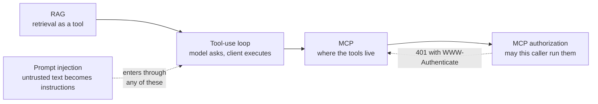

# AI & Agent Systems

Flows for the protocols and loops that let a language model act on the world:
how a model asks for a tool to be run, how a client discovers and calls a
Model Context Protocol server, how that server decides the caller is allowed
in, where the model's knowledge comes from, and how all of it is attacked.

| Flow                                                                          | What it answers                                                                                         | Difficulty   |
| ----------------------------------------------------------------------------- | ------------------------------------------------------------------------------------------------------- | ------------ |
| [LLM Tool-Use Loop](llm-tool-use-loop.md)                                     | How does a model "call a function" when it can only emit text, and who actually runs the code?          | Intermediate |
| [RAG Ingestion & Retrieval](rag-ingestion-and-retrieval.md)                   | How does a question about my documents become an answer grounded in them, with citations?               | Intermediate |
| [MCP Request Lifecycle & Versioning](mcp-request-lifecycle-and-versioning.md) | How does an MCP client talk to a server now that the `initialize` handshake is gone?                    | Intermediate |
| [MCP Authorization](mcp-authorization.md)                                     | How does a remote MCP server authenticate callers, and why must it never forward the token it receives? | Advanced     |
| [Prompt Injection & Tool Poisoning](prompt-injection-and-tool-poisoning.md)   | How does text the agent merely _reads_ become instructions it obeys, and what actually contains that?   | Advanced     |

## How these fit together

They stack. The **tool-use loop** is the inference-level cycle between your
application and the model — it is protocol-agnostic and works with tools you
hand-wrote. **RAG** is one particular tool: retrieval over your own corpus.
**MCP** is what you reach for when those tools live in someone else's process,
and its **authorization** layer is plain OAuth 2.1 with the MCP server acting as
a resource server. **Prompt injection** is what happens to all of it once any
of that content is written by someone else.

A useful way to hold it: the model never calls anything. It emits a request to
call something, your client decides whether to honour it, and MCP is one
possible answer to "where does that something live". Every arrow into the model
is also an arrow an attacker can write to, which is why the injection page is
the one to read before shipping any of the others.

## A note on protocol versions

MCP revisions are dated strings (`2026-07-28`), and the current revision made
**backwards-incompatible changes** — most visibly, it removed the `initialize`
handshake and protocol-level sessions. A great deal of published material still
describes the older shape.

Pages here pin every link to a dated revision rather than `/draft/`, state which
revision they document, and cover the older "legacy" era explicitly, because
most deployed servers still speak it.

## Wanted

Good first contributions in this category — see [CONTRIBUTING.md](../../CONTRIBUTING.md):

- MCP sampling and elicitation via multi round-trip requests
- Agent memory: summarisation and context-window compaction
- Streaming structured output and partial-JSON parsing
- Model evaluation harness flow (dataset, run, grade, regression gate)
