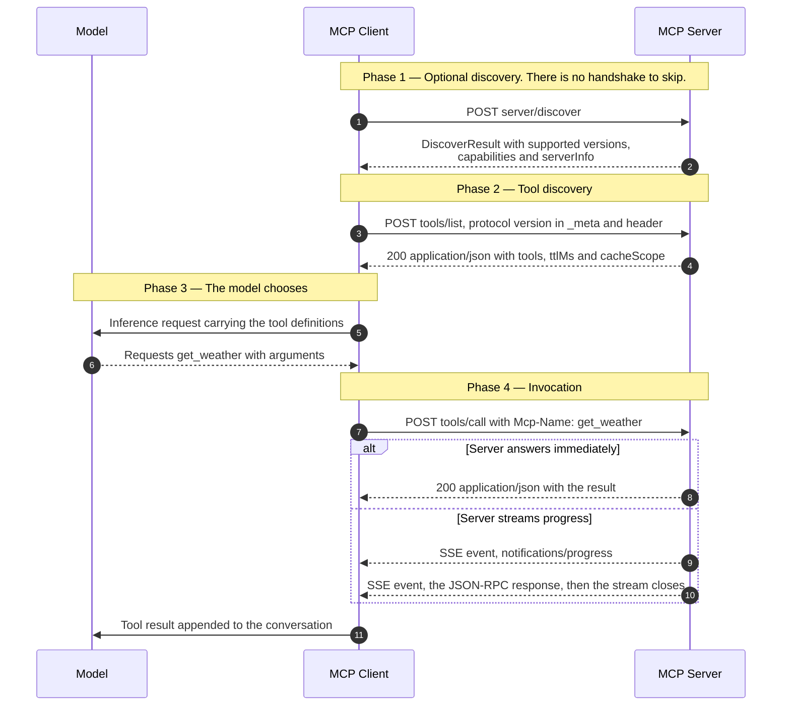
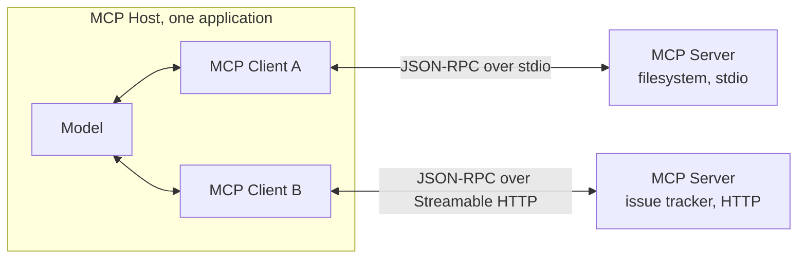
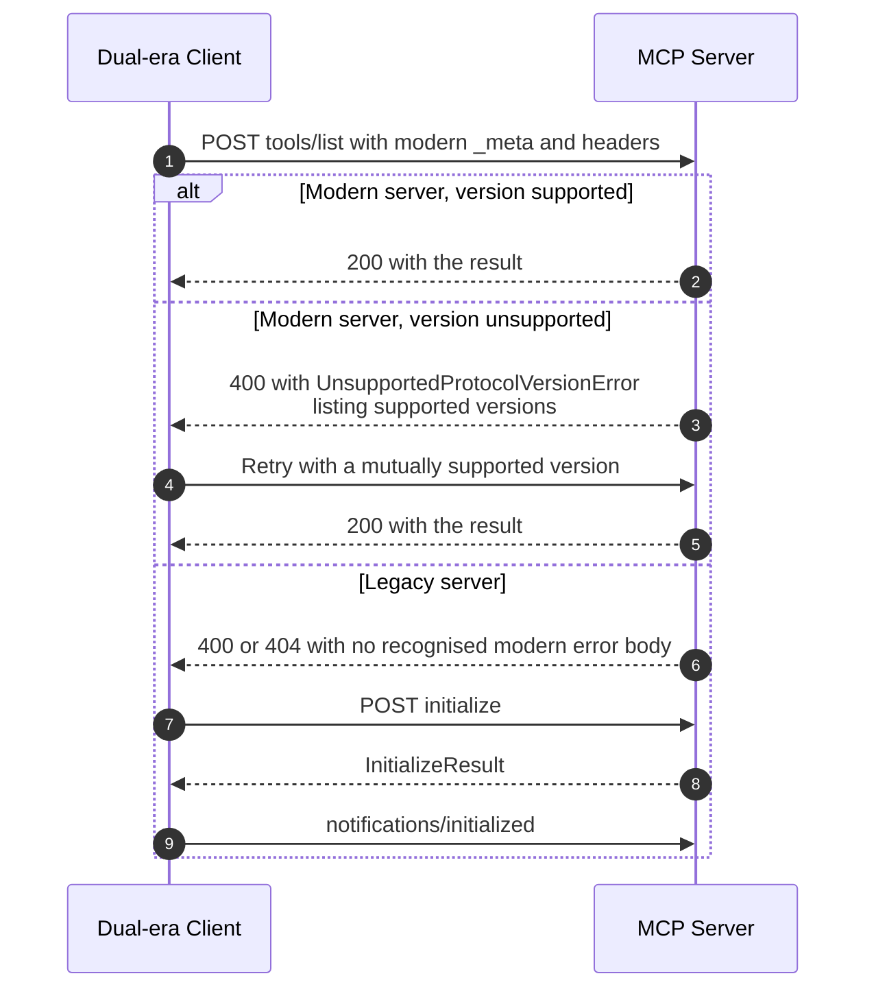

# MCP Request Lifecycle & Versioning

> How a Model Context Protocol client discovers a server's tools, calls one, and
> agrees on a protocol version — now that the `initialize` handshake and the
> protocol-level session have both been removed.

_Documented against MCP revision [`2026-07-28`](https://modelcontextprotocol.io/specification/2026-07-28/basic/versioning), the current revision. Revisions `2025-11-25` and earlier are "legacy" and work differently; see [Interoperating with legacy servers](#interoperating-with-legacy-servers)._

---

## TL;DR

- **There is no handshake.** Every request declares its own protocol version in
  `_meta`, and the server accepts or rejects each request independently. Version
  mismatch surfaces as `UnsupportedProtocolVersionError` (`-32022`), not as a
  failed connection.
- **There is no session.** Protocol-level sessions were removed along with the
  `Mcp-Session-Id` header. A server cannot rely on per-connection state, so
  stateful tools must return an explicit **handle** and take it back as an
  argument.
- **Every message is its own HTTP POST.** The server replies with either a
  single JSON object or an SSE stream scoped to that one request. Clients
  **MUST** support both.
- **Two kinds of error, and the difference matters.** A JSON-RPC error means the
  request was malformed or the tool does not exist. A result with
  `isError: true` means the tool ran and failed — and that one should go back to
  the model, which can often correct itself.
- Selected body fields are mirrored into HTTP headers (`Mcp-Method`,
  `Mcp-Name`) so proxies can route without parsing JSON. If they disagree with
  the body, the server **MUST** reject with `-32020`.

---

## When to use it

- You are writing an MCP client and need to know what to put on the wire.
- You are writing an MCP server and need to know what you are allowed to assume
  between calls. (Short answer: nothing.)
- You are debugging why a client and server that both "support MCP" cannot talk
  to each other — usually an era mismatch.

## When _not_ to use it

- **You just want a model to call your own functions.** MCP is for tools that
  live in another process, written by someone else. If you own both sides, the
  [LLM Tool-Use Loop](llm-tool-use-loop.md) alone is enough, and MCP is pure
  overhead.
- **You need a long-lived bidirectional channel.** This revision has no
  server-initiated requests. Server-to-client interaction is a _result_ the
  client answers by retrying, not a push. The one long-lived channel is
  one-way: a client can open a `subscriptions/listen` request whose SSE
  response stays open and carries only the change notifications it opted in
  to — `notifications/tools/list_changed`, for instance, arrives only there.
- **You are following a tutorial that starts with `initialize`.** That describes
  the legacy era. It still works against legacy servers, but do not build new
  clients on it without reading the compatibility section below.

---

## Actors and terminology

| Actor  | Spec term    | What it is                                                                                                                   |
| ------ | ------------ | ---------------------------------------------------------------------------------------------------------------------------- |
| Model  | —            | The language model. Outside the protocol entirely; MCP never talks to it.                                                    |
| Host   | _MCP Host_   | The application the human uses. Holds the conversation and the model, decides which server to call, and creates the clients. |
| Client | _MCP Client_ | A connector inside the host with a 1:1 connection to one server. Sends the requests and relays the results back to the host. |
| Server | _MCP Server_ | Exposes tools, resources, and prompts over JSON-RPC 2.0.                                                                     |

**Key terms**

- **`_meta`** — the per-request metadata object carrying
  `io.modelcontextprotocol/protocolVersion`,
  `io.modelcontextprotocol/clientInfo`, and
  `io.modelcontextprotocol/clientCapabilities`. Required on every request. This
  is what replaced the handshake.
- **Modern vs legacy** — the spec's own terms. _Modern_ is `2026-07-28` and
  later, carrying version and identity per request. _Legacy_ is `2025-11-25` and
  earlier, establishing a session with `initialize`. A _dual-era_ implementation
  supports both.
- **MCP endpoint** — the single HTTP path accepting POST. In this revision it
  accepts nothing else: `GET` and `DELETE` should be answered `405`.
- **`server/discover`** — a mandatory RPC returning supported versions,
  capabilities, and identity in one call. Servers **MUST** implement it; clients
  **MAY** skip it.
- **Handle** — an opaque string a tool returns to represent state it created,
  which the model must carry into later calls. Not a protocol concept; the
  protocol has no idea it is anything but a string.

---

## Sequence diagram



## Architecture



One client per server, all inside one host. The model sits behind the host and
never addresses a server directly — which is why tool names, unique only within
a server, collide once a host aggregates several and must be disambiguated by
the host.

---

## Step-by-step

1. **Ask what the server supports — optionally.** `server/discover` returns
   versions, capabilities, and identity in one round trip. A client that already
   knows the server can skip straight to step 3 and handle a version error if
   one comes back.

2. **The server answers with its supported versions and capabilities.**
   Capabilities are where optional extensions are advertised, keyed by
   identifier:

   ```json
   {
     "capabilities": {
       "tools": { "listChanged": true },
       "extensions": { "io.modelcontextprotocol/tasks": {} }
     }
   }
   ```

3. **List the tools.** Note the required `_meta` and the mirrored headers. The
   `MCP-Protocol-Version` header value **MUST** equal the `_meta` field; if they
   disagree the server rejects the request with `-32020` (`HeaderMismatch`).

   ```http
   POST /mcp HTTP/1.1
   Host: mcp.example.com
   Content-Type: application/json
   Accept: application/json, text/event-stream
   MCP-Protocol-Version: 2026-07-28
   Mcp-Method: tools/list

   {
     "jsonrpc": "2.0",
     "id": 1,
     "method": "tools/list",
     "params": {
       "_meta": {
         "io.modelcontextprotocol/protocolVersion": "2026-07-28",
         "io.modelcontextprotocol/clientInfo": { "name": "ExampleClient", "version": "1.0.0" },
         "io.modelcontextprotocol/clientCapabilities": {}
       }
     }
   }
   ```

   _Server validates:_ that every required header is present and matches the
   body, and that it supports the declared version.

4. **The server returns the tool list, with caching hints.** The set **MUST NOT**
   vary per connection, but **MAY** vary by the authorization presented — which
   is how a multi-tenant server shows each caller only their own tools.

   ```json
   {
     "jsonrpc": "2.0",
     "id": 1,
     "result": {
       "resultType": "complete",
       "tools": [
         {
           "name": "get_weather",
           "title": "Weather Information Provider",
           "description": "Get current weather information for a location",
           "inputSchema": {
             "type": "object",
             "properties": { "location": { "type": "string" } },
             "required": ["location"]
           },
           "outputSchema": {
             "type": "object",
             "properties": {
               "temperature": { "type": "number", "description": "Temperature in celsius" },
               "conditions": { "type": "string" }
             },
             "required": ["temperature", "conditions"]
           }
         }
       ],
       "ttlMs": 300000,
       "cacheScope": "public"
     }
   }
   ```

   Servers **SHOULD** return tools in a deterministic order — it lets clients
   cache, and it keeps the model's prompt prefix stable, which matters for
   prompt caching.

5. **Hand the tool definitions to the model.** This crosses out of MCP entirely.
   The client translates `inputSchema` into whatever its inference API expects;
   see [LLM Tool-Use Loop](llm-tool-use-loop.md).

6. **The model asks for a tool by name and arguments.** It has not called
   anything. It has emitted a request that the client may honour, refuse, or put
   in front of the user first — the spec says there **SHOULD** always be a human
   able to deny an invocation.

7. **Call the tool.** `Mcp-Name` mirrors `params.name`; if a tool schema marks a
   parameter with `x-mcp-header`, that value is mirrored too, as
   `Mcp-Param-{Name}`.

   ```http
   POST /mcp HTTP/1.1
   Host: mcp.example.com
   Content-Type: application/json
   Accept: application/json, text/event-stream
   MCP-Protocol-Version: 2026-07-28
   Mcp-Method: tools/call
   Mcp-Name: get_weather

   {
     "jsonrpc": "2.0",
     "id": 2,
     "method": "tools/call",
     "params": {
       "name": "get_weather",
       "arguments": { "location": "New York" },
       "_meta": {
         "io.modelcontextprotocol/protocolVersion": "2026-07-28",
         "io.modelcontextprotocol/clientInfo": { "name": "ExampleClient", "version": "1.0.0" },
         "io.modelcontextprotocol/clientCapabilities": {}
       }
     }
   }
   ```

8. **(Immediate branch.)** The server returns a single JSON object. `content` is
   the unstructured rendering the model reads; `structuredContent` is
   machine-readable data that **MUST** conform to the tool's `outputSchema`,
   since one was declared in step 4. For backwards compatibility the text block
   **SHOULD** carry the same data serialised as JSON.

   ```json
   {
     "jsonrpc": "2.0",
     "id": 2,
     "result": {
       "resultType": "complete",
       "content": [
         { "type": "text", "text": "{\"temperature\": 22.5, \"conditions\": \"Partly cloudy\"}" }
       ],
       "structuredContent": { "temperature": 22.5, "conditions": "Partly cloudy" },
       "isError": false
     }
   }
   ```

9. **(Streaming branch.)** For long work the server opens an SSE stream scoped to
   this request and emits progress notifications first. It **SHOULD** set
   `X-Accel-Buffering: no` so reverse proxies do not hold them.

10. **(Streaming branch.)** The final JSON-RPC response **SHOULD** terminate the
    stream. If the _client_ closes the stream instead, that is the cancellation
    signal — the server **MUST** treat it as cancellation and send nothing
    further for that request.

11. **Append the result and continue the loop.** The result goes back to the
    model as a tool result, and inference resumes. Nothing about this exchange
    is remembered by the server.

---

## Failure modes

| Failure                                      | What the client sees                                                           | Correct handling                                                                                                                                                               |
| -------------------------------------------- | ------------------------------------------------------------------------------ | ------------------------------------------------------------------------------------------------------------------------------------------------------------------------------ |
| Server does not support the declared version | `400` with `UnsupportedProtocolVersionError` (`-32022`) and a `supported` list | Pick a mutually supported version from the list and retry. Do not fall back to `initialize` — a recognised modern error proves the server is modern.                           |
| Header and body disagree                     | `400` with `HeaderMismatch` (`-32020`)                                         | A client bug. If the mismatch is a missing `Mcp-Param-*`, call `tools/list` again — the schema may have changed — then retry.                                                  |
| Unknown method                               | `404` with JSON-RPC `-32601`                                                   | The JSON-RPC body is what distinguishes this from a legacy server's plain `404`.                                                                                               |
| Tool does not exist                          | JSON-RPC error `-32602`                                                        | A client or host bug. Refresh the tool list. Passing this to the model rarely helps.                                                                                           |
| Tool ran and failed                          | `200` with `isError: true`                                                     | Feed it to the model. This is the self-correction path — a bad date format or an out-of-range value is something the model can fix and retry.                                  |
| Server needs user input mid-call             | `resultType: "input_required"` with `inputRequests`                            | Gather the input, then **retry the original request** with `inputResponses` and `requestState`, using a **different** JSON-RPC `id`.                                           |
| Connection drops mid-stream                  | Truncated SSE                                                                  | Not resumable. `Last-Event-ID` is explicitly unsupported in this revision; re-issue the request, which means the tool must be idempotent or the client must tolerate a repeat. |
| `Origin` header invalid                      | `403`                                                                          | Correct server behaviour — this is the DNS rebinding defence for local servers.                                                                                                |

### Interoperating with legacy servers

Most deployed servers still speak a legacy revision. A dual-era client detects
which it is talking to by _trying modern first_ and inspecting the error body:



The distinction that matters: **a `400` alone does not mean "legacy"**. Modern
servers use `400` for unsupported versions, header mismatches, and missing
capabilities. Only a `400` whose body is _not_ a recognised modern JSON-RPC
error justifies falling back.

Era is a property of the server, not of a request. Cache the answer for the
lifetime of the process (stdio) or origin (HTTP), and re-probe only if the
cached assumption later fails.

| Client   | Server   | Outcome                                                                     |
| -------- | -------- | --------------------------------------------------------------------------- |
| Modern   | Modern   | Works                                                                       |
| Modern   | Legacy   | **Fails** — probe with `server/discover` on stdio to fail deterministically |
| Dual-era | Modern   | Works, stays modern                                                         |
| Dual-era | Legacy   | Works, falls back to `initialize`                                           |
| Legacy   | Modern   | **Fails** — legacy clients have no fall-forward mechanism                   |
| Legacy   | Dual-era | Works under legacy semantics                                                |

---

## Common pitfalls

### Assuming a session exists

❌ **What people do:** store per-connection state on the server — an open
database transaction, a browser context, a shopping cart — and key it by
connection or by `Mcp-Session-Id`.

✅ **Do instead:** have a creation tool return an explicit opaque handle, and
accept that handle as an argument on every later call. Validate the caller's
authorization against the handle _every time_.

_Why it bites you:_ protocol-level sessions were removed in this revision, and
`Mcp-Session-Id` should now simply be ignored. Behind a load balancer, two calls
in the same conversation routinely land on different instances, so the second
one finds no state — a failure that appears only under horizontal scale, which
is exactly when it is hardest to reproduce.

### Confusing a protocol error with a tool error

❌ **What people do:** treat any non-success as an exception, abort the loop, and
show the user "tool failed".

✅ **Do instead:** branch on which kind it is. JSON-RPC `error` means the request
was wrong — a bug to fix. `result.isError: true` means the tool ran and
reported a problem, and the text is written _for the model_.

_Why it bites you:_ tool execution errors carry actionable feedback — "departure
date must be in the future, today is 08/08/2025" — and clients **SHOULD** pass
them to the model, which usually corrects itself on the next turn. Aborting
instead converts a self-healing situation into a dead end the user has to
untangle.

### Trusting tool annotations from any server

❌ **What people do:** read a tool's `annotations` (read-only, destructive, and
so on) and use them to decide whether to skip the confirmation prompt.

✅ **Do instead:** treat annotations as untrusted unless the server is trusted.
The spec says this in as many words.

_Why it bites you:_ annotations are supplied by the server being described. A
hostile or compromised server marks `delete_everything` as read-only and your
client waves it through. Anything security-relevant must be decided by the host
and the user, not by metadata the attacker wrote.

### Returning `structuredContent` and nothing else

❌ **What people do:** return only `structuredContent`, since it is the precise
representation.

✅ **Do instead:** also return the serialised JSON in a text block in `content`.

_Why it bites you:_ the model reads `content`. Clients that do not understand
`structuredContent` — and older ones do not — show the model an empty result, so
it concludes the tool returned nothing and either retries or invents an answer.

### Pinning links and docs to `/draft/`

❌ **What people do:** bookmark or cite `modelcontextprotocol.io/specification/draft/...`
because it is the newest.

✅ **Do instead:** pin to a dated revision, and state which revision your
implementation targets.

_Why it bites you:_ the draft changes under you. Between `2025-11-25` and
`2026-07-28` the handshake, sessions, the GET stream, and `Last-Event-ID`
resumability all disappeared. Code written against a moving target silently
stops matching the document it was written from.

### Ignoring the mirrored headers

❌ **What people do:** send the JSON-RPC body and omit `Mcp-Method` and
`Mcp-Name`, since the body already contains them.

✅ **Do instead:** send them. They are **REQUIRED** for compliance, and they must
match the body exactly, base64-decoded first where the sentinel encoding is used.

_Why it bites you:_ servers **MUST** reject the request with `-32020`. The
headers exist so intermediaries can route and rate-limit without parsing JSON —
and the strict matching rule exists so a load balancer and the server can never
be made to disagree about what is being called.

---

## Security considerations

| Threat                                         | Mitigation                                                                                      |
| ---------------------------------------------- | ----------------------------------------------------------------------------------------------- |
| DNS rebinding against a local server           | Validate `Origin`; respond `403` if present and invalid; bind to `127.0.0.1`                    |
| Header/body confusion between proxy and server | Mandatory header-body validation, `-32020` on mismatch                                          |
| Hostile server misrepresenting a tool          | Annotations untrusted; human in the loop able to deny any invocation                            |
| Sensitive arguments leaking to intermediaries  | Never mark secrets with `x-mcp-header` — header values are visible to every hop                 |
| Header injection via tool arguments            | Base64 sentinel encoding for any value that is not plain visible ASCII                          |
| Prompt injection via tool output               | Show tool inputs to the user before the call; validate results before passing them to the model |
| Unauthorized access to a handle                | Treat a handle as a name, not a capability — re-check authorization on every call               |

---

## Implementation checklist

- [ ] Send `_meta` with `protocolVersion`, `clientInfo`, and `clientCapabilities`
      on every request — and the matching `MCP-Protocol-Version` header.
- [ ] Send `Mcp-Method`, and `Mcp-Name` for `tools/call`, `resources/read`, and
      `prompts/get`.
- [ ] Send `Accept: application/json, text/event-stream` and handle both.
- [ ] Implement `server/discover` if you are the server — it is mandatory.
- [ ] Store no per-connection state. Use explicit handles with bounded lifetimes
      and authorization checks.
- [ ] Distinguish JSON-RPC errors from `isError: true`, and pass the latter to
      the model.
- [ ] Handle `resultType: "input_required"` by retrying with `inputResponses`
      and a fresh JSON-RPC `id`.
- [ ] Return both `content` and `structuredContent` when you have structured data.
- [ ] Set `X-Accel-Buffering: no` on SSE responses; emit periodic `:` keep-alive
      comments on long-lived streams.
- [ ] Answer `GET` and `DELETE` on the MCP endpoint with `405`; ignore
      `Mcp-Session-Id` and `Last-Event-ID`.
- [ ] Detect era by trying modern first and inspecting the `400` body — never by
      status code alone. Cache the result per server.
- [ ] Disambiguate tool names when aggregating servers; `serverInfo.name` is not
      unique and must not be used for it.

---

## Specs and references

**Normative**

- [MCP Versioning and Compatibility — 2026-07-28](https://modelcontextprotocol.io/specification/2026-07-28/basic/versioning) — per-request version negotiation, `UnsupportedProtocolVersionError`, extension negotiation, and the era compatibility matrix reproduced above.
- [MCP Streamable HTTP transport — 2026-07-28](https://modelcontextprotocol.io/specification/2026-07-28/basic/transports/streamable-http) — the MCP endpoint, the required `Accept` header, request metadata headers, server validation, cancellation, the `subscriptions/listen` notification stream, and what was removed from earlier revisions.
- [MCP Tools — 2026-07-28](https://modelcontextprotocol.io/specification/2026-07-28/server/tools) — `tools/list` and `tools/call` shapes, `outputSchema`, `x-mcp-header`, stateful-tool guidance, and the two error mechanisms.
- [JSON-RPC 2.0](https://www.jsonrpc.org/specification) — the message framing everything above is built on, including the reserved error code ranges.

**Further reading**

- [MCP changelog for 2026-07-28](https://modelcontextprotocol.io/specification/2026-07-28/changelog) — what changed from `2025-11-25`, which is the fastest way to audit an existing implementation.
- [MCP deprecated features registry](https://modelcontextprotocol.io/specification/2026-07-28/deprecated) — what is scheduled for removal, so you can avoid building on it.

---

## Related flows

- [MCP Authorization](mcp-authorization.md) — how the client obtains the bearer token these requests carry.
- [LLM Tool-Use Loop](llm-tool-use-loop.md) — steps 5, 6, and 11 in full: what the client and the model exchange.
- [Server-Sent Events & HTTP Streaming](../networking/server-sent-events-and-http-streaming.md) — the streaming branch at steps 9 and 10, including why proxies buffer it.
- [Idempotency Keys](../distributed-systems/idempotency-keys.md) — what to do about the un-resumable stream: a retried `tools/call` must be safe to run twice.
- [Prompt Injection & Tool Poisoning](prompt-injection-and-tool-poisoning.md) — tool definitions are server-controlled, model-visible text, which makes `tools/list` an attack surface.
