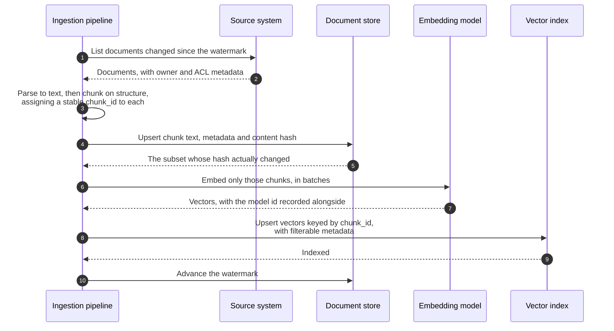
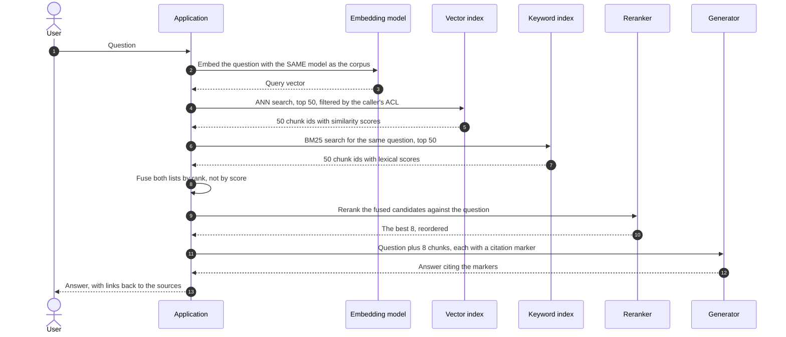

# RAG Ingestion & Retrieval

> How a question about your own documents becomes an answer grounded in them:
> what is computed offline, what is computed per query, and which of the two is
> responsible for the answer you did not expect.

_Also known as: retrieval-augmented generation, grounded generation, "chat with
your docs"._

---

## TL;DR

- **RAG is two pipelines that must agree.** Ingestion turns documents into
  retrievable chunks; query turns a question into a ranked set of them. Almost
  every production bug is a disagreement between the two — most often, two
  different embedding models.
- **Retrieval quality is the whole system.** The model cannot cite what you did
  not give it. When an answer is wrong, the retrieved chunks are wrong first,
  perhaps 90% of the time — so measure retrieval separately, before you touch
  the prompt.
- **Similarity is not relevance.** A cosine score is a position in one model's
  vector space. It has no absolute meaning, does not transfer between models,
  and the nearest chunk to a question is returned whether or not the answer
  exists anywhere in your corpus.
- **Chunk on structure, not on a token count.** A fixed 512-token window will
  cut a table from its header and an answer from its question. Structure-aware
  chunks, plus a little surrounding context, beat clever retrieval over bad ones.
- **Your corpus is an injection surface.** Retrieved text lands in the model's
  context as instructions-shaped data — see
  [Prompt Injection & Tool Poisoning](prompt-injection-and-tool-poisoning.md).

---

## When to use it

- The answer exists in a body of text that changes faster than you could
  fine-tune, or is too large to put in a context window.
- You need **citations** — the user must be able to check the source. This is
  RAG's strongest argument and the one fine-tuning cannot make.
- Access control matters: different users may see different documents, which
  means retrieval has to be filtered per caller.

## When _not_ to use it

- **The corpus fits in the context window.** If the whole handbook is 60k
  tokens, put the handbook in the prompt and cache it. You will get better
  answers than any retrieval pipeline gives you, with a fraction of the
  machinery.
- **The task needs global reasoning** — "summarise the themes across all 4,000
  support tickets". Top-k retrieval sees k chunks and cannot count, aggregate,
  or notice absence. Use a map-reduce pass or a query against structured data.
- **The question is structured.** "Revenue by region last quarter" is SQL.
  Embedding numbers and hoping is a well-trodden way to be confidently wrong.
- **Style rather than knowledge** is what you are missing — that is what
  fine-tuning is for.

---

## Actors and terminology

| Actor              | Also called              | What it is                                                                                                                     |
| ------------------ | ------------------------ | ------------------------------------------------------------------------------------------------------------------------------ |
| Source system      | _Corpus_                 | Where documents live: a wiki, a bucket, a CMS, a ticketing system.                                                             |
| Ingestion pipeline | _Indexer_                | Batch or streaming job that parses, chunks, embeds, and upserts. Runs on a schedule or on a change event.                      |
| Embedding model    | _Encoder_ / _Bi-encoder_ | Maps text to a fixed-length vector. Used on both sides, and it must be the **same model and version** on both.                 |
| Vector index       | _Vector store_           | Approximate nearest-neighbour search over those vectors, plus metadata filtering.                                              |
| Keyword index      | _Lexical index_          | BM25 or equivalent. Catches exact identifiers, error codes, and rare words that embeddings blur.                               |
| Reranker           | _Cross-encoder_          | Scores each (question, chunk) pair jointly. Far more accurate than vector similarity, far too slow to run on the whole corpus. |
| Generator          | _LLM_                    | Writes the answer from the retrieved chunks, with citations.                                                                   |

**Key terms**

- **Chunk** — the unit of retrieval. Needs a **stable `chunk_id`** derived from
  the document ID and its position or heading path, so that re-ingestion updates
  rather than duplicates.
- **Embedding** — a vector, typically 384–3072 dimensions. Comparable only to
  vectors from the same model and version.
- **ANN** — approximate nearest neighbour. Trades exactness for speed; HNSW
  ([Malkov & Yashunin, 2016](https://arxiv.org/abs/1603.09320)) is the common
  implementation.
- **Recall@k** — the fraction of questions whose answer-bearing chunk appears in
  the top _k_. The number to optimise during retrieval, before generation is
  involved at all.
- **Hybrid search** — running dense and lexical retrieval and fusing the
  results, usually with **reciprocal rank fusion**
  ([Cormack et al., 2009](https://doi.org/10.1145/1571941.1572114)), which
  combines by rank and so needs no score normalisation.
- **Contextual retrieval** — prepending a short, document-aware description to
  each chunk before embedding it, so that "it dropped 3%" carries the subject
  with it
  ([Anthropic, 2024](https://www.anthropic.com/news/contextual-retrieval)).
- **Watermark** — the high-water mark of what has been ingested, so a run
  processes only what changed.

> **Note on sources.** There is no specification for any of this. The citations
> here are research papers and vendor engineering write-ups; the parameter
> values are conventional defaults, not requirements. Where this page gives a
> number, treat it as a starting point to measure from.

---

## Sequence diagram — ingestion

Offline, and the half people under-invest in.



## Sequence diagram — query

Per request, and on a latency budget.



---

## Step-by-step

### Ingestion

1. **List what changed.** Incremental by default — full re-ingestion is a
   fallback, not the design. Track a watermark per source, and handle deletes
   explicitly: a document removed at the source that stays in the index is a
   confidentiality bug waiting to be found by someone else.

2. **Source returns documents with their metadata.** Capture `owner`,
   `acl`/`group_ids`, `updated_at`, `source_url`, and `mime_type` **now**. These
   are what let you filter at query time, and backfilling them later means
   re-ingesting everything.

3. **Parse, then chunk on structure.** Parsing is where most quality is won or
   lost: a PDF table flattened into prose is unanswerable no matter how good the
   retrieval is. Chunk along the document's own boundaries — heading, section,
   function, slide — and only fall back to a token window inside an oversized
   section:

   ```python
   # Structure first; the token budget is the ceiling, not the rule.
   for section in split_on_headings(doc):
       for chunk in pack_to_budget(section, max_tokens=800, overlap_tokens=100):
           yield Chunk(
               chunk_id=f"{doc.id}#{section.path}:{chunk.index}",  # STABLE
               text=chunk.text,
               heading_path=section.path,     # "Billing > Refunds > EU"
               doc_id=doc.id,
               acl=doc.acl,
               updated_at=doc.updated_at,
           )
   ```

   The `heading_path` is worth prepending to the chunk text before embedding.
   That is the cheap version of
   [contextual retrieval](https://www.anthropic.com/news/contextual-retrieval);
   the full version asks a model for a one-sentence situating description per
   chunk, which costs real money on a large corpus and measurably helps on
   documents full of pronouns and deltas.

4. **Upsert chunk text and a content hash.** The document store is the system of
   record for chunks; the vector index is a derived structure you must be able
   to rebuild from it.

5. **Store returns only what actually changed.** Hash comparison is what keeps
   the embedding bill proportional to edits rather than to corpus size. A
   pipeline that re-embeds everything nightly works fine at 10k chunks and stops
   being affordable at 10M.

6. **Embed in batches.** Record the **model id and version** next to every
   vector. When you change models you need to know what is stale, and you will
   change models.

7. **Embedding model returns the vectors.**

8. **Upsert into the vector index** keyed by `chunk_id`, with the metadata you
   will filter on. Two constraints to decide up front: the index must support
   filtering _during_ the search rather than after it, or ACL filtering will
   quietly shrink your top-k to nothing; and re-embedding under a new model
   should go to a **new index** you can switch to atomically.

9. **Index confirms.**

10. **Advance the watermark** — only after the vectors are live, so a crash
    re-processes rather than skips.

### Query

1. **User asks a question.** Consider rewriting it first if you have chat
   history: "what about EU?" is unretrievable without the previous turn folded
   in.

2. **Embed the question.** With the same model, same version, and the same
   prompt prefix (some models distinguish `query:` from `passage:`).

3. **Embedding model returns the query vector.**

4. **ANN search, over-fetching, filtered by the caller's permissions.** Ask for
   far more than you will use — 50 to retrieve 8 — because the reranker is what
   makes the final choice:

   ```json
   {
     "vector": [0.013, -0.221, "…"],
     "top_k": 50,
     "filter": { "acl": { "$in": ["grp_eng", "grp_all"] } }
   }
   ```

   _Receiver validates:_ the filter must be applied **inside** the search, not
   as a post-filter on the results. Post-filtering an ANN result set is how you
   get "the system says there is nothing about billing" for a user who can see
   forty billing documents.

5. **Vector index returns candidates with scores.**

6. **Keyword search for the same question.** This is the step most teams skip
   and later add. Embeddings are poor at exact tokens — `ERR_4032`,
   `customer_id`, a product name coined last week — and BM25 is excellent at
   them.

7. **Keyword index returns its candidates.**

8. **Fuse the two lists by rank.** Reciprocal rank fusion needs no score
   normalisation, which is its whole appeal, since dense and lexical scores are
   not on a common scale:

   ```python
   K = 60                      # the constant from the original paper
   scores = defaultdict(float)
   for ranking in (dense_ids, lexical_ids):
       for rank, chunk_id in enumerate(ranking, start=1):
           scores[chunk_id] += 1 / (K + rank)
   fused = sorted(scores, key=scores.get, reverse=True)[:50]
   ```

9. **Rerank the fused candidates.** A cross-encoder reads the question and the
   chunk together, so it can judge relevance rather than proximity. This is
   usually the single largest quality gain available. Scoring 50 pairs is
   typically one batched forward pass or one reranking API call, so the added
   latency is modest — but cost grows with every pair scored, which is why it
   runs over 50 candidates and not over the corpus.

10. **Reranker returns the final set,** ordered. Keep it small: 8 good chunks
    beat 30 mediocre ones, and long contexts dilute attention as well as cost
    money.

11. **Assemble the prompt.** Each chunk labelled and delimited, with instructions
    that bind the answer to them:

    ```text
    Answer using ONLY the sources below. Cite them as [S1], [S2].
    If the sources do not contain the answer, say so.

    [S1] (Billing > Refunds > EU, updated 2026-08-02)
    Refunds for EU customers are processed within 14 days…

    [S2] (Billing > Refunds > Disputes, updated 2026-07-19)
    …
    ```

    Mark the boundary between your instructions and retrieved text clearly —
    this is OWASP's "segregate and identify external content", and it is also
    just good prompting. It reduces injection risk; it does not eliminate it.

12. **Model answers with citations.** Validate them: a citation marker that does
    not match any provided chunk means the model is filling gaps, and you would
    rather catch that than ship it.

13. **Return the answer with links.** Citations that the user can click are what
    makes the system auditable — and they are how you find out the corpus is
    wrong, which it will be.

---

## Failure modes

| Failure                                    | What the user sees                                         | Correct handling                                                                                                                   |
| ------------------------------------------ | ---------------------------------------------------------- | ---------------------------------------------------------------------------------------------------------------------------------- |
| Answer is not in the corpus                | A confident, wrong answer built from the nearest chunks    | Instruct refusal, and enforce a relevance floor from the _reranker_ score. Empty is a valid result and should be a visible metric. |
| Query embedded with a different model      | Retrieval that looks random                                | Record the model id with every vector and assert it at query time. The single most common cause of "RAG suddenly broke".           |
| Chunk split the answer in half             | Partial answers that trail off                             | Chunk on structure, add overlap, and retrieve neighbours of a hit when the section is contiguous.                                  |
| Deleted document still indexed             | Leaked or stale content, often noticed by the wrong person | Propagate deletes as first-class events; reconcile index against source on a schedule.                                             |
| ACL filter applied after the search        | "No results" for users who can see plenty                  | Filter inside the ANN search. Verify with a test user who can see exactly one document.                                            |
| Embedding provider is down or rate-limited | Every query fails, not just the new ones                   | Cache query embeddings, fail over to lexical-only retrieval, and say the results are degraded rather than returning nothing.       |
| Re-embedding mid-migration                 | Mixed spaces, silently wrong neighbours                    | Build a new index and switch atomically. Never write two models' vectors into one index.                                           |
| Poisoned content in the corpus             | Plausible answers that follow someone else's instructions  | Treat ingestion as a trust boundary — see [Prompt Injection & Tool Poisoning](prompt-injection-and-tool-poisoning.md).             |

---

## Common pitfalls

### Embedding the query with a different model than the corpus

❌ **What people do:** upgrade the embedding model, redeploy the query service,
and leave the index as it was — or use a provider default that changed.

✅ **Do instead:** store the model id and dimension alongside every vector, and
refuse to query an index whose model id does not match the one configured.
Re-embed into a new index and cut over.

_Why it bites you:_ vectors from two models are not comparable, but they are the
same shape, so nothing errors. Retrieval degrades to approximately random and
the only symptom is that answers got worse — which teams then try to fix by
editing the prompt, for weeks.

### Fixed-size chunking

❌ **What people do:** split on 512 tokens with 50 overlap, uniformly, because
that is what the tutorial did.

✅ **Do instead:** split on the document's own structure, keep tables and code
blocks whole, and prepend the heading path to each chunk before embedding.

_Why it bites you:_ the split lands mid-table and mid-procedure. Step 4 of an
eight-step runbook retrieves without steps 1–3, and the model confidently
presents the middle of a procedure as the whole of it.

### No metadata filter, or a filter applied afterwards

❌ **What people do:** retrieve globally, then drop the chunks the user is not
allowed to see.

✅ **Do instead:** pass the caller's groups into the search as a filter the index
applies during traversal, and test with a user who can see exactly one document.

_Why it bites you:_ two failure modes from one mistake. Post-filtering a top-50
down to the three chunks a user may see gives terrible answers; forgetting the
filter on one code path leaks the CEO's documents into a support agent's
answer — and you find out from the support agent.

### Treating the similarity score as a confidence

❌ **What people do:** set a cutoff — "only use chunks above 0.75" — and treat
what passes as relevant.

✅ **Do instead:** threshold on the **reranker** score, which judges the
(question, chunk) pair jointly and so separates relevant from irrelevant far
better. It is still not a calibrated probability — its scale shifts across
reranker models and versions — so tune the threshold against a labelled query
set, and re-tune it whenever the reranker changes. Use the vector score only
for ordering candidates.

_Why it bites you:_ cosine scores are dense in a narrow band, shift with model
and text length, and are not comparable across queries. A threshold tuned on
today's model silently becomes "accept everything" or "accept nothing" after an
upgrade.

### Unstable chunk IDs

❌ **What people do:** key chunks by an auto-increment ID or the array index from
this run's chunking.

✅ **Do instead:** derive the ID deterministically from document ID plus heading
path plus ordinal, and store a content hash beside it.

_Why it bites you:_ every re-ingestion becomes an insert. The index fills with
near-duplicates, the top-k fills with five copies of the same paragraph, and
deletes stop working because nothing can be matched to its source.

### Evaluating by asking it a few questions

❌ **What people do:** try a dozen questions by hand, pronounce it good, ship it,
and tune the prompt whenever someone complains.

✅ **Do instead:** build a fixed set of 50–200 questions with known
answer-bearing chunks, and measure **recall@k for retrieval separately** from
answer quality. Run it in CI on every chunking, embedding, or prompt change.

_Why it bites you:_ without separated metrics you cannot tell a retrieval
failure from a generation failure, so every regression turns into prompt
roulette. Retrieval is where the fault usually is, and it is the cheaper of the
two to fix.

---

## Security considerations

| Threat                                          | Mitigation                                                                                                                       |
| ----------------------------------------------- | -------------------------------------------------------------------------------------------------------------------------------- |
| Cross-tenant or cross-user retrieval            | Metadata filter applied inside the search, derived from the authenticated caller — never from a parameter the client can set.    |
| Stale permissions after an ACL change           | Re-ingest metadata on permission change, or resolve permissions at query time against the source rather than trusting the index. |
| Deleted or unshared documents remaining indexed | Deletes as first-class events, plus periodic reconciliation against the source.                                                  |
| Indirect prompt injection from corpus content   | Delimit and label retrieved text, and cut the trifecta: no broad credentials or free egress in an agent that reads the corpus.   |
| Embedding inversion / leakage via the index     | Treat the vector store as containing the source text, because approximately it does. Same encryption and access controls.        |
| PII entering an external embedding API          | Redact before embedding, or use a model you host. Decide this at ingestion; you cannot un-send it later.                         |

---

## Implementation checklist

- [ ] Pick the embedding model, and record its id and dimension next to every
      vector you write.
- [ ] Derive stable `chunk_id`s and store a content hash for incremental
      re-ingestion.
- [ ] Capture `acl`, `source_url`, and `updated_at` at ingestion — you cannot
      add them later without a full re-run.
- [ ] Chunk on document structure; keep tables and code blocks intact.
- [ ] Prepend the heading path (at minimum) to chunk text before embedding.
- [ ] Apply permission filters inside the ANN search, and test with a user who
      can see exactly one document.
- [ ] Add lexical search and fuse by rank before you spend a week tuning the
      vector side.
- [ ] Over-fetch and rerank. Measure recall@k before and after; keep the number.
- [ ] Build a labelled evaluation set and wire it into CI.
- [ ] Handle deletes, and reconcile the index against the source on a schedule.
- [ ] Plan the model migration — new index, atomic cutover — before you need it.
- [ ] Instruct the model to refuse when the sources do not answer, and monitor
      how often it does.

---

## Specs and references

**There is no normative specification for RAG.** These are the primary sources
behind the mechanisms above; everything else on this page is convention.

- [Retrieval-Augmented Generation for Knowledge-Intensive NLP Tasks](https://arxiv.org/abs/2005.11401) —
  Lewis et al., 2020. The paper the name comes from. Worth reading to see that
  the original formulation trained retriever and generator together, which is
  not what anyone means by RAG today.
- [Efficient and robust approximate nearest neighbor search using Hierarchical Navigable Small World graphs](https://arxiv.org/abs/1603.09320) —
  Malkov & Yashunin, 2016. HNSW, the index under most vector databases; §4
  explains the recall/latency knobs you will be asked to tune: `M`, and the
  candidate-list sizes `efConstruction` (build time) and `ef` (query time) —
  which libraries such as FAISS expose as `efSearch`.
- [Reciprocal Rank Fusion outperforms Condorcet and individual Rank Learning Methods](https://doi.org/10.1145/1571941.1572114) —
  Cormack, Clarke & Büttcher, SIGIR 2009. Two pages, and the source of the
  `1/(K + rank)` formula with `K = 60`.

**Further reading**

- [Introducing Contextual Retrieval](https://www.anthropic.com/news/contextual-retrieval) —
  Anthropic, 2024. Prepending a generated, document-aware context line to each
  chunk before embedding, with measured retrieval-failure reductions and the
  cost trade-off stated plainly.
- [OWASP Top 10 for LLM Applications — LLM01: Prompt Injection](https://genai.owasp.org/llmrisk/llm01-prompt-injection/) —
  "segregate and identify external content" is the prompt-assembly rule in
  step 11.

---

## Related flows

- [LLM Tool-Use Loop](llm-tool-use-loop.md) — retrieval as a tool the model
  calls itself, rather than a step you run before it.
- [Prompt Injection & Tool Poisoning](prompt-injection-and-tool-poisoning.md) —
  your corpus is untrusted input; this is what that costs.
- [Cache-Aside Read & Write](../data-and-delivery/cache-aside-read-write.md) —
  the same read-through shape, and the same invalidation problem, for query
  embeddings and answer caches.
- [Rate Limiting Algorithms](../data-and-delivery/rate-limiting-algorithms.md) —
  embedding APIs are rate-limited per minute and per token; batch ingestion will
  meet both limits.
