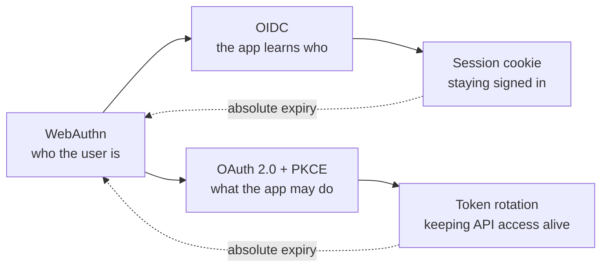

# Auth & Identity

Flows for proving who someone is, and for letting an application act on their
behalf without ever holding their password.

| Flow                                                                                  | What it answers                                                                                    | Difficulty   |
| ------------------------------------------------------------------------------------- | -------------------------------------------------------------------------------------------------- | ------------ |
| [OAuth 2.0 Authorization Code + PKCE](oauth2-authorization-code-pkce.md)              | How does an app get permission to call an API as me, and what exactly does PKCE protect against?   | Intermediate |
| [JWT Access & Refresh Token Rotation](jwt-access-refresh-token-rotation.md)           | How do I keep a user signed in for weeks with 15-minute tokens, and detect a stolen refresh token? | Intermediate |
| [WebAuthn / Passkey Registration & Login](webauthn-passkey-registration-and-login.md) | How do passkeys work, and why can phishing not defeat them?                                        | Advanced     |
| [OpenID Connect Authorization Code Flow](openid-connect-authorization-code.md)        | OAuth tells me what an app may do — how do I find out _who_ just signed in?                        | Intermediate |
| [Session Cookies & Server-Side Sessions](session-cookies-and-server-side-sessions.md) | How does the boring, correct version of "stay signed in" actually work?                            | Beginner     |

## How these fit together

They are one story told in order. A user proves their identity with a
**passkey**; **OpenID Connect** turns that into an assertion of _who they are_
while **OAuth + PKCE** grants _what the app may do_; the app then either creates
a **session** or keeps **rotating tokens** until an absolute expiry forces
re-authentication.

The two endings are a real choice, not a detail. If the browser and the server
are both yours, a session is simpler and revocable. Tokens are for the cases
where they are not.

## Wanted

Good first contributions in this category — see [CONTRIBUTING.md](../../CONTRIBUTING.md):

- SAML 2.0 Web Browser SSO
- Mutual TLS (mTLS) client authentication
- Device Authorization Grant (RFC 8628) — TVs and CLIs
- Magic links and one-time passcodes, and their real security properties
