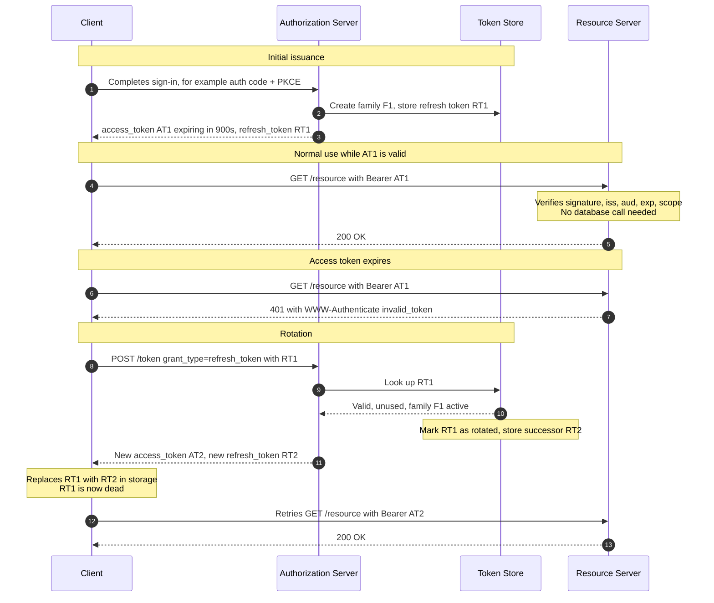
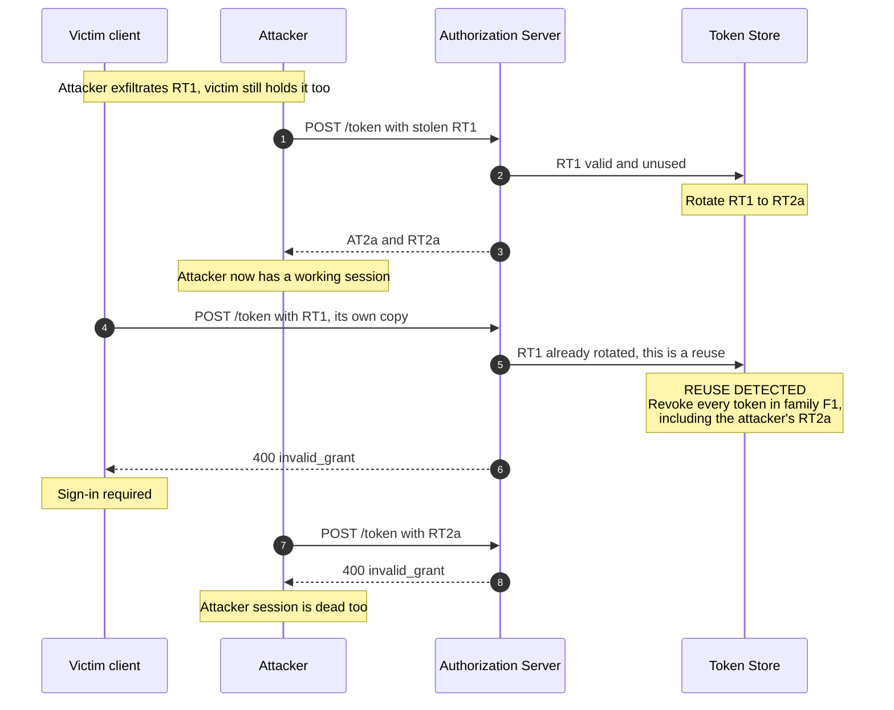

# JWT Access & Refresh Token Rotation

> How an app keeps a user signed in for weeks using access tokens that live for
> minutes — and how rotating the refresh token turns a stolen credential from a
> silent, permanent compromise into a detectable, self-healing one.

---

## TL;DR

- **Access token**: short-lived (5–15 min), usually a signed JWT, verified by
  the API without a database round-trip. **Refresh token**: long-lived, opaque,
  presented only to the auth server to mint a new access token.
- **Rotation** means every refresh consumes the old refresh token and issues a
  new one. A refresh token is therefore single-use.
- Single-use makes theft _detectable_: if the same refresh token is presented
  twice, one of the two presenters is an attacker — and the server does not
  need to know which. RFC 9700 has it revoke the active refresh token; the
  common vendor convention, followed here, is to revoke the **entire token
  family**.
- The cost of a stateless access token is that you **cannot revoke it**. Logout,
  bans, and permission changes take effect only when it expires. Keep the
  lifetime short; that number is your worst-case revocation delay.
- Rotation without reuse detection is close to pointless. Detection is the
  feature; rotation is just what makes detection possible.

---

## When to use it

- Any session that must outlive a single access token — that is, essentially
  every consumer-facing app.
- Public clients (SPAs, mobile) where OAuth 2.1 requires refresh tokens to be
  either rotating or sender-constrained.
- When you want stateless, horizontally scalable API authorization but still
  need a way to kill a compromised session.

## When _not_ to use it

- **First-party web app, single backend, no third-party API.** A server-side
  session with an `HttpOnly` cookie is simpler, revocable instantly, and has no
  token-storage problem. Reach for JWTs when statelessness actually buys you
  something.
- **When you need instant revocation.** Stateless JWTs cannot give you that.
  Either accept the lifetime window, or use opaque access tokens with
  introspection ([RFC 7662](https://www.rfc-editor.org/rfc/rfc7662)) and pay the
  lookup cost.
- **As a session cookie replacement in a browser, stored in `localStorage`.**
  That trade is strictly worse than a cookie: same XSS exposure, plus you lose
  `HttpOnly` and `SameSite`.

---

## Actors and terminology

| Actor       | Spec term              | What it is                                                                                        |
| ----------- | ---------------------- | ------------------------------------------------------------------------------------------------- |
| App         | _Client_               | Holds the tokens and retries failed calls.                                                        |
| Auth server | _Authorization Server_ | Issues, rotates, and revokes tokens. Owns the token-family state.                                 |
| API         | _Resource Server_      | Verifies access tokens. Ideally does no I/O to do it.                                             |
| Token store | —                      | The auth server's record of live refresh tokens and their families. Not optional once you rotate. |

**Key terms**

- **Access token** — short-lived credential sent to the API on every request,
  typically a JWT ([RFC 7519](https://www.rfc-editor.org/rfc/rfc7519)) carrying
  `iss`, `sub`, `aud`, `exp`, `iat`, and `scope`.
- **Refresh token** — long-lived credential sent **only** to the auth server's
  token endpoint. Should be opaque: the client has no business reading it.
- **Token family** — the chain of refresh tokens descending from one
  authorization. Rotation replaces a member; reuse detection kills the family.
- **Reuse detection** — noticing that an already-rotated refresh token has been
  presented again.
- **Absolute vs idle expiry** — idle expiry ends a session after inactivity;
  absolute expiry caps total lifetime regardless of activity. You want both.

---

## Sequence diagram

The normal path — sign in, work, silently refresh, keep working:



## Reuse detection — what happens when a refresh token is stolen



Either party can trip the alarm, and the response is the same regardless of
which one does. The server never has to guess who the thief was.

---

## Step-by-step

Numbers match the first (normal-path) sequence diagram.

1. **User signs in.** Typically via
   [Authorization Code + PKCE](oauth2-authorization-code-pkce.md); the mechanism
   does not matter here, only that the auth server has decided who the user is.

2. **Auth server records the token family.** Persist at minimum:

   ```text
   family_id      f_9c1d…          # constant for the life of the session
   token_id       rt_1             # this member
   parent_id      NULL             # rt_1 is the root
   user_id        u_42
   client_id      s6BhdRkqt3
   token_hash     sha256(RT1)      # store the hash, never the token
   status         active           # active | rotated | revoked
   issued_at      …
   expires_at     …                # idle expiry
   family_expires_at …             # absolute expiry, does not move on rotation
   ```

   Hash refresh tokens the way you hash passwords' cousins: a stolen database
   dump should not yield usable sessions. SHA-256 is sufficient here because
   the token is already high-entropy — you do not need a slow KDF.

3. **Tokens are returned to the client.**

   ```http
   HTTP/1.1 200 OK
   Content-Type: application/json
   Cache-Control: no-store

   {
     "access_token": "eyJhbGciOiJFUzI1NiIsInR5cCI6IkpXVCIsImtpZCI6IjIwMjYtMDkifQ…",
     "token_type": "Bearer",
     "expires_in": 900,
     "refresh_token": "v1.MR3rt9…",
     "scope": "invoices.read invoices.write"
   }
   ```

4. **Client calls the API with the access token.** On every request, in the
   `Authorization` header.

   _Receiver validates:_ the signature against the issuer's JWKS (cached, keyed
   by `kid`), then `iss`, `aud`, `exp`, `nbf`, and scope. No network call — that
   is the entire point of a stateless access token.

5. **API serves the request.**

6. **Later: the client sends a now-expired access token.** Clients should
   refresh proactively — a little before `exp` — rather than waiting for a
   `401`. Reactive refresh works, but it adds a failed round-trip to a user
   action.

7. **API rejects it,** per
   [RFC 6750 §3](https://www.rfc-editor.org/rfc/rfc6750#section-3):

   ```http
   HTTP/1.1 401 Unauthorized
   WWW-Authenticate: Bearer realm="api", error="invalid_token",
                     error_description="The access token expired"
   ```

   The `error="invalid_token"` code is what lets the client distinguish "refresh
   and retry" from `403`/`insufficient_scope`, which refreshing will not fix.

8. **Client presents the refresh token.**

   ```http
   POST /token HTTP/1.1
   Host: as.example.com
   Content-Type: application/x-www-form-urlencoded

   grant_type=refresh_token
   &refresh_token=v1.MR3rt9…
   &client_id=s6BhdRkqt3
   ```

9. **Auth server looks the token up by hash.**

10. **Store confirms it is `active`, unexpired, and its family is not revoked.**

    _The rotation must be atomic._ A compare-and-set is the whole ballgame:

    ```sql
    UPDATE refresh_tokens
       SET status = 'rotated', rotated_at = now()
     WHERE token_hash = $1
       AND status = 'active'
    RETURNING family_id, user_id;
    ```

    Zero rows updated means either an unknown token or a **reuse** — go to the
    revocation path. A non-atomic read-then-write lets two concurrent refreshes
    both succeed, which forks the family and produces exactly the false
    positives discussed below.

11. **Auth server returns a new access token and a new refresh token.** The new
    refresh token's `parent_id` is the one just rotated, and it inherits the
    family's `family_expires_at` — absolute expiry must not slide forward on
    rotation, or the session becomes immortal.

    _No message on the wire:_ the client now replaces its stored refresh token,
    atomically. Write the new one before discarding the old one, and serialize
    concurrent refreshes behind a single-flight lock. A client that fires three
    refreshes in parallel will report a stolen token that was never stolen.

12. **Client retries the original API call** with the new access token.

13. **The API serves it.** From the user's point of view nothing happened.

---

## Failure modes

| Failure                                       | What happens                                          | Correct handling                                                                                                                                                           |
| --------------------------------------------- | ----------------------------------------------------- | -------------------------------------------------------------------------------------------------------------------------------------------------------------------------- |
| Access token expires mid-request              | `401 invalid_token`                                   | Refresh once, retry once. Never loop: a second `401` after a fresh token is a real error, not a stale one.                                                                 |
| Refresh token expired (idle timeout)          | `400 invalid_grant`                                   | Full re-authentication. Do not retry.                                                                                                                                      |
| Family hit absolute expiry                    | `400 invalid_grant` even though the token looks fresh | Full re-authentication. This is the intended ceiling on session length.                                                                                                    |
| Reuse detected                                | Whole family revoked                                  | Sign the user out everywhere, log the event with client and IP, and alert. Consider notifying the user.                                                                    |
| Response lost in transit after rotation       | Server rotated, client still holds the dead token     | The classic false positive. Mitigate with a short grace window (below).                                                                                                    |
| Client refreshes concurrently from three tabs | Looks identical to reuse                              | Single-flight the refresh in the client; use a grace window on the server.                                                                                                 |
| Signing key rotated                           | Old tokens fail verification                          | Publish both keys in the JWKS and key them by `kid`; retire the old key only after the maximum access-token lifetime plus the resource servers' JWKS cache TTL has passed. |
| Auth server clock skew                        | Tokens rejected as `nbf` in the future                | Allow a small leeway (30–60s) on `exp`/`nbf`. Do not allow more.                                                                                                           |

**The grace-window trade-off.** A strict "second use = attack" rule generates
real false positives from lost responses and racing tabs. The usual fix is a
vendor convention, not part of RFC 9700 — Okta calls it a grace period, Auth0 a
rotation overlap period (`leeway`): for a short window after rotation
(typically 10–60 seconds), accept the _parent_ token once more instead of
treating it as reuse. Because you store only the successor's hash, you cannot
hand the same successor back; either mint a fresh sibling in the same family
(same `parent_id`, same `family_expires_at`), or keep the successor encrypted
for the length of the window and discard it afterwards. Outside that window,
treat reuse as an attack. This
preserves detection — an attacker replaying a token hours later is still caught
— while absorbing the benign races. Whatever window you pick, make it a
deliberate, documented number.

---

## Common pitfalls

### Rotating without detecting reuse

❌ **What people do:** issue a new refresh token on each refresh, mark the old
one used, and return `invalid_grant` if it shows up again. Nothing else.

✅ **Do instead:** on reuse, revoke the entire family, then log and alert.
RFC 9700 §4.14.2 requires revoking the active refresh token; revoking the
whole family is the vendor convention (Auth0, Okta) that makes this robust
when a family has more than one live member, for example after a grace-window
sibling.

_Why it bites you:_ without that revocation, a thief who refreshes once holds
a valid chain forever. The victim's next refresh fails, they log in again, and
they experience it as a glitch. The attacker's session is untouched. You have
paid the full complexity cost of rotation and bought nothing.

### Long-lived access tokens

❌ **What people do:** set `expires_in` to 24 hours to avoid dealing with
refresh logic.

✅ **Do instead:** 5–15 minutes, with a working refresh path.

_Why it bites you:_ the access-token lifetime _is_ your revocation delay. Fire
someone, ban an abuser, or discover a compromise, and they keep full access
until that timer runs out. There is no mechanism to shorten it after the fact.

### Trusting the JWT without verifying it

❌ **What people do:** base64-decode the payload and read the claims —
sometimes via a library's `decode()` when they wanted `verify()`.

✅ **Do instead:** verify the signature against the issuer's JWKS, pin the
expected algorithm, and check `iss`, `aud`, and `exp` explicitly.

_Why it bites you:_ a JWT is a signed _claim_, not a fact. Unverified, `sub` is
whatever the caller typed. Pin the algorithm too: a verifier that accepts
`alg` from the header can be fed `alg: none`, or tricked into verifying an
RS256 token as HS256 using the public key as the HMAC secret.

### No absolute session expiry

❌ **What people do:** extend the refresh token on every rotation and stop
there.

✅ **Do instead:** stamp `family_expires_at` when the family is created and
never move it. Re-authenticate when it passes.

_Why it bites you:_ a session that refreshes itself indefinitely never expires.
An attacker with a foothold keeps it forever, and you have no natural point at
which reauthentication (and MFA) is re-applied.

### Refresh tokens in `localStorage`

❌ **What people do:** store the refresh token in `localStorage` so it survives
a page reload.

✅ **Do instead:** hold it server-side behind a backend-for-frontend, or in an
`HttpOnly; Secure; SameSite=Strict` cookie scoped to the token endpoint path.
Keep the access token in memory only.

_Why it bites you:_ one XSS exfiltrates a durable credential the attacker can
use from their own machine indefinitely. Rotation helps only if the _victim_
refreshes again to trip detection — and if the attacker has the refresh token,
they may simply keep the chain alive themselves while the victim is asleep.

### Stampeding refreshes

❌ **What people do:** let every in-flight request that gets a `401` trigger its
own refresh.

✅ **Do instead:** single-flight it. First `401` starts one refresh; everything
else waits on that promise and retries with the result.

_Why it bites you:_ five parallel refreshes with the same token are
indistinguishable from an attack. You will revoke your own users' sessions and
spend a day hunting a breach that never happened.

### Treating the token store as optional

❌ **What people do:** make refresh tokens self-contained JWTs so no state is
needed.

✅ **Do instead:** keep server-side state for refresh tokens. They are the one
thing that genuinely must be revocable.

_Why it bites you:_ rotation and reuse detection are inherently stateful — you
cannot know a token was already used without recording that it was. A stateless
refresh token cannot be revoked, which is the property you were trying to buy.

---

## Security considerations

| Threat                                   | Mitigation                                                                                                                                                   |
| ---------------------------------------- | ------------------------------------------------------------------------------------------------------------------------------------------------------------ |
| Stolen refresh token used from elsewhere | Rotation + reuse detection + family revocation                                                                                                               |
| Stolen access token                      | Short lifetime; sender-constrain with DPoP ([RFC 9449](https://www.rfc-editor.org/rfc/rfc9449)) or mTLS ([RFC 8705](https://www.rfc-editor.org/rfc/rfc8705)) |
| XSS exfiltration                         | Tokens never in `localStorage`; BFF pattern; strict CSP                                                                                                      |
| Token store dump                         | Store SHA-256 hashes, not raw tokens                                                                                                                         |
| Algorithm confusion / `alg: none`        | Pin the accepted algorithm in the verifier; never read it from the token header                                                                              |
| Cross-service token replay               | Set and check `aud`; issue per-audience access tokens                                                                                                        |
| Key compromise                           | Short-lived signing keys, `kid`-keyed JWKS, documented rotation procedure                                                                                    |
| Session immortality                      | Absolute family expiry that never slides                                                                                                                     |
| Server-side logout not honoured          | Explicit revocation endpoint ([RFC 7009](https://www.rfc-editor.org/rfc/rfc7009)); accept the access-token window                                            |

---

## Implementation checklist

- [ ] Access tokens live 5–15 minutes; you have written down that this is your revocation delay and it is acceptable.
- [ ] Refresh tokens are opaque, high-entropy, and stored **hashed** server-side.
- [ ] Rotation is a single atomic compare-and-set; zero rows updated routes to the reuse path.
- [ ] Reuse revokes the whole family, emits a structured audit event, and raises an alert.
- [ ] A documented grace window (10–60s) absorbs a benign retry — a fresh sibling in the same family, or an encrypted successor held only for the window.
- [ ] Both idle expiry and absolute family expiry exist; absolute expiry does not move on rotation.
- [ ] Client single-flights refreshes across tabs and concurrent requests.
- [ ] Client retries a failed call **once** after a refresh, never in a loop.
- [ ] API verifies signature, `iss`, `aud`, `exp`, and scope — with the algorithm pinned.
- [ ] JWKS is cached with a sane TTL and a `kid` cache-miss refetch, so key rotation is not an outage.
- [ ] Logout revokes the refresh token server-side ([RFC 7009](https://www.rfc-editor.org/rfc/rfc7009)).
- [ ] Tokens are redacted from logs, APM traces, and error reports.

---

## Specs and references

**Normative**

- [RFC 7519 — JSON Web Token](https://www.rfc-editor.org/rfc/rfc7519) — claim definitions and the validation rules for `exp`, `nbf`, `aud`, `iss`.
- [RFC 6749 §6 — Refreshing an Access Token](https://www.rfc-editor.org/rfc/rfc6749#section-6) — the `grant_type=refresh_token` request and response.
- [RFC 9700 — OAuth 2.0 Security Best Current Practice](https://www.rfc-editor.org/rfc/rfc9700) — [§4.14.2](https://www.rfc-editor.org/rfc/rfc9700#section-4.14.2) covers refresh token protection: public clients need rotation or sender-constraining, and on detected reuse the authorization server revokes the active refresh token. Family-wide revocation and grace windows are vendor conventions layered on top.
- [RFC 7009 — Token Revocation](https://www.rfc-editor.org/rfc/rfc7009) — the `/revoke` endpoint used at logout.
- [RFC 7662 — Token Introspection](https://www.rfc-editor.org/rfc/rfc7662) — the stateful alternative when you need instant revocation of access tokens.
- [RFC 8725 — JWT Best Current Practices](https://www.rfc-editor.org/rfc/rfc8725) — BCP 225. Read [§3.1](https://www.rfc-editor.org/rfc/rfc8725#section-3.1) (perform algorithm verification — pin the algorithm), [§3.2](https://www.rfc-editor.org/rfc/rfc8725#section-3.2) (use appropriate algorithms), [§3.3](https://www.rfc-editor.org/rfc/rfc8725#section-3.3) (validate all cryptographic operations), and [§3.8](https://www.rfc-editor.org/rfc/rfc8725#section-3.8)/[§3.9](https://www.rfc-editor.org/rfc/rfc8725#section-3.9) (validate issuer and audience) before writing a verifier.
- [RFC 9449 — DPoP](https://www.rfc-editor.org/rfc/rfc9449) — binds a token to a client-held key so a stolen token cannot be replayed.

**Further reading**

- [RFC 8252 — OAuth 2.0 for Native Apps](https://www.rfc-editor.org/rfc/rfc8252) — refresh token handling on mobile, where secure storage is the OS keychain.
- [Okta — Refresh token rotation](https://developer.okta.com/docs/guides/refresh-tokens/main/) — the grace period for token rotation (default 30 s, 0–60 s), and reuse detection outside it.
- [Auth0 — Refresh Token Rotation](https://auth0.com/docs/secure/tokens/refresh-tokens/refresh-token-rotation) and [Configure Refresh Token Rotation](https://auth0.com/docs/secure/tokens/refresh-tokens/configure-refresh-token-rotation) — family-wide invalidation on reuse, and the rotation overlap period (`leeway`).

---

## Related flows

- [OAuth 2.0 Authorization Code Flow with PKCE](oauth2-authorization-code-pkce.md) — how the first token pair is obtained.
- [WebAuthn / Passkey Registration & Login](webauthn-passkey-registration-and-login.md) — what re-authentication looks like when the family hits absolute expiry.
- [Idempotency Keys](../distributed-systems/idempotency-keys.md) — the same atomic compare-and-set pattern used for safe retries; the token-rotation race is a special case of it.
- [Session Cookies & Server-Side Sessions](session-cookies-and-server-side-sessions.md) — the stateful alternative. If both ends are yours, it gives you the revocation this page works hard to approximate.
- [OpenID Connect Authorization Code Flow](openid-connect-authorization-code.md) — where the ID token fits, and why it is not one of these tokens.
