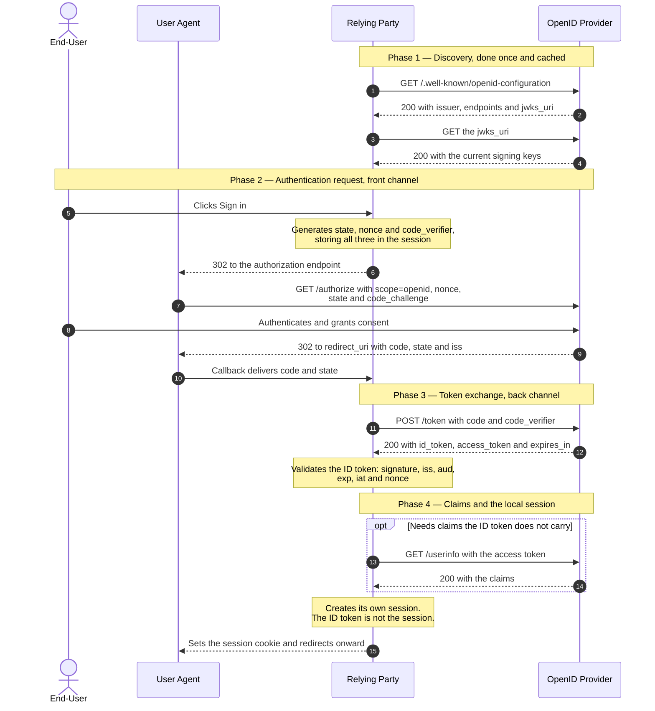
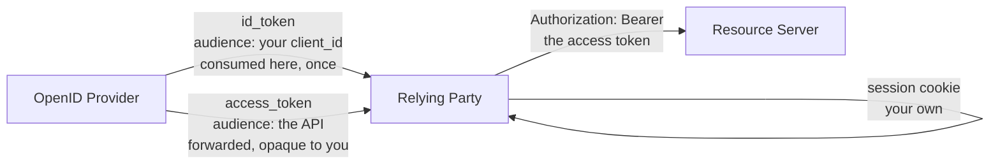

# OpenID Connect Authorization Code Flow

> How an application learns _who_ just signed in — as opposed to what it is
> allowed to do on their behalf, which is the question OAuth answers.

_Also known as: OIDC, "Sign in with…", the basic client profile._

---

## TL;DR

- **OIDC is OAuth 2.0 plus one artefact:** the **ID token**, a signed JWT
  containing claims _about the user_, issued to _your application_. Everything
  else is the authorization code flow you already know.
- **An access token is not proof of identity.** It is a bearer credential for an
  API, opaque to you by design, and any application can obtain one. Only the ID
  token is addressed to you and says who the user is.
- **`nonce` is not `state`.** `state` protects the redirect; `nonce` binds the
  ID token to _this_ authentication request and defeats token replay. You need
  both, plus PKCE.
- **Validating the ID token is the flow.** `iss`, `aud`, `exp`, and `nonce`
  (when you sent one) are required by the spec; checking the signature and
  `iat` as well, even on the back channel, is the hardening this page
  recommends. Skip the required ones and the guarantee is gone.
- **The ID token is not your session.** Validate it once, then create your own
  session. It is a receipt for an authentication event, not a credential to
  present repeatedly.

---

## When to use it

- You want users to sign in with an existing account — Google, Microsoft
  Entra ID, Okta, an internal identity provider.
- You are building single sign-on across several of your own applications.
- You already use OAuth for API access and now need the user's identity too. The
  two are the same round trip; you add `scope=openid`.

## When _not_ to use it

- **First-party login to your own application, with no other party involved.**
  A password or passkey plus a session cookie is fewer moving parts. See
  [Session Cookies & Server-Side Sessions](session-cookies-and-server-side-sessions.md).
- **API-to-API calls with no user.** Use the client credentials grant. There is
  no identity to assert.
- **When you only need delegated access, not identity.** Plain OAuth is enough;
  do not request `openid` and then ignore the ID token.
- **The implicit flow (`response_type=id_token token`)** is not the simpler
  alternative it appears to be. It puts tokens in the URL fragment, is
  discouraged by [RFC 9700](https://www.rfc-editor.org/rfc/rfc9700), and has no
  advantage now that PKCE works everywhere.

---

## Actors and terminology

| Actor             | Spec term                                                                            | What it is                                                                          |
| ----------------- | ------------------------------------------------------------------------------------ | ----------------------------------------------------------------------------------- |
| User              | _End-User_ ([OIDC Core §1.2](https://openid.net/specs/openid-connect-core-1_0.html)) | The human signing in.                                                               |
| Browser           | _User Agent_                                                                         | Carries the front-channel redirects.                                                |
| Your app          | _Relying Party_ (RP)                                                                 | The application that wants to know who the user is. Also an OAuth client.           |
| Identity provider | _OpenID Provider_ (OP)                                                               | Authenticates the user and issues the ID token. Also an OAuth authorization server. |

**Key terms**

- **ID token** — a [JWT](https://www.rfc-editor.org/rfc/rfc7519) signed by the
  OP, whose audience is _your_ `client_id`. Carries `iss`, `sub`, `aud`, `exp`,
  `iat`, and usually `nonce`, `auth_time`, and profile claims.
- **`sub`** — the subject identifier. Stable, opaque, and **unique only within
  one issuer**. This, paired with `iss`, is the user's primary key. It is not an
  email address.
- **`nonce`** — a random value you generate, send in the authentication request,
  and require to come back inside the ID token. It binds the token to your
  request.
- **`aud`** — must contain your `client_id`. This is what stops an ID token
  issued for a _different_ application from being replayed at yours.
- **`azp`** — authorized party. Since errata set 2, Core says it appears only
  when extensions beyond the spec are in use; if you use such an extension,
  validate `azp` as it specifies (typically, that it equals your `client_id`),
  and otherwise ignore it.
- **UserInfo endpoint** — an OAuth-protected endpoint returning claims about the
  user. Called with the _access_ token, not the ID token.
- **`at_hash`** — an optional claim binding the ID token to the access token
  issued alongside it. Only meaningful in flows where they travel separately.

---

## Sequence diagram



## Architecture

The two tokens go to different places, and confusing that is the root of most
OIDC mistakes:



The ID token stops at your server. The access token passes through it. Neither
one is what you give the browser to stay signed in.

---

## Step-by-step

1. **Fetch the provider's configuration.** One document names every endpoint,
   so nothing has to be hard-coded.

   ```http
   GET /.well-known/openid-configuration HTTP/1.1
   Host: accounts.example.com
   ```

2. **The provider returns its metadata.**

   ```json
   {
     "issuer": "https://accounts.example.com",
     "authorization_endpoint": "https://accounts.example.com/authorize",
     "token_endpoint": "https://accounts.example.com/token",
     "userinfo_endpoint": "https://accounts.example.com/userinfo",
     "jwks_uri": "https://accounts.example.com/.well-known/jwks.json",
     "response_types_supported": ["code"],
     "subject_types_supported": ["public"],
     "id_token_signing_alg_values_supported": ["RS256", "ES256"],
     "code_challenge_methods_supported": ["S256"]
   }
   ```

   Trimmed to what this flow uses, plus the fields
   [Discovery §3](https://openid.net/specs/openid-connect-discovery-1_0.html#ProviderMetadata)
   marks REQUIRED.

   _Client stores:_ `issuer` above all. Step 12 compares the token's `iss` to
   this exact string.

3. **Fetch the signing keys.** Cache them, keyed by `kid`, and refresh on an
   unknown `kid` — with a rate limit, so an attacker cannot use unknown key IDs
   to make you hammer the provider.

4. **The provider returns its JWKS.** Multiple keys are normal; providers
   publish the next one before they start using it, which is what makes rotation
   invisible to you.

5. **The user starts sign-in.**

6. **Generate the three secrets and redirect.** `state`, `nonce`, and
   `code_verifier` are independent values, each stored server-side against this
   user's session.

7. **The browser reaches the authorization endpoint.** `scope=openid` is what
   makes this OIDC rather than plain OAuth — without it you get no ID token.

   ```http
   GET /authorize?response_type=code
       &client_id=s6BhdRkqt3
       &redirect_uri=https%3A%2F%2Fapp.example.com%2Fcallback
       &scope=openid%20profile%20email
       &state=af0ifjsldkj
       &nonce=n-0S6_WzA2Mj
       &code_challenge=E9Melhoa2OwvFrEMTJguCHaoeK1t8URWbuGJSstw-cM
       &code_challenge_method=S256 HTTP/1.1
   Host: accounts.example.com
   ```

8. **The user authenticates and consents.** How, is the provider's business —
   password, passkey, or an existing session. If you need to know, ask: `prompt`
   and `max_age` control re-authentication, and `auth_time` reports when it
   happened.

9. **The provider redirects back with the code.**

10. **Your callback receives it.** Compare `state` to the session value and
    reject on mismatch. Where the provider supports it, also check `iss`
    ([RFC 9207](https://www.rfc-editor.org/rfc/rfc9207)).

11. **Exchange the code over the back channel.**

    ```http
    POST /token HTTP/1.1
    Host: accounts.example.com
    Content-Type: application/x-www-form-urlencoded

    grant_type=authorization_code
    &code=SplxlOBeZQQYbYS6WxSbIA
    &redirect_uri=https%3A%2F%2Fapp.example.com%2Fcallback
    &client_id=s6BhdRkqt3
    &code_verifier=dBjftJeZ4CVP-mB92K27uhbUJU1p1r_wW1gFWFOEjXk
    ```

12. **The provider returns the tokens — and now you validate.** This is the
    step the whole flow exists for.

    ```json
    {
      "token_type": "Bearer",
      "expires_in": 3600,
      "access_token": "SlAV32hkKG",
      "id_token": "eyJhbGciOiJSUzI1NiIsImtpZCI6IjFlOWdkazcifQ..."
    }
    ```

    Decoded, the ID token payload:

    ```json
    {
      "iss": "https://accounts.example.com",
      "sub": "24400320",
      "aud": "s6BhdRkqt3",
      "exp": 1757000000,
      "iat": 1756996400,
      "auth_time": 1756996390,
      "nonce": "n-0S6_WzA2Mj",
      "email": "jane@example.com",
      "email_verified": true
    }
    ```

    _Relying party validates_ the rules in
    [OIDC Core §3.1.3.7](https://openid.net/specs/openid-connect-core-1_0.html#IDTokenValidation).
    `iss`, `aud`, `exp`, and `nonce` (if you sent one) are MUSTs. The rest of
    this table is recommended hardening beyond the minimum: because this ID
    token arrives directly from the token endpoint, the spec lets TLS server
    validation stand in for the signature check, and the `iat` window is your
    own policy. Check them anyway — it keeps one code path for every ID token
    and survives a later move to a flow where the signature is mandatory.

    | Check       | Rule                                                                                                                                     |
    | ----------- | ---------------------------------------------------------------------------------------------------------------------------------------- |
    | Signature   | Verify with the JWKS key matching the header `kid`, using an algorithm from `id_token_signing_alg_values_supported`. Reject `alg: none`. |
    | `iss`       | Exactly equals the `issuer` from step 2.                                                                                                 |
    | `aud`       | Contains your `client_id`. Reject if it contains audiences you do not recognise.                                                         |
    | `azp`       | Only if an extension you use puts it there: validate as that extension specifies (typically, equals your `client_id`).                   |
    | `exp`       | In the future, allowing small clock skew.                                                                                                |
    | `iat`       | Recent enough for your policy.                                                                                                           |
    | `nonce`     | Exactly equals the value stored in step 6 (required whenever you sent one — and you should always send one).                             |
    | `auth_time` | If you sent `max_age`, check the authentication is recent enough.                                                                        |

13. **(Optional.) Call UserInfo** when you need claims the ID token does not
    carry. Some providers keep the ID token deliberately small.

    ```http
    GET /userinfo HTTP/1.1
    Host: accounts.example.com
    Authorization: Bearer SlAV32hkKG
    ```

14. **UserInfo returns the claims.** Verify that the `sub` here equals the `sub`
    in the ID token — [OIDC Core §5.3.2](https://openid.net/specs/openid-connect-core-1_0.html)
    requires it, and it is what stops a substituted response describing someone
    else.

15. **Create your own session and move on.** Look the user up by
    `(iss, sub)`, provision them if new, and issue a session cookie. The ID token
    has done its job.

---

## Failure modes

| Failure                             | What the user sees                       | Correct handling                                                                                                                                                       |
| ----------------------------------- | ---------------------------------------- | ---------------------------------------------------------------------------------------------------------------------------------------------------------------------- |
| `state` mismatch at step 10         | A failed login                           | Abort. Do not exchange the code. Usually a stale tab; possibly CSRF.                                                                                                   |
| `nonce` mismatch at step 12         | A failed login                           | Abort and log loudly. A valid signature with the wrong `nonce` means a token from a different authentication event.                                                    |
| Unknown `kid` at step 12            | Intermittent login failures              | Refetch the JWKS once, rate-limited, then retry. Do not refetch per request.                                                                                           |
| Clock skew                          | Sporadic `exp`/`iat` rejections          | Allow a small, fixed leeway — a minute or two. Do not disable the checks.                                                                                              |
| Provider returns no `id_token`      | You have an access token and no identity | You omitted `scope=openid`.                                                                                                                                            |
| User revokes access at the provider | Your session keeps working               | The ID token attests to a past event and cannot be revoked. Bound session lifetime, and use back-channel logout or token introspection if you need faster propagation. |
| Provider is down at step 1          | Nobody can sign in                       | Cache discovery and JWKS with a sensible TTL and serve stale on failure. Do not fetch discovery per login.                                                             |
| `email_verified` is `false`         | Account linked to the wrong person       | Never link accounts by unverified email. See the pitfall below.                                                                                                        |

---

## Common pitfalls

### Using the access token as proof of identity

❌ **What people do:** take the access token, call UserInfo, and sign in whoever
comes back.

✅ **Do instead:** authenticate from the validated ID token. Use the access token
only to call APIs.

_Why it bites you:_ an access token is a bearer credential addressed to the API,
not to your client. Even when it is a JWT with an `aud`
([RFC 9068](https://www.rfc-editor.org/rfc/rfc9068)), you are not guaranteed to
be able to inspect it, and nothing in it says it was issued to _your_
application. An attacker who obtains one for _their_ account at a
provider your app trusts — trivially, by signing in to their own malicious app —
can present it to yours, and UserInfo will faithfully describe them. Historically
this is the "access token substitution" attack, and it is precisely why the ID
token exists.

### Skipping `nonce` because `state` is already checked

❌ **What people do:** treat the two as redundant and implement only `state`.

✅ **Do instead:** send both. `state` is checked against the _callback_; `nonce`
is checked against the _ID token's contents_.

_Why it bites you:_ they defend different things. `state` cannot detect an ID
token that is perfectly valid but was minted for an earlier session or injected
by an attacker who obtained one legitimately. Without `nonce` you have no way to
tell "this token was issued for the request I just made" from "this token was
issued at some point, to someone".

### Treating `email` as the user identifier

❌ **What people do:** key the user table on `email`, because it is human-readable
and every provider returns it.

✅ **Do instead:** key on `(iss, sub)`. Store email as a mutable attribute.

_Why it bites you:_ email addresses change, get reassigned in corporate domains,
and are not guaranteed unique across providers. If you also accept `email` when
`email_verified` is `false`, an attacker registers `ceo@yourcompany.com` at any
provider you trust and takes over that account on first login. `sub` is stable
and opaque, which is exactly why the spec makes it the identifier.

### Putting the ID token in a cookie and calling it a session

❌ **What people do:** set the raw ID token as a cookie or in `localStorage`,
and re-validate it on every request.

✅ **Do instead:** validate it once and create your own session — an opaque
identifier bound to server-side state.

_Why it bites you:_ an ID token is not designed to be presented repeatedly; it
is a receipt for an authentication event. You cannot revoke it, you cannot
change what is in it, and its lifetime is set by the provider rather than by
you. It is also large, so it is now on every request. Sessions solve all of
these and you can log the user out.

### Accepting any algorithm the token header names

❌ **What people do:** read `alg` from the JWT header and verify accordingly,
because that is what the library's default does.

✅ **Do instead:** pin the acceptable algorithms from
`id_token_signing_alg_values_supported`, and reject anything else — `none` above
all.

_Why it bites you:_ letting the token choose its own verification is the classic
JWT vulnerability. `alg: none` asks you to accept an unsigned token; switching
`RS256` to `HS256` invites you to verify an HMAC using the public key as the
shared secret, which an attacker also has. Both are still shipping in the wild.

### Discovery on every login

❌ **What people do:** fetch `/.well-known/openid-configuration` and the JWKS at
the start of each authentication.

✅ **Do instead:** cache both, respect the cache headers, refresh JWKS on unknown
`kid` with a rate limit, and serve stale on provider failure.

_Why it bites you:_ it makes your login path depend on two extra network calls
to a third party, so their latency becomes yours and their outage becomes your
outage. It also generates enough traffic that some providers will rate-limit
you — during a login storm, exactly when you can least afford it.

---

## Security considerations

| Threat                                 | Mitigation                                                                                           |
| -------------------------------------- | ---------------------------------------------------------------------------------------------------- |
| Access token substitution              | Authenticate only from a validated ID token; check `aud` (and `azp` where an extension defines it)   |
| ID token replay from another session   | `nonce`, generated per request and compared on receipt                                               |
| ID token issued for a different client | `aud` must contain your `client_id`                                                                  |
| Authorization code interception        | PKCE with `S256`; codes single-use and short-lived                                                   |
| CSRF on the redirect endpoint          | `state`, compared against server-side session state                                                  |
| Authorization server mix-up            | Compare `iss` from the metadata against the token and, where supported, the `iss` response parameter |
| Signature bypass                       | Pin algorithms; reject `none`; never let `alg` select the key type                                   |
| Account takeover via unverified email  | Link accounts on `(iss, sub)`; require `email_verified` before trusting an address                   |
| Stale authentication                   | `max_age` and `auth_time` for sensitive operations; bounded session lifetime                         |

---

## Implementation checklist

- [ ] Use a certified library. ID token validation has many independent checks
      and each one matters.
- [ ] Request `scope=openid`; add `profile` and `email` only if you use them.
- [ ] Generate `state`, `nonce`, and `code_verifier` per request from a CSPRNG,
      and store them server-side against the session.
- [ ] Register `redirect_uri` exactly, and compare it exactly.
- [ ] Cache discovery metadata and JWKS; refresh on unknown `kid`, rate-limited.
- [ ] Validate signature, `iss`, `aud`, `exp`, `iat`, and `nonce` (plus `azp`
      if an extension you use defines it) — write a test for each one failing
      independently.
- [ ] Pin acceptable signing algorithms; reject `none`.
- [ ] If you call UserInfo, check its `sub` matches the ID token's.
- [ ] Key users on `(iss, sub)`. Never link accounts on unverified email.
- [ ] Create your own session and discard the ID token.
- [ ] Decide what logout means: your session, the provider's, or both. Consider
      back-channel logout if you need the provider's revocation to reach you.

---

## Specs and references

**Normative**

- [OpenID Connect Core 1.0](https://openid.net/specs/openid-connect-core-1_0.html) — errata set 2. §2 the ID token and its claims (including `azp`), §3.1 the authorization code flow, [§3.1.3.7](https://openid.net/specs/openid-connect-core-1_0.html#IDTokenValidation) the ID token validation rules, §5.1 the standard claims, §5.3 UserInfo.
- [OpenID Connect Discovery 1.0](https://openid.net/specs/openid-connect-discovery-1_0.html) — the `/.well-known/openid-configuration` document, its REQUIRED fields ([§3](https://openid.net/specs/openid-connect-discovery-1_0.html#ProviderMetadata)), and `jwks_uri`.
- [RFC 7519 — JSON Web Token](https://www.rfc-editor.org/rfc/rfc7519) — the token format, and §4.1 the registered claims validated at step 12.
- [RFC 9700 — Best Current Practice for OAuth 2.0 Security](https://www.rfc-editor.org/rfc/rfc9700) — why the implicit flow is discouraged and PKCE is not optional.
- [RFC 9207 — Authorization Server Issuer Identification](https://www.rfc-editor.org/rfc/rfc9207) — the `iss` response parameter checked at step 10.
- [RFC 9068 — JWT Profile for OAuth 2.0 Access Tokens](https://www.rfc-editor.org/rfc/rfc9068) — access tokens that do carry `aud`, addressed to the resource server rather than to you.

**Further reading**

- [OpenID Connect Certification](https://openid.net/certification/) — which implementations have actually been tested against the specification.

---

## Related flows

- [OAuth 2.0 Authorization Code + PKCE](oauth2-authorization-code-pkce.md) — the grant this is built on. Read it first.
- [Session Cookies & Server-Side Sessions](session-cookies-and-server-side-sessions.md) — what you create at step 15, and how to get it right.
- [JWT Access & Refresh Token Rotation](jwt-access-refresh-token-rotation.md) — keeping the access token alive after the ID token is spent.
- [WebAuthn / Passkey Registration & Login](webauthn-passkey-registration-and-login.md) — how the provider might authenticate the user at step 8.
- [MCP Authorization](../ai-systems/mcp-authorization.md) — where OIDC Discovery appears as one of the two accepted metadata mechanisms.
