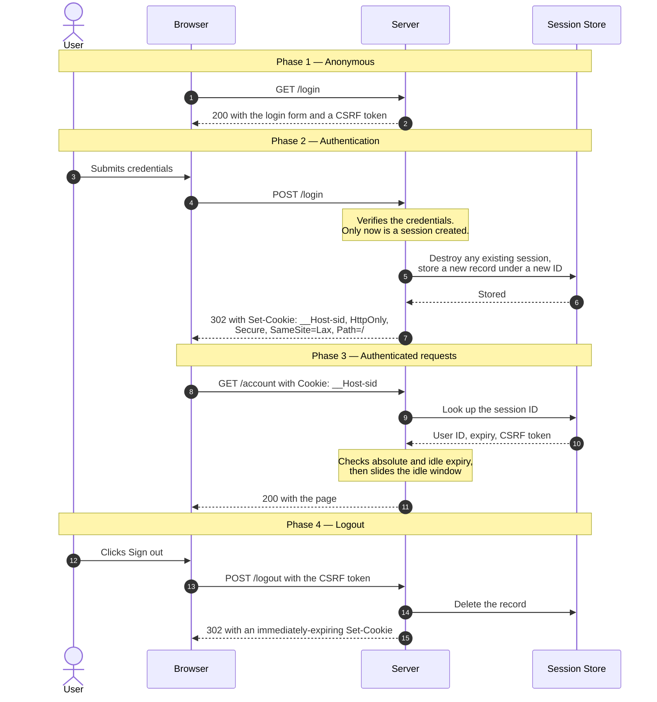
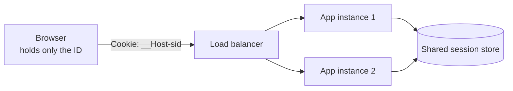

# Session Cookies & Server-Side Sessions

> How a stateless protocol remembers that you are signed in — with one opaque
> identifier in a cookie and all the actual state on the server.

_Also known as: cookie sessions, server-side sessions, "classic" auth._

---

## TL;DR

- **The cookie holds an identifier, not data.** A long random string that means
  nothing on its own; everything real lives server-side, keyed by it. That is
  what makes logout, revocation, and rotation possible at all.
- **Four attributes do the security work:** `HttpOnly`, `Secure`, `SameSite`,
  and a correctly scoped `Path`/`Domain` — best expressed with the `__Host-`
  prefix.
- **Regenerate the session ID at every privilege change**, above all at login.
  Failing to is session fixation, and it is still shipping in new code.
- **Set `SameSite=Lax` explicitly — it blocks most CSRF**, but it is not a
  complete defence on its own. Do not count on a browser default: RFC 6265bis
  describes a `Lax`-equivalent default, but only Chromium-based browsers ship
  it (with a two-minute "Lax+POST" allowance for fresh cookies); Firefox has it
  only behind a preference and Safari not at all.
- **This is the boring option, and usually the right one.** Reach for JWTs when
  you genuinely cannot keep server-side state — not because sessions feel dated.

---

## When to use it

- Any first-party web application where the browser and the server are yours.
- Anywhere you need _immediate_ logout — banning a user, revoking a device,
  responding to a compromise.
- After an OIDC login, as the session you create once the ID token is validated.
  See [OpenID Connect](openid-connect-authorization-code.md).

## When _not_ to use it

- **Native mobile and desktop clients**, which have no cookie jar in the browser
  sense. Use tokens; see
  [JWT Access & Refresh Token Rotation](jwt-access-refresh-token-rotation.md).
- **Cross-domain APIs with third-party callers.** Cookies scoped to your domain
  are not sent by someone else's origin without `SameSite=None`, which reopens
  what you just closed.
- **Genuinely stateless horizontal scale with no shared store.** Though note the
  usual reason given — "sessions do not scale" — is mostly folklore. A Redis
  lookup is well under a millisecond, and you were going to fetch the user row
  anyway.

---

## Actors and terminology

| Actor   | Term            | What it is                                                                                                 |
| ------- | --------------- | ---------------------------------------------------------------------------------------------------------- |
| User    | —               | The human.                                                                                                 |
| Browser | _User Agent_    | Stores the cookie and decides, per request, whether to attach it. Those rules are the security model.      |
| Server  | _Origin Server_ | Issues the identifier and owns the state.                                                                  |
| Store   | _Session Store_ | Where the state lives: Redis, a database table, or memory if you have exactly one process and no ambition. |

**Key terms**

- **Session ID** — an opaque identifier from a CSPRNG. OWASP sets the floor at
  64 bits of entropy; 128 bits is the common convention and what this page
  uses. Not sequential, not a user ID, not a hash of anything predictable.
- **`HttpOnly`** — the cookie is invisible to JavaScript. Turns "any XSS" into
  "any XSS, but at least the attacker cannot simply read the session out and use
  it later from their own machine".
- **`Secure`** — sent only over HTTPS.
- **`SameSite`** — whether the cookie rides along on cross-site requests.
  `Strict` never; `Lax` only on top-level navigations that are safe methods;
  `None` always, and then `Secure` is mandatory.
- **`__Host-` prefix** — a cookie name prefix the browser enforces: it must be
  `Secure`, have `Path=/`, and have **no** `Domain` attribute. That last part is
  the valuable one — it prevents a subdomain from setting a cookie your origin
  will accept.
- **Session fixation** — an attacker gets a victim to use a session ID the
  attacker already knows, then waits for them to log in.
- **Idle vs absolute timeout** — idle resets on activity; absolute does not.
  You want both.

---

## Sequence diagram



## Architecture



The shared store is what makes sticky sessions unnecessary. In-process session
memory is the version of this that works in development and fails the first time
you run two instances — half of requests find no session, and users are logged
out at random.

---

## Step-by-step

1. **An anonymous request arrives.** Do **not** create a session yet. A session
   for every visitor, including every crawler, is a storage bill and a fixation
   opportunity.

2. **Serve the login form with a CSRF token.** The token can live in a
   pre-session cookie or in the form; what matters is that it is bound to
   whatever the browser will present back.

3. **The user submits their credentials.**

4. **The credentials arrive over POST.**

   ```http
   POST /login HTTP/1.1
   Host: app.example.com
   Content-Type: application/x-www-form-urlencoded

   username=jane&password=…&csrf=…
   ```

   _Server validates:_ the credentials, the CSRF token, and the rate limit for
   this account and this IP.

5. **Create a brand-new session, destroying any existing one.** This single step
   is the fixation defence. A new ID, not a refreshed record under the old ID.

   ```sql
   DELETE FROM sessions WHERE id = $old_id;
   INSERT INTO sessions (id, user_id, created_at, last_seen_at, absolute_expires_at)
   VALUES ($new_random_id, $user_id, now(), now(), now() + interval '12 hours');
   ```

6. **The store confirms.** Write before you set the cookie: a cookie pointing at
   a session that does not exist logs the user straight back out.

7. **Set the cookie.** Every attribute here is load-bearing.

   ```http
   HTTP/1.1 302 Found
   Location: /account
   Set-Cookie: __Host-sid=P8x2vQ…; Path=/; Secure; HttpOnly; SameSite=Lax
   ```

   Note there is no `Domain` and no `Max-Age`. Omitting `Domain` is what the
   `__Host-` prefix enforces. Omitting `Max-Age` makes it a _session cookie_ the
   browser drops when it closes — though "when it closes" is unreliable, since
   browsers that restore tabs restore cookies too. Server-side expiry is the
   real control.

8. **A subsequent request carries the cookie.**

   ```http
   GET /account HTTP/1.1
   Host: app.example.com
   Cookie: __Host-sid=P8x2vQ…
   ```

9. **Look the session up.** Treat the ID as untrusted input: a missing or
   unknown ID means anonymous, not an error page.

10. **The store returns the record.**

11. **Check expiry, slide the window, respond.** Two clocks: `last_seen_at + idle
timeout` and `absolute_expires_at`. Either may end the session; only the
    first is refreshed. Writing `last_seen_at` on every request is a hot write —
    throttle it to once a minute rather than dropping it.

12. **The user signs out.**

13. **Logout is a POST with a CSRF token.** A `GET /logout` can be triggered by
    a top-level navigation from any site (which `Lax` allows), by an embedded
    image on any same-site page — a user-content subdomain, say — or from
    anywhere if the cookie is `SameSite=None`. Logging users out unexpectedly
    is a real, if minor, denial of service.

14. **Delete the record server-side.** This is the step that makes logout mean
    something.

15. **Expire the cookie too.** Empty value, `Max-Age=0`. The browser identifies
    a cookie by name, domain (including whether it is host-only), and path; if
    those differ you create a second cookie and the original survives.
    `HttpOnly` and `SameSite` need not match, but the `__Host-` prefix rules
    still apply to the deleting `Set-Cookie`: it must be `Secure`, `Path=/`,
    and carry no `Domain`, or the browser rejects it.

    ```http
    Set-Cookie: __Host-sid=; Path=/; Secure; HttpOnly; SameSite=Lax; Max-Age=0
    ```

---

## Failure modes

| Failure                                       | What the user sees            | Correct handling                                                                                                                                       |
| --------------------------------------------- | ----------------------------- | ------------------------------------------------------------------------------------------------------------------------------------------------------ |
| Unknown or expired session ID                 | Sent to login                 | Treat as anonymous. Never leak whether the ID once existed.                                                                                            |
| Session store is down                         | Everyone logged out           | Fail closed for authenticated routes; serve anonymous content where you can. Do not fall back to trusting the cookie.                                  |
| Store write at step 5 fails                   | Cookie set, session missing   | Write first, set the cookie second.                                                                                                                    |
| Two concurrent requests both slide the window | Lost update on `last_seen_at` | Harmless — last writer wins on a timestamp. Do not add a lock for this.                                                                                |
| User logs in on a second device               | Both sessions valid           | Usually correct. If you want single-session, delete the others at step 5 and tell the user.                                                            |
| Password changed elsewhere                    | Old sessions still live       | Delete all of that user's sessions on password change, and on any credential change. This is the main reason to index sessions by user.                |
| Clock skew between instances                  | Sporadic early expiry         | Expire against the store's clock, not each instance's.                                                                                                 |
| Cookie silently dropped                       | Login "does nothing"          | Almost always `Secure` over plain HTTP, or `__Host-` with a `Domain` attribute. The browser drops it without a visible error; check the network panel. |

---

## Common pitfalls

### Not regenerating the session ID at login

❌ **What people do:** create a session for every visitor, then at login write
the user ID into the _existing_ record.

✅ **Do instead:** destroy the old session and create a new one with a new ID at
login — and at every privilege escalation, such as entering an admin area or
re-authenticating for a sensitive action.

_Why it bites you:_ this is session fixation. An attacker visits your site, gets
a session ID, plants it in the victim's browser — via a link, a subdomain they
control, or an XSS — and waits. The victim logs in normally, your server upgrades
_that_ session to authenticated, and the attacker's copy of the ID is now an
authenticated session. The victim sees nothing wrong.

### `SameSite=None` because a third-party embed broke

❌ **What people do:** hit a case where the cookie is not sent — an iframe, a
payment return, a cross-domain SPA — and set `SameSite=None; Secure` to make it
work.

✅ **Do instead:** understand which case it is first. A payment redirect back to
your site is a top-level navigation and works under `Lax`. A genuine third-party
context needs `None`, and then CSRF tokens become mandatory rather than
belt-and-braces.

_Why it bites you:_ `SameSite=None` restores full cross-site cookie sending, so
every state-changing endpoint is CSRF-reachable again. It is usually applied
globally to fix one endpoint, silently removing the protection from all the
others — including the ones added later by people who assumed it was there.

### Clearing the cookie and calling it logout

❌ **What people do:** on logout, send an expiring `Set-Cookie` and nothing else.

✅ **Do instead:** delete the server-side record first. The cookie is a
convenience for the browser; the record is the session.

_Why it bites you:_ anyone who captured the ID — a proxy log, a shared machine,
a backup — can still use it, because the server still honours it. The user was
told they signed out. On a shared computer that is precisely the situation
logout exists for.

### Putting real data in the cookie

❌ **What people do:** store `user_id`, roles, or a whole serialised object in
the cookie, signed or encrypted, to avoid a store lookup.

✅ **Do instead:** store an opaque identifier and keep the data server-side.

_Why it bites you:_ you cannot revoke it, and you cannot change it. A user
demoted from admin keeps their admin cookie until it expires. Signed cookies also
invite deserialisation bugs — several frameworks have shipped remote code
execution through exactly this path — and encrypted ones break the moment a key
rotates. If you accept those trade-offs deliberately, that is stateless tokens,
and their own page covers the consequences.

### A session ID from the wrong random source

❌ **What people do:** generate the ID from `Math.random()`, a timestamp, a UUIDv1,
or a hash of the user ID.

✅ **Do instead:** use a cryptographically secure generator —
`crypto.randomBytes`, `secrets.token_urlsafe`, `SecureRandom`. OWASP's floor is
64 bits of entropy; 128 bits is the usual convention and costs nothing extra.

_Why it bites you:_ all of those are predictable given enough samples. UUIDv1
encodes a timestamp and a MAC address; `Math.random()` is a PRNG whose internal
state can be recovered from a handful of outputs. An attacker who can predict
IDs does not need to steal one — they enumerate live sessions.

### One idle timeout and no absolute timeout

❌ **What people do:** expire after 30 minutes of inactivity and refresh it on
every request.

✅ **Do instead:** set both an idle timeout and an absolute maximum lifetime.

_Why it bites you:_ an idle-only session lives forever as long as it is used, so
a stolen ID never expires on its own. The absolute timeout puts a hard ceiling
on the value of a theft, and it forces periodic re-authentication, which is what
you want on any account that matters.

---

## Security considerations

| Threat                                 | Mitigation                                                                             |
| -------------------------------------- | -------------------------------------------------------------------------------------- |
| Session fixation                       | New session ID on login and on every privilege change                                  |
| Session hijacking via XSS              | `HttpOnly`; a Content Security Policy; and treating XSS as total compromise regardless |
| Session hijacking on the network       | `Secure`; HSTS; TLS everywhere                                                         |
| CSRF                                   | `SameSite=Lax` or `Strict`, plus per-session CSRF tokens on state-changing requests    |
| Cookie set by a compromised subdomain  | `__Host-` prefix, which forbids `Domain`                                               |
| Session ID prediction                  | CSPRNG; 64+ bits of entropy (OWASP), 128 by convention                                 |
| Indefinite session lifetime            | Absolute timeout alongside the idle timeout                                            |
| Stale sessions after credential change | Delete all of a user's sessions on password or MFA change                              |
| Session ID in a URL                    | Never put it there — it leaks via `Referer`, logs, and shared links                    |

---

## Implementation checklist

- [ ] Generate IDs with a CSPRNG: at least 64 bits of entropy (OWASP), 128 by
      convention.
- [ ] Do not create a session before there is something to remember.
- [ ] Regenerate the ID at login and at every privilege change; destroy the old
      record.
- [ ] Name the cookie with the `__Host-` prefix: `Secure`, `Path=/`, no `Domain`.
- [ ] Set `HttpOnly` and an explicit `SameSite` — do not rely on the browser
      default.
- [ ] Store sessions in a shared store, not in process memory.
- [ ] Enforce both an idle timeout and an absolute timeout, server-side.
- [ ] Throttle the `last_seen_at` write so it is not one database write per
      request.
- [ ] Make logout a POST with a CSRF token, and delete the record before
      expiring the cookie.
- [ ] Index sessions by user so you can revoke them all on a credential change.
- [ ] Add CSRF tokens to every state-changing endpoint, regardless of `SameSite`.
- [ ] Never place a session ID in a URL, a log line, or an error report.

---

## Specs and references

**Normative**

- [RFC 6265 — HTTP State Management Mechanism](https://www.rfc-editor.org/rfc/rfc6265) — the `Cookie` and `Set-Cookie` headers, and §8 the security considerations that most of this page elaborates.
- [RFC 6265bis (draft)](https://datatracker.ietf.org/doc/html/draft-ietf-httpbis-rfc6265bis) — the current work: `SameSite` ([§4.1.2.7](https://datatracker.ietf.org/doc/html/draft-ietf-httpbis-rfc6265bis#section-4.1.2.7), and the "Lax-allowing-unsafe" default in [§5.6.7.2](https://datatracker.ietf.org/doc/html/draft-ietf-httpbis-rfc6265bis#section-5.6.7.2)), the `__Host-` and `__Secure-` prefixes, and cookie size and count limits. This is where browsers' actual behaviour is specified; RFC 6265 predates all of it. The httpbis working group is also developing [Cookies: HTTP State Management Mechanism (draft-ietf-httpbis-layered-cookies)](https://datatracker.ietf.org/doc/draft-ietf-httpbis-layered-cookies/), which reorganises the same material into server and user-agent requirements and is intended to obsolete both.

**Further reading**

- [OWASP Session Management Cheat Sheet](https://cheatsheetseries.owasp.org/cheatsheets/Session_Management_Cheat_Sheet.html) — [session ID entropy](https://cheatsheetseries.owasp.org/cheatsheets/Session_Management_Cheat_Sheet.html#session-id-entropy) (at least 64 bits), timeout guidance, the advice not to rely on the browser's `SameSite` default, and the fixation and hijacking attack detail.
- [MDN — `Set-Cookie`: `SameSite`](https://developer.mozilla.org/en-US/docs/Web/HTTP/Reference/Headers/Set-Cookie#samesitesamesite-value) — the two-minute `POST` allowance when `Lax` is applied as a default, and the [browser compatibility](https://developer.mozilla.org/en-US/docs/Web/HTTP/Reference/Headers/Set-Cookie#browser_compatibility) data on which browsers default to `Lax`.
- [OWASP Cross-Site Request Forgery Prevention Cheat Sheet](https://cheatsheetseries.owasp.org/cheatsheets/Cross-Site_Request_Forgery_Prevention_Cheat_Sheet.html) — why `SameSite` alone is defence in depth rather than a complete answer.

---

## Related flows

- [OpenID Connect Authorization Code Flow](openid-connect-authorization-code.md) — where this session begins when identity comes from a provider.
- [JWT Access & Refresh Token Rotation](jwt-access-refresh-token-rotation.md) — the stateless alternative, and the revocation problem you take on with it.
- [WebAuthn / Passkey Registration & Login](webauthn-passkey-registration-and-login.md) — how the credentials at step 4 can be phishing-resistant.
- [CORS Preflight](../networking/cors-preflight.md) — why a cross-origin fetch needs `credentials: "include"` and an exact `Access-Control-Allow-Origin` before it will send this cookie at all.
