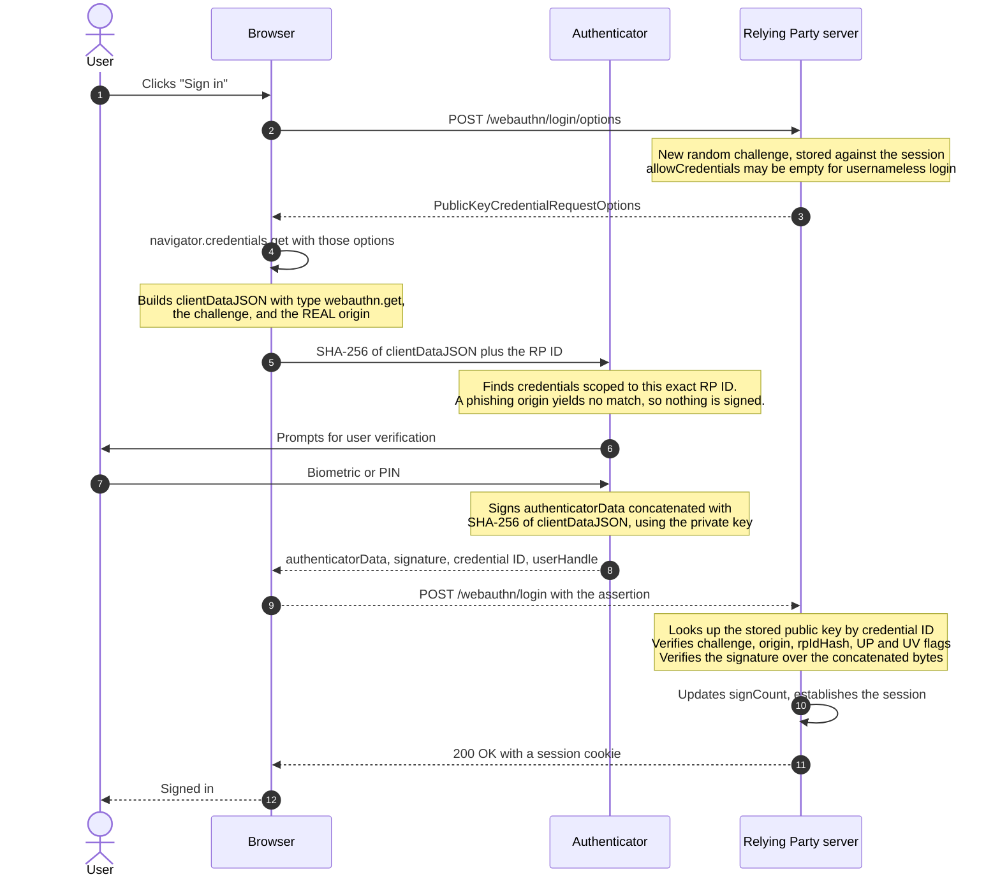

# WebAuthn / Passkey Registration & Login

> How a user signs in by proving they hold a private key that is never sent to
> the server — and why this is the only widely deployed authentication method
> that phishing cannot defeat.

_Also known as: passkeys, FIDO2, passwordless login, security key login._

---

## TL;DR

- Two ceremonies, same shape: **registration** creates a keypair and gives the
  server the public key; **authentication** signs a fresh server challenge with
  the private key. The private key is never sent to the relying party, and
  never leaves the authenticator or credential provider in plaintext — a
  synced passkey travels between the user's devices only as an end-to-end
  encrypted copy.
- The browser — not your code, and not the user — binds the signature to the
  **origin**. A phishing site at `exarnple.com` cannot get a signature valid for
  `example.com`, because the browser refuses to produce one.
- That origin binding is the entire security story. Everything else is
  plumbing.
- **Passkeys** are WebAuthn credentials that are _discoverable_ (the
  authenticator can list them without being told the username, enabling
  usernameless login) and usually _synced_ across a user's devices by their
  platform.
- Because passkeys sync, the signature counter no longer reliably detects
  cloning. Do not build security on `signCount`.

---

## When to use it

- Replacing passwords, or adding a genuinely phishing-resistant second factor.
- Any account where credential phishing is the realistic threat — which is most
  of them.
- Step-up authentication before a sensitive action, using `userVerification:
"required"` to force a fresh biometric or PIN check.

## When _not_ to use it

- **As the only sign-in method with no recovery path.** Lose every device and
  the account is gone. You need account recovery, and recovery is now your
  weakest link — design it before you ship.
- **Server-to-server or headless contexts.** There is no user to touch a
  sensor. Use mTLS or signed requests.
- **Where you cannot store per-user public keys and per-attempt challenges.**
  WebAuthn is inherently stateful on the server side.

---

## Actors and terminology

| Actor        | Spec term            | What it is                                                                                                                                                                                                                        |
| ------------ | -------------------- | --------------------------------------------------------------------------------------------------------------------------------------------------------------------------------------------------------------------------------- |
| Your server  | _Relying Party_ (RP) | Generates challenges, verifies signatures, stores public keys.                                                                                                                                                                    |
| Browser      | _WebAuthn Client_    | Enforces origin binding and mediates the user gesture. The security-critical component you do not control.                                                                                                                        |
| Device / key | _Authenticator_      | Holds private keys, does user verification, signs. Platform (Touch ID, Windows Hello) or roaming (USB/NFC security key, or a phone via hybrid: BLE proves proximity, data flows through an encrypted tunnel via a relay service). |
| —            | _Credential_         | A keypair plus its ID, scoped to one RP ID.                                                                                                                                                                                       |

**Key terms**

- **RP ID** — the domain a credential is scoped to, e.g. `example.com`. Must be
  the origin's effective domain or a registrable suffix of it: a page on
  `app.example.com` may use `example.com` but never `example.org`. The
  authenticator stores `SHA-256(RP ID)` and will not sign for any other.
- **Challenge** — server-generated random value, ≥16 bytes, single-use, bound
  to the session. This is the anti-replay mechanism.
- **`clientDataJSON`** — assembled _by the browser_, containing the ceremony
  `type`, the `challenge`, and the true `origin`. The client cannot be talked
  into lying about `origin`.
- **`authenticatorData`** — assembled by the authenticator: `rpIdHash`, flag
  bits, `signCount`, and (on registration) the new public key.
- **Flags** — `UP` (user present: someone touched it), `UV` (user verified:
  biometric or PIN succeeded), `BE`/`BS` (backup eligible / backed up — how you
  tell a synced passkey from a single-device credential).
- **Attestation** — optional cryptographic statement about the authenticator's
  make and model. Useful in enterprise; unnecessary and privacy-invasive for
  consumer sign-in, where `attestation: "none"` is correct.
- **Discoverable credential** (formerly _resident key_) — stored on the
  authenticator with enough metadata to be offered without the RP naming a user
  first. This is what makes "just click Sign in" work.

---

## Sequence diagram — Ceremony 1: registration (attestation)

```mermaid
sequenceDiagram
    autonumber
    actor U as User
    participant B as Browser
    participant A as Authenticator
    participant RP as Relying Party server

    U->>B: Clicks "Create a passkey"
    B->>RP: POST /webauthn/register/options
    Note over RP: Generates a 32-byte random challenge<br/>Stores it against the session with a short TTL
    RP-->>B: PublicKeyCredentialCreationOptions with rp, user,<br/>challenge, pubKeyCredParams, excludeCredentials

    B->>B: navigator.credentials.create with those options
    Note over B: Builds clientDataJSON containing<br/>type webauthn.create, the challenge, and the REAL origin
    B->>A: Sends SHA-256 of clientDataJSON plus the RP ID
    Note over A: Checks whether it already holds any credential ID<br/>listed in excludeCredentials for this RP ID

    A->>U: Prompts for user verification
    U->>A: Biometric or PIN, plus a physical touch
    Note over A: Generates a new keypair for this RP ID<br/>Private key stays in the authenticator<br/>Builds authenticatorData and signs the attestation

    A-->>B: attestationObject and credential ID
    B-->>RP: POST /webauthn/register with clientDataJSON<br/>and attestationObject
    Note over RP: Verifies type, challenge, origin, rpIdHash,<br/>UP and UV flags, algorithm, attestation
    RP->>RP: Stores credential ID, public key, signCount, AAGUID, BE/BS
    RP-->>B: 201 Created
    B-->>U: "Passkey created"
```



### Step-by-step — registration

1. **User asks to create a passkey.**

2. **Browser requests options from your server.** Options must come from the
   server: the challenge is the security-relevant part and cannot be
   client-generated.

3. **Server returns the creation options.**

   ```json
   {
     "rp": { "id": "example.com", "name": "Example" },
     "user": {
       "id": "dTQy",
       "name": "ada@example.com",
       "displayName": "Ada Lovelace"
     },
     "challenge": "k3rDq1Zt8w9c5xQ2p7fVnGh4sLmBaYuIeOwRtZxCvNk",
     "pubKeyCredParams": [
       { "type": "public-key", "alg": -7 },
       { "type": "public-key", "alg": -257 }
     ],
     "authenticatorSelection": {
       "residentKey": "required",
       "userVerification": "preferred"
     },
     "excludeCredentials": [{ "type": "public-key", "id": "…" }],
     "attestation": "none",
     "timeout": 60000
   }
   ```

   `alg: -7` is ES256 and `-257` is RS256, from the
   [COSE algorithm registry](https://www.iana.org/assignments/cose/cose.xhtml#algorithms).
   Offer both. `user.id` must be an **opaque byte string, not an email or
   username** — it is not meant to be displayed (that is what `name` and
   `displayName` are for), but the authenticator stores it and may return it,
   even without user verification, so it must not be personally identifying,
   and should not be reused across accounts
   ([WebAuthn L3 §14.6.1](https://www.w3.org/TR/webauthn-3/#sctn-user-handle-privacy)). `residentKey: "required"` is what makes this a passkey rather than
   a second factor.

4. **Browser calls `navigator.credentials.create()`** and assembles
   `clientDataJSON`. The `origin` it writes in is the real one, from the browser's
   own state — not anything your JavaScript supplied.

5. **Browser passes the hashed client data and RP ID to the authenticator,**
   over an internal API for a platform authenticator or over CTAP2 for a
   roaming one. `excludeCredentials` lets the authenticator refuse to create a
   second credential when it already holds one of the listed credential IDs for
   this RP.

6. **Authenticator asks the user to verify.**

7. **User provides a biometric or PIN and touches the device.** The touch
   proves a human is present; the biometric proves _which_ human.

   _No message on the wire:_ the authenticator now generates the keypair and
   signs. For a device-bound credential the private key is generated in and
   never leaves the secure element; for a synced passkey it is held by the
   credential provider and copied to the user's other devices only
   end-to-end encrypted. Either way it is never sent to the relying party.

8. **Authenticator returns the attestation object** — CBOR containing `fmt`,
   `attStmt`, and `authData`. `authData` carries `rpIdHash` (32 bytes), flags
   (1 byte), `signCount` (4 bytes), and the attested credential data including
   the COSE-encoded public key.

9. **Browser posts the result to your server.**

   _Receiver validates:_ per
   [WebAuthn L3 §7.1](https://www.w3.org/TR/webauthn-3/#sctn-registering-a-new-credential),
   at minimum:
   - `clientData.type === "webauthn.create"`
   - `clientData.challenge` equals the challenge stored for this session, which
     is then **deleted** so it cannot be reused
   - `clientData.origin` is in your allow-list of exact origins
   - `authData.rpIdHash === SHA-256(rpId)`
   - `UP` flag is set; `UV` is set if you required it
   - the credential's algorithm is one you offered in `pubKeyCredParams`
   - the credential ID is not already registered to another user

10. **Server stores the credential.** Persist credential ID, public key,
    `signCount`, AAGUID, transports, and the `BE`/`BS` flags. Store transports:
    returning them in `allowCredentials` later is what makes the browser prompt
    for the right thing instead of showing every option.

11. **Server confirms.**

12. **Browser tells the user the passkey exists.** Prompt them to register a
    second credential now — account recovery is much easier to solve before it
    is needed.

---

## Sequence diagram — Ceremony 2: authentication (assertion)



### Step-by-step — authentication

1. **User clicks sign in.** With discoverable credentials there is no username
   field to fill in first.

2. **Browser requests options.**

3. **Server returns request options** with a _fresh_ challenge:

   ```json
   {
     "challenge": "9pQnR4tYuIoP2aSdF6gHjKlZxCvBnM8eRtYuIoPaSdE",
     "rpId": "example.com",
     "allowCredentials": [],
     "userVerification": "preferred",
     "timeout": 60000
   }
   ```

   An empty `allowCredentials` means "offer any passkey you have for this RP" —
   usernameless login. Populate it (with `transports`) only when you already
   know who the user is, such as for step-up authentication.

4. **Browser calls `navigator.credentials.get()`.** For the autofill experience,
   pass `mediation: "conditional"` and put `autocomplete="username webauthn"` on
   the input; the browser then offers passkeys inline instead of in a modal.

5. **Browser hands the request to the authenticator.** _This is the step that
   defeats phishing._ The browser derives the RP ID from the real origin, and
   the authenticator only holds keys under `SHA-256(rpId)`. On a lookalike
   domain there is simply no matching credential, so no signature is produced.
   No user decision is involved, which is why it works where user education
   does not.

6. **Authenticator prompts for verification.**

7. **User verifies.**

   _No message on the wire:_ the authenticator signs over
   `authenticatorData ‖ SHA-256(clientDataJSON)`. Note it signs a hash of the
   client data, so both the challenge and the origin are covered by the
   signature.

8. **Authenticator returns the assertion,** including `userHandle` — the
   `user.id` from registration, which is how you identify the user in a
   usernameless flow.

9. **Browser posts it to your server.**

   _Receiver validates:_ per
   [WebAuthn L3 §7.2](https://www.w3.org/TR/webauthn-3/#sctn-verifying-assertion):
   - look up the stored public key by credential ID, and confirm it belongs to
     the user identified by `userHandle`
   - `clientData.type === "webauthn.get"`
   - challenge matches the stored one; delete it
   - `origin` is allow-listed; `rpIdHash` matches
   - `UP` set; `UV` set if required
   - the signature verifies over `authenticatorData ‖ SHA-256(clientDataJSON)`
     with the stored public key

10. **Server updates `signCount` and starts a session.** From here it is an
    ordinary session — see
    [JWT Access & Refresh Token Rotation](jwt-access-refresh-token-rotation.md).

11. **Server returns the session cookie.**

12. **User is signed in.**

---

## Failure modes

| Failure                                  | What the user sees                  | Correct handling                                                                                                                                                                                                                                                                                                                                          |
| ---------------------------------------- | ----------------------------------- | --------------------------------------------------------------------------------------------------------------------------------------------------------------------------------------------------------------------------------------------------------------------------------------------------------------------------------------------------------- |
| User cancels the prompt                  | `NotAllowedError`                   | Indistinguishable from a timeout by design. Show "Passkey sign-in cancelled" and offer another method. Do not treat it as a failed attempt for lockout purposes.                                                                                                                                                                                          |
| Ceremony times out                       | `NotAllowedError` again             | Same handling. The spec deliberately does not let you tell these apart, so you cannot probe for credential existence.                                                                                                                                                                                                                                     |
| No credential for this RP on this device | `NotAllowedError`                   | Offer the cross-device (QR code / hybrid) flow, or a fallback method.                                                                                                                                                                                                                                                                                     |
| Credential already registered            | `InvalidStateError` from `create()` | This is the _success_ case for `excludeCredentials`. Tell the user they already have a passkey here — do not surface it as an error.                                                                                                                                                                                                                      |
| `signCount` did not increase             | Verification "anomaly"              | Common and benign for synced passkeys, which report `0` on both sides. If either counter is non-zero and the received one is not greater, §7.2 calls it a clone signal (not proof) — feed it to risk scoring.                                                                                                                                             |
| User loses every device                  | Locked out                          | Only recovery saves them. This is a product problem, not a protocol one.                                                                                                                                                                                                                                                                                  |
| RP ID changed (domain migration)         | All credentials unusable            | Credentials are bound to the RP ID permanently. Either keep using the old RP ID from the new origin via Related Origin Requests (list the new origin in `https://old-rp-id/.well-known/webauthn`, [WebAuthn L3 §5.11](https://www.w3.org/TR/webauthn-3/#sctn-related-origins); needs client support), or have users re-register. Plan this before launch. |
| Browser has no platform authenticator    | No prompt                           | Feature-detect with `isUserVerifyingPlatformAuthenticatorAvailable()` before offering the option.                                                                                                                                                                                                                                                         |

---

## Common pitfalls

### Generating the challenge on the client

❌ **What people do:** create the random challenge in JavaScript, or reuse one
challenge for many attempts.

✅ **Do instead:** generate ≥16 bytes on the server per attempt, store it
against the session with a short TTL, and delete it on first use.

_Why it bites you:_ the challenge is the only thing preventing replay. A
client-chosen or reused challenge means a captured assertion can be replayed
forever, and the whole ceremony degrades into a very elaborate no-op.

### Checking the origin with a prefix match

❌ **What people do:** `if (origin.startsWith("https://example.com"))`.

✅ **Do instead:** compare against an explicit allow-list of exact origin
strings.

_Why it bites you:_ `https://example.com.attacker.net` passes that check. You
have reintroduced phishing into the one protocol that had eliminated it.

### Trusting `signCount` as clone detection

❌ **What people do:** hard-fail authentication whenever the counter does not
increase.

✅ **Do instead:** follow
[WebAuthn L3 §7.2](https://www.w3.org/TR/webauthn-3/#sctn-verifying-assertion):
if either the stored or the received counter is non-zero and the received one
is not greater than the stored one, treat it as a signal, not proof, of
cloning and flag it for review. Only when both are zero is there nothing to
check.

_Why it bites you:_ synced passkeys — the majority of credentials now — report
`signCount: 0` always, because a counter cannot be kept consistent across
devices. A hard fail locks out your users on a signal that no longer means what
it did in 2019.

### Demanding attestation for consumer sign-in

❌ **What people do:** set `attestation: "direct"` and reject unknown AAGUIDs.

✅ **Do instead:** use `attestation: "none"` unless you have a written policy
requiring specific certified hardware.

_Why it bites you:_ attestation adds an identifying, cross-site-linkable signal,
triggers extra browser consent prompts, and blocks perfectly good
authenticators whose AAGUIDs you have not enumerated. You get a worse
conversion rate in exchange for a signal you were never going to act on.

### Using an email address as `user.id`

❌ **What people do:** set `user.id` to the user's email or a sequential
database ID.

✅ **Do instead:** a random opaque byte string, generated once per account and
stored alongside it.

_Why it bites you:_ `user.id` is written into the authenticator, which may hand
it back as `userHandle` without user verification — so a PII value leaks to
anyone holding the device, permanently. It is not what credential managers
display; `name` and `displayName` are. It is also the
account key for discoverable credentials — if the email changes, or if the same
value appears under another account, credential management breaks.

### Shipping passkeys with no recovery path

❌ **What people do:** launch passwordless-only, with support tickets as the
recovery mechanism.

✅ **Do instead:** prompt for a second credential at registration, and design
recovery explicitly — a second passkey, a verified recovery contact, or one-time
codes.

_Why it bites you:_ recovery becomes the weakest link, and if it is "email a
magic link", the account's real security is your email provider's, not
WebAuthn's. An attacker will simply attack the recovery path.

### Verifying with a hand-rolled CBOR parser

❌ **What people do:** write bespoke parsing of `attestationObject` and COSE
keys.

✅ **Do instead:** use a maintained server library — SimpleWebAuthn (TS),
webauthn4j (Java), py_webauthn (Python), go-webauthn (Go).

_Why it bites you:_ verification has a dozen checks and several
attacker-controlled binary formats. A single skipped check — most commonly the
origin or the `UV` flag — silently removes the guarantee, and nothing in your
test suite will notice.

---

## Security considerations

| Threat                                   | Mitigation                                                                                                 |
| ---------------------------------------- | ---------------------------------------------------------------------------------------------------------- |
| **Phishing**                             | Origin binding, enforced by the browser. The defining property of WebAuthn.                                |
| **Credential replay**                    | Single-use, server-generated, session-bound challenges                                                     |
| **Man-in-the-middle**                    | The signature covers the origin via `clientDataJSON`; a proxy on another domain cannot produce a valid one |
| **Credential stuffing / password reuse** | No shared secret exists to stuff                                                                           |
| **Server database breach**               | Only public keys are stored; they are not credentials                                                      |
| **Authenticator cloning**                | `signCount` where meaningful; attestation where you have a hardware policy                                 |
| **Malware on the user's device**         | Out of scope for the protocol. `UV` raises the bar; it does not eliminate this.                            |
| **Account recovery abuse**               | Design recovery to the same standard as sign-in — it is now the attack surface                             |

---

## Implementation checklist

- [ ] Challenges are ≥16 random bytes, generated server-side, session-bound, short-TTL, and deleted after one use.
- [ ] `origin` is checked against an exact allow-list, never a prefix or substring match.
- [ ] `rpIdHash` is compared to `SHA-256(rpId)` on every ceremony.
- [ ] `type` is checked: `webauthn.create` on registration, `webauthn.get` on authentication.
- [ ] `UP` is required; `UV` is required wherever your policy says it is, and actually enforced server-side.
- [ ] `user.id` is a random opaque byte string, not an email, username, or sequential ID.
- [ ] `residentKey: "required"` if you want passkeys; `excludeCredentials` populated on registration.
- [ ] Stored per credential: credential ID, public key, `signCount`, AAGUID, transports, `BE`/`BS`.
- [ ] `transports` are returned in `allowCredentials` so the browser prompts correctly.
- [ ] `signCount` regressions (received ≤ stored, when either is non-zero) are flagged, not hard-failed; only both-zero is skipped.
- [ ] Users are prompted to register a second credential, and a recovery path exists and is documented.
- [ ] Cancel and timeout are handled as the same, non-alarming outcome.
- [ ] Conditional UI (`mediation: "conditional"`) is wired up for autofill sign-in.
- [ ] The RP ID is chosen deliberately for the long term — it cannot be changed later, only shared with new origins via Related Origin Requests.
- [ ] Verification uses a maintained library, not hand-written CBOR parsing.

---

## Specs and references

**Normative**

- [W3C Web Authentication Level 3](https://www.w3.org/TR/webauthn-3/) — the specification. §7.1 and §7.2 are the two verification procedures and are the sections you will actually implement against; §6.1 documents the `authenticatorData` byte layout and flags; [§5.11](https://www.w3.org/TR/webauthn-3/#sctn-related-origins) is Related Origin Requests; [§14.6.1](https://www.w3.org/TR/webauthn-3/#sctn-user-handle-privacy) covers user handle contents.
- [FIDO CTAP 2.3](https://fidoalliance.org/specs/fido-v2.3-ps-20260226/fido-client-to-authenticator-protocol-v2.3-ps-20260226.html) — the protocol between browser and roaming authenticator, current Proposed Standard (February 2026). [§11.5](https://fidoalliance.org/specs/fido-v2.3-ps-20260226/fido-client-to-authenticator-protocol-v2.3-ps-20260226.html#sctn-hybrid) specifies the hybrid (cross-device) transport: BLE advertisements for proximity, data over a tunnel service. Hybrid was first specified in [CTAP 2.2](https://fidoalliance.org/specs/fido-v2.2-ps-20250714/fido-client-to-authenticator-protocol-v2.2-ps-20250714.html) (July 2025); CTAP 2.1 does not cover it. Relevant if you are debugging hardware keys or the cross-device flow.
- [RFC 9052 — CBOR Object Signing and Encryption (COSE): Structures and Process](https://www.rfc-editor.org/rfc/rfc9052) — the `COSE_Key` structure used for the public key in `attestationObject`. Obsoletes RFC 8152 together with RFC 9053.
- [RFC 9053 — CBOR Object Signing and Encryption (COSE): Initial Algorithms](https://www.rfc-editor.org/rfc/rfc9053) — the ES256 and other algorithm and key-parameter definitions.
- [IANA COSE Algorithms registry](https://www.iana.org/assignments/cose/cose.xhtml#algorithms) — the `alg` values for `pubKeyCredParams` (`-7` = ES256, `-257` = RS256).

**Further reading**

- [passkeys.dev](https://passkeys.dev/) — FIDO Alliance and W3C-backed implementation guidance, including current platform support and UX patterns.
- [MDN — Web Authentication API](https://developer.mozilla.org/en-US/docs/Web/API/Web_Authentication_API) — the most readable reference for the client-side API surface.
- [SimpleWebAuthn](https://simplewebauthn.dev/) — a well-documented server and browser library; its docs double as a good explanation of the verification steps.

---

## Related flows

- [OAuth 2.0 Authorization Code Flow with PKCE](oauth2-authorization-code-pkce.md) — WebAuthn is how the user authenticates at the authorization server's login step.
- [JWT Access & Refresh Token Rotation](jwt-access-refresh-token-rotation.md) — what happens after a successful assertion establishes the session.
- [Session Cookies & Server-Side Sessions](session-cookies-and-server-side-sessions.md) — the other thing to do after a successful assertion, and the one to prefer for a first-party application.
- [OpenID Connect Authorization Code Flow](openid-connect-authorization-code.md) — how a provider conveys "this user authenticated with a passkey, at this time" to a relying party.
