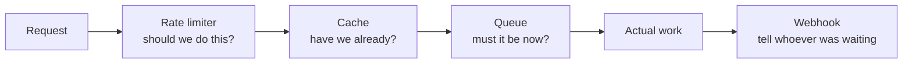

# Data, Caching & Delivery

Flows for moving data to where it is needed, keeping copies of it, and knowing
what guarantees you actually have when you do.

| Flow                                                                                        | What it answers                                                                                      | Difficulty   |
| ------------------------------------------------------------------------------------------- | ---------------------------------------------------------------------------------------------------- | ------------ |
| [Cache-Aside Read & Write](cache-aside-read-write.md)                                       | How do I cache correctly, and what happens when ten thousand requests miss the same key at once?     | Intermediate |
| [Message Queue Delivery Semantics](message-queue-delivery-semantics.md)                     | What do at-least-once and exactly-once actually mean, and which one do I really have?                | Intermediate |
| [Rate Limiting Algorithms](rate-limiting-algorithms.md)                                     | Token bucket or sliding window — and how do I count correctly across a fleet?                        | Intermediate |
| [Webhook Delivery & Signature Verification](webhook-delivery-and-signature-verification.md) | How do I prove an HTTP POST really came from the sender, is fresh, and has not already been handled? | Intermediate |

## How these fit together

Three of them are ways of not doing work at the moment it is asked for. A
**cache** answers without doing it again; a **queue** accepts it now and does it
later; a **rate limiter** declines to do it at all. Between them they are most
of what keeps a system up when demand exceeds what it can serve. A **webhook**
is the outbound direction of the same idea: telling somebody else that work
happened, on their schedule rather than yours.

Caches and queues also share a hazard: both hold copies that can disagree with
the source. In a system with both, the queue usually carries the invalidation —
so your cache invalidation inherits every duplication and ordering caveat of
your broker. Webhooks inherit them too, which is why the consumer is the one
that has to deduplicate.

## Wanted

Good first contributions in this category — see [CONTRIBUTING.md](../../CONTRIBUTING.md):

- CDN cache flow (edge hit, origin shield, purge propagation)
- Database replication and failover (sync vs async, split brain)
- Read replicas and read-your-own-writes consistency
- Blue-green and canary deployments
- CI/CD pipeline flow from commit to production
- Backpressure and load shedding
- Bulk import and ETL with restartability
