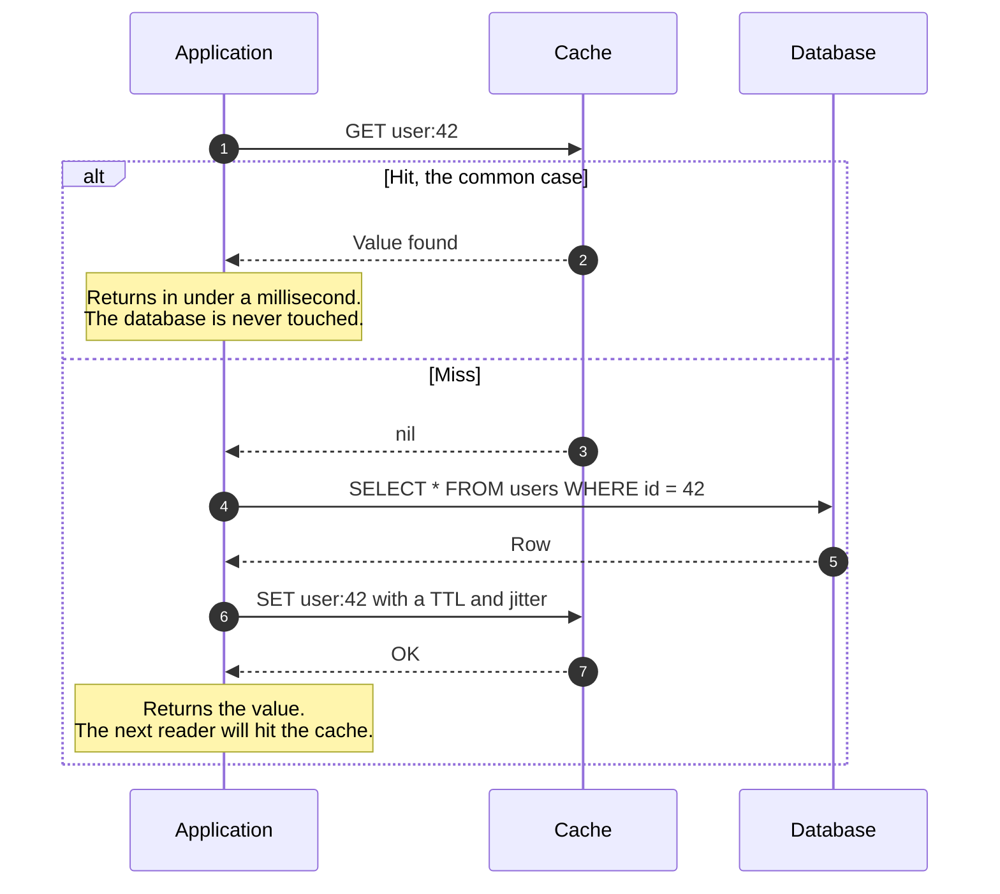
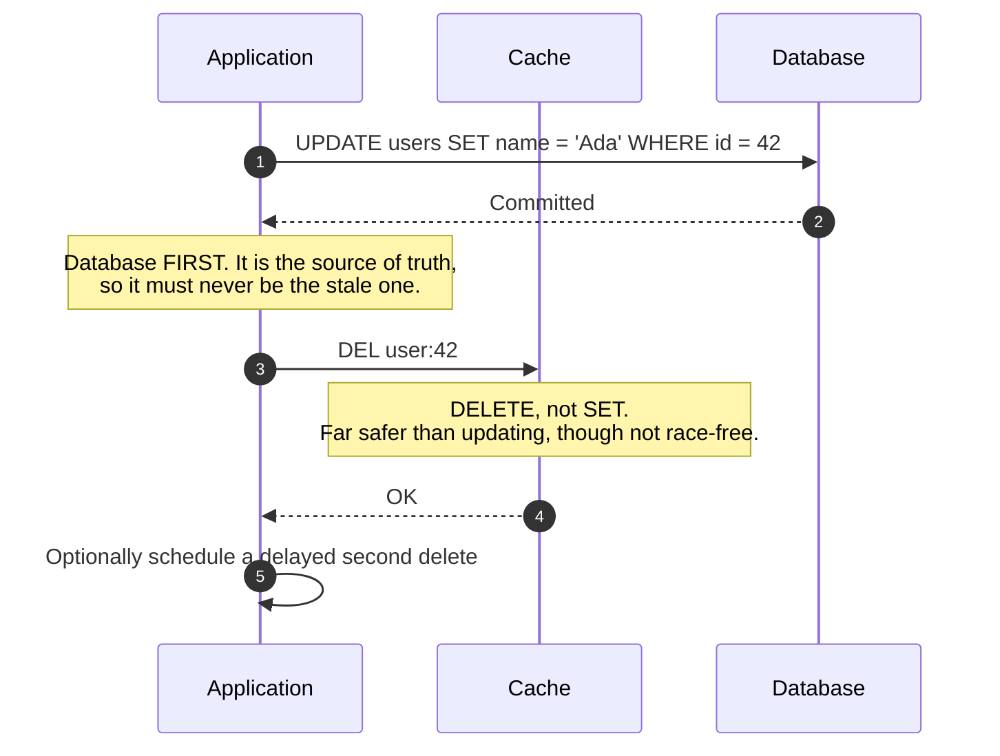
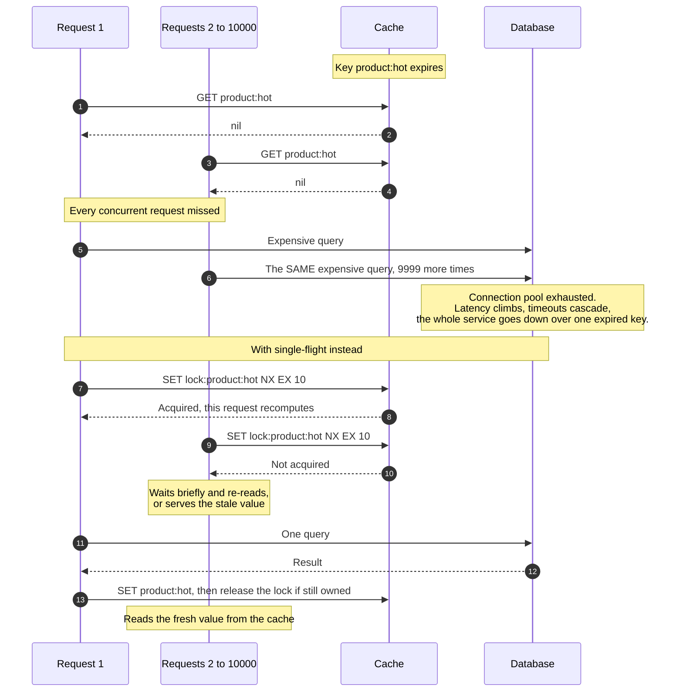

# Cache-Aside (Lazy Loading) Read & Write

> The most widely deployed caching pattern: the application checks the cache,
> falls back to the database on a miss, and populates the cache on the way back
> — plus the two things that make it hard, which are invalidation and what
> happens when ten thousand requests miss at once.

_Also known as: lazy loading, lazy population._

---

## TL;DR

- **Read:** check cache → on miss, read the database → write to cache → return.
  The cache is a side store the application manages, not something the database
  knows about.
- **Write: invalidate, do not update.** Deleting the key is far safer than
  writing the new value, because two concurrent writers can interleave and leave
  a permanently wrong value in the cache.
- **Order matters:** write the database _first_, then delete the cache key. The
  reverse order has a much wider race window.
- **Cache stampede** is the failure that takes systems down: one popular key
  expires, every concurrent request misses, and they all hit the database
  simultaneously. Single-flight or early recomputation fixes it.
- The cache is not the source of truth. Every path must still work — slower —
  when the cache is empty or unavailable.

---

## When to use it

- Read-heavy workloads with a high read:write ratio.
- Expensive reads: joins, aggregations, external API calls.
- When you can tolerate briefly stale data. If you cannot, you are not looking
  for a cache.

## When _not_ to use it

- **Write-heavy data.** Constant invalidation means you pay the cache's cost and
  hit the database anyway.
- **Data that must be strictly consistent** — balances at the point of a
  transaction, inventory at the point of sale. Read those from the primary.
- **When the database is already fast enough.** A cache adds an entire class of
  bugs (staleness, stampede, inconsistency) and a new operational dependency.
  Measure first.
- **As a durable store.** Caches evict under memory pressure without warning.
  Anything you cannot regenerate does not belong in one.

---

## Actors and terminology

| Actor       | Term                  | What it is                                                                   |
| ----------- | --------------------- | ---------------------------------------------------------------------------- |
| Application | _Client_ of the cache | Owns all the caching logic. The cache and database never talk to each other. |
| Cache       | —                     | Redis, Memcached, or an in-process LRU.                                      |
| Database    | _System of record_    | The only source of truth.                                                    |

**Key terms**

- **Cache hit / miss** — whether the key was present.
- **TTL** — time to live. The upper bound on staleness, and your safety net for
  every invalidation bug you have not found yet.
- **Cache stampede** (thundering herd, dog-piling) — many concurrent misses on
  the same key hitting the database at once.
- **Single-flight** — allowing exactly one request to recompute a key while
  others wait for its result.
- **Negative caching** — caching "this does not exist" so repeated lookups for
  a missing key do not reach the database.
- **Stale-while-revalidate** — serving the old value immediately while
  refreshing in the background ([RFC 5861](https://www.rfc-editor.org/rfc/rfc5861)).

---

## Sequence diagram — read path



## Sequence diagram — write path



## The stampede, and the fix



---

## Step-by-step

### Read path

1. **Look up the key.** Use a namespaced, versioned key so a schema change can
   invalidate everything at once:

   ```text
   v3:user:42          # bump v3 to v4 to invalidate the entire class
   ```

   Steps 2 and 3 are the two branches of the same lookup. `autonumber` counts
   both, but only one of them happens on any given read.

2. **Hit — the cache returns the value.** Return it and stop. Nothing else
   happens, and the database is never touched.

3. **Miss — the cache returns `nil`.** A miss is an ordinary outcome, not an
   error: the remaining steps are the miss path.

4. **Read from the database.**

5. **Database returns the row.**

6. **Write it to the cache with a TTL — and jitter the TTL.**

   ```python
   ttl = 300 + random.randint(0, 60)   # 5 minutes, plus up to 60s of jitter
   cache.set(key, value, ex=ttl)
   ```

   Jitter matters more than it looks. Without it, everything populated during a
   deploy or a cold start expires in the same second, and you have built a
   stampede generator that fires on a fixed schedule.

7. **Cache acknowledges the write.** Return the value to the caller; the next
   reader will hit.

### Write path

1. **Write to the database first.** The database is the source of truth; it must
   never be the stale copy.

2. **Database confirms the commit.** If the process dies here, the cache holds a
   stale value that the TTL will clear — degraded, but correct-eventually.

3. **Delete the cache key.** Not update. See the pitfalls for why.

4. **Cache acknowledges the delete.** Treat a failure here as serious: the
   window it opens is bounded only by the TTL, so retry, and alert if the retry
   fails.

5. **Optionally schedule a delayed second delete** (100–500ms later). This
   narrows the stale-set race described below — a slow reader that SETs an old
   value after your first delete is cleaned up by the second — at the cost of
   one extra invalidation. It is a community pattern, usually called _delayed
   double delete_, not a feature of any cache; the delay only helps if it
   exceeds the slowest reader's read-to-set time. Worth it for hot keys with
   strict-ish freshness requirements.

**Why the database goes first.** Consider deleting the cache first:

```text
T1  DEL user:42
T2  reader misses, SELECTs, gets the OLD row (T1 has not committed)
T3  T1 commits the new row
T4  reader SETs user:42 = OLD value
    -> cache is now wrong until the TTL expires
```

Writing the database first makes this much rarer, but it does not eliminate it.
The same stale set can still happen when a reader is slow:

```text
T1  reader misses, SELECTs, gets the OLD row, then stalls (GC pause, slow network)
T2  writer commits the new row
T3  writer DELs user:42          <- nothing to delete yet
T4  reader SETs user:42 = OLD value
    -> cache is now wrong until the TTL expires
```

The window is now the reader's read-to-set time rather than the writer's
transaction, and the reader must straddle both the commit and the delete, so it
is rare in practice — but it is not zero. The mitigations, in increasing order
of effort:

- **A short TTL** as the backstop that bounds how long a stale set survives.
- **A delayed second delete** (step 5), which catches most slow readers.
- **Versioned or compare-and-set writes** — the reader only SETs if the value's
  version is newer than what is cached.
- **Leases**, as in memcache at Facebook: a miss hands the reader a lease token,
  a delete invalidates outstanding tokens, and a SET with an invalidated token
  is rejected ([Nishtala et al., NSDI 2013 §3.2.1](https://www.usenix.org/system/files/conference/nsdi13/nsdi13-final170_update.pdf)).

---

## Comparison with the other caching patterns

| Pattern           | Read                                               | Write                                                 | Trade-off                                                                                    |
| ----------------- | -------------------------------------------------- | ----------------------------------------------------- | -------------------------------------------------------------------------------------------- |
| **Cache-aside**   | App checks cache, falls back to DB                 | App writes DB, invalidates cache                      | Most control, most application code. Resilient: a cache outage degrades to slow, not broken. |
| **Read-through**  | Cache fetches from the DB itself on a miss         | —                                                     | Less app code, but needs a cache that can load, and couples the cache to your schema.        |
| **Write-through** | —                                                  | App writes to cache; cache writes to DB synchronously | Cache is never stale; every write pays the cache's latency.                                  |
| **Write-behind**  | —                                                  | App writes to cache; DB updated asynchronously        | Fastest writes; **data loss if the cache dies before flushing**.                             |
| **Refresh-ahead** | Cache proactively refreshes hot keys before expiry | —                                                     | Avoids stampedes; wasted work on keys that were not going to be read.                        |

Cache-aside dominates in practice because it degrades gracefully. If Redis
disappears, every request becomes slow but correct. Under write-behind, the same
event loses data.

---

## Failure modes

| Failure                                                             | What happens                                                   | Correct handling                                                                                                                          |
| ------------------------------------------------------------------- | -------------------------------------------------------------- | ----------------------------------------------------------------------------------------------------------------------------------------- |
| **Stampede** on an expired hot key                                  | Concurrent misses flood the database                           | Single-flight with a lock, or early recomputation (below)                                                                                 |
| **Cache unavailable**                                               | Every request goes to the database                             | Fail _open_ — treat cache errors as a miss, with a short timeout and a circuit breaker. Never fail the request because the cache is down. |
| **Cache penetration** — repeated reads of a key that does not exist | Every request reaches the database                             | Negative-cache the absence with a short TTL; consider a Bloom filter for large key spaces                                                 |
| **Stale after write**                                               | Reader sees the old value                                      | TTL bounds it. Delayed double delete narrows it.                                                                                          |
| **Invalidation missed** entirely (a code path that forgot)          | Indefinitely wrong data                                        | This is why every key gets a TTL, no exceptions                                                                                           |
| **Mass expiry** at the same instant                                 | Synchronised stampede across many keys                         | TTL jitter                                                                                                                                |
| **Hot key** overloading one cache shard                             | One node saturates while others idle                           | Add a small local in-process cache in front, with a very short TTL                                                                        |
| **Big key**                                                         | One huge value blocks the event loop and saturates the network | Split it, or cache the components separately                                                                                              |
| Cached value outlives its schema                                    | Deserialisation errors after a deploy                          | Version the key prefix; bumping it invalidates everything atomically                                                                      |

### Preventing the stampede

Three approaches, roughly in order of preference:

**1. Single-flight (mutex).** One request acquires a short-lived lock and
recomputes; the rest wait briefly and re-read, or serve stale.

```python
# Delete the lock only if we still own it (compare-and-delete).
RELEASE = cache.register_script("""
if redis.call('GET', KEYS[1]) == ARGV[1] then
  return redis.call('DEL', KEYS[1])
end
return 0
""")

def get(key):
    if (v := cache.get(key)) is not None:
        return v
    lock, token = f"lock:{key}", secrets.token_hex(16)
    if cache.set(lock, token, nx=True, ex=10):          # atomic claim, with a TTL
        try:
            v = db.query(key)
            cache.set(key, v, ex=jittered_ttl())
            return v
        finally:
            RELEASE(keys=[lock], args=[token])
    # Someone else is recomputing: poll with bounded backoff.
    delay = 0.02
    for _ in range(8):                                  # roughly 5s worst case
        sleep(delay)
        if (v := cache.get(key)) is not None:           # 0, "" and cached negatives are hits
            return v
        if not cache.exists(lock):                      # holder finished or died
            if (v := cache.get(key)) is not None:       # it may have SET just before releasing
                return v
            break
        delay = min(delay * 2, 1.0)
    return db.query(key)                                # holder failed or is very slow: fall back
```

Always give the lock a TTL. A lock held by a process that crashed, with no
expiry, is a permanent outage for that key. Release it with a compare-and-delete
on a unique token, never a plain `DEL`: if your recomputation outlived the lock
TTL, a plain delete removes the _next_ holder's lock. Waiters must keep polling
until the value appears or the lock disappears — a single short sleep followed
by a database read recreates the stampede whenever recomputation is slower than
the sleep.

**2. Probabilistic early expiration.** Each reader independently decides whether
to refresh early, with probability rising as expiry approaches. No lock, no
coordination — one reader typically refreshes before the value expires at all,
so no one ever sees a miss. This is the XFetch algorithm from
["Optimal Probabilistic Cache Stampede Prevention"](https://cseweb.ucsd.edu/~avattani/papers/cache_stampede.pdf):

```python
# delta = how long the last recomputation took
# beta  = tuning constant, 1.0 is a good default
if now - delta * beta * log(random()) >= expiry:
    recompute()
```

**3. Stale-while-revalidate.** Serve the expired value immediately and refresh
in the background. Best latency, at the cost of a bounded window of knowingly
stale reads.

---

## Common pitfalls

### Updating the cache instead of deleting it

❌ **What people do:** `db.update(x); cache.set(key, x)`.

✅ **Do instead:** `db.update(x); cache.delete(key)`.

_Why it bites you:_ two concurrent writers can interleave:

```text
W1 writes A to DB
W2 writes B to DB
W2 sets cache = B
W1 sets cache = A        <- cache says A, database says B, permanently
```

A delete removes the writer-writer hazard — whoever deletes last, the next read
repopulates from the database. It does not remove the reader-writer stale-set
race described under [Why the database goes first](#write-path), which is why
the TTL, a delayed second delete, or leases still matter. Updating also wastes
work on keys nobody reads again, and forces the write path to construct the
full cached representation.

### No TTL, because invalidation is "handled"

❌ **What people do:** cache indefinitely and rely on explicit invalidation.

✅ **Do instead:** set a TTL on every key, always.

_Why it bites you:_ invalidation is missed eventually — a new code path, a batch
job, a manual `UPDATE` in production, a bug. Without a TTL those become
permanent corruption that only a manual flush fixes. The TTL is the backstop
that turns "wrong forever" into "wrong for five minutes".

### Failing the request when the cache is down

❌ **What people do:** let a cache connection error propagate as a 500.

✅ **Do instead:** catch it, treat it as a miss, use a short timeout and a
circuit breaker.

_Why it bites you:_ you have made an optional performance component a hard
dependency. A cache restart — a routine operation — becomes a full outage, and
the cache is now _less_ reliable than the database it was protecting.

### Caching before measuring

❌ **What people do:** add Redis because the endpoint feels slow.

✅ **Do instead:** profile first. Usually it is a missing index, an N+1 query, or
a synchronous external call.

_Why it bites you:_ a cache in front of a query that needed an index gives you
the same slow query on every miss, plus staleness bugs, plus a new production
dependency. The index would have been faster and free.

### Not caching misses

❌ **What people do:** cache only rows that exist.

✅ **Do instead:** cache "not found" with a short TTL.

_Why it bites you:_ every lookup for a nonexistent ID reaches the database.
Scrapers and scanners probing sequential IDs turn this into an effective
denial-of-service against your primary, and the cache hit rate looks fine
throughout.

### Uniform TTLs

❌ **What people do:** `ex=300` everywhere.

✅ **Do instead:** add random jitter — `300 + rand(0, 60)`.

_Why it bites you:_ keys populated together expire together. After a deploy or a
cache restart, everything warms in the same few seconds and then expires in the
same second, producing a stampede that recurs on a fixed cycle and looks
inexplicable on a dashboard.

### Caching user-specific data under a shared key

❌ **What people do:** cache a rendered page or an API response without the
viewer in the key.

✅ **Do instead:** include the user or tenant in the key, or cache only the
shared portion.

_Why it bites you:_ one user's private data is served to another. This is a data
breach, not a performance bug, and cache keys are exactly where it happens.

---

## Implementation checklist

- [ ] Every key has a TTL. No exceptions, including keys with explicit invalidation.
- [ ] TTLs are jittered.
- [ ] Writes go **database first, then delete** — never cache-update.
- [ ] Cache failures are caught and treated as misses, behind a short timeout and a circuit breaker.
- [ ] Stampede protection exists on expensive keys: single-flight, early expiration, or stale-while-revalidate.
- [ ] Locks always carry a TTL.
- [ ] Negative results are cached with a short TTL.
- [ ] Key names are namespaced and **versioned**, so a schema change can invalidate a whole class.
- [ ] Cache keys include the user or tenant wherever the value is not global.
- [ ] Values are size-bounded; large objects are split.
- [ ] Hit rate, miss rate, latency, evictions, and memory are all monitored — evictions rising means your working set no longer fits.
- [ ] The system has been tested with the cache **empty** and with the cache **down**.
- [ ] The maximum acceptable staleness for each cached class is written down.

---

## Specs and references

Application-level caching has no governing standard; HTTP caching does, and its
concepts (freshness, revalidation, stale-while-revalidate) are the same ones.

**Normative — HTTP caching**

- [RFC 9111 — HTTP Caching](https://www.rfc-editor.org/rfc/rfc9111) — the model for freshness, age, and validation. §4.2 on freshness lifetime is directly applicable to TTL design.
- [RFC 5861 — HTTP Cache-Control Extensions for Stale Content](https://www.rfc-editor.org/rfc/rfc5861) — `stale-while-revalidate` and `stale-if-error`, the formal versions of the patterns above.

**Practice**

- [Optimal Probabilistic Cache Stampede Prevention (VLDB 2015)](https://cseweb.ucsd.edu/~avattani/papers/cache_stampede.pdf) — the XFetch algorithm. Short, and it changes how you think about expiry.
- [AWS — Caching best practices](https://aws.amazon.com/caching/best-practices/) — a solid survey of the pattern family and their trade-offs.
- [Redis — Client-side caching](https://redis.io/docs/latest/develop/reference/client-side-caching/) — the tracking/invalidation protocol for adding a local tier without staleness.
- [Facebook — Scaling Memcache at Facebook (NSDI 2013)](https://www.usenix.org/system/files/conference/nsdi13/nsdi13-final170_update.pdf) — the classic paper on cache-aside at scale, including leases as a stampede fix.

---

## Related flows

- [Message Queue Delivery Semantics](message-queue-delivery-semantics.md) — how invalidation events propagate to other services' caches, and why they may arrive twice or out of order.
- [Transactional Outbox & CDC](../distributed-systems/transactional-outbox-and-cdc.md) — the reliable way to emit those invalidation events; a cache invalidation published as a dual write can be lost.
- [Idempotency Keys](../distributed-systems/idempotency-keys.md) — the same atomic `SET NX` primitive used here for single-flight locks.
- [Rate Limiting Algorithms](rate-limiting-algorithms.md) — the other way to survive load you cannot serve, and the same atomicity requirement on the shared counter.
- [DNS Resolution](../networking/dns-resolution.md) — the same TTL and invalidation trade-offs, in a cache hierarchy you do not control at all.
