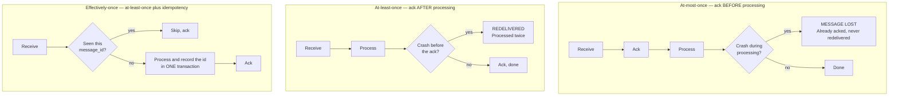
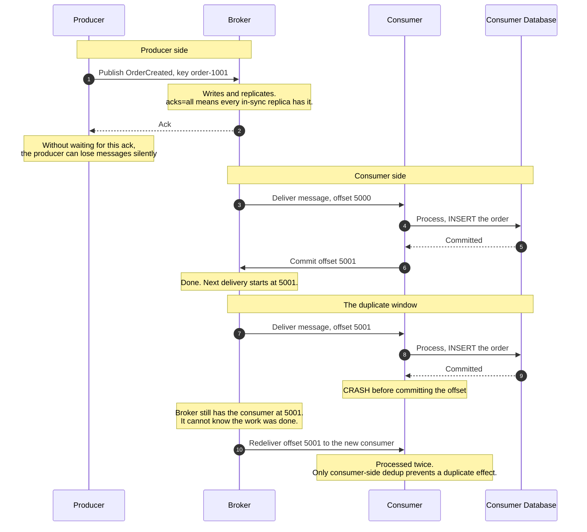
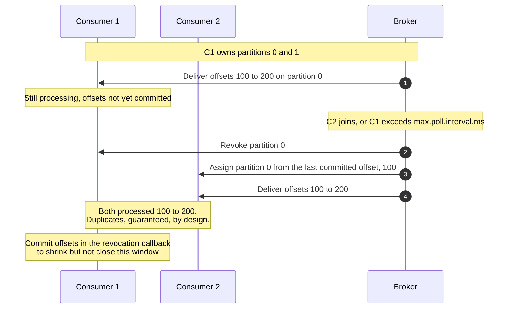

# Message Queue Delivery Semantics

> What "at-least-once" and "exactly-once" actually mean once you look at where
> the acknowledgements happen — and why every practical system is at-least-once
> delivery with idempotent processing, whatever the marketing says.

---

## TL;DR

- Three models: **at-most-once** (ack before processing — may lose messages),
  **at-least-once** (ack after processing — may duplicate), **exactly-once**
  (requires transactional coupling between the broker and your side effects).
- **At-least-once is the right default.** Duplicates are survivable; silent loss
  usually is not.
- The duplicate window is structural: the consumer processes the message, then
  crashes before its ack lands. The broker cannot distinguish that from a
  consumer that never processed it, so it redelivers. No configuration removes
  this.
- **"Exactly-once" is never a delivery guarantee** — it is an end-to-end
  _processing_ guarantee, and only within systems that can share a transaction.
  The moment you call an external HTTP API, you are back to at-least-once plus
  idempotency.
- Ordering is per-partition or per-queue, never global, and any concurrency
  above one consumer per partition destroys it.

---

## When to use a queue at all

- Decoupling producer and consumer lifecycles and scaling them independently.
- Absorbing bursts — the queue is a buffer, and that is often its main value.
- Work that can be done asynchronously: emails, thumbnails, indexing, webhooks.
- Fan-out to several independent consumers.

## When _not_ to use one

- **When the caller needs the result now.** A queue plus a polling loop for a
  result is a slower, more complex RPC.
- **When strict global ordering across all messages is required.** That means
  one partition and one consumer — a queue is then just an unnecessarily
  complicated single-threaded worker.
- **When you cannot make the consumer idempotent** and duplicates are
  unacceptable. Fix the idempotency first; it is a prerequisite, not an
  optimisation.

---

## Actors and terminology

| Actor        | Term                      | What it is                                                                             |
| ------------ | ------------------------- | -------------------------------------------------------------------------------------- |
| Sender       | _Producer_ / _Publisher_  | Writes messages. Needs its own ack to know they were durably stored.                   |
| Broker       | —                         | Kafka, RabbitMQ, SQS, Pub/Sub, NATS. Stores and delivers.                              |
| Receiver     | _Consumer_ / _Subscriber_ | Processes and acknowledges.                                                            |
| Failure sink | _Dead-letter queue_ (DLQ) | Where messages go after repeated failures, so one bad message cannot block the stream. |

**Key terms**

- **Ack / commit** — the consumer telling the broker it is done. _Where you put
  this call determines your delivery semantics._ That is the whole subject.
- **Offset** (Kafka) — the consumer group's position in a partition. Committing
  the offset is the ack.
- **Visibility timeout** (SQS) — how long a received message is hidden from
  other consumers. Exceed it while still processing and the message is
  redelivered _while you are still working on it_.
- **Redelivery / requeue** — the broker resending an unacknowledged message.
- **Consumer group** — a set of consumers sharing the work, with each partition
  assigned to exactly one member.
- **Rebalance** — reassigning partitions when membership changes. The source of
  most duplicate-processing incidents.
- **Poison message** — a message that fails every time, and will block the
  partition forever if you let it.

---

## The three models



The third row is what people mean when they say exactly-once, and it is
achievable — but note where the work is. The guarantee comes from the consumer's
own transaction, not from the broker.

---

## Sequence diagram — at-least-once, and where duplicates come from



## Rebalance — the other duplicate source



Rebalances are triggered by deploys, autoscaling, crashed consumers missing
heartbeats (`session.timeout.ms`), and slow consumers that go longer than
`max.poll.interval.ms` between polls — that is, constantly. Any consumer that is not idempotent will
double-process on its next deploy.

---

## Step-by-step

Numbers match the **at-least-once** diagram.

1. **Producer publishes,** keyed by the entity ID so all messages for one entity
   land in one partition and stay ordered relative to each other.

   _No message on the wire:_ the broker persists and replicates before it
   answers. With Kafka's `acks=all` the ack waits for every in-sync replica;
   with `acks=1` only the leader, so a leader failure loses the message; with
   `acks=0` there is no guarantee at all.

2. **Broker acknowledges the producer.** A producer that does not wait for this
   is at-most-once _on the produce side_ — a distinct failure mode from anything
   the consumer does, and one people forget exists. Keep
   `enable.idempotence=true` so the producer's own retries do not write
   duplicates from a single producer session. Since Kafka 3.0 both
   `enable.idempotence=true` and `acks=all` are producer defaults; setting a
   conflicting option (such as `acks=1`) silently disables idempotence.

3. **Broker delivers to the consumer.**

4. **Consumer processes the message,** writing to its own database.

5. **The write commits.**

6. **Consumer commits the offset — after processing.** This ordering is what
   makes it at-least-once. Committing first would be at-most-once.

   _No message on the wire:_ the broker advances the group's position. The next
   delivery starts after this message.

7. **The next message is delivered.**

8. **Consumer processes it.**

9. **The write commits** — and then the consumer crashes before committing the
   offset. A pod eviction, an OOM kill, a deploy.

   _No message on the wire:_ the broker still has the group at the old offset.
   It has no way to learn that the work was completed — the acknowledgement is
   the only signal, and it never arrived.

10. **The message is redelivered** to whichever consumer takes over. Unless the
    consumer deduplicates, the effect happens twice.

---

## Achieving effectively-once

The only durable answer is to make **processing** idempotent. Three ways, in
increasing order of restrictiveness:

**1. Dedup table in the consumer's own transaction.** Works everywhere.

```sql
BEGIN;
  -- The UPDATE runs only if this message_id was newly recorded.
  -- A duplicate inserts nothing, so the UPDATE matches no rows.
  WITH ins AS (
    INSERT INTO processed_messages (message_id, processed_at)
    VALUES ($1, now())
    ON CONFLICT (message_id) DO NOTHING
    RETURNING 1
  )
  UPDATE accounts SET balance = balance - 100
  WHERE id = 42 AND EXISTS (SELECT 1 FROM ins);
COMMIT;
-- Either way, ack the message after COMMIT.
```

Because the marker and the effect commit together, a crash cannot leave one
without the other. (This is PostgreSQL syntax; elsewhere, check the INSERT's
affected-row count in application code and skip the effect when it is 0.) Give `processed_messages` a retention policy — longer than
your maximum possible redelivery delay.

**2. Naturally idempotent operations.** `SET status = 'shipped'` is safe to
repeat; `balance = balance - 100` is not. Where you can express the work as an
upsert keyed by the entity, no dedup table is needed. Look for this first — it
is free.

**3. Broker-native transactions.** Kafka's `read-process-write` transactions
commit the offset and the output records atomically, giving genuine
exactly-once _within Kafka_. Two details are easy to miss: the producer commits
the consumed offsets through the transaction with `sendOffsetsToTransaction`
(not the consumer's own commit), and every downstream consumer must set
`isolation.level=read_committed` — the default, `read_uncommitted`, also
returns records from aborted transactions. Useful for stream processing, and the guarantee
evaporates the moment you touch anything outside Kafka — an HTTP call, an email,
a different database. Those need approach 1 or 2 regardless.

---

## Broker comparison

|                    | Kafka                             | RabbitMQ                                                           | SQS (standard)                                        | SQS (FIFO)            |
| ------------------ | --------------------------------- | ------------------------------------------------------------------ | ----------------------------------------------------- | --------------------- |
| Default semantics  | At-least-once                     | At-least-once                                                      | At-least-once                                         | At-least-once         |
| Ack mechanism      | Offset commit                     | `basic.ack` per message                                            | `DeleteMessage` before the visibility timeout expires | Same                  |
| Ordering           | Per partition                     | Per queue, single consumer                                         | **None**                                              | Per message group     |
| Redelivery trigger | Uncommitted offset, rebalance     | Unacked on channel close                                           | Visibility timeout expiry                             | Same                  |
| Dedup support      | Idempotent producer, transactions | None built in                                                      | None                                                  | 5-minute dedup window |
| Replay             | Yes — messages are retained       | Classic and quorum queues: no, removed on ack. Streams (3.9+): yes | No                                                    | No                    |
| DLQ                | Consumer-implemented              | Dead-letter exchange                                               | Native, with `maxReceiveCount`                        | Native                |

The distinction that matters most in practice: **Kafka is a log** (messages
persist, consumers hold a position, replay is possible), while RabbitMQ and SQS
are **queues** (messages are removed on ack, there is nothing to replay) —
RabbitMQ Streams, added in 3.9, being the log-shaped exception. That
shapes how you recover from a bad deploy — reset the offset and reprocess, or
restore from somewhere else entirely.

---

## Failure modes

| Failure                                       | Result                                                                                  | Correct handling                                                                                                                                                                                 |
| --------------------------------------------- | --------------------------------------------------------------------------------------- | ------------------------------------------------------------------------------------------------------------------------------------------------------------------------------------------------ |
| Consumer crashes after processing, before ack | Duplicate                                                                               | Idempotent processing. Structural; cannot be configured away.                                                                                                                                    |
| Consumer crashes after ack, before processing | **Message loss**                                                                        | Never ack before processing.                                                                                                                                                                     |
| Processing exceeds the visibility timeout     | Redelivered while still being processed — **two consumers on one message concurrently** | Extend the timeout (SQS heartbeat, Kafka `max.poll.interval.ms`), or make the handler faster                                                                                                     |
| Rebalance mid-batch                           | Duplicates                                                                              | Commit in the revocation callback; use cooperative sticky assignment; keep batches small                                                                                                         |
| Poison message                                | Partition blocked forever                                                               | Retry cap, then DLQ. Non-negotiable for any partition-ordered consumer.                                                                                                                          |
| DLQ never inspected                           | Silent data loss with extra steps                                                       | Alert on DLQ depth. A DLQ nobody watches is a delete.                                                                                                                                            |
| Producer does not await its ack               | Silent loss on broker failover                                                          | `acks=all` plus publisher confirms                                                                                                                                                               |
| Consumer lag grows                            | Unbounded staleness                                                                     | Monitor lag, not throughput. Lag is the number that tells you the system is falling behind.                                                                                                      |
| Out-of-order processing                       | Stale state overwrites fresh                                                            | Partition by entity key; include a version and drop older versions                                                                                                                               |
| Slow consumer exceeds `max.poll.interval.ms`  | Endless rebalance loop                                                                  | Heartbeats already run on a background thread (KIP-62, Kafka 0.10.1); the poll deadline is what trips. Reduce `max.poll.records`, raise `max.poll.interval.ms`, or move work off the poll thread |
| Dedup table grows forever                     | Storage exhaustion                                                                      | Retention policy longer than the maximum redelivery window                                                                                                                                       |

---

## Common pitfalls

### Acknowledging before processing

❌ **What people do:** ack on receipt so the message is "handled", then process
in a background task.

✅ **Do instead:** ack only after the work is durably committed.

_Why it bites you:_ this is at-most-once, chosen by accident. Every crash,
deploy, or OOM silently drops whatever was in flight, and because nothing errors,
you find out weeks later from a customer asking where their order went.

### Believing "exactly-once" on the label

❌ **What people do:** enable an exactly-once setting and skip consumer-side
deduplication.

✅ **Do instead:** treat every consumer as receiving duplicates. Always.

_Why it bites you:_ the guarantee holds only within the broker's transactional
boundary. Your handler that charges a card, sends an email, or calls a partner
API is outside it. Duplicates arrive, and the code that assumed they could not
double-charges.

### No dead-letter queue

❌ **What people do:** retry failures indefinitely.

✅ **Do instead:** cap retries with exponential backoff, then DLQ — and alert on
DLQ depth.

_Why it bites you:_ in an ordered partition, one unprocessable message blocks
every message behind it. Consumer lag climbs while the logs show the same error
looping. The queue is stopped, and nothing says so except a graph nobody is
watching.

### Monitoring throughput instead of lag

❌ **What people do:** dashboard messages/second and alert when it drops.

✅ **Do instead:** alert on **consumer lag** and on the age of the oldest
unprocessed message.

_Why it bites you:_ throughput looks healthy right up until it doesn't, and a
consumer that is keeping up at half the producer's rate shows a perfectly
respectable throughput number while falling further behind every minute. Lag
measures the thing you actually care about.

### Assuming ordering you do not have

❌ **What people do:** rely on messages arriving in the order they were sent,
across partitions or with several consumers.

✅ **Do instead:** partition by entity key, and include a version or sequence
number so the consumer can drop stale updates.

_Why it bites you:_ ordering holds only within a partition. Two messages for the
same order on different partitions, or one retried after a transient failure,
arrive out of order — and a `status = 'pending'` message applied after
`status = 'shipped'` silently un-ships the order.

### Long processing inside the poll loop

❌ **What people do:** do 30 seconds of work per message in the poll handler.

✅ **Do instead:** keep handlers short, tune `max.poll.interval.ms` and
`max.poll.records`, or hand off to a worker pool with explicit offset
management.

_Why it bites you:_ the consumer misses its poll deadline, the broker declares
it dead, a rebalance starts, the partition moves, and the work is redone
elsewhere — while the original consumer is still doing it. This produces a
self-sustaining rebalance loop where nothing ever finishes.

### Unbounded retries with no backoff

❌ **What people do:** retry immediately on failure, forever.

✅ **Do instead:** exponential backoff with jitter, a retry cap, and a DLQ. For
throughput-sensitive consumers, use separate delay topics rather than blocking.

_Why it bites you:_ a downstream service having a bad minute gets a retry storm
that turns it into a bad hour. Your retry policy becomes the outage.

---

## Implementation checklist

- [ ] Producer waits for its ack, with `acks=all` (or publisher confirms).
- [ ] Producer idempotence enabled where the broker supports it.
- [ ] Messages carry a stable, unique `message_id` — assigned by the producer, not derived from delivery metadata.
- [ ] Messages are keyed by entity ID so per-entity ordering is preserved.
- [ ] Consumer acks **after** the work is durably committed.
- [ ] Processing is idempotent: dedup table in the same transaction, or naturally idempotent operations.
- [ ] Dedup records have a retention policy longer than the maximum redelivery window.
- [ ] Retries use exponential backoff with jitter and a cap.
- [ ] A DLQ exists, and its depth is alerted on.
- [ ] Consumer **lag** and oldest-message age are monitored and alerted on.
- [ ] Visibility timeout / `max.poll.interval.ms` exceeds realistic worst-case processing time, or is extended by a heartbeat.
- [ ] Offsets are committed in the rebalance revocation callback.
- [ ] Messages carry a version or sequence number so stale updates can be dropped.
- [ ] Trace context propagates from producer to consumer.
- [ ] Consumers have been tested against duplicate delivery, out-of-order delivery, and a poison message.

---

## Specs and references

There is no cross-broker standard for delivery semantics; each broker documents
its own, and the differences matter.

**Broker documentation**

- [Kafka — Message Delivery Semantics](https://kafka.apache.org/43/design/design/#message-delivery-semantics) — the clearest first-party explanation of the three models and where exactly-once genuinely applies.
- [Kafka — Using Transactions](https://kafka.apache.org/43/design/design/#using-transactions) — the read-process-write pattern, `isolation.level=read_committed`, and its boundaries.
- [Kafka — Producer configs](https://kafka.apache.org/43/configuration/producer-configs/) and [Consumer configs](https://kafka.apache.org/43/configuration/consumer-configs/) — defaults for `enable.idempotence`, `acks`, `isolation.level`, and `max.poll.interval.ms`.
- [KIP-62 — Allow consumer to send heartbeats from a background thread](https://cwiki.apache.org/confluence/display/KAFKA/KIP-62%3A+Allow+consumer+to+send+heartbeats+from+a+background+thread) — why slow processing trips `max.poll.interval.ms`, not the session timeout.
- [RabbitMQ — Streams](https://www.rabbitmq.com/docs/streams) — the replayable, log-style queue type.
- [RabbitMQ — Consumer Acknowledgements and Publisher Confirms](https://www.rabbitmq.com/docs/confirms) — both directions of acknowledgement, and the redelivery rules.
- [AWS SQS — Standard vs FIFO queues](https://docs.aws.amazon.com/AWSSimpleQueueService/latest/SQSDeveloperGuide/FIFO-queues.html) — the FIFO dedup window and message groups.
- [AWS SQS — Visibility timeout](https://docs.aws.amazon.com/AWSSimpleQueueService/latest/SQSDeveloperGuide/sqs-visibility-timeout.html) — the most common source of accidental concurrent processing.

**Further reading**

- [You Cannot Have Exactly-Once Delivery — Tyler Treat](https://bravenewgeek.com/you-cannot-have-exactly-once-delivery/) — the argument from first principles. Read this before designing around a vendor's exactly-once claim.
- [Life Beyond Distributed Transactions — Pat Helland](https://queue.acm.org/detail.cfm?id=3025012) — why idempotent, retryable operations are the foundation everything else rests on.
- [Designing Data-Intensive Applications, ch. 11 — Martin Kleppmann](https://dataintensive.net/) — stream processing, fault tolerance, and the precise meaning of exactly-once semantics.

---

## Related flows

- [Idempotency Keys](../distributed-systems/idempotency-keys.md) — the consumer-side deduplication this pattern requires. Read it as the companion piece.
- [Transactional Outbox & CDC](../distributed-systems/transactional-outbox-and-cdc.md) — how producers publish reliably in the first place.
- [The Saga Pattern](../distributed-systems/saga-pattern.md) — a choreographed saga is built directly on these guarantees, including the duplicates.
- [Cache-Aside Read & Write](cache-aside-read-write.md) — cache invalidation messages are subject to every ordering and duplication caveat here.
- [Rate Limiting Algorithms](rate-limiting-algorithms.md) — the decision that comes first: accept the work and defer it, or refuse it outright.
- [Raft Leader Election & Log Replication](../distributed-systems/raft-leader-election-and-log-replication.md) — the same commit-then-acknowledge problem, one layer down, where the log is the product rather than the transport.
- [Webhook Delivery & Signature Verification](webhook-delivery-and-signature-verification.md) — the same delivery problem when the consumer is somebody else, over HTTP.
