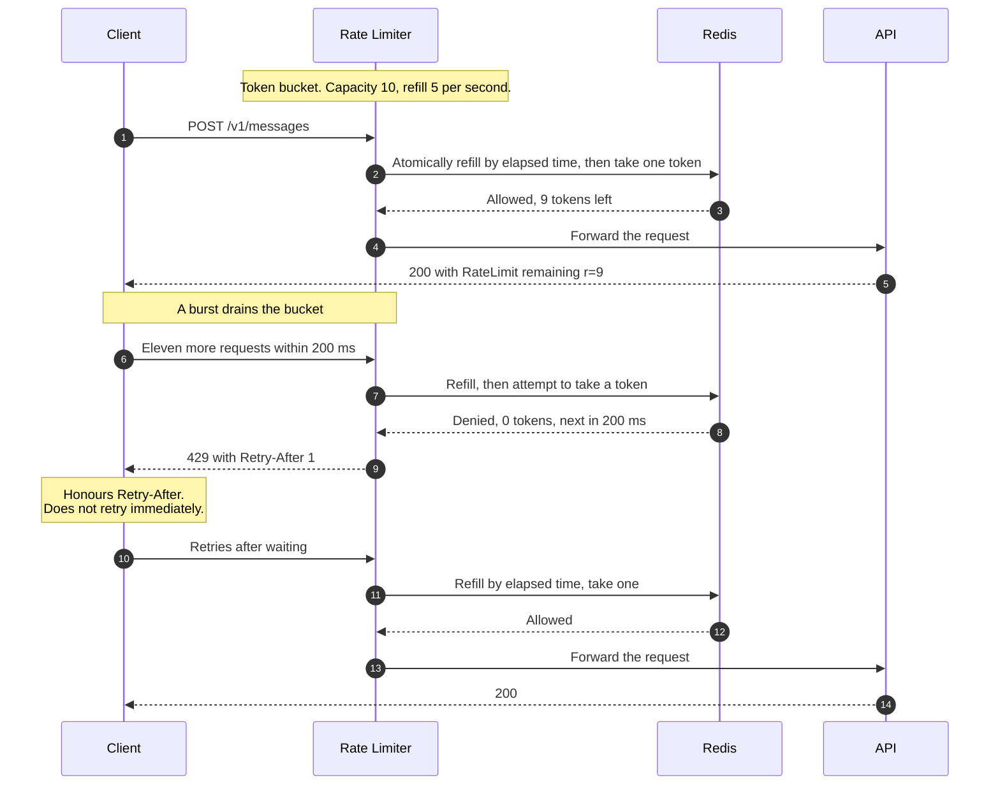
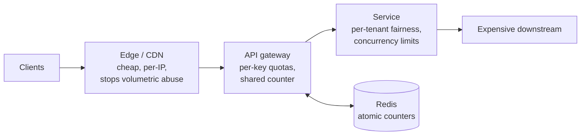

# Rate Limiting Algorithms

> How a service decides that a caller has asked for too much, too fast — the
> four algorithms in common use, what each one actually promises, and how to
> make the decision correctly when the counter is shared across a fleet.

_Also known as: throttling, quota enforcement, traffic shaping._

---

## TL;DR

- **Four algorithms, one real choice.** Fixed window is simplest and wrong at the
  edges; sliding window log is exact and expensive; sliding window counter is the
  practical approximation; **token bucket** is what you want when bursts are
  legitimate.
- **Token bucket allows bursts on purpose.** Tokens accumulate while you are
  idle, up to a cap. That is a feature — real clients are bursty, and a limiter
  that forbids all bursts is just a slow API.
- **Fixed windows permit double the limit** across a boundary: the full quota at
  the end of one window and again at the start of the next.
- **Distributed limiting is a read-modify-write race.** Do it atomically —
  a Lua script, or for a fixed window `INCR` and `EXPIRE` in one
  `MULTI`/`EXEC` — or your limit is advisory.
- **Tell the client what to do.** `429` with `Retry-After` is the contract; a
  bare `429` guarantees an immediate retry and makes the overload worse.

---

## When to use it

- Any public or partner-facing API. Not optional — one client's retry loop
  should not be able to consume the capacity of all the others.
- Protecting an expensive downstream: a payment processor, an LLM provider, a
  database with finite connections.
- Fairness under contention, so a single tenant cannot monopolise a shared pool.
- Abuse control on login, password reset, and signup endpoints — where the limit
  is per account and per IP, and both matter.

## When _not_ to use it

- **As your only overload defence.** A limiter sized for normal traffic does
  nothing about a genuinely undersized fleet. Combine with load shedding, queues,
  and autoscaling.
- **Between your own trusted services**, where a
  [circuit breaker](../distributed-systems/circuit-breaker-retry-and-backoff.md)
  and concurrency limits fit better. Rate limits between internal services tend
  to be guessed, then forgotten, then hit during an incident.
- **When the real constraint is concurrency, not rate.** Ten requests a second
  that each take a minute is not ten requests a second of load. Limit in-flight
  work instead.

---

## Actors and terminology

| Actor   | Term           | What it is                                                                                   |
| ------- | -------------- | -------------------------------------------------------------------------------------------- |
| Client  | —              | The caller. May be a user, a tenant, an IP, or an API key.                                   |
| Limiter | _Rate limiter_ | The component making the allow/deny decision. Usually at the edge; sometimes in the service. |
| Store   | —              | Where counters live. Redis, most often, because the decision must be shared.                 |
| Service | _Origin_       | The thing being protected. Ideally never learns any of this happened.                        |

**Key terms**

- **Limit key** — what the quota is counted against. Getting this wrong is more
  consequential than the algorithm: per API key, per user, per IP, per endpoint,
  or a combination.
- **Fixed window** — a counter reset every interval. Cheap, one key, and wrong
  at the boundaries.
- **Sliding window log** — timestamps of every request, trimmed to the window.
  Exact, and O(requests) in memory.
- **Sliding window counter** — the current window's count plus a weighted
  fraction of the previous one. Two counters, near-exact.
- **Token bucket** — a bucket of capacity `B` refilled at `R` per second. Each
  request takes a token. Allows a burst of `B`, then settles to `R`.
- **Leaky bucket** — a queue drained at a fixed rate. Smooths output completely;
  adds latency instead of returning errors.
- **`429 Too Many Requests`** — the status code, from
  [RFC 6585 §4](https://www.rfc-editor.org/rfc/rfc6585).
- **`Retry-After`** — seconds, or an HTTP date
  ([RFC 9110 §10.2.3](https://www.rfc-editor.org/rfc/rfc9110)). This is
  normative. The `RateLimit` and `RateLimit-Policy` header fields are an IETF
  **draft**, and many APIs still ship older `X-RateLimit-*` or
  `RateLimit-Limit`/`-Remaining`/`-Reset` headers with incompatible meanings;
  treat all of them as convention.

---

## Sequence diagram



## Architecture

Where the limiter sits determines what it can protect:



Each layer catches something the next cannot. The edge stops floods before they
cost you anything; the gateway enforces the quota you sold; the service protects
the downstream from a caller that is within its quota but still too expensive.

---

## The four algorithms

| Algorithm              | State per key                 | Bursts                 | Boundary accuracy | Use when                                                           |
| ---------------------- | ----------------------------- | ---------------------- | ----------------- | ------------------------------------------------------------------ |
| Fixed window           | 1 counter                     | Up to 2× at boundaries | Poor              | Coarse abuse control where exactness does not matter               |
| Sliding window log     | 1 timestamp per request       | Exact                  | Exact             | Low limits where precision matters, e.g. 5 password resets an hour |
| Sliding window counter | 2 counters                    | Slight over-admission  | Very good         | The general-purpose default for request quotas                     |
| Token bucket           | 2 values: tokens, last refill | Burst of `B`, then `R` | Exact             | Clients that are legitimately bursty. Most APIs.                   |

**Fixed window**, and why it is wrong:

```text
limit = 100 per minute
12:00:59 — 100 requests, all allowed  (window 12:00 count = 100)
12:01:00 — 100 requests, all allowed  (window 12:01 count = 100)
=> 200 requests in a two-second span, under a "100 per minute" limit
```

**Sliding window counter** fixes it by weighting the previous window:

```text
estimate = current_count + previous_count × (1 - elapsed_fraction_of_window)
# at 12:01:15, 25% into the minute:
#   estimate = 20 + 100 × 0.75 = 95  -> still under 100, allowed
```

**Token bucket**, which is the one to reach for by default:

```text
elapsed  = now - last_refill
tokens   = min(capacity, tokens + elapsed × refill_rate)
if tokens >= 1:
    tokens -= 1;  last_refill = now;  allow
else:
    retry_after = (1 - tokens) / refill_rate;  deny
```

Note that tokens are computed lazily from elapsed time. There is no background
timer and no scheduled job — a common and unnecessary implementation.

---

## Step-by-step

1. **A request arrives.** Extract the limit key _before_ anything expensive.
   Authentication usually has to happen first, since the key is normally the API
   key or tenant — which means unauthenticated requests need their own, cheaper,
   per-IP limit at the edge.

2. **Refill and consume, atomically.** These are one operation, not two. In Redis
   that means a Lua script (or a Redis Function), because a read followed by a
   write is a race. `MULTI`/`EXEC` is not enough here: the commands inside it
   are queued, so it cannot branch on a value it has read — "take a token only
   if one is left" cannot be expressed. `WATCH` with an optimistic retry works,
   but degrades exactly when contention is high.

   ```lua
   -- KEYS[1] = bucket key; ARGV = capacity, refill_rate (tokens/s), requested
   local capacity  = tonumber(ARGV[1])
   local rate      = tonumber(ARGV[2])
   local requested = tonumber(ARGV[3])

   -- The store's clock, not the caller's. Writing after TIME is safe because
   -- scripts replicate their effects (default since Redis 5, the only mode in 7).
   local t   = redis.call('TIME')
   local now = tonumber(t[1]) + tonumber(t[2]) / 1000000

   local b = redis.call('HMGET', KEYS[1], 'tokens', 'ts')
   local tokens = tonumber(b[1]) or capacity
   local ts     = tonumber(b[2]) or now
   tokens = math.min(capacity, tokens + math.max(0, now - ts) * rate)

   local allowed, retry_ms = tokens >= requested, 0
   if allowed then
     tokens = tokens - requested
   else
     retry_ms = math.ceil((requested - tokens) / rate * 1000)
   end

   redis.call('HSET', KEYS[1], 'tokens', tokens, 'ts', now)
   redis.call('EXPIRE', KEYS[1], math.ceil(capacity / rate) + 1)
   -- Lua numbers are truncated to integers on return, so round explicitly.
   return { allowed and 1 or 0, math.floor(tokens), retry_ms }
   ```

   ```text
   EVAL "...script..." 1 bucket:key_abc123 10 5 1    # capacity 10, 5/s, take 1
   ```

   The fractional token count is kept in the hash (stored as a string), so
   partial refills are not lost; only the returned count is rounded down. The
   expiry is the time to refill from empty — after that, a missing key and a
   full bucket are the same thing. Always set an expiry. Without it every key any client has ever used stays in
   memory forever, and the eviction happens at the worst possible moment.

3. **The store returns the decision and the remaining budget.**

4. **The request is forwarded.**

5. **The response carries the budget back.** Advisory headers help well-behaved
   clients pace themselves rather than discovering the limit by hitting it:

   ```http
   HTTP/1.1 200 OK
   RateLimit-Policy: "default";q=10;w=2
   RateLimit: "default";r=9;t=1
   ```

   `RateLimit-Policy` describes the quota — `q` units per `w` seconds; a token
   bucket of 10 refilling at 5/s is approximated as 10 per 2 seconds.
   `RateLimit` reports what is left under that policy — `r` remaining, within an
   effective window of `t` seconds. Both are Structured Field lists keyed by a
   quoted policy name. They come from an IETF **draft**, not a published
   standard; earlier drafts used separate `RateLimit-Limit`, `-Remaining`, and
   `-Reset` fields, and many APIs still ship those or `X-RateLimit-*` with
   different semantics. Document exactly what yours mean.

6. **A burst arrives.** Legitimately: a page loading twelve resources, a job
   starting, an agent issuing parallel tool calls.

7. **The limiter refills and tries again.** Only 200 ms have passed, so one token
   has accrued: the first ten requests take the nine that were left plus that
   one, and the eleventh finds an empty bucket.

8. **The store denies and reports when the next token arrives.** Compute this —
   it is what makes `Retry-After` honest rather than a guess.

9. **Return `429` with `Retry-After`.** Include enough for the client to act:

   ```http
   HTTP/1.1 429 Too Many Requests
   Retry-After: 1
   RateLimit: "default";r=0;t=1
   Content-Type: application/json

   {"error":{"type":"rate_limit_error","message":"Rate limit exceeded. Retry in 1s."}}
   ```

   _Client should:_ honour `Retry-After` over its own backoff, and add jitter on
   top so that every client denied in the same second does not return in the same
   second.

10. **The client waits, then retries.**

11. **Enough time has passed for a token to accrue.**

12. **The store allows it.**

13. **The request is forwarded.**

14. **A normal response.** The client never needed to know which algorithm was
    used — only how long to wait.

---

## Failure modes

| Failure                                   | What happens                                                   | Correct handling                                                                                                                                                                           |
| ----------------------------------------- | -------------------------------------------------------------- | ------------------------------------------------------------------------------------------------------------------------------------------------------------------------------------------ |
| Redis is unavailable                      | The limiter cannot decide                                      | Choose deliberately. Fail **open** for a customer-facing quota; fail **closed** for abuse controls on login. Whichever you pick, write it down — the default is whatever the library does. |
| Read-then-write without atomicity         | Concurrent requests all see the same count and are all allowed | One atomic operation: a Lua script, or `INCR` plus `EXPIRE key n NX` inside one `MULTI`/`EXEC`. Two separate calls can crash in between and leave a key with no TTL — a permanent lockout. |
| Per-instance in-memory counters           | Effective limit is `limit × instances`                         | Share the counter, or divide the limit by the instance count and accept the unfairness under uneven balancing.                                                                             |
| Every request round-trips to Redis        | The limiter becomes the bottleneck                             | Local token buckets synced periodically against the shared budget. Approximate, and usually the right trade.                                                                               |
| Limit key is the IP behind a NAT or proxy | Whole offices or schools throttled together                    | Prefer an authenticated key. If you must use IP, parse `X-Forwarded-For` correctly — and only trust the hops you control.                                                                  |
| All denied clients retry together         | A synchronised wave at `Retry-After`                           | Jitter server-side by varying `Retry-After` slightly per client, as well as client-side.                                                                                                   |
| Cost varies wildly per request            | The limit is meaningless                                       | Charge by cost, not by request. Take `n` tokens for an `n`-token LLM call, or reserve an estimate and reconcile afterwards.                                                                |
| Clock skew between limiter instances      | Token accrual jumps around                                     | Use the _store's_ clock — `TIME` in Redis — not each instance's.                                                                                                                           |

---

## Common pitfalls

### A read, then a write

❌ **What people do:** `GET count`, compare with the limit, `SET count + 1`.

✅ **Do instead:** one atomic operation. For a fixed window, `INCR` and
`EXPIRE key 60 NX` (Redis 7+; sets the TTL only if the key has none) inside one
`MULTI`/`EXEC`, or a Lua script — never two separate calls, because a crash
between them leaves a counter with no TTL that locks the client out for good.
A Lua script for anything stateful.

_Why it bites you:_ under exactly the concurrency you built the limiter for, N
requests read the same value simultaneously and all conclude they are under the
limit. The limiter holds perfectly in testing, where requests are sequential,
and provides essentially no protection under real load — which is the only time
it matters.

### Fixed windows for anything precise

❌ **What people do:** `INCR key:{user}:{minute}` with a 60-second expiry, and
call it 100 per minute.

✅ **Do instead:** sliding window counter, or token bucket.

_Why it bites you:_ a client that discovers the boundary gets 200 requests in
two seconds — twice the limit, delivered as a spike, which is precisely the load
pattern the limit was meant to prevent. Clients find this by accident, because
scheduled jobs cluster at the top of the minute.

### `429` with no `Retry-After`

❌ **What people do:** return `429` and a message and nothing else.

✅ **Do instead:** always send `Retry-After`, computed from the actual time until
capacity is available.

_Why it bites you:_ the client has no information, so it retries immediately —
and often that retry is inside a loop that retries immediately again. You have
converted a throttled client into a tight loop hammering an endpoint that is
already refusing it, which costs you more than serving the request would have.

### Counting requests when you meant to count cost

❌ **What people do:** limit an LLM API to 60 requests per minute, where one
request might be 200 tokens or 200,000.

✅ **Do instead:** limit by units of cost, with two buckets — requests per minute
_and_ tokens per minute. Reserve an estimate up front and settle afterwards.

_Why it bites you:_ the expensive tail passes the limit while consuming orders of
magnitude more capacity than the limit assumed, so the downstream is overloaded
by clients who are entirely compliant. Meanwhile clients making cheap requests
are throttled for no reason, and your quota means nothing to anyone.

### One global limit for every endpoint

❌ **What people do:** apply 1,000 requests per minute uniformly across the API.

✅ **Do instead:** scale the limit to the cost of the endpoint. Cheap reads get a
high limit; expensive writes and searches get a low one.

_Why it bites you:_ the limit must be set low enough to survive a client that
sends only the most expensive call, which makes it needlessly punitive for
everyone using the cheap ones. Clients respond by parallelising across endpoints,
and you have taught them to work around the limiter instead of within it.

### Failing open without deciding to

❌ **What people do:** wrap the limiter in a try/catch that allows the request on
error, because an outage in the limiter should not be an outage in the API.

✅ **Do instead:** decide per limit. Quotas fail open; abuse controls on
authentication fail closed. Alert on either, loudly.

_Why it bites you:_ an attacker who can make Redis unavailable — often by
flooding it through the limiter itself — turns off every protection at once,
including the brute-force limit on your login endpoint. The failure mode of your
security control should never be "disabled, silently".

### Limiting per instance and calling it a fleet limit

❌ **What people do:** an in-memory bucket per process, with the documented limit
configured in each.

✅ **Do instead:** share the state, or configure `limit / instance_count` and
accept the imprecision.

_Why it bites you:_ the effective limit is your documented limit times the number
of instances, and it changes every time you autoscale. During a traffic spike
you add instances, which raises the limit, which admits more of the spike — the
opposite of the intended behaviour.

---

## Implementation checklist

- [ ] Choose the limit key deliberately; prefer an authenticated identity over IP.
- [ ] Use token bucket unless you have a reason not to; document capacity and
      refill rate rather than a bare "per minute" figure.
- [ ] Make the refill-and-consume a single atomic operation.
- [ ] Set an expiry on every counter key.
- [ ] Use the store's clock, not the instance's.
- [ ] Return `429` with `Retry-After` computed from real availability.
- [ ] Document your `RateLimit` / `RateLimit-Policy` (or legacy `X-RateLimit-*`)
      headers — they are a draft or a convention, not a standard.
- [ ] Add jitter to `Retry-After` so denied clients do not return in lockstep.
- [ ] Charge by cost where request cost varies by orders of magnitude.
- [ ] Set per-endpoint limits proportional to endpoint cost.
- [ ] Decide fail-open versus fail-closed per limit, and test the store being
      down.
- [ ] Apply a separate, cheaper limit at the edge for unauthenticated traffic.
- [ ] Emit metrics for throttle rate per key, and alert when a single key is
      throttled continuously — that is usually a broken client, and telling them
      is cheaper than absorbing it.
- [ ] Publish the limits. An undocumented limit is discovered as an outage.

---

## Security considerations

| Threat                                       | Mitigation                                                                            |
| -------------------------------------------- | ------------------------------------------------------------------------------------- |
| Credential stuffing                          | Fail-closed limits per account _and_ per IP on authentication endpoints               |
| Limiter bypass via spoofed `X-Forwarded-For` | Trust only proxies you operate; take the client IP from a known position in the chain |
| Resource exhaustion of the limiter store     | Expire every key; cap key cardinality; limit at the edge before the store is touched  |
| Enumeration through differing responses      | Return the same `429` shape regardless of whether the account exists                  |
| Denial of service against another tenant     | Per-tenant keys, never a shared global counter                                        |

---

## Specs and references

**Normative**

- [RFC 6585 — Additional HTTP Status Codes](https://www.rfc-editor.org/rfc/rfc6585) — §4 defines `429 Too Many Requests`, including that the response _may_ describe when to retry.
- [RFC 9110 — HTTP Semantics](https://www.rfc-editor.org/rfc/rfc9110) — §10.2.3 defines `Retry-After` in both delta-seconds and HTTP-date forms. This is the only rate-limiting-related header that is actually standardised.

**Convention, not normative**

- [RateLimit header fields for HTTP (draft)](https://datatracker.ietf.org/doc/html/draft-ietf-httpapi-ratelimit-headers) — draft-ietf-httpapi-ratelimit-headers-11 (May 2026). §3 defines `RateLimit-Policy` (`q` quota, `w` window) and §4 defines `RateLimit` (`r` remaining, `t` effective window), both as Structured Field lists; §6 says `Retry-After` should not point earlier than the end of the effective window. Earlier drafts used `RateLimit-Limit`, `RateLimit-Remaining`, and `RateLimit-Reset`, and many deployed APIs use `X-RateLimit-*` with incompatible meanings. Document what yours mean rather than assuming a shared understanding.
- [Redis — Scripting with Lua](https://redis.io/docs/latest/develop/programmability/eval-intro/) — script atomicity, and effects replication, which is what makes calling `TIME` before a write safe.
- [Redis — Transactions](https://redis.io/docs/latest/develop/using-commands/transactions/) — why `MULTI`/`EXEC` queues commands without branching, and `WATCH` for optimistic locking.
- [Redis — `EXPIRE`](https://redis.io/docs/latest/commands/expire/) — the `NX` option, available since Redis 7.0.

**Further reading**

- [Site Reliability Engineering — Handling Overload](https://sre.google/sre-book/handling-overload/) — why per-client limits are only part of overload control, and how adaptive load shedding complements them.

---

## Related flows

- [Circuit Breaker, Timeout & Retry](../distributed-systems/circuit-breaker-retry-and-backoff.md) — the caller's half of this contract, and how to back off without stalling.
- [Cache-Aside Read & Write](cache-aside-read-write.md) — the cheapest rate limiting is not serving the request at all.
- [Message Queue Delivery Semantics](message-queue-delivery-semantics.md) — when the right answer is to accept the work and defer it rather than reject it.
- [Idempotency Keys](../distributed-systems/idempotency-keys.md) — a retry after `429` must not duplicate the effect of a request that actually succeeded.
- [LLM Tool-Use Loop](../ai-systems/llm-tool-use-loop.md) — where per-request limits and per-token limits diverge most sharply.
- [Webhook Delivery & Signature Verification](webhook-delivery-and-signature-verification.md) — what a dispatcher should do with your `429`, and what to send so it complies.
