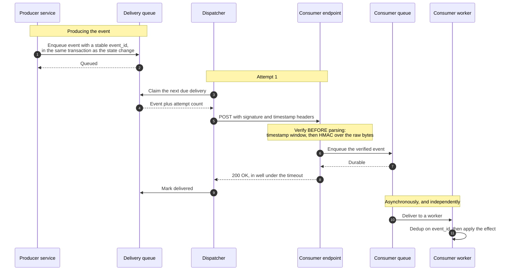
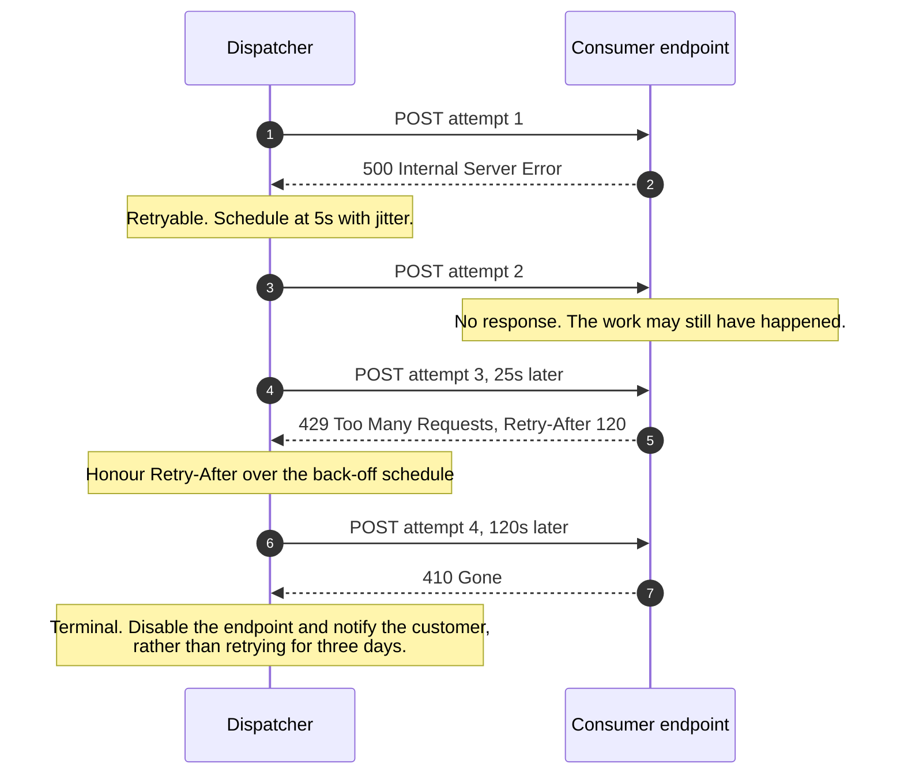

# Webhook Delivery & Signature Verification

> How one service tells another that something happened, and how the receiver
> proves the message really came from the sender, really is fresh, and really
> has not already been processed.

_Also known as: HTTP callbacks, event notifications, reverse APIs._

---

## TL;DR

- **A webhook is an HTTP POST from a stranger.** Every property you want —
  authenticity, freshness, uniqueness, ordering — has to be added on top. The
  transport gives you none of them.
- **Sign over the raw bytes, and a timestamp.** HMAC-SHA256 over
  `id.timestamp.raw_body` (the Standard Webhooks scheme; Stripe signs
  `timestamp.raw_body`), compared in constant time. Signing the parsed-and-
  re-serialised JSON is the most common way a verifier ends up rejecting valid
  deliveries, or accepting invalid ones.
- **A signature without a timestamp window is a bearer token with no expiry.**
  Anyone who captures one delivery can replay it forever.
- **Acknowledge fast, process later.** Return `2xx` as soon as the event is
  durably queued. Work done inline turns a slow database into the sender's
  timeout, and a timeout into a duplicate delivery.
- **Delivery is at-least-once and unordered.** Deduplicate on the event ID and
  make handlers idempotent — the sender cannot fix this for you.

---

## When to use it

- A third party needs to know about your events and polling would be wasteful or
  too slow — payments, CI runs, document processing, provisioning.
- The receiver is a public HTTPS endpoint and you want no coupling beyond a
  shared secret.
- You want the consumer to scale independently of your event volume.

## When _not_ to use it

- **Inside your own system.** If both sides are yours, a message broker gives
  you ordering, replay, consumer groups, and back-pressure for less operational
  pain — see
  [Message Queue Delivery Semantics](message-queue-delivery-semantics.md).
- **When the consumer cannot expose an endpoint.** Polling an event-list API, or
  [SSE](../networking/server-sent-events-and-http-streaming.md), works from
  behind a firewall. Webhooks do not.
- **For state you can fetch.** Sending a full entity snapshot invites the
  consumer to apply events out of order. Send the identity and the event type;
  let them read the current state.
- **When the receiver needs strict ordering.** No webhook system gives it. If
  order matters, the consumer must reconcile using sequence numbers or
  timestamps.

---

## Actors and terminology

| Actor           | Also called            | What it is                                                                                                               |
| --------------- | ---------------------- | ------------------------------------------------------------------------------------------------------------------------ |
| Producer        | _Sender_, _Emitter_    | The service where the event happened. Owns retries, signing, and the dead-letter queue.                                  |
| Delivery queue  | _Dispatcher_           | The producer's own internal queue. Webhook sending is a background job, never part of the request that caused the event. |
| Consumer        | _Receiver_, _Endpoint_ | The customer's HTTPS endpoint. Verifies, acknowledges, and queues.                                                       |
| Consumer worker | —                      | Where the actual work happens, after the `2xx`.                                                                          |

**Key terms**

- **Event ID** — a unique, stable identifier for the _event_, constant across
  every retry of it. The consumer's deduplication key.
- **Delivery ID** — unique per _attempt_. Useful in logs; useless for dedup.
- **Signing secret** — a shared symmetric key, per endpoint. Never one global
  secret for all your customers.
- **Raw body** — the exact bytes received, before any parsing. The only correct
  input to a signature check.
- **Timestamp tolerance** — the window in which a signed request is accepted.
  Among schemes that sign a timestamp, five minutes is the common convention —
  it is Stripe's library default and the Standard Webhooks reference
  libraries' — but not every scheme has one: GitHub's `X-Hub-Signature-256`
  signs the body alone.
- **Constant-time comparison** — an equality check whose duration does not
  depend on how many leading bytes matched.
- **Dead-letter queue** — where a delivery goes after the last retry, so it can
  be replayed once the customer fixes their endpoint.

> **Convention, not specification.** There is no standard for webhook headers.
> `X-Signature`, `Stripe-Signature`, `X-Hub-Signature-256`, and
> `webhook-signature` are all in production use and none of them is normative.
> [RFC 9421 HTTP Message Signatures](https://www.rfc-editor.org/rfc/rfc9421) is
> the standards-track mechanism for this problem and is what to reach for in new
> designs; the HMAC-over-`id.timestamp.body` scheme below is what the ecosystem
> actually runs, which is why this page shows both.

---

## Sequence diagram



## Retry and back-off — the failure path



Which statuses are terminal is a **design choice, not a rule**. A common
convention treats a `4xx` other than `408` and `429` as "the consumer will not
accept this event" and stops early — retrying a `401` in a tight loop is how you
get your IP blocked by your own customer. The trade-off is that some `4xx`s are
fixable: a `401` or `400` often means the customer is mid-way through a secret
rotation or a deploy, and giving up loses the event. Stripe, for example,
retries any non-`2xx` response for up to three days. Whichever you choose,
back off hard on `4xx`, and never give up without a DLQ and a replay path.

---

## Step-by-step

1. **Enqueue the event with the state change.** In the same database
   transaction, so you can never notify about something that rolled back — this
   is the [transactional outbox](../distributed-systems/transactional-outbox-and-cdc.md),
   and a webhook dispatcher is exactly the case it exists for. Assign the
   `event_id` here, once:

   ```sql
   BEGIN;
     UPDATE invoices SET status = 'paid' WHERE id = 42;
     INSERT INTO webhook_outbox (event_id, endpoint_id, type, payload)
     VALUES ('evt_01J8Z9K4M2', 'ep_7', 'invoice.paid', '{"id":"inv_42"}');
   COMMIT;
   ```

2. **Queue confirms.** The HTTP request that caused the event returns now.
   Sending must never be inline: one slow customer endpoint would otherwise add
   its timeout to your own API's latency.

3. **Dispatcher claims the next due delivery.** A separate process, with its own
   concurrency limits — per endpoint, not just globally, so one customer cannot
   consume the whole pool.

4. **Queue hands over the event and its attempt count.**

5. **POST to the consumer.** The payload is small and the headers carry
   everything the receiver needs to verify it:

   ```http
   POST /hooks/acme HTTP/1.1
   Host: consumer.example.com
   Content-Type: application/json
   Webhook-Id: evt_01J8Z9K4M2
   Webhook-Timestamp: 1790000000
   Webhook-Signature: v1,279VDNb1PpY2w1uvbUfAKr3p+ZNhweEw6L3FkHtrJlM=
   User-Agent: Acme-Webhooks/1.0

   {"type":"invoice.paid","id":"evt_01J8Z9K4M2","created":1790000000,"data":{"id":"inv_42"}}
   ```

   The signature is computed over a string the receiver can reconstruct exactly
   — never over a re-serialised object. Standard Webhooks secrets are
   `whsec_`-prefixed base64; the HMAC key is the decoded bytes, not the string:

   ```python
   secret = "whsec_YXdlc29tZS1mbG93cy1zYW1wbGUtc2VjcmV0LTMyYiE="   # sample only
   key    = base64.b64decode(secret.removeprefix("whsec_"))
   signed = f"{event_id}.{timestamp}.".encode() + raw_body         # bytes, not str
   sig    = "v1," + base64.b64encode(hmac.new(key, signed, hashlib.sha256).digest()).decode()
   ```

   With that sample secret, the headers above, and the one-line body exactly as
   shown, this reproduces the `Webhook-Signature` value in the example.

   Version-prefix the signature (`v1,`) and allow several space-separated
   values, so you can rotate secrets and algorithms without a flag day.

   _Receiver validates:_ in this order, before parsing anything —
   - the `Webhook-Timestamp` is within tolerance (±5 minutes) of now;
   - the HMAC, recomputed over **the raw request bytes**, matches, using
     `hmac.compare_digest` or your language's constant-time equivalent;
   - the `Webhook-Id` has not been seen before, if you dedup at the edge.

   Fail all of these with `400`, not `401`, and with the same generic message —
   a verifier that says which check failed hands an attacker an oracle.

6. **Consumer enqueues the verified event.** The handler's entire job is:
   verify, persist, acknowledge. Anything else belongs behind the queue.

7. **Consumer's queue confirms durability.** Only now is acknowledging honest.
   A `200` returned before the event is durable is a lie that costs the sender
   its only retry opportunity.

8. **Consumer returns `2xx`.** Aim for well under the sender's timeout — most
   are in the 3–30 second range. Return `2xx` for duplicates too: a duplicate is
   a success, not an error, and responding `409` to a retry only produces
   another retry.

9. **Dispatcher marks it delivered.** Record the status, latency, and response
   body prefix per attempt: when a customer says "we never got it", this is the
   entire conversation.

10. **Consumer's queue delivers to a worker,** asynchronously. From here the
    producer's SLA is out of the picture.

11. **Worker deduplicates, then applies the effect.** Insert the `event_id` into
    a unique-constrained table in the same transaction as the work — the
    mechanics are on [Idempotency Keys](../distributed-systems/idempotency-keys.md).
    Out-of-order arrival is normal, so compare the event's timestamp or sequence
    against what you have already applied and drop the older one rather than
    overwriting newer state with it.

---

## Failure modes

| Failure                                       | What each side sees                                     | Correct handling                                                                                                                                  |
| --------------------------------------------- | ------------------------------------------------------- | ------------------------------------------------------------------------------------------------------------------------------------------------- |
| Response lost after the consumer processed it | Producer sees a timeout; consumer sees a normal request | Retry, and rely on the consumer's dedup. This is why at-least-once is the only achievable semantic.                                               |
| Consumer times out under load                 | Producer retries; consumer's load increases             | Acknowledge before processing, and honour `Retry-After` on the producer side. Retrying harder into a struggling endpoint is an outage you caused. |
| Consumer is down for hours                    | Escalating back-off, then the dead-letter queue         | Exponential back-off with jitter, a bounded attempt count, then DLQ plus an email. Offer replay from the DLQ; customers need it.                  |
| Events arrive out of order                    | Consumer applies a stale update over a fresh one        | Version every event, and drop ones older than the state you hold. Never assume ordering.                                                          |
| Secret rotated mid-flight                     | A burst of signature failures                           | Accept both secrets during an overlap window, and send multiple signature values in one header.                                                   |
| Attacker replays a captured delivery          | Consumer processes it again                             | Timestamp tolerance plus `event_id` dedup. Either alone is insufficient — the window is minutes, and dedup tables get pruned.                     |
| Endpoint returns `301` to a different host    | A dispatcher that follows it leaks the signed payload   | Do not follow redirects on webhook delivery. Treat a redirect as a configuration error.                                                           |
| Customer's URL points inside your network     | An SSRF path straight through your dispatcher           | Resolve and validate the destination: HTTPS only, and no private or link-local address ranges.                                                    |

---

## Common pitfalls

### Verifying against re-serialised JSON

❌ **What people do:** let the framework parse the body, then re-serialise it to
compute the HMAC — often without noticing, because the framework consumed the
stream before the handler ran.

✅ **Do instead:** capture the raw bytes before any parser touches them, and
sign and verify those. In Express, `express.raw()`; in Flask,
`request.get_data()`; in Rails, `request.raw_post`.

_Why it bites you:_ key order, Unicode escaping, and float formatting all differ
between serialisers, so the recomputed signature is wrong for a valid delivery.
Teams then "fix" it by skipping verification in production, and the endpoint
becomes unauthenticated for anyone who learns the URL.

### `==` instead of a constant-time compare

❌ **What people do:** `if received_sig == expected_sig:`.

✅ **Do instead:** `hmac.compare_digest(received, expected)`, or the equivalent.

_Why it bites you:_ string equality returns as soon as it finds a differing
byte, so the response time leaks how many leading bytes were right. It is a
slow attack over the internet and an entirely practical one from a co-located
network, and the fix is one function call.

### No timestamp, or a timestamp you do not check

❌ **What people do:** sign only the body, or send a timestamp and never compare
it to the clock.

✅ **Do instead:** include the timestamp **inside the signed string** and reject
anything outside ±5 minutes.

_Why it bites you:_ a signature over the body alone is valid forever. Anyone who
obtains one delivery — a log aggregator, a proxy, a screenshot in a support
ticket — can resend it whenever they like, and it verifies perfectly every time.

### Doing the work before acknowledging

❌ **What people do:** run the full business transaction in the request handler
and return `200` at the end.

✅ **Do instead:** verify, enqueue, `200`. Process in a worker.

_Why it bites you:_ the day your database is slow, every delivery times out,
every timeout becomes a retry, and the retries arrive while the originals are
still running. A latency problem becomes a duplication problem, then a
thundering herd — see
[Circuit Breaker, Timeout & Retry](../distributed-systems/circuit-breaker-retry-and-backoff.md).

### One signing secret for every customer

❌ **What people do:** one `WEBHOOK_SECRET` environment variable, shared across
all endpoints, because per-endpoint secrets need a UI and a rotation story.

✅ **Do instead:** generate a secret per endpoint at creation, show it once, and
support two active secrets so rotation does not require downtime.

_Why it bites you:_ any one customer who leaks the secret can forge events for
every other customer. And with one secret you can never rotate, because rotating
breaks everyone simultaneously.

### Retrying every failure the same way

❌ **What people do:** retry any non-`2xx` for three days on a fixed schedule.

✅ **Do instead:** retry `408`, `429`
([RFC 6585 §4](https://www.rfc-editor.org/rfc/rfc6585#section-4)), `5xx`, and
network errors with exponential back-off **and jitter**; honour `Retry-After`
([RFC 9110 §10.2.3](https://www.rfc-editor.org/rfc/rfc9110#section-10.2.3));
stop immediately on `410`; decide deliberately what other `4xx`s mean — stop, or
retry on a much slower schedule, since a `401` is often a secret rotation the
customer will fix — and disable an endpoint that has failed continuously for
days and tell the customer.

_Why it bites you:_ unjittered retries from many events synchronise into a
spike that arrives exactly when the endpoint comes back, knocking it over again.
And `401`s retried at full speed for three days are a support ticket accusing
you of a DoS.

### Sending the whole entity in the payload

❌ **What people do:** embed a full object snapshot so the consumer "does not
have to call back".

✅ **Do instead:** send the type, the ID, and a timestamp or version. Let the
consumer fetch current state if it needs detail.

_Why it bites you:_ deliveries arrive out of order, so a consumer that applies
snapshots blindly will overwrite new data with old. Payloads also become an
API contract you cannot change, and they leak more data than the event needs
into logs you do not control.

---

## Security considerations

| Threat                               | Mitigation                                                                                                                                 |
| ------------------------------------ | ------------------------------------------------------------------------------------------------------------------------------------------ |
| Forged events                        | HMAC-SHA256 over `id.timestamp.raw_body` with a per-endpoint secret, compared in constant time.                                            |
| Replay of a captured delivery        | Timestamp inside the signed string, ±5-minute tolerance, plus `event_id` deduplication.                                                    |
| Signature-verification timing oracle | Constant-time comparison, and identical error responses regardless of which check failed.                                                  |
| Secret compromise                    | Per-endpoint secrets, rotation with an overlap window, and multiple signature values per header.                                           |
| Payload tampering in transit         | TLS, plus the signature. If you sign only headers, add `Content-Digest` ([RFC 9530](https://www.rfc-editor.org/rfc/rfc9530)) and cover it. |
| SSRF via a customer-supplied URL     | Validate the destination: HTTPS only, public addresses only, no redirect following, DNS re-checked at request time.                        |
| Sensitive data in payloads           | Send identifiers, not contents. Anything in the body ends up in the consumer's logs and their error tracker.                               |
| Unauthenticated endpoint discovery   | Treat the URL as non-secret. The signature is the authentication; a hard-to-guess path is not.                                             |

---

## Implementation checklist

**Producing**

- [ ] Write the event to an outbox in the same transaction as the state change.
- [ ] Assign a stable `event_id` once, and send it unchanged on every retry.
- [ ] Generate a secret per endpoint; support two active secrets for rotation.
- [ ] Sign over `id.timestamp.raw_body`, version-prefix the signature, and send
      the timestamp as its own header.
- [ ] Set a request timeout (10s is typical) and do **not** follow redirects.
- [ ] Exponential back-off with jitter, a bounded attempt count, then a DLQ.
- [ ] Honour `Retry-After`; stop on `410`; auto-disable dead endpoints and
      notify the customer.
- [ ] Validate customer URLs against private address ranges at save time _and_
      at send time.
- [ ] Per-endpoint concurrency limits, so one slow customer cannot starve the
      dispatcher.
- [ ] Expose delivery logs and a manual replay button. This removes most of the
      support load.

**Consuming**

- [ ] Capture the raw body before any parsing middleware.
- [ ] Check the timestamp window first, then the HMAC, in constant time.
- [ ] Return the same `400` for every verification failure.
- [ ] Enqueue, then return `2xx` — well inside the sender's timeout.
- [ ] Deduplicate on `event_id` in the same transaction as the effect.
- [ ] Treat events as unordered; compare versions before applying.
- [ ] Return `2xx` for duplicates.
- [ ] Alert on verification failures — a sustained run means a rotated secret or
      someone probing you.

---

## Specs and references

**Normative** — for the standards-track way to do this.

- [RFC 9421 — HTTP Message Signatures](https://www.rfc-editor.org/rfc/rfc9421) —
  §2.3 the signature parameters (`created`, `expires`, `nonce`, `keyid`, `alg`,
  `tag`), §2.5 how the signature base is constructed, §4.1–4.2 the
  `Signature-Input` and `Signature` fields, §3.2 verification, §7.2.2 signature
  replay. Choosing this over a bespoke HMAC header gets you key identification
  and standard `created`/`expires`/`nonce` parameters without inventing them —
  but the verifier must still enforce the time window and track nonces itself;
  the RFC gives you the tools for replay protection, not the protection.
- [RFC 9530 — Digest Fields](https://www.rfc-editor.org/rfc/rfc9530) —
  `Content-Digest`, which is how you cover the body when your signature covers
  header fields rather than bytes.
- [RFC 6585 §4 — 429 Too Many Requests](https://www.rfc-editor.org/rfc/rfc6585#section-4) —
  the status code a throttling consumer returns.
- [RFC 9110 §10.2.3 — Retry-After](https://www.rfc-editor.org/rfc/rfc9110#section-10.2.3) —
  the delta-seconds or HTTP-date semantics a dispatcher must honour.

**Further reading**

- [Standard Webhooks](https://www.standardwebhooks.com/) — an attempt at a
  common convention: the `webhook-id`, `webhook-timestamp`, `webhook-signature`
  headers and the `id.timestamp.payload` signing scheme this page follows, with
  `whsec_`-prefixed base64 secrets
  ([spec](https://github.com/standard-webhooks/standard-webhooks/blob/main/spec/standard-webhooks.md);
  the reference libraries default to a five-minute tolerance). Widely adopted,
  not a standards-body document.
- [Stripe — Receive events in your webhook endpoint](https://docs.stripe.com/webhooks) —
  a widely deployed variant: `t.body` signing, a five-minute default tolerance,
  and retries of any non-`2xx` response for up to three days.
- [GitHub — Validating webhook deliveries](https://docs.github.com/en/webhooks/using-webhooks/validating-webhook-deliveries) —
  `X-Hub-Signature-256`, an HMAC over the body alone, with no signed timestamp.

---

## Related flows

- [Idempotency Keys](../distributed-systems/idempotency-keys.md) — the
  deduplication the consumer must implement, in detail.
- [Transactional Outbox & CDC](../distributed-systems/transactional-outbox-and-cdc.md) —
  how step 1 avoids notifying about a transaction that rolled back.
- [Circuit Breaker, Timeout & Retry with Backoff](../distributed-systems/circuit-breaker-retry-and-backoff.md) —
  the back-off and jitter the dispatcher needs, and when to stop.
- [Message Queue Delivery Semantics](message-queue-delivery-semantics.md) — the
  same at-least-once problem when both ends are yours.
- [Rate Limiting Algorithms](rate-limiting-algorithms.md) — what a consumer's
  `429` means and how to respond to it.
