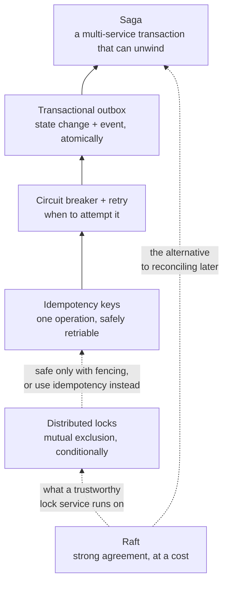

# Distributed Systems

Flows for keeping data consistent when it lives in more than one place and any
component may fail at any moment.

| Flow                                                                                  | What it answers                                                                                | Difficulty   |
| ------------------------------------------------------------------------------------- | ---------------------------------------------------------------------------------------------- | ------------ |
| [The Saga Pattern](saga-pattern.md)                                                   | How do I keep data consistent across services when no transaction can span them?               | Advanced     |
| [Transactional Outbox & CDC](transactional-outbox-and-cdc.md)                         | How do I update my database and publish an event without the two ever disagreeing?             | Intermediate |
| [Idempotency Keys](idempotency-keys.md)                                               | How does a client safely retry a payment when it has no idea whether the first attempt worked? | Intermediate |
| [Circuit Breaker, Timeout & Retry with Backoff](circuit-breaker-retry-and-backoff.md) | How do I stop retrying a failing dependency before my retries become the outage?               | Intermediate |
| [Raft Leader Election & Log Replication](raft-leader-election-and-log-replication.md) | How do five machines that can each crash agree on one ordered sequence of commands?            | Advanced     |
| [Distributed Locks & Fencing Tokens](distributed-locks-and-fencing-tokens.md)         | Why does my distributed lock not actually give me mutual exclusion, and what would?            | Advanced     |

## How these fit together

They are layers of one solution. **Idempotency** makes an individual operation
safe to retry; the **circuit breaker** decides whether to attempt it at all. The
**outbox** makes a state change and its announcement atomic. The **saga**
composes those reliable steps into a business transaction that can be undone.
**Raft** is the other answer entirely — when you need real agreement rather than
eventual reconciliation. **Distributed locks** are what people reach for instead
of all of this, and the page on them is mostly about why that usually does not
work.

Read them bottom-up if you are new to this. A saga built on non-idempotent steps
and dual writes will fail in ways that are very hard to diagnose.

## Wanted

Good first contributions in this category — see [CONTRIBUTING.md](../../CONTRIBUTING.md):

- Two-phase commit (2PC) and why it blocks
- CQRS and event sourcing
- Consistent hashing and rebalancing
- Vector clocks and last-writer-wins conflict resolution
