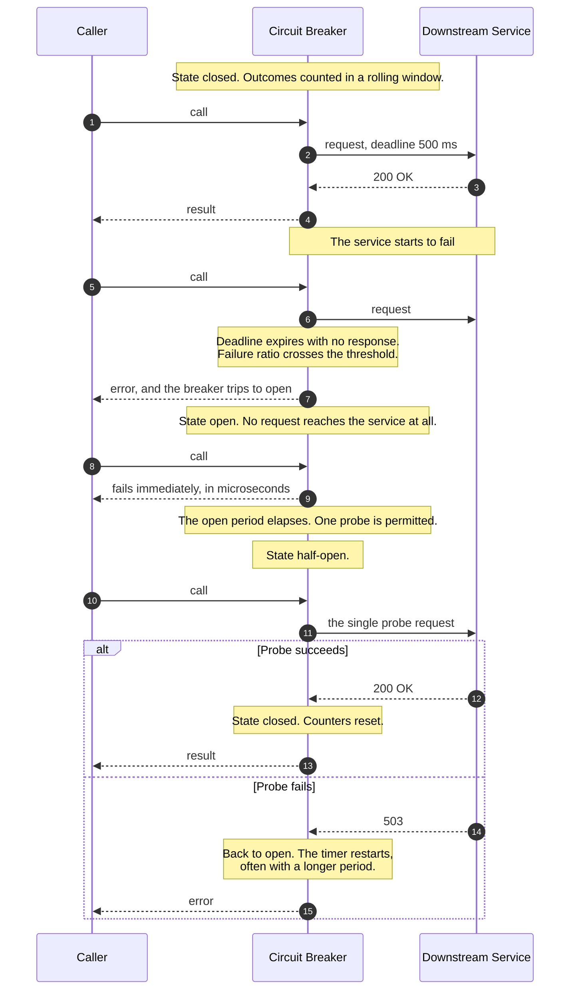
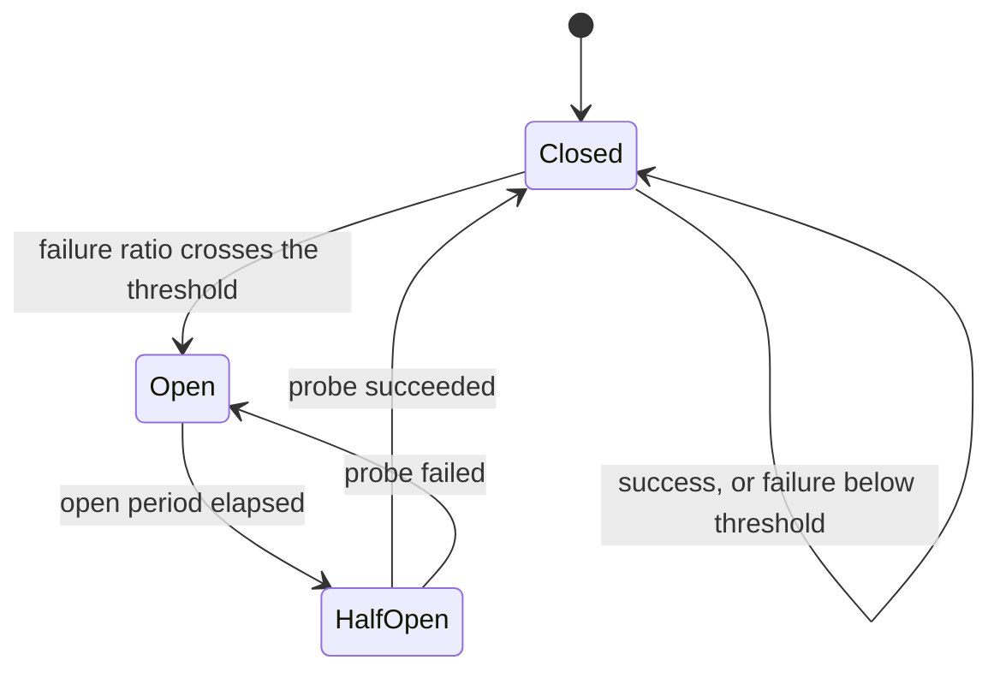
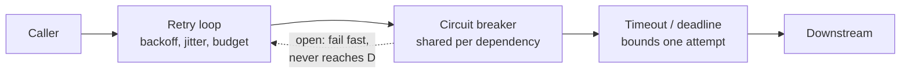

# Circuit Breaker, Timeout & Retry with Backoff

> How a caller stops making a struggling dependency worse — by giving up
> quickly, retrying carefully, and eventually refusing to call at all until
> there is evidence it has recovered.

_Also known as: the resilience triad. Individually: bulkheads' quieter sibling, exponential backoff with jitter, fail-fast._

_There is no specification for this flow. It is a set of well-documented
operational practices; the references name where each claim comes from._

---

## TL;DR

- **The three parts only work together.** Timeouts bound a single attempt,
  retries recover from transient faults, and the breaker stops retries from
  becoming an attack on a service that is already down.
- **A breaker has three states.** _Closed_ passes traffic and counts failures;
  _open_ fails instantly without calling; _half-open_ lets a small, limited
  number of probes through to test recovery. This page recommends one;
  libraries vary (Resilience4j defaults to 10).
- **Jitter is not optional.** Unjittered exponential backoff synchronises every
  client into retry waves that arrive together — the thundering herd that keeps
  a recovering service down.
- **Retrying a non-idempotent call can double-charge someone.** Retry safely or
  do not retry; see [Idempotency Keys](idempotency-keys.md).
- **Retries multiply through layers.** Three retries — four attempts — at each
  of three tiers is 4³ = sixty-four requests at the bottom. Use a retry
  _budget_, not a retry count.

---

## When to use it

- Any synchronous call across a network boundary: another service, a database, a
  third-party API.
- Any dependency whose failure should degrade your service rather than take it
  down with it.
- Inside an agent's tool-execution path, where a failing tool would otherwise be
  retried by the model as well as by your code — see
  [LLM Tool-Use Loop](../ai-systems/llm-tool-use-loop.md).

## When _not_ to use it

- **In-process calls.** A breaker around a local function call adds state and
  failure modes for no benefit.
- **Where a queue is the better answer.** If the work does not need to happen
  now, buffer it. A breaker turns unavailability into an error; a queue turns it
  into latency, which is often what the user actually wants.
- **On a dependency you cannot function without.** Opening a breaker in front of
  your only database converts a slow outage into a fast one. Bound it, alert on
  it, but be honest that failing fast is not resilience here.
- **A breaker per call site.** State must be shared per dependency, or it never
  accumulates enough signal to trip.

---

## Actors and terminology

| Actor    | Term              | What it is                                                                                                     |
| -------- | ----------------- | -------------------------------------------------------------------------------------------------------------- |
| Caller   | _Client_          | Your code making the outbound call.                                                                            |
| Breaker  | _Circuit Breaker_ | A stateful wrapper around a dependency. Counts outcomes and decides whether calls pass.                        |
| Service  | _Downstream_      | The dependency. Frequently unaware any of this is happening.                                                   |
| Fallback | —                 | What the caller does when the call fails or is refused: a cached value, a degraded response, or a clear error. |

**Key terms**

- **Closed / open / half-open** — the three states. Confusingly, _closed_ is the
  healthy one; the metaphor is an electrical circuit, where closed means current
  flows.
- **Failure threshold** — what trips the breaker. A _ratio_ over a rolling
  window with a minimum request count, not a raw consecutive-failure count.
- **Open period** — how long the breaker stays open before allowing a probe.
- **Probe** — a trial request allowed through in half-open state. How many are
  permitted is a configuration choice; this page recommends one.
- **Exponential backoff** — wait `base × 2^attempt`, capped.
- **Jitter** — randomisation applied to that delay. _Full jitter_ is
  `random(0, min(cap, base × 2^attempt))`.
- **Retry budget** — a cap on retries as a _fraction_ of total traffic, typically
  around 10%. Bounds the extra load regardless of how many callers fail at once.
- **Deadline** — the absolute time by which the whole operation must finish,
  propagated to every downstream call. Superior to per-call timeouts because it
  cannot be reset by each hop.

---

## Sequence diagram



## Architecture

The state machine, which is easier to hold than the sequence:



And where the three mechanisms sit relative to each other — the ordering matters
and is frequently got wrong:



The retry loop is **outside** the breaker. That way an open breaker rejects each
retry instantly and cheaply, and the retry loop's own budget is what stops it
from spinning.

---

## Step-by-step

1. **The caller invokes the dependency through the breaker.** It never calls the
   HTTP client directly — that is how a call site ends up with no protection at
   all.

2. **The breaker is closed, so the request goes out with a deadline.** Derive it
   from the deadline you were given, do not invent a fresh one:

   ```text
   remaining = request_deadline - now()
   attempt_timeout = min(remaining, per_attempt_cap)
   if remaining <= 0: fail immediately, do not call
   ```

   The per-attempt timeout should come from observed latency — the p99.9 plus
   headroom — not from a round number someone liked.

3. **The service responds normally.** The breaker records a success in the
   rolling window.

4. **The result is returned.**

5. **A later call arrives while the service is degrading.**

6. **The request goes out and does not come back in time.** The breaker counts a
   failure. What counts as failure matters: timeouts, connection errors, and
   `5xx` do. A `400` does not — that is your bug, and it will never recover no
   matter how long you wait.

7. **The threshold is crossed and the breaker opens.** For example: at least 20
   requests in the last 10 seconds, of which more than 50% failed. The minimum
   count is essential — two failures out of two is 100% and means nothing.

8. **The next call arrives, and the breaker is open.**

9. **It fails immediately, without a network call.** This is the entire point:
   the caller's threads are not blocked, its own latency stays flat, and the
   downstream service gets a chance to recover without incoming load. Return a
   fallback here if you have one.

10. **After the open period, the breaker admits one probe.** Typically 5 to 60
    seconds. All other calls continue to fail fast while the probe is in flight.

11. **The probe goes out.** The diagram shows one, which is this page's
    recommendation rather than part of the pattern's definition: libraries let
    you configure a small number (Resilience4j's
    `permittedNumberOfCallsInHalfOpenState` defaults to 10). Whatever the
    number, keep it small — a "half-open" state that admits all traffic
    recreates the stampede it exists to prevent.

12. **(Success branch.)** The probe returns cleanly.

13. **The breaker closes and normal traffic resumes.** Reset the counters —
    otherwise stale failures re-trip it immediately.

14. **(Failure branch.)** The probe fails.

15. **The breaker re-opens.** Increase the open period on repeated failures, so a
    long outage is not probed every five seconds for an hour.

**Where retries fit.** Around all of the above. A retryable failure is retried
with full jitter:

```python
delay = random.uniform(0, min(cap, base * (2 ** attempt)))
```

Retry only on transient failures, only if the operation is safe to repeat, only
within the remaining deadline, and only while the retry budget allows.

---

## Failure modes

| Failure                                     | What the caller sees                 | Correct handling                                                                                                                                       |
| ------------------------------------------- | ------------------------------------ | ------------------------------------------------------------------------------------------------------------------------------------------------------ |
| Downstream slow but not failing             | Latency climbs, no errors            | Timeouts convert this into failures the breaker can act on. Without them, threads pile up and _your_ service falls over first.                         |
| Breaker opens on a client bug               | Everything fails fast                | Do not count `4xx` as failure. A malformed request is not a signal the dependency is unhealthy.                                                        |
| One bad shard, breaker per host             | Traffic shifts away from it          | Correct behaviour, if the breaker is keyed per host. A single breaker for the whole cluster opens on one bad node and blocks the healthy ones.         |
| Retry storm on recovery                     | Service recovers, then dies again    | Jitter, plus a retry budget, plus half-open admitting only a few probes (one, as recommended here).                                                    |
| Nested retries                              | Load amplified multiplicatively      | Retry at exactly one layer — usually the outermost that still knows the call is safe to repeat. Deeper layers get a deadline, not a retry loop.        |
| Non-idempotent call retried after a timeout | Duplicate side effect                | You cannot tell a lost request from a lost response. Use an idempotency key, or do not retry.                                                          |
| Server sends `Retry-After`                  | Client backs off on its own schedule | Honour the header — the server knows more than your backoff formula. See [Rate Limiting Algorithms](../data-and-delivery/rate-limiting-algorithms.md). |
| Breaker state lost on deploy                | Every instance starts closed         | Usually acceptable; state is per-process by design. Stagger deploys so all instances do not probe simultaneously.                                      |

---

## Common pitfalls

### Retrying without jitter

❌ **What people do:** `sleep(base * 2 ** attempt)` — textbook exponential
backoff, no randomisation.

✅ **Do instead:** full jitter — `random(0, min(cap, base * 2 ** attempt))`.

_Why it bites you:_ every client that failed at the same instant retries at the
same instant, then again together, and again. The service comes back, is hit by
a synchronised wave, and falls over — repeatedly, at an interval that doubles
each time. AWS's measurements of this are the clearest published demonstration
that jitter both reduces contention and finishes the work sooner.

### Retrying a call that is not safe to repeat

❌ **What people do:** apply one retry policy to every outbound call, including
`POST /payments`.

✅ **Do instead:** retry only idempotent operations, or make them idempotent with
a client-generated key.

_Why it bites you:_ a timeout tells you nothing about whether the server acted.
The request may have been lost, or it may have succeeded and the _response_ lost.
Retrying charges the card twice. This is the most expensive bug in this page and
the least visible in testing, because it only appears under the network
conditions your tests do not create.

### Retrying at every layer

❌ **What people do:** the HTTP client retries three times, the service wrapper
retries three times, and the gateway retries three times. Each is reasonable
alone.

✅ **Do instead:** retry at one layer. Everywhere else, propagate the deadline and
fail. Enforce a retry budget as a fraction of traffic.

_Why it bites you:_ the amplification is multiplicative. Three retries means
four attempts per layer, so three layers is 4³ = 64 requests to a service that is already struggling, from every
caller, at once. The dependency experiences your outage as a denial of service
attack, and it is the retries — not the original traffic — that keep it down.

### No timeout at all

❌ **What people do:** rely on the client library's default, which for several
popular HTTP clients is _no timeout_.

✅ **Do instead:** set an explicit connect timeout and an explicit read timeout on
every client, and propagate an absolute deadline through the call graph.

_Why it bites you:_ without a timeout, a slow dependency consumes a thread or
connection per in-flight request forever. Your pool exhausts, requests that have
nothing to do with that dependency start queueing, and your service fails
completely because one non-critical call got slow. This is the single most common
way a partial outage becomes a total one.

### A breaker per call site

❌ **What people do:** construct the breaker inside the function that makes the
call, so each call site gets a fresh one.

✅ **Do instead:** one breaker instance per dependency — per host, or per host and
endpoint class — shared across all callers in the process.

_Why it bites you:_ the breaker needs enough observations to distinguish a real
outage from noise. Spread across fifty call sites, no single instance ever sees
the minimum request count, so none of them ever trips and the breaker is purely
decorative. Its dashboard, meanwhile, shows it as healthy.

### Half-open that admits everything

❌ **What people do:** after the open period, return to closed and let all traffic
through to see what happens.

✅ **Do instead:** admit a strictly limited number of probes — one is the
simplest and what this page recommends — and close only if they succeed.

_Why it bites you:_ the full production load arriving at once at a service that
has just restarted with cold caches and an empty connection pool will knock it
over again immediately. You then oscillate — open, flood, die, open — and the
breaker is actively preventing recovery.

### Counting client errors as failures

❌ **What people do:** count every non-`2xx` as a failure.

✅ **Do instead:** count timeouts, connection errors, and `5xx`. Treat `4xx` as
success from the breaker's point of view, and handle `429` separately by honouring
`Retry-After`.

_Why it bites you:_ a deploy that starts sending a malformed field produces
100% `400`s, trips the breaker, and now every _valid_ request fails too — turning
a bug affecting one endpoint into a total outage of that dependency, and hiding
the actual error behind circuit-breaker exceptions.

---

## Implementation checklist

- [ ] Set explicit connect and read timeouts on every client. Audit the defaults;
      several are unbounded.
- [ ] Propagate an absolute deadline through the call graph; never reset it at a
      hop.
- [ ] Derive timeouts from measured latency, not round numbers.
- [ ] Retry only idempotent operations; attach an idempotency key otherwise.
- [ ] Use full jitter, with a cap.
- [ ] Enforce a retry budget as a fraction of traffic, not a per-request count.
- [ ] Retry at exactly one layer, and document which.
- [ ] Honour `Retry-After` when the server sends it, over your own backoff.
- [ ] Share one breaker per dependency; key it per host where hosts fail
      independently.
- [ ] Trip on a failure _ratio_ over a rolling window, with a minimum request
      count.
- [ ] Exclude `4xx` from the failure count.
- [ ] Cap probes in half-open (one recommended; check your library's default, e.g. Resilience4j's is 10); reset counters only on success.
- [ ] Lengthen the open period on repeated probe failures.
- [ ] Define the fallback for every breaker: cached value, degraded response, or
      a clear error. "Throw an exception" is a decision, not a default.
- [ ] Emit metrics for state transitions and alert on them — an open breaker is
      an incident, not a normal condition.
- [ ] Test with induced latency and packet loss, not only with a stopped
      dependency.

---

## Specs and references

**Authoritative** — no standards body defines this. These are the primary
operational sources.

- [Timeouts, retries, and backoff with jitter](https://aws.amazon.com/builders-library/timeouts-retries-and-backoff-with-jitter/) — Amazon Builders' Library. Deadline propagation, retry budgets, and why retries at multiple layers multiply.
- [Exponential Backoff and Jitter](https://aws.amazon.com/blogs/architecture/exponential-backoff-and-jitter/) — the measurements behind full jitter, including why it completes work faster as well as reducing contention.
- [Site Reliability Engineering — Handling Overload](https://sre.google/sre-book/handling-overload/) — Google's retry budgets, the per-request retry cap, and cascading failure. The companion chapter on addressing cascading failures is where the load-amplification argument is made in full.
- [CircuitBreaker](https://martinfowler.com/bliki/CircuitBreaker.html) — Fowler's description of the three states, with the reference implementation sketch.

**Further reading**

- [Resilience4j — CircuitBreaker](https://resilience4j.readme.io/docs/circuitbreaker) — a widely used implementation; its configuration table shows half-open probe count (`permittedNumberOfCallsInHalfOpenState`, default 10), window types, and minimum call counts as tunables.
- _Release It!_, Michael Nygard — the origin of the pattern's name and the stability-antipattern framing (integration points, cascading failure, blocked threads).
- [RFC 9110 §10.2.3 — Retry-After](https://www.rfc-editor.org/rfc/rfc9110#field.retry-after) — the header to honour before your own backoff.

---

## Related flows

- [Idempotency Keys](idempotency-keys.md) — what makes a retry safe in the first place. Read it before enabling retries on anything that writes.
- [Rate Limiting Algorithms](../data-and-delivery/rate-limiting-algorithms.md) — the other side: what the downstream service does to defend itself, and what `429` and `Retry-After` mean.
- [The Saga Pattern](saga-pattern.md) — when a retry is no longer enough and the work already done has to be undone.
- [Raft Leader Election & Log Replication](raft-leader-election-and-log-replication.md) — how a caller should behave during the seconds a cluster has no leader.
- [LLM Tool-Use Loop](../ai-systems/llm-tool-use-loop.md) — an agent loop is itself a retry loop, and needs the same bounds.
- [Webhook Delivery & Signature Verification](../data-and-delivery/webhook-delivery-and-signature-verification.md) — a dispatcher is a retry loop aimed at endpoints you do not control, and needs every control on this page.
