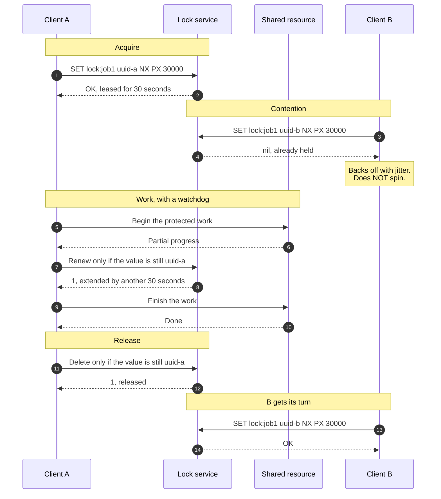
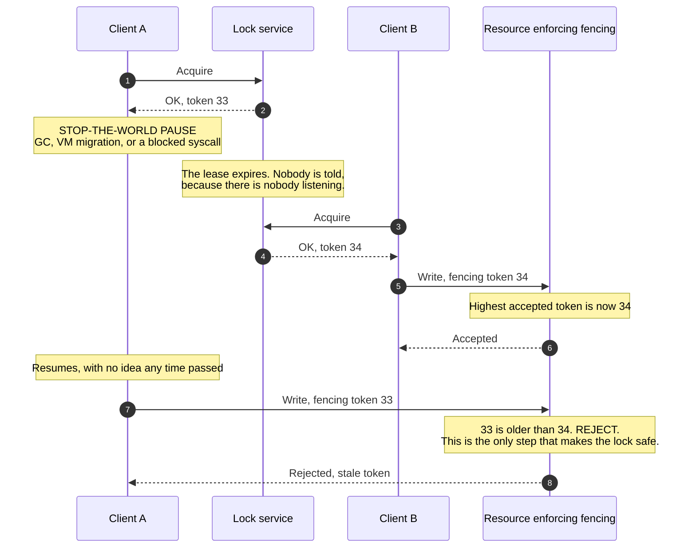

# Distributed Locks & Fencing Tokens

> How one process stops two others from doing the same job at the same time
> across a network — and why the lock alone never achieves that, no matter which
> lock service you buy.

_Also known as: distributed mutex, leader lease, `SETNX` locking, Redlock._

---

## TL;DR

- **A distributed lock is a lease, not a lock.** It expires on a schedule the
  holder does not control. A process can be inside the critical section and no
  longer hold the lock, and it has no way to know.
- **The dangerous gap is the pause.** A GC pause, a stop-the-world VM
  migration, or a slow disk can freeze a process for longer than its lease.
  When it resumes it carries on as though nothing happened — and someone else
  now holds the lock.
- **Only a fencing token closes the gap.** The lock issues a monotonically
  increasing number, the holder passes it with every write, and **the resource
  rejects anything older than what it has already accepted.** Without that, the
  lock is advisory.
- **Release must be a compare-and-delete.** A plain `DEL` releases whoever
  happens to hold the lock now, which after an expiry is someone else.
- **Ask whether you need mutual exclusion at all.** Idempotent writes,
  conditional updates, and single-partition consumers solve most of these
  problems without a lock, and they do not have a pause window.

---

## When to use it

- **Efficiency:** avoiding duplicate work that is merely wasteful — one cron
  instance sending the nightly digest instead of five. Here a lock that
  occasionally fails open is fine, and this is most real uses.
- **Correctness under contention** on a resource that can enforce fencing — a
  database that will accept a token check, a storage system with conditional
  writes.
- **Leader election** for a component where one active instance is the design,
  and the followers are ready to take over.

## When _not_ to use it

- **For correctness, on a resource that cannot reject a stale writer.** If the
  resource will accept any write from anyone, no lock protects it. Kleppmann's
  argument is exactly this, and it has not been refuted.
- **When a conditional write would do.** `UPDATE … WHERE version = $expected`,
  a compare-and-swap, or a unique constraint gives you the same safety with no
  lease, no clock assumption, and no liveness risk.
- **When the work can simply be idempotent.** Two workers doing the same
  idempotent job is a cost problem, not a correctness one — see
  [Idempotency Keys](idempotency-keys.md).
- **For long-running work.** A lease held for an hour is a lease that will
  expire mid-job on the day something is slow. Split the work, or use a system
  built for it.
- **As a queue.** A lock everyone spins on is a queue with no fairness, no
  visibility, and unbounded retry cost.

---

## Actors and terminology

| Actor           | Also called            | What it is                                                                                             |
| --------------- | ---------------------- | ------------------------------------------------------------------------------------------------------ |
| Client A        | _Lock holder_          | Acquires the lease and does the work. May be paused at any instant without warning.                    |
| Client B        | _Contender_            | Wants the same lock. Backs off, and eventually acquires it — sometimes sooner than Client A expects.   |
| Lock service    | _Coordination service_ | Redis, etcd, ZooKeeper, Consul, or a database row. Grants leases and expires them.                     |
| Shared resource | _Protected resource_   | The file, row, or API the lock exists to protect. **The only place fencing can actually be enforced.** |

**Key terms**

- **Lease** — a lock with a TTL. The defining property: it can expire while the
  holder still believes it holds it.
- **Owner value** — a unique random value stored with the lock so the holder can
  prove it is releasing its _own_ lease.
- **Fencing token** — a monotonically increasing integer issued with each
  successful acquisition. Chubby calls it a **sequencer**; ZooKeeper's
  `zxid`/sequential znode number serves the same role.
- **Lease renewal** — extending the TTL from a watchdog while the work runs.
  Reduces the frequency of the problem; does not remove it, since the watchdog
  is paused too.
- **Split brain** — two processes simultaneously convinced they hold the lock.
  The normal state of affairs after a pause, not an exotic failure.
- **Fail-open / fail-closed** — what you do when the lock service is
  unreachable. Both are wrong in different ways, and you must choose knowingly.

---

## Sequence diagram

The normal path, done correctly: unique owner value, TTL, watchdog renewal, and
a compare-and-delete release.



## The pause — and the fencing token that survives it

Everything above assumes Client A keeps running. It need not.



Without the check the resource makes on receiving step 7's write — the note
between steps 7 and 8 — Client A's write lands **after** Client B's and
silently wins — the classic lost update, produced by a lock that was working
exactly as designed. Note also what the fencing check does _not_ need: it makes
no assumption about clocks, and it does not care how the lock was granted.

---

## Step-by-step

1. **Acquire with a unique owner value and a TTL, atomically.** One command,
   never a check-then-set:

   ```bash
   SET lock:job1 "a3f1c0e2-…" NX PX 30000
   ```

   `NX` makes it conditional on absence, `PX` sets the expiry in the same
   operation. A separate `EXPIRE` leaves a window in which a crash strands the
   lock forever. The value must be **unique per acquisition**, not per client —
   the same process re-acquiring later needs a different value.

2. **Lock service grants the lease.** Note what it does not grant: any promise
   about the holder still running. The TTL is a bet about the worst-case
   duration of the work plus the worst-case pause.

3. **A second client tries the same key.**

4. **It is refused,** `nil`. There is no queue and no fairness — the winner of
   the next attempt is whoever asks first after expiry.

   _No message on the wire:_ Client B now backs off, with jitter, and with a
   bounded number of attempts. A tight retry loop against a lock is how one
   contended key turns into a saturated lock service — the same dynamics as
   [retry storms](circuit-breaker-retry-and-backoff.md).

5. **Client A starts the protected work.**

6. **The resource reports progress.** This is the region where every assumption
   can break: the process can be paused, the network can partition, the lease
   can expire.

7. **The watchdog renews the lease** — conditionally, so a client that has
   already lost the lock cannot steal it back:

   ```lua
   -- renew: extend only if we still own it
   if redis.call("GET", KEYS[1]) == ARGV[1] then
     return redis.call("PEXPIRE", KEYS[1], ARGV[2])
   else
     return 0
   end
   ```

   A renewal that returns `0` means the lease was lost. The correct response is
   to **abort the work immediately**, not to re-acquire and continue — someone
   else has been running concurrently since the expiry.

8. **Lock service extends the lease.**

9. **Client A finishes the work.**

10. **The resource confirms.**

11. **Release with a compare-and-delete.** The read and the delete must be one
    atomic operation. On Redis 8.4 and later that is a single command:

    ```bash
    DELEX lock:job1 IFEQ "a3f1c0e2-…"
    ```

    On earlier versions it means a script:

    ```lua
    -- release: delete only if we still own it
    if redis.call("GET", KEYS[1]) == ARGV[1] then
      return redis.call("DEL", KEYS[1])
    else
      return 0
    end
    ```

    The
    [Redis locking documentation](https://redis.io/docs/latest/develop/clients/patterns/distributed-locks/)
    now recommends `DELEX … IFEQ`, with this script as the fallback for
    versions before 8.4. The reason either exists is in the pitfalls below.

12. **Lock service confirms the release.** A `0` here is informative: it means
    the lease had already expired and someone else may hold it, so the work you
    just finished was not exclusive after all. Log it — it is your only signal
    that the TTL is too short.

13. **Client B retries.**

14. **Client B acquires.** With fencing, it gets a token strictly greater than
    Client A's, and that is what makes the ordering enforceable downstream.

---

## Failure modes

| Failure                                     | What happens                                                     | Correct handling                                                                                                                                                                                                                |
| ------------------------------------------- | ---------------------------------------------------------------- | ------------------------------------------------------------------------------------------------------------------------------------------------------------------------------------------------------------------------------- |
| Holder pauses longer than the TTL           | Two clients in the critical section, both certain they are alone | Fencing tokens checked by the resource. Nothing else fixes it — not a longer TTL, not renewal, not a better lock service.                                                                                                       |
| Holder crashes while holding the lock       | The lock expires and work resumes elsewhere                      | This is the case the TTL exists for, and the only one it handles well. Keep the TTL as short as the work allows.                                                                                                                |
| Lock service unreachable                    | Nobody can acquire                                               | Decide fail-open or fail-closed **per use case**, and write it down. Efficiency locks may proceed; correctness locks must not.                                                                                                  |
| Redis primary fails over before replication | Two clients hold the "same" lock                                 | Redis replication is asynchronous, so a single-instance lock is not durable across failover. If you need this, use a consensus system.                                                                                          |
| Clock jumps on the lock server              | Leases expire early or late                                      | Redis's own docs state its TTL expiry does not use a monotonic clock, so a wall-clock shift can grant one lock twice. Prefer a lock service that expires by elapsed monotonic time, and never let correctness depend on clocks. |
| `DEL` releases someone else's lock          | Two holders, immediately and repeatedly                          | Compare-and-delete, always.                                                                                                                                                                                                     |
| Renewal fails mid-work                      | The client is now unprotected but still running                  | Abort. Treat a failed renewal as a lost lock, and make the work resumable so aborting is cheap.                                                                                                                                 |
| Every client retries at the same interval   | Synchronised stampede against the lock service                   | Exponential back-off with full jitter, and a cap on attempts.                                                                                                                                                                   |

---

## Common pitfalls

### Releasing with a plain `DEL`

❌ **What people do:** `redis.del("lock:job1")` in a `finally` block.

✅ **Do instead:** the compare-and-delete from step 11 — `DELEX … IFEQ` or the
script — keyed on the owner value generated at acquisition.

_Why it bites you:_ if your lease expired during the work — which is exactly
when the code is slow enough to matter — that `DEL` removes **Client B's**
lock. B keeps working, C acquires, and now three processes are in the critical
section. The failure compounds instead of recovering, and it happens most under
load.

### A TTL based on how long the work usually takes

❌ **What people do:** measure the job at 8 seconds, set a 30-second TTL, ship
it.

✅ **Do instead:** size the TTL against the worst case including pauses, add a
watchdog renewal, **and** make the resource reject stale writers. Then keep the
TTL short, because you have a real safety mechanism and no longer need the TTL
to be one.

_Why it bites you:_ the distribution has a tail you have not seen yet. A
multi-second GC pause, a hypervisor migration, or an IO stall on a degraded
disk all exceed a comfortable-looking TTL, and the resulting overlap produces
data corruption rather than a slow request.

### Assuming the lock makes the write safe

❌ **What people do:** acquire, write to S3 or Postgres, release, and consider
the critical section protected.

✅ **Do instead:** carry the fencing token into the write and have the resource
enforce it — a monotonic `token` column checked in the `WHERE` clause, a
conditional write with an expected version, or an `If-Match` on an ETag:

```sql
UPDATE job_state
   SET payload = $1, fence = $2
WHERE id = $3
   AND fence <= $2;    -- an older token updates zero rows; the same
                       -- holder's repeat writes with its token still land
```

Use `<=`, not `<`: a holder usually writes more than once per lease (steps 5
and 9 above), and a strict comparison would reject its own second write. Only
tokens _older_ than the highest accepted one are stale. The row must also
exist: create it on first write (for example `INSERT … ON CONFLICT (id) DO
UPDATE … WHERE job_state.fence <= EXCLUDED.fence`), or the `UPDATE` silently
matches nothing.

_Why it bites you:_ the lock and the resource are different systems that never
talk to each other. The resource has no idea a lock exists and will happily
apply a write from a process whose lease expired four seconds ago. This is the
single most common misconception about distributed locks, and the reason this
page exists.

### Treating Redlock as consensus

❌ **What people do:** run Redlock across five Redis nodes and conclude the lock
is now safe for correctness.

✅ **Do instead:** understand what it does and does not give you. Redlock adds
fault tolerance across Redis instances; it still depends on bounded clock drift
and bounded pauses, and it still issues no fencing token. If you want a lock
whose safety rests on consensus, use etcd or ZooKeeper — and even then, fence
the writes.

_Why it bites you:_ the multi-node algorithm creates confidence proportional to
its complexity rather than to its guarantees. Read
[Kleppmann's critique](https://martin.kleppmann.com/2016/02/08/how-to-do-distributed-locking.html)
and the responses to it before betting correctness on this, so that the choice
is informed rather than inherited from a blog post.

### Not deciding what happens when the lock service is down

❌ **What people do:** discover the behaviour during the incident, when the
`acquire()` call throws and the exception handler does whatever it does.

✅ **Do instead:** choose explicitly, per lock. A nightly report lock fails open
and someone gets two emails. A payment-capture lock fails closed and the job
waits. Both are correct; the wrong one is the one nobody chose.

_Why it bites you:_ the default is usually "the exception propagates and the
job fails", which turns a Redis blip into a stalled pipeline — or worse, a
retry loop that hammers the recovering service.

### Using a lock where the database already offers one

❌ **What people do:** reach for Redis to serialise updates to a row that the
database could guard with a unique constraint, an advisory lock, or
`SELECT … FOR UPDATE`.

✅ **Do instead:** use the database. A transaction against the same system you
are protecting gives you atomicity without a second failure domain, a lease, or
a clock assumption.

_Why it bites you:_ you have introduced a second system whose availability now
bounds yours, to solve a problem the first system solved decades ago — and the
Redis-based version is the one with the correctness gap.

---

## Implementation checklist

- [ ] Ask first whether an idempotent or conditional write removes the need for
      a lock. If it does, stop here.
- [ ] Classify the lock: **efficiency** (may occasionally fail) or
      **correctness** (must not). Write the classification next to the code.
- [ ] Acquire atomically, with a unique-per-acquisition owner value and a TTL in
      the same command.
- [ ] Release with a compare-and-delete (`DELEX … IFEQ` on Redis 8.4+, a script before that), never a bare `DEL`.
- [ ] Renew conditionally from a watchdog, and **abort the work** if a renewal
      fails.
- [ ] For correctness locks: issue a fencing token and enforce it **at the
      resource**. If the resource cannot enforce it, the lock is advisory —
      document that.
- [ ] Back off with full jitter and bound the attempts; never spin.
- [ ] Decide and document the behaviour when the lock service is unreachable.
- [ ] Log every failed renewal and every failed release — these are your only
      evidence that the TTL is wrong.
- [ ] Make the protected work resumable, so aborting on a lost lease is cheap.
- [ ] Verify that failover of the lock service cannot grant the same lock twice
      (for Redis, it can).

---

## Specs and references

**There is no specification for distributed locking.** These are the primary
sources, and they disagree with each other in useful ways.

- [Distributed Locks with Redis](https://redis.io/docs/latest/develop/clients/patterns/distributed-locks/) —
  the `SET resource NX PX` pattern, the compare-and-delete release (`DELEX`
  from Redis 8.4, the Lua script before), and the Redlock algorithm, with the
  project's own statement of the safety and liveness properties it claims — and
  its disclaimer that TTL expiry does not use a monotonic clock.
- [How to do distributed locking](https://martin.kleppmann.com/2016/02/08/how-to-do-distributed-locking.html) —
  Kleppmann, 2016. The efficiency/correctness distinction, the pause-and-expiry
  timeline, and the fencing-token argument. The single most useful thing to
  read before building any of this.
- [The Chubby lock service for loosely-coupled distributed systems](https://research.google/pubs/the-chubby-lock-service-for-loosely-coupled-distributed-systems/) —
  Burrows, OSDI 2006. Coarse-grained locking over Paxos, and §2.4 "Locks and
  sequencers": the fencing-token idea, in production, twenty years ago. The
  same section describes **lock-delay** — keeping a lock unavailable for a
  period after its holder vanishes — as the consolation prize for resources
  that will not check a sequencer. Which is to say: the problem on this page
  was identified, solved, and given a fallback two decades ago, and most
  systems still ship neither.
- [ZooKeeper Recipes](https://zookeeper.apache.org/doc/current/recipes.html) —
  locks and leader election from ephemeral sequential znodes, including the
  herd-effect-avoiding watch on the predecessor node rather than on the lock
  itself.

---

## Related flows

- [Raft Leader Election & Log Replication](raft-leader-election-and-log-replication.md) —
  what a consensus-backed lock service runs internally, and why its leases are
  more trustworthy than a single Redis node's.
- [Idempotency Keys](idempotency-keys.md) — the usual better answer: make the
  duplicate harmless instead of preventing it.
- [Circuit Breaker, Timeout & Retry with Backoff](circuit-breaker-retry-and-backoff.md) —
  the jittered back-off a contender needs, and what to do when the lock service
  is the thing that is failing.
- [The Saga Pattern](saga-pattern.md) — coordinating long-running work without
  holding anything for its duration.
