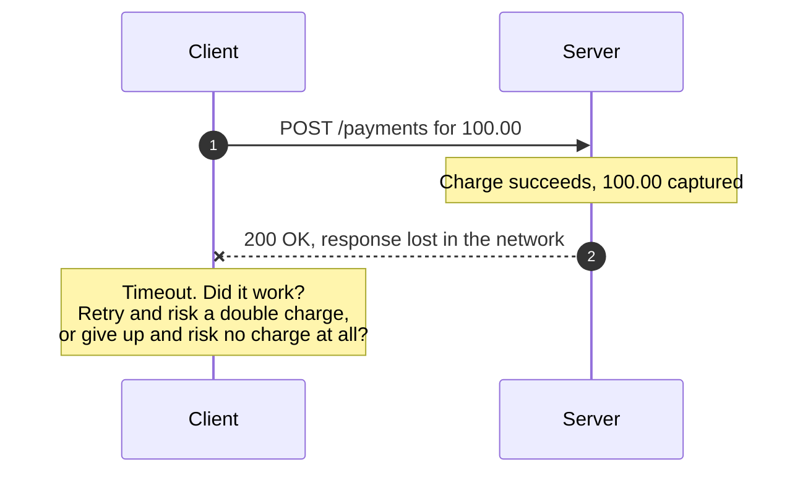
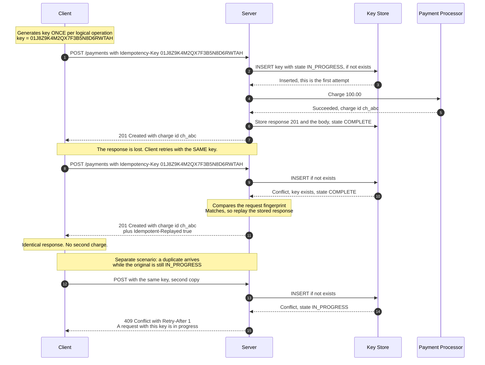
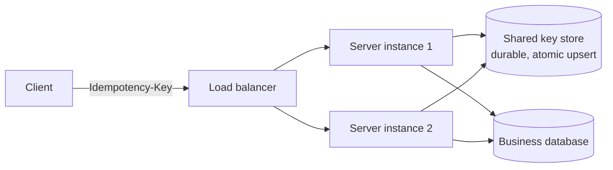

# Idempotency Keys

> How a client can safely retry a request that creates something — a payment, an
> order, a transfer — without risking a duplicate, even when it has no idea
> whether the original request succeeded.

_Also known as: request deduplication, `Idempotency-Key` header, client-generated request IDs._

---

## TL;DR

- A network timeout is **ambiguous**: the request may have succeeded, failed, or
  succeeded with the response lost. The client cannot tell the difference, and
  no amount of client-side cleverness will let it.
- The client generates a unique key per _logical operation_ and sends it with
  the request. The server records the key and the **response**, and replays that
  same response for any repeat.
- Store the response, not just the key. Returning `409 Conflict` on a retry
  turns a solvable problem into an error the client cannot act on.
- Handle the **concurrent** duplicate — two copies of the request in flight at
  once — with an atomic insert, not a read-then-write. This is where naive
  implementations break.
- Fingerprint the request body. The same key with a different body is a client
  bug and must be rejected loudly, not silently served a stale response.

---

## When to use it

- Any non-idempotent state-changing endpoint: `POST /payments`,
  `POST /transfers`, `POST /orders`.
- Any consumer of an at-least-once message stream — which is every message
  queue and every [outbox relay](transactional-outbox-and-cdc.md).
- Any operation whose duplicate has a cost you would have to apologise for.

## When _not_ to use it

- **`GET`, `PUT`, and `DELETE` that are already idempotent by construction.**
  `PUT /users/42` with a full representation is naturally safe to repeat
  ([RFC 9110 §9.2.2](https://www.rfc-editor.org/rfc/rfc9110#section-9.2.2)).
  Adding a key buys nothing.
- **When natural idempotency is available.** If the client can supply the
  resource ID (`PUT /orders/{client-chosen-id}`), a unique constraint does the
  job with no extra machinery.
- **Free, side-effect-light operations.** A duplicate search query costs a few
  milliseconds. Don't build a dedup store for it.

---

## The problem



There is no third option and no way for the client to find out on its own.
Idempotency keys give the client a safe answer: **always retry**.

---

## Actors and terminology

| Actor     | Term     | What it is                                                                                                           |
| --------- | -------- | -------------------------------------------------------------------------------------------------------------------- |
| Caller    | _Client_ | Generates the key and retries.                                                                                       |
| Service   | _Server_ | Records keys and replays stored responses.                                                                           |
| Key store | —        | Persistent map from key to request fingerprint and stored response. Must be durable and shared across all instances. |

**Key terms**

- **Idempotency key** — a client-generated unique string (a UUIDv4 is standard)
  identifying one logical operation. Generated **once**, reused across every
  retry of that operation.
- **Request fingerprint** — a hash of the canonicalised request body, stored
  with the key to detect a key being reused for different content.
- **Idempotency scope** — the tuple the key is unique within. Almost always
  _(API key or tenant, endpoint, idempotency key)_, so one tenant's keys can
  never collide with another's.
- **Recovery point** — the state recorded before doing the work, so an
  interrupted request can be resumed rather than restarted.

---

## Sequence diagram



---

## Architecture



The key store must be **shared and durable**. An in-process cache means two
instances behind the same load balancer will both think they are first — which
is precisely the case idempotency exists to prevent.

---

## Step-by-step

1. **Client sends the request,** carrying a key it generated _once_ for this
   logical operation and will reuse for every retry of it.

   ```http
   POST /payments HTTP/1.1
   Host: api.example.com
   Idempotency-Key: "01J8Z9K4M2QX7F3B5N8D6RWTAH"
   Content-Type: application/json

   {"amount": 10000, "currency": "usd", "customer": "cus_42"}
   ```

   The IETF draft defines the value as a Structured Field String, so it is
   quoted on the wire. Stripe, which predates the draft, accepts unquoted
   values (`Idempotency-Key: KG5LxwFBepaKHyUD`); servers that want to interoperate
   with both should accept either form.

   Where the key comes from matters more than what is in it:

   ```text
   key = uuid4()          # or a ULID; any collision-resistant unique string
   for attempt in 1..N:
       POST /payments  Idempotency-Key: {key}
   ```

   Generating a new key inside the retry loop is the single most common way this
   pattern is broken — it turns every retry into a distinct operation, which is
   exactly the behaviour you were trying to prevent.

2. **Server attempts an atomic claim.** Insert-if-not-exists, in one statement:

   ```sql
   INSERT INTO idempotency_keys
       (scope, key, request_fingerprint, state, created_at, expires_at)
   VALUES ($1, $2, $3, 'IN_PROGRESS', now(), now() + interval '24 hours')
   ON CONFLICT (scope, key) DO NOTHING
   RETURNING id;
   ```

   _Atomicity is the crux._ A `SELECT` followed by an `INSERT` has a window in
   which two concurrent requests both see nothing and both proceed. The single
   statement closes it, and the database's unique index does the arbitration.

3. **Store confirms this is the first attempt.**

4. **Server performs the work.** Ideally in the same transaction as the key
   record, so a crash cannot leave one without the other. When the work involves
   an external call — as with a payment processor — that is impossible, so pass
   your idempotency key _through_ to the processor. Every serious payment API
   accepts one, and this is what makes the composite operation safe.

5. **External system returns.**

6. **Server stores the outcome:** status code, headers, and body, with state
   `COMPLETE`.

   ```sql
   UPDATE idempotency_keys
      SET state = 'COMPLETE', response_status = 201,
          response_body = $1, completed_at = now()
    WHERE scope = $2 AND key = $3;
   ```

7. **Server responds.**

   _No message on the wire:_ this response is lost — a dropped connection, a
   proxy timeout, a client that died. The client times out knowing nothing, and
   everything below is the consequence.

8. **Client retries with the same key.**

9. **Server attempts the same atomic claim.**

10. **The insert conflicts** — the key already exists, state `COMPLETE`.

    _Receiver validates:_ the server compares the request fingerprint before
    replaying anything. A match means a genuine retry; a mismatch is a client
    bug (see Pitfalls).

11. **Server replays the stored response,** byte-for-byte, with a header marking
    it a replay:

    ```http
    HTTP/1.1 201 Created
    Content-Type: application/json
    Idempotent-Replayed: true

    {"id": "ch_abc", "amount": 10000, "status": "succeeded"}
    ```

    The replay header is a convention, not a standard, but it is invaluable in
    logs and dashboards for seeing how often clients are retrying. The client
    cannot tell — and does not need to — whether this was the original or a
    replay.

12. **A concurrent duplicate arrives.** This is a separate scenario from steps
    1–11, where the original had already completed: here the original request
    is still running, so its key record is still `IN_PROGRESS` — typically a
    client that timed out and retried while the processor call was slow.

13. **Server attempts the claim for it too.**

14. **Its insert conflicts with state `IN_PROGRESS`.**

15. **Server returns `409 Conflict` with `Retry-After`.** Do not block waiting
    for the first request; holding a connection open to wait on another request
    is how one slow processor call turns into thread-pool exhaustion. Tell the
    client to come back.

---

## Failure modes

| Failure                              | What happens                       | Correct handling                                                                                                                                                                                                                                                                                                                                                             |
| ------------------------------------ | ---------------------------------- | ---------------------------------------------------------------------------------------------------------------------------------------------------------------------------------------------------------------------------------------------------------------------------------------------------------------------------------------------------------------------------- |
| Response lost after success          | Client retries                     | Replay the stored response. The core case.                                                                                                                                                                                                                                                                                                                                   |
| Two concurrent duplicates            | Second hits `IN_PROGRESS`          | `409` + `Retry-After`. The client's retry then finds `COMPLETE` and gets the real response.                                                                                                                                                                                                                                                                                  |
| Server crashes mid-work              | Key stuck `IN_PROGRESS`            | Records need a lease/expiry. On timeout, either resume from a recovery point or mark the key failed so a retry can re-attempt cleanly. Never leave it stuck forever.                                                                                                                                                                                                         |
| Same key, different body             | Client bug                         | `422 Unprocessable Entity`. Never serve the stored response — the client asked for something else and would silently get the wrong answer.                                                                                                                                                                                                                                   |
| Key reused after expiry              | Treated as new                     | Document the retention window (24h is common). Clients must not retry beyond it.                                                                                                                                                                                                                                                                                             |
| Original request **failed**          | Key exists with a failure recorded | Decide deliberately: replay the failure, or allow a fresh attempt. Stripe persists every outcome once execution begins, **including `500`s**, and stores nothing if validation fails first or a concurrent request holds the key. Persisting 5xx is safest when a failure may have had side effects; not persisting it lets a transient error be retried under the same key. |
| Key store unavailable                | Cannot guarantee safety            | **Fail closed** — return 503. Processing without dedup on a payments endpoint is worse than being briefly unavailable.                                                                                                                                                                                                                                                       |
| Client generates a new key per retry | Duplicates, silently               | Server-side you cannot detect this. Catch it in client SDKs and integration tests.                                                                                                                                                                                                                                                                                           |

---

## Common pitfalls

### Read-then-write instead of an atomic insert

❌ **What people do:**

```python
if store.get(key):        # <-- two requests can both see None here
    return store.get(key).response
store.set(key, IN_PROGRESS)
do_the_work()
```

✅ **Do instead:** a single `INSERT … ON CONFLICT DO NOTHING` (or Redis `SET NX`)
and branch on whether it inserted.

_Why it bites you:_ the gap between the read and the write is exactly where
concurrent duplicates live — and concurrent duplicates are the common case,
because clients retry on timeout while the original is still running. The code
passes every sequential test and double-charges under load.

### Returning `409` for a completed retry

❌ **What people do:** see the key, conclude "duplicate", return `409 Conflict`.

✅ **Do instead:** replay the stored response with its original status code.

_Why it bites you:_ the client still does not know whether the payment
succeeded, which was the entire problem. It will either retry forever or
surface an error for an operation that worked. Reserve `409` for the
_in-progress_ case, where retrying shortly is genuinely the right move.

### Storing only the key, not the response

❌ **What people do:** keep a set of seen keys and return `200 OK` with an empty
body on a repeat.

✅ **Do instead:** persist status, headers, and body, and replay them exactly.

_Why it bites you:_ the client needs the resource ID from the original response.
An empty `200` means it succeeded but the client has no reference to what was
created and cannot proceed.

### Scoping keys globally

❌ **What people do:** make the key column unique on its own.

✅ **Do instead:** unique on _(tenant/API key, endpoint, key)_.

_Why it bites you:_ one client's UUID collides with another's — rare — but more
practically, a client reusing a key across two different endpoints gets one
endpoint's response from the other. Worse, a global namespace lets a malicious
caller probe or block another tenant's keys.

### Ignoring the request fingerprint

❌ **What people do:** replay the stored response whenever the key matches,
regardless of the body.

✅ **Do instead:** hash the canonicalised body, store it, compare on retry, and
return `422` on mismatch.

_Why it bites you:_ a client that reuses a key for a different payment gets a
`201` describing the _first_ payment. It records a success for a charge that
never happened. Silent, and extremely hard to trace back.

### Leaving `IN_PROGRESS` records forever

❌ **What people do:** set `IN_PROGRESS` and only ever clear it on success.

✅ **Do instead:** give the record a lease with an expiry, and sweep or reclaim
expired ones.

_Why it bites you:_ the server crashes mid-request and that key is permanently
poisoned. Every retry gets `409` forever, and the operation can never complete
— from the user's perspective, one specific payment is cursed.

### Failing open when the key store is down

❌ **What people do:** if the dedup store is unreachable, process anyway rather
than reject the request.

✅ **Do instead:** return `503` with `Retry-After`.

_Why it bites you:_ the key store is most likely to be down during an incident —
exactly when clients are retrying hardest. Failing open converts a partial
outage into a burst of duplicate charges.

---

## Implementation checklist

- [ ] Key is generated **once per logical operation** by the client, before the first attempt — enforced in the SDK.
- [ ] Server claims the key with a single atomic insert; no read-then-write anywhere.
- [ ] Uniqueness is scoped to _(tenant, endpoint, key)_.
- [ ] Request fingerprint stored and compared; mismatch returns `422`.
- [ ] Full response (status, relevant headers, body) is stored and replayed verbatim.
- [ ] `IN_PROGRESS` returns `409` + `Retry-After`; the server never blocks waiting on another request.
- [ ] `IN_PROGRESS` records carry a lease and are reclaimed after it expires.
- [ ] Retention window is documented publicly (24h is the norm) and enforced by a TTL or sweeper.
- [ ] Policy for failed originals is deliberate and documented: whether 5xx outcomes are replayed (Stripe's choice) or retryable under the same key, and that pre-execution validation failures are not stored.
- [ ] Key store unavailability **fails closed**.
- [ ] Your idempotency key is propagated to downstream providers that accept one.
- [ ] Replays are observable — a header and a metric — so retry rates are visible.
- [ ] There is a load test with concurrent duplicate requests. Sequential tests do not exercise the case that breaks.

---

## Specs and references

**Normative-ish**

- [The Idempotency-Key HTTP Header Field](https://datatracker.ietf.org/doc/html/draft-ietf-httpapi-idempotency-key-header) — IETF HTTPAPI draft standardising the header name and semantics, including the `409`/`422` responses described here, and the quoted Structured Field String value (§2.1). The latest revision, -07 (October 2025), is an expired Internet-Draft, not an RFC; the header name is a de-facto convention through wide adoption.
- [RFC 9110 §9.2.2 — Idempotent Methods](https://www.rfc-editor.org/rfc/rfc9110#section-9.2.2) — what HTTP already guarantees, and why `POST` is excluded.

**Practice**

- [Stripe — Idempotent Requests](https://docs.stripe.com/api/idempotent_requests) — the reference implementation everyone copies. Note the 24-hour window, the behaviour on mismatched bodies, and that it saves failed outcomes including `500`s.
- [Implementing Stripe-like Idempotency Keys in Postgres — Brandur Leach](https://brandur.org/idempotency-keys) — the best deep treatment available, including recovery points for multi-step operations that cross external systems.
- [AWS — EC2 client tokens](https://docs.aws.amazon.com/AWSEC2/latest/APIReference/Run_Instance_Idempotency.html) — the same pattern under a different name, with a different retention policy worth comparing.

---

## Related flows

- [Transactional Outbox & CDC](transactional-outbox-and-cdc.md) — produces the at-least-once stream whose duplicates this pattern absorbs.
- [Message Queue Delivery Semantics](../data-and-delivery/message-queue-delivery-semantics.md) — why consumer-side idempotency is mandatory rather than optional.
- [The Saga Pattern](saga-pattern.md) — every saga step and every compensation depends on this pattern to be safely retriable.
- [JWT Access & Refresh Token Rotation](../auth/jwt-access-refresh-token-rotation.md) — refresh-token rotation is the same atomic compare-and-set, applied to credentials.
- [Circuit Breaker, Timeout & Retry](circuit-breaker-retry-and-backoff.md) — the mechanism that generates the retries this pattern makes safe. Enable one without the other and you have chosen a side effect you did not want.
- [Raft Leader Election & Log Replication](raft-leader-election-and-log-replication.md) — consensus deliberately does not deduplicate commands, so a Raft client needs exactly this.
- [Webhook Delivery & Signature Verification](../data-and-delivery/webhook-delivery-and-signature-verification.md) — the consumer of a webhook is the canonical place this pattern is needed, and the canonical place it is skipped.
- [Distributed Locks & Fencing Tokens](distributed-locks-and-fencing-tokens.md) — the alternative people reach for first: preventing the duplicate instead of absorbing it.
