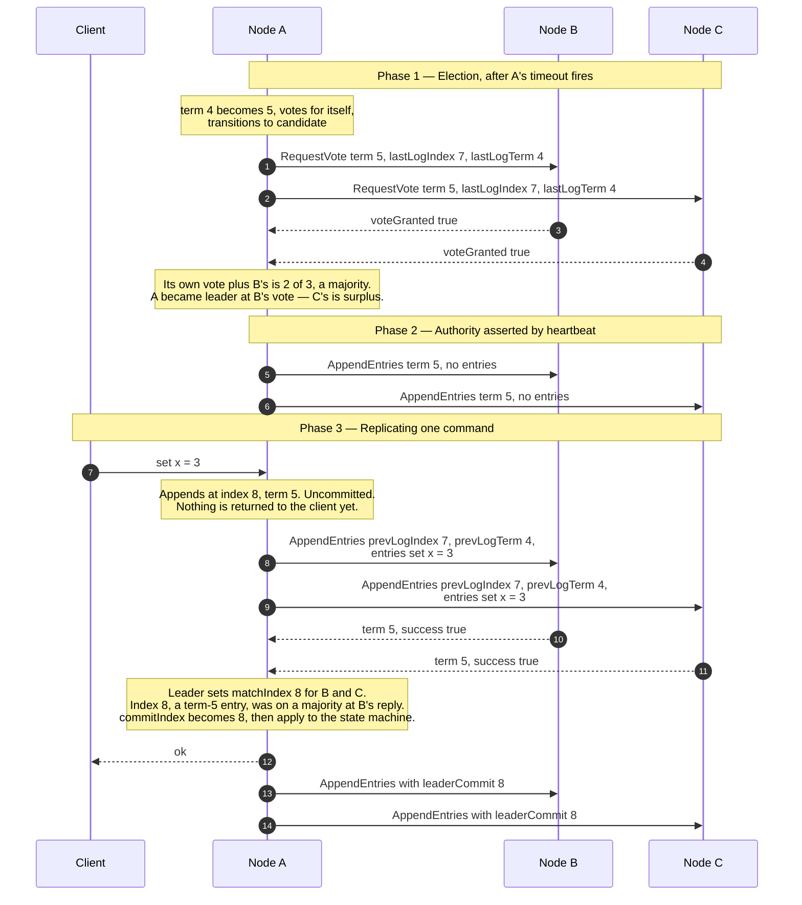
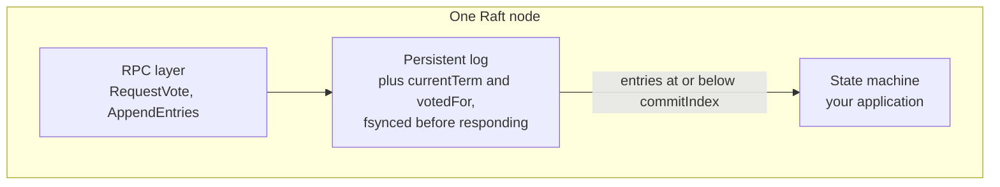
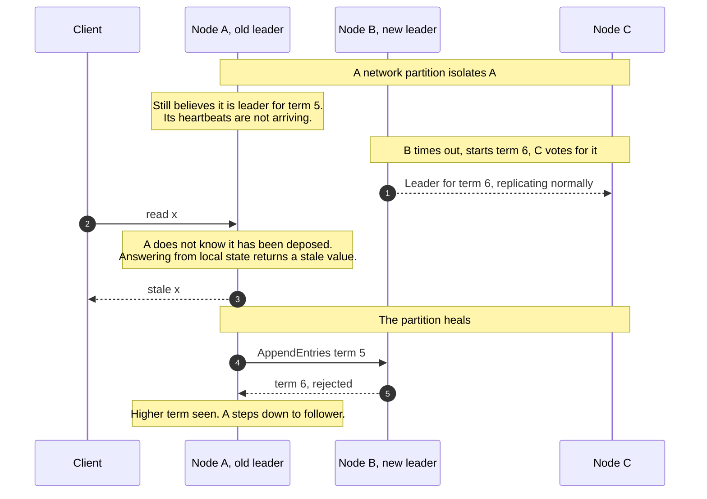

# Raft Leader Election & Log Replication

> How a handful of machines that can crash, stall, and lose messages agree on a
> single ordered sequence of commands — and how they pick which one of them gets
> to decide.

_Also known as: the consensus algorithm behind etcd, Consul, TiKV, CockroachDB, and Kafka's KRaft mode._

---

## TL;DR

- **Everything routes through one leader.** Clients write to the leader; the
  leader appends to its log and replicates. There is no multi-writer path, and
  that restriction is what makes the algorithm comprehensible.
- **Terms are a logical clock.** Every message carries a term. Seeing a higher
  term makes any node step down immediately — this is the entire mechanism for
  resolving competing leaders.
- **Committed means "on a majority" — with a catch.** A leader commits an entry
  **from its own term** once it is stored on a quorum; earlier entries commit
  with it. Only committed entries may be applied. This is why clusters are odd-sized:
  five nodes tolerate two failures, six tolerate the same two.
- **The election restriction is the safety property.** A node only grants a vote
  to a candidate whose log is at least as up to date as its own, so a committed
  entry can never be lost by electing the wrong leader.
- **Randomised election timeouts** are what break split votes. Not a heuristic —
  it is how the algorithm makes progress.

---

## When to use it

- Replicating a small, critical piece of state that must be strongly consistent:
  cluster membership, configuration, leases, locks, service discovery.
- Electing a single active instance of something — a scheduler, a job runner —
  where two would be a correctness problem.
- Anywhere you would otherwise write "we will use a database row as a lock" and
  then discover it needs to survive the database failing over.

## When _not_ to use it

- **Bulk data.** Every write goes to every node and through one leader. Raft
  replicates a _decision log_, not a data warehouse.
- **Cross-region low-latency writes.** Every commit costs a majority round trip.
  With nodes on three continents that is a hard floor of hundreds of
  milliseconds per write.
- **When you can use a Raft-backed system instead of implementing it.** etcd and
  Consul exist. Implementing Raft correctly — with snapshots, membership
  changes, and log compaction — is a year of work and a long tail of bugs.
- **When eventual consistency is genuinely acceptable.** CRDTs and
  last-write-wins are cheaper and stay available under partition. Consensus buys
  linearizability, and you should be able to say why you need it.

---

## Actors and terminology

| Actor     | Spec term   | What it is                                                                |
| --------- | ----------- | ------------------------------------------------------------------------- |
| Node      | _Server_    | One member of the cluster. Always in exactly one of three states.         |
| Leader    | _Leader_    | Handles all client requests and drives replication. At most one per term. |
| Follower  | _Follower_  | Passive. Responds to the leader and to candidates. The normal state.      |
| Candidate | _Candidate_ | A follower that timed out and is standing for election.                   |
| Client    | _Client_    | Sends commands. Must be redirected to the leader.                         |

**Key terms**

- **Term** — a monotonically increasing integer. Each term has at most one
  leader; some terms have none, because the election failed. Terms are compared
  on every message, and a node seeing a higher term always reverts to follower.
- **Log entry** — `(term, index, command)`. The index is a position; the term is
  when it was created. Both are needed to identify an entry uniquely.
- **`commitIndex`** — the index of the highest log entry known to be
  _committed_ (figure 2). Not simply "on a majority": a leader advances it only
  by counting replicas of an entry from its current term (§5.4.2). Entries at
  or below it are safe to apply.
- **`lastApplied`** — the highest index actually applied to the state machine.
  Trails `commitIndex` briefly.
- **Log Matching Property** — if two logs contain an entry with the same index
  and term, the logs are identical in every preceding entry. `AppendEntries`
  carries `prevLogIndex` and `prevLogTerm` specifically to maintain this.
- **Election restriction** — a voter rejects a candidate whose log is less up to
  date than its own, comparing last term first, then last index. This is the
  single check that makes leader election safe.
- **Quorum** — a strict majority. Any two quorums intersect, which is why two
  leaders cannot both commit.

---

## Sequence diagram



## Architecture

Each node is the same three-part machine. The log is the interface between
consensus and your application:



The state machine only ever sees committed entries, in index order, exactly
once. Every node therefore reaches the same state — that is the whole promise,
and it is why the state machine must be deterministic.

---

## Step-by-step

1. **A follower's election timeout expires and it becomes a candidate.** It
   increments `currentTerm`, votes for itself, and sends `RequestVote` to
   everyone else. The timeout is drawn randomly from a range — commonly
   150–300 ms — so that nodes rarely time out together.

   ```json
   {
     "type": "RequestVote",
     "term": 5,
     "candidateId": "A",
     "lastLogIndex": 7,
     "lastLogTerm": 4
   }
   ```

2. **The same request goes to every other node**, in parallel. A candidate does
   not wait for one reply before sending the next.

3. **A voter grants or refuses.** The rules, in order: refuse if `term` is less
   than `currentTerm`; if `term` is greater, step down to follower and adopt it;
   then grant only if `votedFor` is null or already this candidate (so a
   retransmitted request gets the same answer) **and** the candidate's log is
   at least as up to date as its own.

   B's grant is the one that decides this election: A's own vote plus B's is 2
   of 3, a majority, so A becomes leader for term 5 as soon as it arrives.

   _Voter persists:_ `currentTerm` and `votedFor` to stable storage **before**
   replying. A vote forgotten across a crash can produce two leaders in one term.

4. **The second vote arrives.** A is already leader; C's vote is surplus in a
   three-node cluster (in five nodes, the candidate would need two granted
   votes besides its own). A candidate that instead receives
   `AppendEntries` from a leader with a term at least as high reverts to
   follower; one that hears nothing and times out again starts term 6.

5. **The new leader sends empty `AppendEntries` at once.** Heartbeats suppress
   other nodes' election timeouts. The interval must be comfortably shorter than
   the minimum election timeout, or the cluster elects a new leader every few
   seconds.

6. **The heartbeat reaches the rest of the cluster.** From here the leader
   maintains `nextIndex` and `matchIndex` for every follower.

7. **A client sends a command.** If it arrives at a follower, the follower
   rejects it and returns the leader's identity — Raft has no write forwarding
   in the base algorithm.

8. **The leader appends locally, then replicates.** `prevLogIndex` and
   `prevLogTerm` describe the entry _before_ the new one, and are the consistency
   check.

   ```json
   {
     "type": "AppendEntries",
     "term": 5,
     "leaderId": "A",
     "prevLogIndex": 7,
     "prevLogTerm": 4,
     "entries": [{ "term": 5, "index": 8, "command": "set x = 3" }],
     "leaderCommit": 7
   }
   ```

9. **The same request goes to the other follower.** Followers are independent;
   one being slow does not block the other.

10. **A follower accepts.** Per figure 2 the reply carries only `term` and
    `success`; `matchIndex` is leader-side state, which the leader sets to 8
    for this follower on success (implementations often add hints to the
    reply, such as a conflict index). With the leader's own copy, index 8 is
    now on 2 of 3 — a majority, and a current-term entry — so the leader can
    commit it here without waiting for the other follower. It refuses if
    `prevLogIndex`/`prevLogTerm` do not match its log — the leader then decrements
    `nextIndex` for that follower and retries, walking backwards until the logs
    agree, then overwriting whatever the follower had beyond that point. **The
    leader's log is authoritative and is never modified to match a follower's.**

11. **The second follower accepts.** Not needed for the commit, but the leader
    now has index 8 on itself plus two followers, and sets C's `matchIndex` to 8.

12. **The leader commits, applies, and answers the client.** It advances
    `commitIndex` to 8, applies `set x = 3` to its state machine, and only then
    responds. Note the subtlety: a leader may only advance `commitIndex` on an
    entry **from its own term** by counting replicas. Entries from earlier terms
    are committed indirectly, once a current-term entry above them commits.

13. **Followers learn of the commit on the next `AppendEntries`.** `leaderCommit`
    carries it; there is no separate commit message.

14. **The second follower learns too, and applies.** Followers apply committed
    entries to their own state machines in index order, reaching the same state
    the leader already has.

---

## Failure modes

| Failure                                           | What happens                                     | Why it is safe                                                                                                                                     |
| ------------------------------------------------- | ------------------------------------------------ | -------------------------------------------------------------------------------------------------------------------------------------------------- |
| Leader crashes after step 8, before committing    | A new election; the entry may or may not survive | The entry was not acknowledged, so no client was told it succeeded. A new leader with the entry keeps it; one without it never had to preserve it. |
| Leader crashes after committing, before answering | Client sees a timeout                            | The entry **is** committed and will be applied. The client must retry — and the command must therefore be idempotent.                              |
| Split vote                                        | No leader for that term                          | Every candidate times out again, at randomised intervals, and the next term almost always resolves.                                                |
| Network partition, leader in the minority         | Leader cannot reach a quorum                     | It keeps trying and commits nothing. The majority side elects a new leader with a higher term.                                                     |
| Old leader returns after a partition              | Sends `AppendEntries` with a stale term          | Followers reject it and reply with the current term; the old leader steps down.                                                                    |
| Follower falls far behind                         | `nextIndex` walks backwards                      | If the needed entries are compacted away the leader sends a snapshot instead.                                                                      |
| Follower disk full or `fsync` fails               | It cannot durably persist                        | It must _not_ acknowledge. An acknowledgement it cannot honour after a restart breaks the commit guarantee.                                        |
| Client retries after a timeout                    | Command may be applied twice                     | Raft does not deduplicate. Attach a client ID and a sequence number, or use [Idempotency Keys](idempotency-keys.md).                               |
| Partitioned node rejoins with an inflated term    | Healthy leader forced to step down               | Isolated, it kept timing out and incrementing its term; its higher term deposes the leader on contact. Use Pre-Vote (thesis §9.6) and CheckQuorum. |

### The stale leader, and why reads are harder than writes



A deposed leader finds out only when it next talks to someone. Writes are safe
regardless — it can never assemble a quorum — but a **local read is not**. The
fixes: route reads through the log like writes (correct, slow); confirm
leadership with a heartbeat round before answering (`ReadIndex`); or hold a
time-based lease and answer locally within it, which trades a clock assumption
for latency.

---

## Common pitfalls

### Acknowledging before the write is durable

❌ **What people do:** append the entry to an in-memory log or a buffered file
and reply `success` immediately, because `fsync` per entry is slow.

✅ **Do instead:** persist `currentTerm`, `votedFor`, and the log entries to
stable storage before replying. Batch entries to amortise the `fsync` — do not
skip it.

_Why it bites you:_ Raft's safety argument assumes an acknowledgement is durable.
A node that acknowledges, crashes, and comes back missing entries can vote for a
candidate it should have refused, and a committed entry is then lost. The cluster
does not detect this; it silently diverges, which is the worst failure a
consensus system can have.

### Even numbers of nodes

❌ **What people do:** run four or six nodes, reasoning that more replicas means
more fault tolerance.

✅ **Do instead:** run three, five, or seven. If you have an even number of
machines, make one a non-voting learner.

_Why it bites you:_ a quorum of four is three, and a quorum of three is also
two-plus-one — so four nodes tolerate exactly one failure, the same as three,
while costing more and making split votes more likely. Six tolerates two, the
same as five. The extra node adds latency and cost and buys nothing.

### Heartbeat interval too close to the election timeout

❌ **What people do:** tune the heartbeat to 100 ms and the election timeout to
150 ms, to detect failure fast.

✅ **Do instead:** keep an order of magnitude between them, and set the election
timeout well above your worst-case round trip — including garbage collection
pauses and disk stalls.

_Why it bites you:_ one slow heartbeat triggers an election, the cluster stops
serving writes while it runs, and the resulting load makes the next heartbeat
late too. Clusters in this state flap between leaders indefinitely, and the
symptom — intermittent write unavailability with no node actually down — is
maddening to diagnose.

### Counting replicas to commit an entry from a previous term

❌ **What people do:** on becoming leader, look at uncommitted entries inherited
from the previous leader, see they are on a majority, and mark them committed.

✅ **Do instead:** only count replicas for entries from your **own** term. Older
entries commit implicitly when a current-term entry above them commits — which
is why leaders append a no-op entry immediately on election.

_Why it bites you:_ this is figure 8 in the Raft paper, and it is the subtlest
bug in the algorithm. There is a sequence of failures where an entry replicated
to a majority is _still_ later overwritten. Counting replicas across terms lets
you commit — and apply, and acknowledge — an entry that a future leader will
legitimately discard.

### Serving reads from the leader without checking leadership

❌ **What people do:** treat reads as free, answering from the leader's local
state machine.

✅ **Do instead:** use `ReadIndex` (thesis §6.4) — first make sure you have
committed an entry from your current term (the election no-op), since until
then your `commitIndex` may lag; record `commitIndex`; confirm with a heartbeat
round that you are still leader; wait for `lastApplied` to reach the recorded
index; then answer. Or accept lease-based reads and document the clock assumption.

_Why it bites you:_ linearizability is what you bought consensus for, and a
deposed leader that does not yet know it will happily serve a value that has
already been overwritten. This is not rare — it is the normal state of affairs
for a few hundred milliseconds after every partition.

### Changing membership by editing the config and restarting

❌ **What people do:** add a node by updating the peer list on each machine and
rolling a restart.

✅ **Do instead:** use the algorithm's own membership change — single-node
changes committed through the log, or joint consensus. Add new nodes as
non-voting learners first, and let them catch up before they gain a vote.

_Why it bites you:_ during the roll, different nodes hold different views of who
counts as a quorum, and two disjoint majorities can exist at the same time —
which means two leaders, both committing. Adding a voter that has an empty log
also enlarges the quorum immediately while being unable to help satisfy it,
which can freeze writes.

---

## Implementation checklist

- [ ] Persist `currentTerm`, `votedFor`, and log entries before responding to any
      RPC. Test it by killing the process mid-write.
- [ ] Compare terms on **every** received message; step down on any higher term.
- [ ] Randomise election timeouts over a wide range; keep heartbeats an order of
      magnitude shorter.
- [ ] Enforce the election restriction: compare last log term, then last index.
- [ ] Enforce the log matching check on `prevLogIndex` and `prevLogTerm`; walk
      `nextIndex` back on rejection.
- [ ] Never modify the leader's log to agree with a follower.
- [ ] Only count replicas for entries from the current term. Append a no-op on
      election.
- [ ] Apply entries to the state machine strictly in index order, exactly once.
- [ ] Make the state machine deterministic — no clocks, no random values, no map
      iteration order.
- [ ] Implement `ReadIndex` or an explicit lease for linearizable reads.
- [ ] Deduplicate client commands with a client ID and sequence number.
- [ ] Implement snapshotting and log compaction before the log outgrows the disk.
- [ ] Use learners for membership changes, and change membership one node at a
      time.
- [ ] Test with a fault injector. Raft bugs live in the partition-and-crash paths
      that normal tests never reach.

---

## Specs and references

**Normative** — Raft is defined by a paper, not a standards body. The extended
paper is the authority; figure 2 is the complete specification.

- [In Search of an Understandable Consensus Algorithm (Extended Version)](https://raft.github.io/raft.pdf) — figure 2 is the full algorithm on one page. §5.2 elections, §5.3 log replication, §5.4 the safety argument and the figure 8 case, §6 cluster membership changes, §7 log compaction, §8 client interaction and read-only queries.
- [The Raft Consensus Algorithm](https://raft.github.io/) — the visualisation, and the list of implementations worth reading before writing your own.
- [Consensus: Bridging Theory and Practice](https://web.stanford.edu/~ouster/cgi-bin/papers/OngaroPhD.pdf) — Ongaro's dissertation. The membership change, log compaction, and lease-read material the paper only sketches — including §6.4 on `ReadIndex` and lease reads, and §9.6 on Pre-Vote for rejoining servers.

**Further reading**

- [etcd Raft library](https://github.com/etcd-io/raft) — the most widely deployed implementation, and a realistic picture of what production Raft involves. Its `PreVote` and `CheckQuorum` options implement the rejoining-node mitigations.

---

## Related flows

- [The Saga Pattern](saga-pattern.md) — what to do when consensus is not available across services: coordination by compensation rather than agreement.
- [Idempotency Keys](idempotency-keys.md) — the deduplication Raft does not do for you, needed because clients must retry after an ambiguous timeout.
- [Circuit Breaker, Timeout & Retry](circuit-breaker-retry-and-backoff.md) — how a client should behave while the cluster has no leader.
- [Message Queue Delivery Semantics](../data-and-delivery/message-queue-delivery-semantics.md) — the same commit-then-acknowledge problem, one layer up.
- [Distributed Locks & Fencing Tokens](distributed-locks-and-fencing-tokens.md) — what people build on top of a consensus system, and why the lock alone still is not enough.
