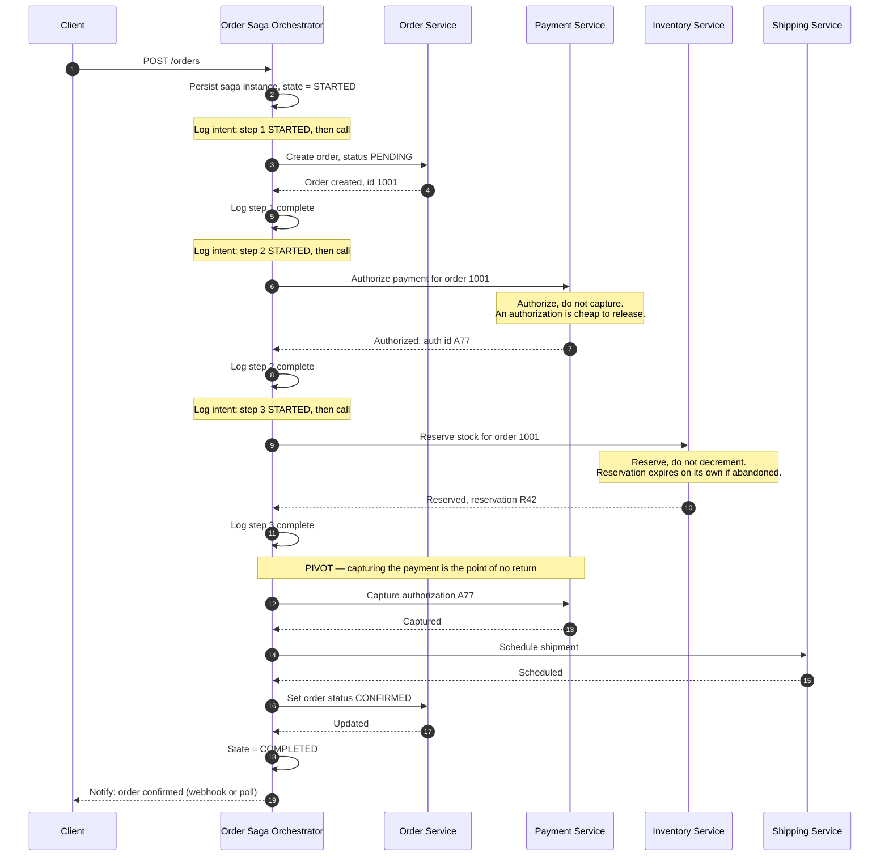
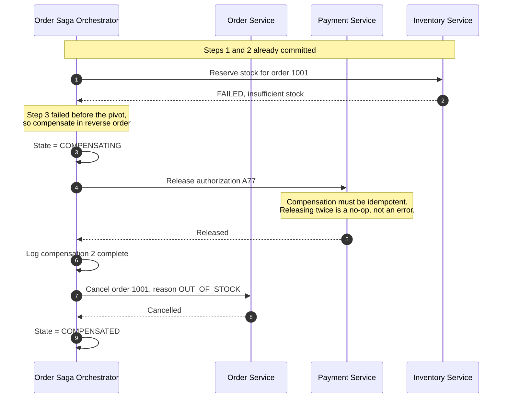
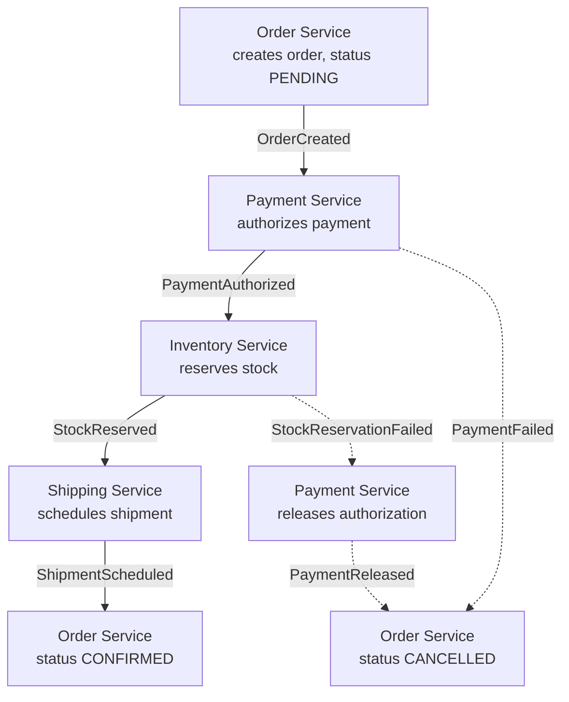

# The Saga Pattern

> How to keep data consistent across several services when no single database
> transaction can span them — by breaking the work into local transactions and
> defining, for each one, how to undo it.

_Also known as: compensating transaction pattern, long-lived transaction (LLT)._

---

## TL;DR

- A saga is a sequence of **local** transactions. Each step commits
  independently and publishes its outcome; if a later step fails, earlier steps
  are undone by running explicit **compensating transactions** in reverse.
- Compensation is **semantic**, not a rollback. You cannot un-commit a payment;
  you issue a refund. The refund is visible, and that difference drives most of
  the design.
- Two coordination styles: **choreography** (services react to each other's
  events, no central brain) and **orchestration** (one coordinator tells each
  service what to do). Orchestration wins as soon as the saga has more than
  about four steps.
- A saga gives you **A**tomicity, **C**onsistency, and **D**urability but **not
  Isolation**. Intermediate states are visible to everyone. Countermeasures for
  that are the hard part, not the happy path.
- Every saga has a **pivot**: the step after which you can no longer go back,
  only forward. Identify it deliberately.

---

## When to use it

- A business operation spans several services that each own their own database,
  and it must not be left half-done.
- The operation is long-running (minutes to days) and holding a distributed lock
  for its duration is unacceptable.
- You can define a meaningful compensation for each step — a refund, a release,
  a cancellation notice.

## When _not_ to use it

- **The data is in one database.** Use a local ACID transaction. A saga across
  tables in the same Postgres instance is pure loss.
- **You need real isolation.** If a partially-applied saga being visible causes
  incorrect behaviour that no countermeasure can absorb, sagas are the wrong
  tool — reconsider the service boundaries instead.
- **A step genuinely cannot be compensated** and cannot be reordered after the
  pivot. "Send an irrevocable wire transfer" and "email the customer" cannot be
  undone; they must sit at or after the pivot, or the saga is unsound.
- **The services were split for organisational reasons and are always deployed
  together.** Merging them is usually cheaper than operating a saga.

**On two-phase commit.** 2PC gives you real atomicity and isolation, but it
holds locks across services for the duration and blocks if the coordinator dies
mid-commit. It also requires every participant to support XA — which most
message brokers and virtually all HTTP APIs do not. Sagas trade isolation away
in exchange for availability and independence. That trade is usually right for
microservices and usually wrong inside a single database.

---

## Actors and terminology

| Actor            | Term                                          | What it is                                                                                    |
| ---------------- | --------------------------------------------- | --------------------------------------------------------------------------------------------- |
| Saga coordinator | _Orchestrator_ / _Saga Execution Coordinator_ | Holds saga state and decides the next step. Exists only in orchestration.                     |
| Service          | _Participant_                                 | Owns one local transaction and its compensation.                                              |
| Saga log         | _Saga log_ / state store                      | Durable record of which steps have completed. Without it, a coordinator crash loses the saga. |

**Key terms**

- **Local transaction (`Tᵢ`)** — one ACID transaction inside one service.
- **Compensating transaction (`Cᵢ`)** — the semantic undo for `Tᵢ`. Must be
  idempotent and must eventually succeed.
- **Compensatable transaction** — a step before the pivot; can still be undone.
- **Pivot transaction** — the point of no return. Once it commits, the saga can
  only roll _forward_.
- **Retriable transaction** — a step after the pivot, guaranteed to succeed
  eventually if retried.
- **Countermeasure** — a technique for coping with the missing isolation.

---

## Sequence diagram — orchestration, happy path



## Orchestration — compensation path



## Choreography — the same saga, no coordinator



Solid arrows are the forward path, dashed arrows the compensation path. Notice
that no component knows the whole flow — which is exactly the appeal and
exactly the problem.

---

## Step-by-step

Numbers match the **orchestration happy path** diagram.

1. **Client submits the request.** The orchestrator accepts it and returns
   quickly; the saga runs asynchronously. Do not hold the HTTP request open for
   the whole saga.

2. **Orchestrator persists the saga instance before doing anything else.**

   ```text
   saga_id        sg_7f3a…
   saga_type      CreateOrder
   state          STARTED
   current_step   0
   payload        { customer_id, items, total }
   compensations  []                      # filled in as steps succeed
   created_at     …
   ```

   This write must be durable _before_ the first participant is called. If the
   orchestrator crashes after calling a service but before recording it, the
   step's effect exists with nothing tracking it — an orphan. The same rule
   applies to every step: the diagram's notes show the orchestrator logging
   _intent_ before each call and completion after it.

3. **Step 1: create the order** in a `PENDING` state. The order exists, but its
   non-final status tells every reader that this saga is still in flight. That
   is the **semantic lock** countermeasure, and it is the cheapest one
   available.

4. **Order service confirms.**

5. **Orchestrator logs step 1 and records its compensation** (`cancel order
1001`) in the saga log. Record the compensation _with its arguments_ at this
   point — during recovery you may not be able to reconstruct them.

6. **Step 2: authorize the payment.** Note _authorize_, not _capture_. An
   authorization places a hold that can be released cleanly and is invisible on
   most statements. Choosing operations that are cheap to undo is the single
   most effective saga design technique.

7. **Payment service returns an authorization ID.**

8. **Orchestrator logs step 2.**

9. **Step 3: reserve stock.** Again a reservation, not a decrement — and give
   it a TTL, so an abandoned saga self-heals even if compensation never runs.

10. **Inventory service confirms the reservation.**

11. **Orchestrator logs step 3.**

12. **Pivot: capture the payment.** Everything before this was reversible;
    nothing after it is. From here the orchestrator must **roll forward** —
    retrying failed steps indefinitely rather than compensating. Steps after
    the pivot must therefore be ones you can guarantee will eventually succeed.

13. **Payment captured.**

14. **Schedule the shipment.** A retriable step: if the shipping service is
    down, retry with backoff. Do not compensate.

15. **Shipment scheduled.**

16. **Mark the order `CONFIRMED`,** releasing the semantic lock.

17. **Order service confirms.**

18. **Saga marked `COMPLETED`.**

19. **Client is notified** — by webhook, push, or polling the order status.

---

## Failure modes

| Failure                                                    | What happens                   | Correct handling                                                                                                                                                                                 |
| ---------------------------------------------------------- | ------------------------------ | ------------------------------------------------------------------------------------------------------------------------------------------------------------------------------------------------ |
| Step fails **before** the pivot                            | Business failure               | Compensate completed steps in reverse order.                                                                                                                                                     |
| Step fails **after** the pivot                             | Cannot go back                 | Roll forward: retry with backoff, escalate to a human if it exhausts. Never compensate past the pivot.                                                                                           |
| Orchestrator crashes mid-saga                              | Saga is stuck                  | On restart, scan for sagas not in a terminal state and resume from `current_step`. This only works if the log was written before each call.                                                      |
| A **compensation** fails                                   | Saga cannot complete or unwind | Retry indefinitely with backoff. If it still fails, park in a dead-letter state and alert. This is the one case that requires a human, so make it loud.                                          |
| Participant times out — did it commit?                     | Unknown state                  | Make participant operations idempotent and retry. Idempotency turns "unknown" into "safe to ask again". See [Idempotency Keys](idempotency-keys.md).                                             |
| Compensation arrives before the transaction it compensates | Out-of-order delivery          | Participants must handle compensation for work they have not seen — record the compensation and apply it when the forward message arrives, or make compensation for unknown IDs a durable no-op. |
| A user reads a partially-applied saga                      | Sees an inconsistent view      | Expected. This is the missing isolation; use a countermeasure below.                                                                                                                             |
| Duplicate saga started for one request                     | Double order                   | Deduplicate at the entry point with an idempotency key.                                                                                                                                          |

### The missing isolation, and what to do about it

Because each local transaction commits immediately, other transactions see
intermediate states. Garcia-Molina and Salem named this in 1987 and it has not
gone away. The standard countermeasures:

| Countermeasure          | How it works                                                                               | Cost                                  |
| ----------------------- | ------------------------------------------------------------------------------------------ | ------------------------------------- |
| **Semantic lock**       | Mark the record with an in-flight status (`PENDING`, `RESERVED`) that readers must respect | Every reader must understand the flag |
| **Commutative updates** | Design operations so order does not matter — `credit`/`debit` rather than `setBalance`     | Not always expressible                |
| **Pessimistic view**    | Reorder steps so the risky one happens last, shrinking the exposure window                 | Constrains the business flow          |
| **Re-read value**       | Re-read and compare before writing; abort on change (optimistic concurrency)               | Adds a retry loop                     |
| **Version file**        | Record operations and apply them in the correct order regardless of arrival                | Complex                               |
| **By value**            | Route low-risk requests through a saga and high-risk ones through 2PC                      | Two mechanisms to maintain            |

Semantic lock plus commutative updates covers the large majority of real cases.

---

## Common pitfalls

### Choosing choreography for a complex saga

❌ **What people do:** wire seven services together with events because it feels
decoupled and needs no new component.

✅ **Do instead:** use choreography for 2–4 steps. Beyond that, introduce an
orchestrator.

_Why it bites you:_ in choreography the flow exists only as an emergent property
of the wiring. No artifact anywhere describes the business process, so
answering "why is order 1001 stuck?" means reading seven codebases and
correlating logs. Cyclic event dependencies appear, and adding a step means
changing several services at once. The decoupling turns out to be an illusion —
the services are tightly coupled through the event choreography, just
invisibly.

### Compensations that are not idempotent

❌ **What people do:** write `refund(order)` as "create a refund for the order
total".

✅ **Do instead:** key compensations by the ID of the thing being compensated —
`refund(payment_id, amount)` — and make a repeat a no-op returning the original
result.

_Why it bites you:_ compensations are retried, by definition, because they run
in failure conditions. A non-idempotent refund issued twice is real money out
the door, and it will happen the first time the network hiccups.

### No pivot identified

❌ **What people do:** assume every step can be compensated, and discover
otherwise in production.

✅ **Do instead:** mark every step explicitly as compensatable, pivot, or
retriable. Order them so all compensatable steps precede the pivot and all
retriable ones follow it.

_Why it bites you:_ if the confirmation email goes out at step 2 and step 4
fails, you have told the customer their order shipped and then silently
cancelled it. You cannot compensate an email.

### Writing the saga log after the call

❌ **What people do:** call the participant, then record the step.

✅ **Do instead:** record intent _before_ calling, and completion after. A crash
in between leaves a step in an `UNKNOWN` state, which recovery resolves by
querying the participant idempotently.

_Why it bites you:_ crash between the call and the log write and the effect is
real but invisible to recovery. You have leaked a payment authorization that
nothing will ever release.

### Treating a compensation failure as ordinary

❌ **What people do:** log the error, mark the saga failed, move on.

✅ **Do instead:** retry with backoff, and if it exhausts, park the saga in a
`COMPENSATION_FAILED` state with a page to a human.

_Why it bites you:_ this is the state where money and inventory are genuinely
stuck. It is the one saga outcome that cannot be resolved automatically, and it
must never be silently swallowed. Alert on the count of sagas in this state.

### No timeout on a step

❌ **What people do:** wait indefinitely for a participant to respond.

✅ **Do instead:** give each step a deadline. On expiry, first resolve the
in-flight step with an idempotent query — confirm whether it committed, or
cancel it. Then, **before the pivot**, treat the timeout as failure and
compensate; **after the pivot**, keep retrying forward, because compensation is
no longer an option.

_Why it bites you:_ a saga with no timeout that meets an unresponsive service
holds its semantic locks forever. Inventory stays reserved, the order stays
pending, and support tickets pile up.

### Using a saga where a transaction would do

❌ **What people do:** split a single database's work into a saga because the
architecture is "microservices".

✅ **Do instead:** if the data is in one database, use `BEGIN`/`COMMIT`.

_Why it bites you:_ you take on compensation logic, a saga log, recovery, and
lost isolation, in exchange for nothing. Sagas are a cost you pay when a
transaction is impossible — not a design goal.

---

## Implementation checklist

- [ ] Every step is classified: compensatable, pivot, or retriable — and ordered accordingly.
- [ ] Every compensatable step has a written compensation, and it is idempotent.
- [ ] Participant operations are idempotent and keyed by saga ID + step.
- [ ] Saga state is persisted durably; intent is recorded **before** each call.
- [ ] A recovery process resumes non-terminal sagas on orchestrator restart.
- [ ] Every step has a timeout; on expiry, query the participant, then compensate before the pivot or retry forward after it.
- [ ] Forward steps prefer reversible operations: authorize over capture, reserve over decrement.
- [ ] Reservations carry a TTL so abandoned sagas self-heal.
- [ ] Semantic-lock statuses (`PENDING`, `RESERVED`) exist and every reader honours them.
- [ ] `COMPENSATION_FAILED` is a distinct terminal state with an alert attached.
- [ ] The saga entry point deduplicates on an idempotency key.
- [ ] Saga ID propagates as a correlation ID through every log line and trace span.
- [ ] Dashboards show sagas by state and age, so stuck sagas are visible without being asked about.

---

## Specs and references

There is no standards body here; sagas come from a research paper and a body of
practice.

**Foundational**

- [Sagas — Hector Garcia-Molina and Kenneth Salem, 1987](https://www.cs.cornell.edu/andru/cs711/2002fa/reading/sagas.pdf) — the original paper. Short and readable. Defines the saga, compensation, and the loss of isolation.
- [Life beyond Distributed Transactions: an Apostate's Opinion — Pat Helland, CIDR 2007](https://www.cidrdb.org/cidr2007/papers/cidr07p15.pdf) ([2016 ACM Queue reprint](https://queue.acm.org/detail.cfm?id=3025012)) — why distributed transactions do not scale, and what to do instead. The intellectual foundation for most of this pattern's modern use.

**Practice**

- [microservices.io — Saga pattern](https://microservices.io/patterns/data/saga.html) — Chris Richardson's reference treatment, including the countermeasure taxonomy used above.
- [microservices.io — Transactional Outbox](https://microservices.io/patterns/data/transactional-outbox.html) — how saga participants publish their events reliably.
- [AWS Prescriptive Guidance — Saga orchestration pattern](https://docs.aws.amazon.com/prescriptive-guidance/latest/cloud-design-patterns/saga-orchestration.html) — a concrete Step Functions managed-orchestrator implementation, useful as a worked example.
- [Temporal](https://docs.temporal.io/workflows) and [Camunda](https://docs.camunda.io/) — durable execution engines that give you the saga log, recovery, and timeouts rather than requiring you to build them.

---

## Related flows

- [Transactional Outbox & CDC](transactional-outbox-and-cdc.md) — how a participant commits its local transaction and publishes its event atomically. A saga built on dual writes is unsound.
- [Idempotency Keys](idempotency-keys.md) — what makes participant calls and compensations safe to retry, which the whole pattern depends on.
- [Message Queue Delivery Semantics](../data-and-delivery/message-queue-delivery-semantics.md) — the delivery guarantees underneath a choreographed saga, and why at-least-once forces idempotency on you.
- [Circuit Breaker, Timeout & Retry](circuit-breaker-retry-and-backoff.md) — how a step should behave before it gives up and triggers compensation.
- [Raft Leader Election & Log Replication](raft-leader-election-and-log-replication.md) — the other approach to coordination: real agreement, where a saga settles for reconciling afterwards.
