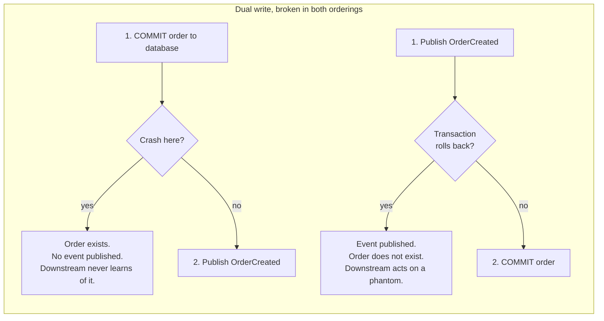
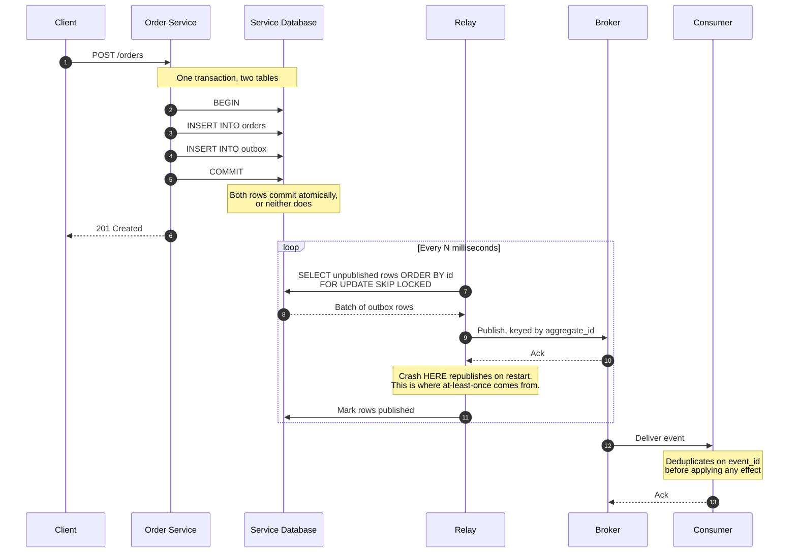
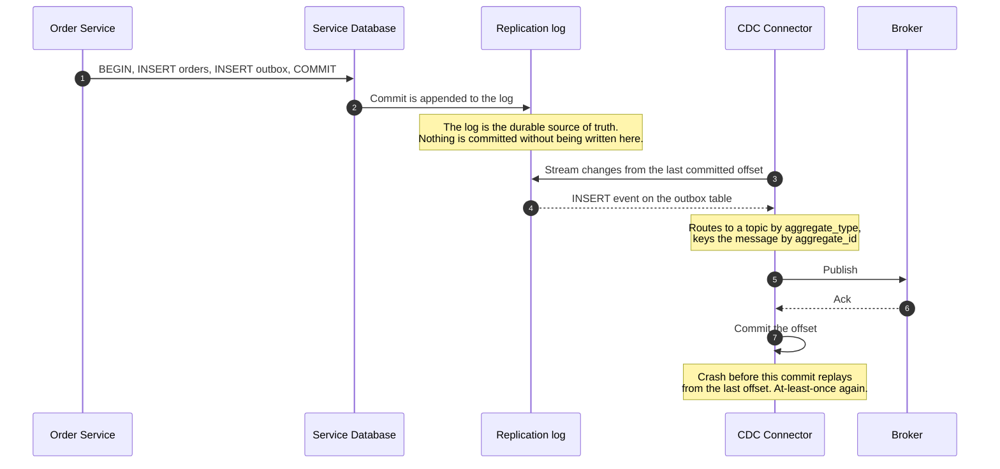

# Transactional Outbox & Change Data Capture

> How a service updates its database _and_ publishes an event about it without
> the two ever disagreeing — by refusing to do two writes in the first place.

_Also known as: the outbox pattern, application outbox, listen-to-yourself._

---

## TL;DR

- The **dual-write problem**: writing to your database and then publishing to a
  broker is two operations with no shared transaction. Crash in between and you
  have a committed order that no one was told about — or an event for an order
  that does not exist.
- The fix is to make it **one** write. Insert the event into an `outbox` table
  in the _same local transaction_ as the business data. Both commit or neither
  does.
- A separate **relay** then reads the outbox and publishes to the broker. Two
  ways to build it: **polling** the table, or **CDC** tailing the database's
  replication log.
- The relay gives you **at-least-once** delivery, not exactly-once. It can crash
  after publishing and before marking the row sent. Consumers must be
  idempotent. There is no arrangement of this pattern that avoids that.
- Order is preserved per key, not globally — as long as you partition by the
  aggregate ID.

---

## When to use it

- A service must update its own state and reliably tell other services about it.
- You are building saga participants — a saga on top of dual writes is unsound.
- You need an audit trail of state changes that provably matches the state.

## When _not_ to use it

- **Fire-and-forget notifications where loss is acceptable** — a metrics ping, a
  cache warm. The outbox is real machinery; do not pay for it to deliver
  something you would not notice losing.
- **When the consumer can just query you.** If a downstream service needs your
  data occasionally, an API call may be simpler than an event pipeline.
- **When your database and broker are the same system.** Some stacks let you
  transactionally write to both; use that if you have it.
- **When you need the event published before the transaction commits.** You
  don't, but people ask. Publishing uncommitted state is how you end up
  broadcasting orders that get rolled back.

---

## The problem: dual writes

Every failure below is a real, routine occurrence — not an exotic edge case.



There is no ordering that fixes this, and no retry policy either — a retry
cannot help a process that is no longer running. The only fix is to stop doing
two writes.

---

## Actors and terminology

| Actor          | Term                                                | What it is                                                  |
| -------------- | --------------------------------------------------- | ----------------------------------------------------------- |
| Service        | _Producer_                                          | Writes business data and the outbox row in one transaction. |
| `outbox` table | _Outbox_                                            | Durable queue living inside the service's own database.     |
| Relay          | _Message Relay_ / _Outbox Poller_ / _CDC connector_ | Moves rows from the outbox to the broker.                   |
| Broker         | —                                                   | Kafka, RabbitMQ, SNS/SQS, Pub/Sub.                          |
| Consumer       | _Subscriber_                                        | Must be idempotent, because delivery is at-least-once.      |

**Key terms**

- **Dual write** — updating two systems without a shared transaction. The bug
  this pattern exists to remove.
- **Relay** — the component that publishes outbox rows. The only place _this
  pattern_ introduces duplicates; the broker's own redelivery can add more
  downstream.
- **CDC (Change Data Capture)** — reading the database's own replication stream
  (Postgres WAL, MySQL binlog, Mongo change stream) rather than polling.
- **LSN / binlog offset** — the position in the replication log the connector
  has processed. Committing this offset is what makes CDC resumable.
- **Aggregate ID** — the entity the event is about. Use it as the partition key
  to preserve per-entity ordering.

---

## Sequence diagram — polling relay



## CDC relay — the same guarantee without a poller



CDC removes the polling load and the write-back to the outbox table, at the cost
of operating a connector and granting replication access to the database.

---

## Step-by-step

Numbers match the **polling relay** diagram.

1. **Client makes a request** that changes state.

2. **Service opens a transaction.**

3. **Insert the business row.**

4. **Insert the outbox row — in the same transaction.** This is the whole
   pattern.

   ```sql
   CREATE TABLE outbox (
     id              BIGSERIAL PRIMARY KEY,   -- publication order
     event_id        UUID        NOT NULL UNIQUE,  -- consumer dedup key
     aggregate_type  TEXT        NOT NULL,    -- 'order'  -> topic routing
     aggregate_id    TEXT        NOT NULL,    -- '1001'   -> partition key
     event_type      TEXT        NOT NULL,    -- 'OrderCreated'
     payload         JSONB       NOT NULL,
     headers         JSONB,                   -- trace context, schema version
     created_at      TIMESTAMPTZ NOT NULL DEFAULT now(),
     published_at    TIMESTAMPTZ              -- NULL until published
   );

   CREATE INDEX outbox_unpublished
     ON outbox (id) WHERE published_at IS NULL;
   ```

   The partial index matters: without it, the relay's "find unpublished rows"
   query degrades into a full scan as the table grows.

5. **Commit.** Atomicity is now the database's problem, which is where it
   belongs. There is no window in which one row exists without the other.

6. **Respond to the client.** The event has not been published yet. That is
   fine — it is _guaranteed_ to be published, which is a stronger property than
   "published now".

7. **Relay polls for unpublished rows.**

   ```sql
   SELECT * FROM outbox
    WHERE published_at IS NULL
    ORDER BY id
    LIMIT 100
      FOR UPDATE SKIP LOCKED;
   ```

   `ORDER BY id` preserves insertion order within a batch. Run **one active
   relay** at a time — via leader election or a database advisory lock such as
   `pg_try_advisory_lock` — or partition the relays by a hash of
   `aggregate_id` so each entity is only ever published by one of them.
   `FOR UPDATE SKIP LOCKED` lets several relays grab disjoint batches, but
   those batches are then published in parallel, which breaks the
   per-`aggregate_id` ordering this pattern promises. It also only excludes rows
   while the locking transaction stays open across publish and mark-sent,
   which means holding row locks over a network call. Use it for concurrency
   only when ordering does not matter.

8. **Database returns the batch.**

9. **Relay publishes,** using `aggregate_id` as the message key so all events
   for one entity land in the same partition and stay ordered. Propagate the
   trace context from `headers` so the consumer's spans join the producer's
   trace.

10. **Broker acknowledges.**

11. **Relay marks the rows published.** _If the relay crashes between steps 10
    and 11, those messages are published again on restart._ This window cannot
    be closed — closing it would require a distributed transaction between the
    broker and the database, which is the thing we are avoiding. **At-least-once
    is a property of this pattern, not a bug in your implementation.**

12. **Broker delivers to the consumer.**

    _Receiver validates:_ the consumer deduplicates on `event_id` _before_
    applying any effect — it must assume it will see this message more than
    once. See [Idempotency Keys](idempotency-keys.md) for the mechanics.

13. **Consumer acknowledges.**

---

## Polling vs CDC

|                           | Polling relay                               | CDC relay                                                       |
| ------------------------- | ------------------------------------------- | --------------------------------------------------------------- |
| **Latency**               | Poll interval (10ms–1s typical)             | Milliseconds                                                    |
| **Database load**         | Constant queries, plus a write-back per row | Read from the replication stream; no extra write                |
| **Operational cost**      | Just your code                              | A connector to deploy, monitor, and upgrade                     |
| **Setup**                 | A table and a loop                          | Replication slot, connector config, schema registry             |
| **Ordering**              | By `id` within a batch                      | Exact commit order from the log                                 |
| **Failure mode to watch** | Table bloat if the sweeper stops            | An inactive replication slot pins WAL and **fills the disk**    |
| **Good fit**              | Most services; start here                   | High throughput, or many services standardising on one pipeline |

Start with polling. Move to CDC when latency or database load makes it worth
the operational surface — not before.

**The CDC failure mode deserves emphasis:** a Postgres replication slot that
stops being consumed prevents the server from recycling WAL segments. The disk
fills, and the _primary database_ goes down. Alert on
`pg_replication_slots.active` and on replication lag from day one.

---

## Failure modes

| Failure                                          | What happens                            | Correct handling                                                                                                                    |
| ------------------------------------------------ | --------------------------------------- | ----------------------------------------------------------------------------------------------------------------------------------- |
| Crash after `COMMIT`, before publish             | Event sits unpublished in the outbox    | The relay picks it up on its next pass. Nothing is lost — this is the property the pattern buys.                                    |
| Relay crashes after publish, before marking sent | Duplicate publication                   | Expected. Consumers deduplicate on `event_id`.                                                                                      |
| Broker unreachable                               | Outbox grows                            | Retry with backoff. Alert on **outbox age** (oldest unpublished row), not row count — age is what tells you the relay is stuck.     |
| Two relay instances run at once                  | Duplicates, possible reordering         | Leader election or an advisory lock, or partition relays by `aggregate_id` hash. `SKIP LOCKED` alone still reorders across batches. |
| Outbox table grows unboundedly                   | Query and storage degradation           | Delete or partition-drop published rows on a schedule. Keep the retention window longer than your longest realistic broker outage.  |
| Poison message the broker always rejects         | Relay stalls at the head of the queue   | Cap retries per row, then move it to a dead-letter state and continue. One bad row must not block the stream.                       |
| Consumer processes out of order                  | Inconsistent downstream state           | Partition by `aggregate_id`; include a version or sequence number so consumers can detect and drop stale events.                    |
| CDC slot inactive                                | **WAL accumulates; primary disk fills** | Monitor slot activity and lag. Have a documented procedure for dropping a dead slot.                                                |
| Schema change to `payload`                       | Consumers break                         | Version the event schema and roll out consumer support before producing the new version.                                            |

---

## Common pitfalls

### Publishing inside the transaction

❌ **What people do:** call `broker.publish()` between `BEGIN` and `COMMIT`,
believing the transaction covers it.

✅ **Do instead:** insert a row. Only the database's own writes are transactional.

_Why it bites you:_ the broker call is not part of the transaction. If the
transaction later rolls back, the event is already gone and downstream services
act on state that never existed — the phantom-order case above. It also holds
the transaction open for the duration of a network call, which is its own
problem under load.

### Publishing in an after-commit hook

❌ **What people do:** use an ORM's `after_commit` callback to publish, reasoning
that the data is now safely committed.

✅ **Do instead:** the outbox.

_Why it bites you:_ this is a dual write wearing a nicer hat. The commit
succeeds, the process is killed before the callback runs, and the event is lost
with no record it was ever meant to exist. It fails _less often_ than
publishing before commit, which makes it worse — it survives testing and fails
in production.

### Alerting on outbox depth instead of age

❌ **What people do:** page when unpublished rows exceed 10,000.

✅ **Do instead:** page on the age of the oldest unpublished row.

_Why it bites you:_ depth is meaningless without throughput — 10,000 rows is
either two seconds or two hours of backlog. Age directly measures the thing you
care about, and it catches a relay that has been wedged on a low-traffic
service for a day.

### Never cleaning up

❌ **What people do:** leave published rows in the outbox forever, since disk is
cheap.

✅ **Do instead:** delete or drop partitions on a schedule, keeping a window
longer than your worst plausible outage.

_Why it bites you:_ the relay's query slows as the table grows, autovacuum falls
behind on the churn, and the pattern's latency degrades gradually until someone
investigates. Time-based partitioning avoids the delete churn entirely — in
Postgres, `ALTER TABLE outbox DETACH PARTITION …` then `DROP TABLE` on the
detached partition.

### Putting an entity snapshot in the payload

❌ **What people do:** serialise the full current ORM entity into `payload`.

✅ **Do instead:** write an explicit event schema containing exactly the fields
consumers need, versioned.

_Why it bites you:_ your internal model becomes your public contract. Renaming a
column silently breaks every consumer, and you cannot refactor your own schema
without a cross-team migration.

### Assuming the outbox gives exactly-once

❌ **What people do:** skip consumer-side deduplication because the outbox
"guarantees" delivery.

✅ **Do instead:** treat every consumer as receiving duplicates, always.

_Why it bites you:_ the outbox guarantees _at-least-once_. The publish/mark-sent
window is unavoidable, and broker retries add more duplicates on top. Skipping
dedup means double-charging customers the first time a relay pod is
rescheduled.

---

## Implementation checklist

- [ ] Business write and outbox insert are in **one** local transaction — verified by a test that kills the process between them.
- [ ] Outbox row carries `event_id` (unique), `aggregate_type`, `aggregate_id`, `event_type`, versioned `payload`, and `headers` with trace context.
- [ ] A partial index covers unpublished rows.
- [ ] Exactly one relay is active (leader election or advisory lock), or relays are partitioned by `aggregate_id` hash — not several `SKIP LOCKED` pollers if ordering matters.
- [ ] Messages are keyed by `aggregate_id` to preserve per-entity ordering.
- [ ] Every consumer deduplicates on `event_id` before applying effects.
- [ ] Alerting is on **oldest unpublished row age**, plus relay error rate.
- [ ] Per-row retry cap with a dead-letter state, so one poison row cannot stall the stream.
- [ ] Published rows are purged or partition-dropped on a schedule.
- [ ] Event schemas are versioned, and consumers tolerate unknown fields.
- [ ] _(CDC only)_ Replication slot activity and lag are alerted on, with a runbook for a dead slot.
- [ ] Trace context propagates end to end, so a producer span and consumer span join up.

---

## Specs and references

No formal standard; this is a well-established practice pattern.

**Practice**

- [microservices.io — Transactional Outbox](https://microservices.io/patterns/data/transactional-outbox.html) — the canonical statement of the pattern, with [Polling Publisher](https://microservices.io/patterns/data/polling-publisher.html) and [Transaction Log Tailing](https://microservices.io/patterns/data/transaction-log-tailing.html) as the two relay variants.
- [Debezium — Outbox Event Router](https://debezium.io/documentation/reference/stable/transformations/outbox-event-router.html) — the reference CDC implementation, including the expected outbox table shape. Its defaults expect columns `id` (the event ID), `aggregatetype`, `aggregateid`, and `payload`; the schema on this page needs remapping via `table.field.event.id=event_id`, `table.field.event.key=aggregate_id`, and `route.by.field=aggregate_type`. Worth reading even if you build your own.
- [Reliable Microservices Data Exchange With the Outbox Pattern](https://debezium.io/blog/2019/02/19/reliable-microservices-data-exchange-with-the-outbox-pattern/) — the clearest end-to-end walkthrough of the CDC variant.
- [Life Beyond Distributed Transactions — Pat Helland](https://queue.acm.org/detail.cfm?id=3025012) — why this problem exists at all, and why "just use a distributed transaction" is not the answer.

**Database mechanics**

- [PostgreSQL — Logical Decoding](https://www.postgresql.org/docs/current/logicaldecoding.html) — how WAL-based CDC works, and the replication-slot lifecycle that will eventually page you.
- [PostgreSQL — Advisory Locks](https://www.postgresql.org/docs/current/explicit-locking.html#ADVISORY-LOCKS) and [`SELECT … FOR UPDATE SKIP LOCKED`](https://www.postgresql.org/docs/current/sql-select.html#SQL-FOR-UPDATE-SHARE) — the single-active-relay lock, and the row-lock semantics behind the polling query.
- [PostgreSQL — Table Partitioning](https://www.postgresql.org/docs/current/ddl-partitioning.html) — `DETACH PARTITION` and dropping old partitions for outbox retention.
- [MySQL — The Binary Log](https://dev.mysql.com/doc/refman/8.4/en/binary-log.html) — the MySQL equivalent.

---

## Related flows

- [The Saga Pattern](saga-pattern.md) — the outbox is how saga participants publish reliably; a saga on dual writes is unsound.
- [Idempotency Keys](idempotency-keys.md) — the consumer-side deduplication this pattern requires.
- [Message Queue Delivery Semantics](../data-and-delivery/message-queue-delivery-semantics.md) — what happens to the message after the relay hands it to the broker.
