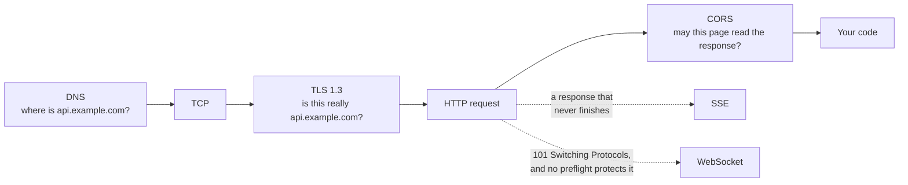

# Networking & Protocols

Flows for what actually happens on the wire, and what the browser does on your
behalf before your code ever runs.

| Flow                                                                            | What it answers                                                                                                  | Difficulty   |
| ------------------------------------------------------------------------------- | ---------------------------------------------------------------------------------------------------------------- | ------------ |
| [The TLS 1.3 Handshake](tls-1-3-handshake.md)                                   | How do two strangers agree on an encryption key across a hostile network, in one round trip?                     | Advanced     |
| [CORS Preflight](cors-preflight.md)                                             | Why is there an `OPTIONS` request before my API call, and why does the error only appear in the browser?         | Beginner     |
| [DNS Resolution](dns-resolution.md)                                             | How does a name become an IP address, and why is my change still not visible?                                    | Beginner     |
| [Server-Sent Events & HTTP Streaming](server-sent-events-and-http-streaming.md) | How does a server push a stream of messages down one response, and why does it arrive all at once in production? | Intermediate |
| [WebSocket Upgrade & Frames](websocket-upgrade-and-frames.md)                   | How does an HTTP request become a two-way connection, and what keeps it alive through a proxy?                   | Intermediate |

## How these fit together

They are the stages of a single request, in order — and each produces errors
that appear to come from somewhere else. **DNS** finds the server, **TLS**
proves it is the right one, **CORS** decides whether page JavaScript may read
the reply, **SSE** is what happens when the reply never ends, and **WebSocket**
is what happens when the request stops being HTTP altogether.

Between the last two: **SSE is the default.** Reach for WebSocket when the
client genuinely needs to send as often as it receives — and then remember that
the `Origin` check CORS would have done for you is now your job.

## Wanted

Good first contributions in this category — see [CONTRIBUTING.md](../../CONTRIBUTING.md):

- HTTP/2 multiplexing and HPACK
- HTTP/3 and QUIC (and how it removes the round trip above)
- gRPC over HTTP/2, including streaming
- TCP congestion control and slow start
- Content negotiation and conditional requests (ETag, `If-None-Match`)
