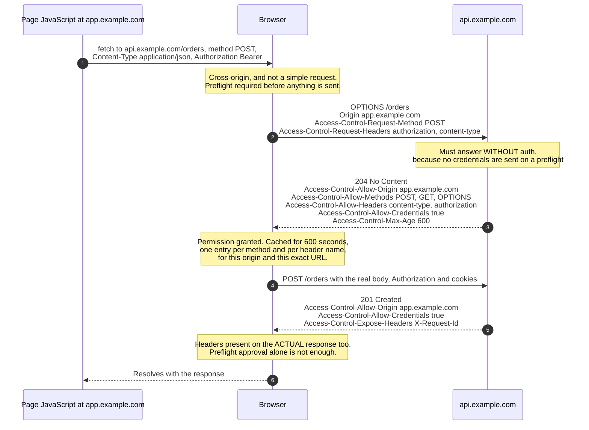
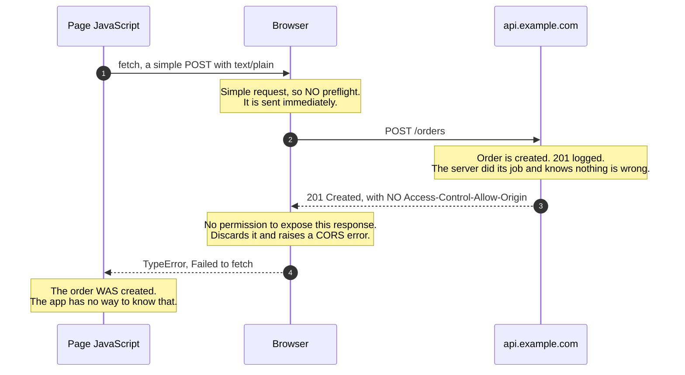

# CORS Preflight

> Why the browser sends a mysterious `OPTIONS` request before your API call —
> and why the resulting error appears in the browser console while your server
> logs a perfectly successful `200`.

_Also known as: the CORS `OPTIONS` request, the preflight check._

---

## TL;DR

- The **same-origin policy** stops JavaScript on one origin from reading
  responses from another. CORS is the mechanism by which a server _opts in_ to
  being read.
- CORS is enforced **entirely by the browser**, and it protects the _user_, not
  your server. `curl`, Postman, and your backend are unaffected — which is why
  the request that "fails" in the browser succeeds in your logs.
- **Simple requests** go straight out; the browser blocks _reading the response_
  if the headers are wrong. The request already reached your server and already
  had its effect.
- **Preflighted requests** — anything with a non-simple method, header, or
  content type — trigger an `OPTIONS` probe _first_. Only if that passes is the
  real request sent.
- `Access-Control-Allow-Origin: *` and `credentials: "include"` are **mutually
  exclusive**. With credentials you must echo one specific origin and send
  `Access-Control-Allow-Credentials: true`.

---

## When it applies

- Any `fetch()` or `XMLHttpRequest` from browser JavaScript to a different
  origin. "Different" means any difference in **scheme, host, or port** —
  `https://example.com` and `https://api.example.com` are different origins, and
  so are `http://` and `https://` on the same host.

## When it does not apply

- **Server-to-server calls.** No browser, no CORS. This is why the same request
  works from `curl`.
- **Same-origin requests**, including same-origin requests through a reverse
  proxy path such as `/api/*` — the most reliable way to avoid CORS entirely.
- **``, `<script>`, `<link>`, and form submissions.** These are legacy
  cross-origin embeds that predate CORS. They still _send_ the request; you just
  cannot read the result. This is why CSRF exists as a separate problem that
  CORS does not solve.

---

## Actors and terminology

| Actor           | Spec term    | What it is                                                                         |
| --------------- | ------------ | ---------------------------------------------------------------------------------- |
| Page JavaScript | _Client_     | Calls `fetch()`. Never sees the raw response unless CORS permits it.               |
| Browser         | _User agent_ | The enforcement point. Adds `Origin`, performs the preflight, blocks the response. |
| API             | _Server_     | Declares its policy with `Access-Control-*` response headers.                      |

**Key terms**

- **Origin** — the _(scheme, host, port)_ triple. Sent by the browser in the
  `Origin` header; it cannot be forged by page JavaScript.
- **Simple request** — a request that does not trigger a preflight (definition
  below).
- **Preflight** — an `OPTIONS` request asking permission before the real one.
- **CORS-safelisted request header** — `Accept`, `Accept-Language`,
  `Content-Language`, `Content-Type` (restricted values only), `Range`.
- **CORS-safelisted response header** — the only headers JavaScript can read
  without `Access-Control-Expose-Headers`: `Cache-Control`, `Content-Language`,
  `Content-Length`, `Content-Type`, `Expires`, `Last-Modified`, `Pragma`.
- **Credentials** — cookies, HTTP authentication, and TLS client certificates.
  Not the `Authorization` header set manually — that is just a header (which
  does trigger a preflight).

---

## What triggers a preflight

A request is **simple** — and skips the preflight — only if _all_ of these hold:

- Method is `GET`, `HEAD`, or `POST`; **and**
- Only CORS-safelisted headers are set, apart from a few allowed extras; **and**
- If `Content-Type` is present, it is one of `application/x-www-form-urlencoded`,
  `multipart/form-data`, or `text/plain`; **and**
- No listener is registered on the upload stream of an `XMLHttpRequest`; and no
  `ReadableStream` is used as the body.

Anything else is preflighted. In practice, that means **almost every real API
call is preflighted**, because `Content-Type: application/json` alone is enough
to trigger it — as is an `Authorization` header, or a custom `X-Request-Id`.

---

## Sequence diagram — preflighted request



## The failure that confuses everyone



This is the single most misunderstood thing about CORS: **the request was not
blocked**. It arrived, it executed, and it had its side effect. Only the
_response_ was withheld from JavaScript. Retrying "because it failed" creates a
second order.

---

## Step-by-step

Numbers match the **preflighted request** diagram.

1. **JavaScript calls `fetch()`.**

   ```js
   await fetch("https://api.example.com/orders", {
     method: "POST",
     headers: {
       "Content-Type": "application/json", // not a safelisted value
       Authorization: `Bearer ${token}`, // not a safelisted header
     },
     credentials: "include", // send cookies
     body: JSON.stringify({ sku: "A1", qty: 2 }),
   });
   ```

   Either of the first two headers alone would force a preflight.

2. **The browser sends the preflight.**

   ```http
   OPTIONS /orders HTTP/1.1
   Host: api.example.com
   Origin: https://app.example.com
   Access-Control-Request-Method: POST
   Access-Control-Request-Headers: authorization, content-type
   ```

   Note what is _absent_: no body, no cookies, no `Authorization` header. The
   preflight is deliberately unauthenticated, so **your auth middleware must not
   run on it**. Returning `401` to a preflight is the most common cause of a
   CORS failure that looks like an auth failure.

3. **Server responds to the preflight.**

   ```http
   HTTP/1.1 204 No Content
   Access-Control-Allow-Origin: https://app.example.com
   Access-Control-Allow-Methods: GET, POST, OPTIONS
   Access-Control-Allow-Headers: authorization, content-type
   Access-Control-Allow-Credentials: true
   Access-Control-Max-Age: 600
   Vary: Origin
   ```

   Every requested method and header must be covered, or the browser rejects
   the preflight and never sends the real request.

   _No message on the wire:_ the browser now caches this approval for
   `Access-Control-Max-Age` seconds. Each cache entry is keyed by network
   partition key, origin, **request URL**, and credentials mode, and holds a
   single method or a single header name
   ([Fetch §4.9](https://fetch.spec.whatwg.org/#cors-preflight-cache)). Because
   the URL is part of the key, approval for `/orders/1` does nothing for
   `/orders/2` — an API with IDs in the path preflights every distinct
   resource at least once, whatever `Max-Age` says. Without the cache you pay
   an extra round trip on _every_ call. Browsers also cap the value — Chrome
   at 7200s, Firefox at 86400s — so asking for more does not help.

4. **Browser sends the real request,** now including cookies and the
   `Authorization` header.

5. **Server responds — and must repeat the CORS headers.**

   ```http
   HTTP/1.1 201 Created
   Content-Type: application/json
   Access-Control-Allow-Origin: https://app.example.com
   Access-Control-Allow-Credentials: true
   Access-Control-Expose-Headers: X-Request-Id
   Vary: Origin
   ```

   Preflight approval does **not** carry over. Headers omitted here mean the
   response is blocked even though the preflight passed.

6. **Browser resolves the promise** and hands the response to JavaScript — which
   can read `X-Request-Id` only because it was explicitly exposed.

---

## Failure modes

| Symptom                                                           | Cause                                                                       | Fix                                                                                                                          |
| ----------------------------------------------------------------- | --------------------------------------------------------------------------- | ---------------------------------------------------------------------------------------------------------------------------- |
| `No 'Access-Control-Allow-Origin' header is present`              | Server sent no CORS headers, or the error path bypassed the CORS middleware | Ensure CORS headers are set on **error** responses too — 4xx and 5xx, not just 2xx                                           |
| `Response to preflight request doesn't pass access control check` | The `OPTIONS` handler returned 401/404/405                                  | Handle `OPTIONS` before auth and routing                                                                                     |
| `Method PATCH is not allowed by Access-Control-Allow-Methods`     | Method missing from the list                                                | Add it                                                                                                                       |
| `Request header field x-tenant-id is not allowed`                 | Custom header not in `Access-Control-Allow-Headers`                         | Add it. The browser will not infer it.                                                                                       |
| Works with `*`, fails with `credentials: "include"`               | Wildcard is illegal with credentials                                        | Echo the specific origin and add `Access-Control-Allow-Credentials: true`                                                    |
| `response.headers.get("X-Total-Count")` is `null`                 | Header not exposed                                                          | Add `Access-Control-Expose-Headers`                                                                                          |
| Works in `curl`, fails in the browser                             | You are seeing CORS, which does not exist outside browsers                  | Not a server bug. Fix the headers.                                                                                           |
| Intermittent failures behind a CDN                                | Cached response carries the wrong origin                                    | Add `Vary: Origin`                                                                                                           |
| Redirect during a preflight                                       | Preflights must not be redirected                                           | Do not redirect `OPTIONS`. Note the request URL for redirects too — a redirect from `http` to `https` changes the origin.    |
| The request succeeded but JS saw an error                         | Simple request, response blocked                                            | Expected. The side effect happened. Do not blind-retry — see [Idempotency Keys](../distributed-systems/idempotency-keys.md). |

---

## Common pitfalls

### Treating CORS as a security control for your API

❌ **What people do:** restrict `Access-Control-Allow-Origin` and consider the
API protected from unauthorised callers.

✅ **Do instead:** authenticate and authorise every request server-side. Treat
CORS purely as a browser-compatibility setting.

_Why it bites you:_ CORS is enforced by the _browser_, on behalf of the user.
Any non-browser client ignores it completely — a two-line `curl` reaches your
endpoint regardless of what your CORS policy says. It is not, and has never
been, an access control.

### Reflecting the `Origin` header unconditionally

❌ **What people do:**

```js
res.setHeader("Access-Control-Allow-Origin", req.headers.origin);
res.setHeader("Access-Control-Allow-Credentials", "true");
```

✅ **Do instead:** check `req.headers.origin` against an allow-list, and only
echo it if it matches.

_Why it bites you:_ this is `*` with credentials, which the spec forbids —
reintroduced by hand. **Any** website can now make authenticated cross-origin
requests with the user's cookies and read the responses. It is a full account
takeover primitive, and it is the most common serious CORS misconfiguration in
the wild.

### Matching origins with `startsWith` or a substring check

❌ **What people do:** `if (origin.includes("example.com"))`.

✅ **Do instead:** exact string comparison against a list of full origins.

_Why it bites you:_ `https://example.com.attacker.net` and
`https://notexample.com` both pass. Same outcome as reflecting: the attacker
picks a domain that satisfies your check.

### Forgetting `Vary: Origin`

❌ **What people do:** echo an allow-listed origin without `Vary: Origin`.

✅ **Do instead:** always send `Vary: Origin` when the CORS response headers
depend on the request's origin.

_Why it bites you:_ any shared cache — CDN, reverse proxy, even the browser's —
will serve the response cached for origin A to a request from origin B. The
symptom is CORS errors that appear and vanish depending on who loaded the page
first, which is close to impossible to reproduce.

### Running auth middleware on the preflight

❌ **What people do:** mount authentication globally, so `OPTIONS` gets a `401`.

✅ **Do instead:** handle `OPTIONS` before authentication, and return `204`.

_Why it bites you:_ preflights carry no credentials by design, so they will
always fail auth. The browser reports it as a CORS error, sending you off to
debug CORS configuration when the actual problem is middleware ordering.

### CORS headers only on the success path

❌ **What people do:** set headers in the controller, so a 500 from an exception
handler or a 404 from the router has none.

✅ **Do instead:** set CORS headers in outermost middleware, so every response
carries them.

_Why it bites you:_ the browser reports a CORS error instead of your actual
`500`, hiding the real failure. You debug CORS for an hour and find a null
pointer.

### Believing CORS prevents CSRF

❌ **What people do:** drop CSRF tokens because "CORS blocks cross-origin
requests".

✅ **Do instead:** keep CSRF defences — `SameSite` cookies plus tokens for
state-changing requests.

_Why it bites you:_ CORS restricts _reading responses_. A cross-origin form
`POST` or a simple request still executes with the user's cookies attached. The
attacker never needs to read the response for a transfer or a password change to
have happened.

---

## Security considerations

| Threat                                       | Mitigation                                                                                                                                                                                                                                              |
| -------------------------------------------- | ------------------------------------------------------------------------------------------------------------------------------------------------------------------------------------------------------------------------------------------------------- |
| Unauthorised cross-origin reads of user data | Exact-match origin allow-list; never reflect blindly                                                                                                                                                                                                    |
| Credential exposure to a malicious origin    | Wildcard forbidden with credentials; keep it that way                                                                                                                                                                                                   |
| Cache poisoning across origins               | `Vary: Origin` on every origin-dependent response                                                                                                                                                                                                       |
| CSRF                                         | `SameSite=Lax`/`Strict` cookies plus CSRF tokens — **CORS does not cover this**                                                                                                                                                                         |
| Internal APIs reachable from a public page   | Network segmentation and authentication. Chrome's Local Network Access (shipped in Chrome 142) gates public-to-local requests behind a user permission prompt; it replaced the earlier Private Network Access preflight proposal, which was put on hold |
| Header leakage                               | Expose only the response headers you intend to; the safelist is deliberately small                                                                                                                                                                      |

---

## Implementation checklist

- [ ] Allowed origins are an exact-match allow-list — no reflection, no `startsWith`, no `includes`.
- [ ] `Access-Control-Allow-Credentials: true` is only ever paired with a specific origin, never `*`.
- [ ] `Vary: Origin` is sent on every response whose CORS headers depend on the origin.
- [ ] `OPTIONS` is handled before authentication and routing, returning `204`.
- [ ] CORS headers are set in outermost middleware, so 4xx and 5xx responses carry them too.
- [ ] `Access-Control-Allow-Headers` lists every custom header the client sends, including `Authorization`.
- [ ] `Access-Control-Expose-Headers` lists every response header the client needs to read.
- [ ] `Access-Control-Max-Age` is set (600–7200) to avoid a preflight on every call — remembering the cache is per URL, so path-parameter APIs still preflight each new resource.
- [ ] `OPTIONS` is never redirected, and the API is reached over `https` directly with no scheme redirect.
- [ ] CSRF protection exists independently of CORS.
- [ ] Non-idempotent endpoints use idempotency keys, so a browser-side "failure" that actually succeeded can be safely retried.
- [ ] Consider avoiding CORS altogether by serving the API under the app's origin via a reverse-proxied path.

---

## Specs and references

**Normative**

- [WHATWG Fetch Standard — CORS protocol](https://fetch.spec.whatwg.org/#cors-protocol) — the actual specification. CORS is defined here, not in an RFC. See [§3.3.2 HTTP requests](https://fetch.spec.whatwg.org/#cors-preflight-request) for what a CORS-preflight request is, [§4.8 CORS-preflight fetch](https://fetch.spec.whatwg.org/#cors-preflight-fetch) for the exact algorithm, [§4.9 CORS-preflight cache](https://fetch.spec.whatwg.org/#cors-preflight-cache) for how approvals are cached, and [§2.2.2 Headers](https://fetch.spec.whatwg.org/#cors-safelisted-request-header) for the safelist.
- [HTML Standard — Origin](https://html.spec.whatwg.org/multipage/browsers.html#origin) — the definition of an origin and the same-origin policy that CORS relaxes.
- [RFC 9110 §9.3.7 — OPTIONS](https://www.rfc-editor.org/rfc/rfc9110#section-9.3.7) — the underlying HTTP method.
- [RFC 6454 — The Web Origin Concept](https://www.rfc-editor.org/rfc/rfc6454) — the original origin definition and its security rationale.

**Further reading**

- [MDN — Cross-Origin Resource Sharing](https://developer.mozilla.org/en-US/docs/Web/HTTP/Guides/CORS) — the best practical reference, including a complete list of what triggers a preflight.
- [PortSwigger — CORS misconfiguration](https://portswigger.net/web-security/cors) — the attack side: what origin reflection actually gives an attacker, with worked examples.
- [Chrome for Developers — Local Network Access](https://developer.chrome.com/blog/local-network-access) — the permission prompt that replaced the Private Network Access preflight for public-to-local requests.
- [MDN — SameSite cookies](https://developer.mozilla.org/en-US/docs/Web/HTTP/Reference/Headers/Set-Cookie/SameSite) — the mechanism that does address CSRF.

---

## Related flows

- [The TLS 1.3 Handshake](tls-1-3-handshake.md) — the secure channel underneath, established before any of this happens.
- [OAuth 2.0 Authorization Code Flow with PKCE](../auth/oauth2-authorization-code-pkce.md) — why an SPA's `Authorization` header forces a preflight on every API call.
- [Idempotency Keys](../distributed-systems/idempotency-keys.md) — how to retry safely when the browser reports a failure for a request that actually succeeded.
- [Server-Sent Events & HTTP Streaming](server-sent-events-and-http-streaming.md) — cross-origin streams need all of this too, and `EventSource` cannot set the headers that would trigger a preflight.
- [Session Cookies & Server-Side Sessions](../auth/session-cookies-and-server-side-sessions.md) — why `credentials: "include"` forbids a wildcard `Access-Control-Allow-Origin`, and what `SameSite` does to a cross-origin cookie.
- [WebSocket Upgrade & Frames](websocket-upgrade-and-frames.md) — the case the browser does **not** preflight, so the `Origin` check has to be yours.
