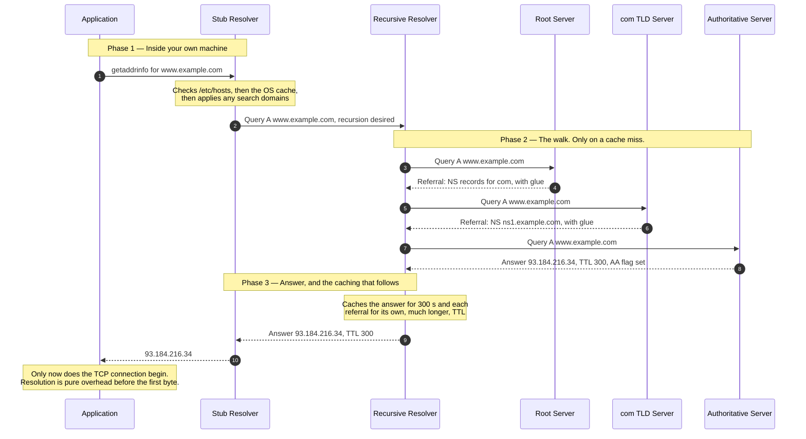
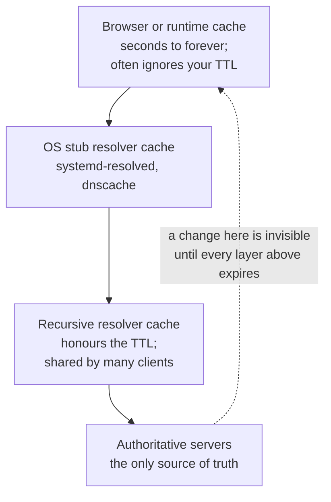

# DNS Resolution

> How a name like `www.example.com` becomes an IP address — which machines are
> asked, in what order, and which of them is quietly holding a cached answer
> that is no longer true.

_Also known as: name resolution, the DNS lookup, "it's always DNS"._

---

## TL;DR

- **Resolution is a delegation walk, not a lookup.** Nobody has the whole
  database. The root knows who runs `com`, `com` knows who runs `example.com`,
  and only that last server has the answer.
- **Almost every query is answered from a cache.** The full walk below happens
  rarely; understanding it matters because the caches are where your problems
  come from.
- **A TTL is a promise you cannot take back.** Once an answer is handed out with
  `TTL 3600`, resolvers may use it for an hour, and some ignore short TTLs
  entirely. Lower it _before_ you plan to change anything.
- **Negative answers are cached too**, governed by the `SOA` minimum
  ([RFC 2308](https://www.rfc-editor.org/rfc/rfc2308)) — so a name that did not
  exist when you first asked stays non-existent for a while after you create it.
- **Your application does not resolve names the way `dig` does.** `dig` talks to
  a resolver directly; your process goes through `getaddrinfo`, `/etc/hosts`,
  search domains, and possibly a runtime cache of its own.

---

## When to use it

- You are debugging why a name resolves differently in two places, or why a
  change has not taken effect.
- You are planning a migration or failover that depends on a DNS change
  propagating.
- You are choosing TTLs, and want to know what you are trading away.

## When _not_ to use it

- **As a load balancer.** Round-robin `A` records distribute badly — clients
  cache, resolvers reorder, and a removed record keeps receiving traffic for the
  length of the TTL and beyond.
- **As a failover mechanism with tight recovery objectives.** You cannot recall
  a cached answer. If your recovery target is under a few minutes, fail over at
  the IP layer, with anycast, or with a proxy — not with DNS.
- **As a service discovery mechanism inside a cluster**, unless you have
  measured what your runtime actually caches. Several do so indefinitely by
  default.

---

## Actors and terminology

| Actor                | Spec term                                                          | What it is                                                                                                                                               |
| -------------------- | ------------------------------------------------------------------ | -------------------------------------------------------------------------------------------------------------------------------------------------------- |
| Application          | —                                                                  | Calls `getaddrinfo`, or its language's equivalent. Rarely speaks DNS itself.                                                                             |
| Stub resolver        | _Resolver_ ([RFC 1034 §5](https://www.rfc-editor.org/rfc/rfc1034)) | The OS-level client. Consults `/etc/hosts`, applies search domains, and asks a recursive resolver. Does no walking of its own.                           |
| Recursive resolver   | _Name Server_ performing recursion                                 | Your ISP's, your cloud VPC's, or a public one. Does the walk and caches the results. This is where nearly all caching happens.                           |
| Root servers         | _Root_                                                             | 13 root server identities, `a` to `m.root-servers.net`, each with an IPv4 and an IPv6 address, anycast to many instances. Know only the TLD delegations. |
| TLD servers          | —                                                                  | Authoritative for `com`, `org`, `uk`. Know only the delegation for each registered domain.                                                               |
| Authoritative server | _Authoritative Name Server_                                        | Holds the actual zone data. Its answers carry the `AA` flag.                                                                                             |

**Key terms**

- **Zone** — a contiguous piece of the namespace under one administrative
  control. `example.com` is a zone; `com` delegates to it.
- **Delegation** — an `NS` record in the parent zone naming the child's servers.
  The parent is not authoritative for the child's data, only for the delegation.
- **Glue record** — an `A`/`AAAA` record served by the parent for a nameserver
  _inside_ the zone it delegates to. Without it, `ns1.example.com` could only be
  found by asking `ns1.example.com`.
- **TTL** — seconds a resolver may cache an answer. Set by the zone owner,
  counted down by the resolver, and honoured with varying enthusiasm.
- **`SOA`** — the zone's start-of-authority record. Its `minimum` field governs
  how long negative answers — both `NXDOMAIN` and `NODATA` — may be cached: the
  negative TTL is the lesser of `minimum` and the `SOA` record's own TTL
  ([RFC 2308 §5](https://www.rfc-editor.org/rfc/rfc2308#section-5)).
- **`NXDOMAIN` vs `NODATA`** — the _name_ does not exist, versus the name exists
  but has no record of the type you asked for. Both are cached; only the first
  is an error most tools report clearly.
- **`CNAME`** — an alias. Resolving it means resolving the target too, so a chain
  costs a round trip per link.
- **Recursion desired (`RD`)** — the flag asking "do the work for me". Set by
  stubs. An authoritative-only server ignores it: it answers from its own zones
  with `RA` (recursion available) clear, and for names outside them typically
  replies `REFUSED` rather than recursing
  ([RFC 1035 §4.1.1](https://www.rfc-editor.org/rfc/rfc1035#section-4.1.1)).

---

## Sequence diagram



The diagram shows the classic walk of
[RFC 1034 §5.3.3](https://www.rfc-editor.org/rfc/rfc1034#section-5.3.3), in
which every server is sent the full question. Modern resolvers usually apply
**QNAME minimisation**
([RFC 9156](https://www.rfc-editor.org/rfc/rfc9156)) — on by default in
current BIND (since 9.14), Unbound, Knot Resolver, and PowerDNS Recursor — so
the root is asked only about `com`, and the `com` servers only about
`example.com`. The shape of the walk is the same; each server simply learns
less about what you are looking up.

## Architecture

Every layer caches, with its own TTL and its own opinion about honouring yours:



This diagram is the answer to "I updated DNS an hour ago and it still resolves
to the old address". Nothing is broken. Something above the authoritative server
is still inside its TTL — and the one you cannot see or flush is the recursive
resolver, which is shared by everyone else using it too.

---

## Step-by-step

1. **The application asks for a name.** Note what it does _not_ do: send a DNS
   packet. It calls the platform's name resolution API, which consults sources
   in an order set by system configuration (`nsswitch.conf` on Linux), starting
   with `/etc/hosts`.

2. **The stub resolver sends a query.** If the name is not fully qualified, the
   search domains from `resolv.conf` are appended first — so `api` might be
   tried as `api.corp.example.com` before `api.` itself.

   ```text
   ;; QUESTION SECTION:
   ;www.example.com.               IN      A
   ;; flags: rd                    ; recursion desired
   ```

3. **The recursive resolver asks a root server.** Only on a cache miss, and in
   practice it usually has the `com` delegation cached already and skips
   straight to step 5. The root hints — the addresses of the root servers — are
   the one piece of bootstrap configuration every resolver ships with.

4. **The root returns a referral, not an answer.** No `AA` flag, an empty answer
   section, and `NS` records for `com` in the authority section with their
   addresses as glue.

   ```text
   ;; AUTHORITY SECTION:
   com.            172800  IN      NS      a.gtld-servers.net.
   ;; ADDITIONAL SECTION:
   a.gtld-servers.net.  172800  IN  A      192.5.6.30
   ```

   Note the TTL: two days. Referrals are cached far longer than answers, which
   is why the top of the walk is almost never performed.

5. **The resolver asks a `com` server.** In the classic walk it is the same
   question, and only the server being asked changes. With QNAME minimisation
   the resolver reveals just one more label than the server needs — here
   `example.com` — and sends the full name only to the authoritative server.

6. **`com` returns the delegation for `example.com`.**

7. **The resolver asks the authoritative server.**

8. **The authoritative server answers, with `AA` set.**

   ```text
   ;; flags: qr aa
   ;; ANSWER SECTION:
   www.example.com.        300     IN      A       93.184.216.34
   ```

   _Resolver validates:_ that the answer is in-bailiwick — a `com` server may
   not hand back records for `example.org`. Accepting out-of-bailiwick data is
   cache poisoning, and rejecting it closes the crudest form of the attack. It
   does not stop in-bailiwick spoofing — the Kaminsky attack forges answers for
   names inside the zone being asked — which is why resolvers also randomise
   query IDs and source ports, and why only DNSSEC actually authenticates the
   data.

9. **The resolver caches and replies.** Each record is cached for its own TTL.
   The TTL returned to the stub counts down: ask again in 100 seconds and you
   are told 200, not 300.

10. **The stub returns an address to the application.** Or several — and which
    one gets used is the application's business, not DNS's. `getaddrinfo`
    applies its own sorting rules, so the order you saw in `dig` is not
    necessarily the order your program tries.

---

## Failure modes

| Failure                                     | What you see                                    | Correct handling                                                                                                                                                                                                                                                                                                                                              |
| ------------------------------------------- | ----------------------------------------------- | ------------------------------------------------------------------------------------------------------------------------------------------------------------------------------------------------------------------------------------------------------------------------------------------------------------------------------------------------------------- |
| `NXDOMAIN` cached before the record existed | New name does not resolve, for minutes to hours | Lower the zone's `SOA` minimum before creating names you will use immediately. Nothing else fixes it — you cannot flush someone else's resolver.                                                                                                                                                                                                              |
| `NODATA`                                    | "Works for IPv4, not IPv6"                      | The name exists, the record type does not. Check `AAAA` separately; the error is often silent.                                                                                                                                                                                                                                                                |
| Long `CNAME` chain                          | Slow first connection                           | Each link is another resolution. Flatten where you can. At the apex, where `CNAME` is not allowed, use your provider's `ALIAS`/`ANAME`/flattening feature (vendor-specific; the ANAME draft was never published) — the standard alternative, `HTTPS`/`SVCB` AliasMode ([RFC 9460](https://www.rfc-editor.org/rfc/rfc9460)), still has limited client support. |
| One authoritative server down               | Intermittent slow resolution                    | Resolvers try another `NS` after a timeout — typically seconds. Run authoritative servers on separate networks and providers.                                                                                                                                                                                                                                 |
| Truncated response (`TC` flag)              | Fails behind restrictive middleboxes            | The resolver retries over TCP. Firewalls that allow only UDP/53 break large responses, including DNSSEC. Allow TCP/53.                                                                                                                                                                                                                                        |
| Runtime caches forever                      | One instance keeps using a decommissioned IP    | Language and framework caches are separate from the OS. The JVM's `networkaddress.cache.ttl` historically defaulted to caching successful lookups indefinitely under a security manager — check yours explicitly.                                                                                                                                             |
| Search domain surprises                     | `api` resolves to the wrong host                | A short name plus a search suffix can match something unintended. Use fully qualified names — with the trailing dot — in configuration.                                                                                                                                                                                                                       |
| Split-horizon disagreement                  | Works internally, not externally                | Different answers by source network, on purpose. Confirm which view you are querying before assuming a bug.                                                                                                                                                                                                                                                   |

### Why `dig` and your application disagree

This is the most common DNS confusion, and it is not a DNS problem:

| `dig`                                      | Your application                                          |
| ------------------------------------------ | --------------------------------------------------------- |
| Sends a DNS query directly to a resolver   | Calls `getaddrinfo`                                       |
| Ignores `/etc/hosts`                       | Reads `/etc/hosts` first, on most systems                 |
| Ignores `nsswitch.conf`                    | Obeys it — mDNS, LDAP, and other sources may answer first |
| Asks for one record type                   | Usually asks for `A` and `AAAA`, and sorts the results    |
| No application-level cache                 | May have one, with its own TTL                            |
| Uses the first nameserver in `resolv.conf` | May use a local stub such as `systemd-resolved`           |

When they differ, the application is right about what it will do. Reach for
`getent ahosts NAME` — which calls `getaddrinfo`, the same path your
application uses — before concluding DNS is broken. (`getent hosts` goes
through NSS too, but via the older `gethostbyname2`-style lookup, so it can
differ in address families and ordering.)

---

## Common pitfalls

### Changing a record without lowering the TTL first

❌ **What people do:** decide to migrate, update the `A` record, and wait — with
the TTL still at 3600 or 86400.

✅ **Do instead:** lower the TTL to 60 seconds at least one full _old_ TTL before
the change, make the change, then raise it again afterwards.

_Why it bites you:_ the TTL in force is the one that was handed out _before_ you
edited anything. Dropping it to 60 at the moment of the change does nothing for
resolvers that already cached the old answer for a day. Migrations planned this
way overrun by exactly one TTL, with a fraction of traffic still hitting a
decommissioned host.

### Believing DNS propagates

❌ **What people do:** describe a change as "propagating" and check a
propagation-checker website until it is green.

✅ **Do instead:** think in terms of expiry. Authoritative data changes instantly;
every cached copy elsewhere expires on its own schedule.

_Why it bites you:_ the mental model predicts a wave that eventually reaches
everyone, so people wait rather than investigate. In reality a resolver that
cached a 24-hour answer will hold it for 24 hours regardless of what anyone
does, and a checker that samples popular public resolvers tells you nothing
about the corporate resolver your customer is behind.

### Round-robin `A` records as load balancing

❌ **What people do:** publish five `A` records and expect roughly even
distribution.

✅ **Do instead:** use a real load balancer or anycast. Use multiple records for
_redundancy_, and expect uneven distribution.

_Why it bites you:_ clients cache the whole set and pick one, often the first,
often forever. Resolvers reorder or truncate the set. `getaddrinfo` sorts by
its own address-selection rules. Removing a failed host's record does nothing
for clients already holding it — so it is not failover either.

### Ignoring negative caching

❌ **What people do:** test a name before creating it, then create it and wonder
why it still does not resolve.

✅ **Do instead:** set the `SOA` minimum to something short — 300 seconds is
common — and avoid querying names you are about to create.

_Why it bites you:_ the `NXDOMAIN` is cached, per RFC 2308, for the lesser of
the `SOA` minimum and the `SOA` record's own TTL. With a default of an hour or
more, a single premature lookup poisons that resolver for everyone behind it.
Automated health checks that start polling before the record exists do this
reliably.

### Trusting the resolver's answer without DNSSEC

❌ **What people do:** treat a DNS answer as authoritative because it came back.

✅ **Do instead:** validate with DNSSEC where the zone is signed, and never rely
on a name resolving correctly as a security control.

_Why it bites you:_ plain DNS is unauthenticated UDP. An on-path attacker, or a
resolver you do not control, can return anything. This is why domain validation
for certificates is not a substitute for verifying the certificate, and why
"only our internal names resolve to internal addresses" is not a security
boundary.

### Assuming one lookup per connection

❌ **What people do:** ignore DNS in latency budgets, since it is "just a lookup".

✅ **Do instead:** measure it. Count `CNAME` links, watch for cold-cache first
requests, and prefer fewer, shorter chains on hot paths.

_Why it bites you:_ a cold lookup through a three-link `CNAME` chain to a distant
authoritative server can cost several hundred milliseconds before a single byte
is sent — and it happens again every time the TTL expires. On a page with
resources across a dozen hostnames, that is a dozen independent chances to be
slow.

---

## Security considerations

| Threat                                               | Mitigation                                                                                 |
| ---------------------------------------------------- | ------------------------------------------------------------------------------------------ |
| Cache poisoning by an off-path attacker              | Source port randomisation and query ID randomisation; DNS cookies; DNSSEC validation       |
| Out-of-bailiwick injection in the additional section | Resolvers must discard records outside the zone being asked                                |
| On-path tampering or surveillance                    | DNS over HTTPS ([RFC 8484](https://www.rfc-editor.org/rfc/rfc8484)) or DNS over TLS        |
| Subdomain takeover                                   | Remove dangling `CNAME`s pointing at deprovisioned cloud resources _before_ releasing them |
| DNS as an exfiltration channel                       | Monitor for high-entropy, high-volume queries to a single zone                             |
| Amplification abuse of open resolvers                | Do not run an open recursive resolver; apply response rate limiting                        |

---

## Implementation checklist

- [ ] Lower TTLs a full old-TTL _before_ any planned change; restore them after.
- [ ] Set the `SOA` minimum deliberately — it governs negative caching
      (`NXDOMAIN` and `NODATA`), not positive.
- [ ] Run at least two authoritative servers, on separate networks; consider
      separate providers.
- [ ] Allow TCP/53 as well as UDP/53 through every firewall.
- [ ] Keep `CNAME` chains short; at a zone apex use your provider's
      `ALIAS`/`ANAME` feature (vendor-specific, not a standard record type).
- [ ] Audit your runtime's DNS cache TTL explicitly — do not assume it respects
      the record.
- [ ] Use fully qualified names in configuration to bypass search domains.
- [ ] Debug with `getent ahosts` or your language's resolver, not only `dig`.
- [ ] Alert on resolution latency and failure rate as a first-class dependency.
- [ ] Remove `CNAME`s pointing at cloud resources before deprovisioning them.
- [ ] Do not use DNS for failover with a recovery objective under a few minutes.

---

## Specs and references

**Normative**

- [RFC 1034 — Domain Names: Concepts and Facilities](https://www.rfc-editor.org/rfc/rfc1034) — the delegation model, zones, and resolver algorithm. §4 and §5 are the walk described above.
- [RFC 1035 — Domain Names: Implementation and Specification](https://www.rfc-editor.org/rfc/rfc1035) — the wire format, message sections, record types, and the 512-byte UDP limit that makes truncation and TCP fallback matter.
- [RFC 2308 — Negative Caching of DNS Queries](https://www.rfc-editor.org/rfc/rfc2308) — how long `NXDOMAIN` and `NODATA` are cached, and the `SOA` minimum's role.
- [RFC 8484 — DNS Queries over HTTPS](https://www.rfc-editor.org/rfc/rfc8484) — DoH, and how it moves resolution out of the OS and into the application.
- [RFC 9156 — DNS Query Name Minimisation](https://www.rfc-editor.org/rfc/rfc9156) — sending each server only the labels it needs; [§2](https://www.rfc-editor.org/rfc/rfc9156#section-2) describes the algorithm.
- [RFC 9460 — SVCB and HTTPS Resource Records](https://www.rfc-editor.org/rfc/rfc9460) — AliasMode, the standardised way to alias a zone apex.

**Further reading**

- [RFC 9499 — DNS Terminology](https://www.rfc-editor.org/rfc/rfc9499) — the definitive glossary. Worth a skim before arguing about what "resolver" means.
- [IANA — Root Servers](https://www.iana.org/domains/root/servers) — the 13 root server identities and their IPv4 and IPv6 addresses.
- [getent(1)](https://man7.org/linux/man-pages/man1/getent.1.html) — which databases and libc calls `hosts` and `ahosts` use.
- [RFC 4033 — DNS Security Introduction and Requirements](https://www.rfc-editor.org/rfc/rfc4033) — the DNSSEC overview, and what validation does and does not give you.

---

## Related flows

- [The TLS 1.3 Handshake](tls-1-3-handshake.md) — what happens immediately after step 10, and why resolution latency sits on the critical path before it.
- [Cache-Aside Read & Write](../data-and-delivery/cache-aside-read-write.md) — the same TTL and invalidation trade-offs, in a system where you actually control every cache.
- [CORS Preflight](cors-preflight.md) — another case where the browser does something before your request that your server logs never show.
