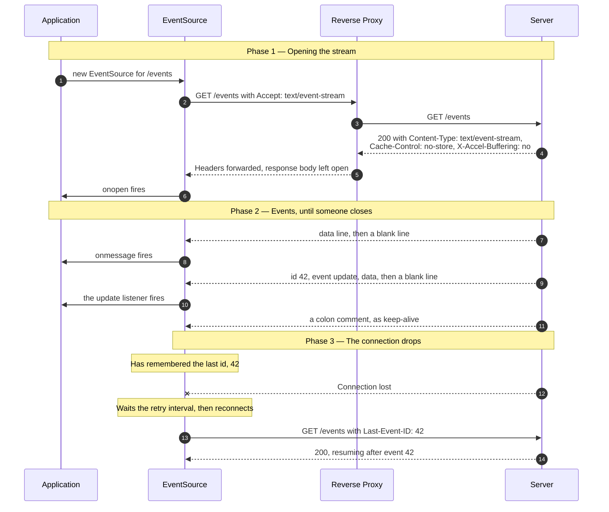
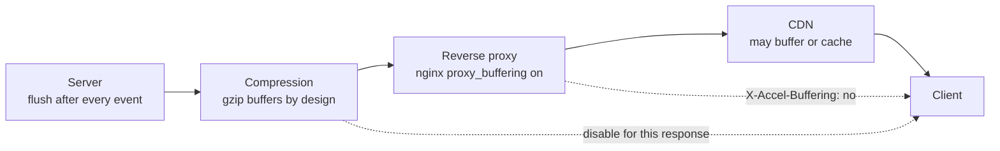

# Server-Sent Events & HTTP Streaming

> How a server pushes a sequence of messages down a single HTTP response that
> never ends — the mechanism behind token-by-token LLM output, live progress
> bars, and notification feeds.

_Also known as: SSE, `EventSource`, event streams, `text/event-stream`._

---

## TL;DR

- **It is one ordinary GET whose response body never finishes.** No new protocol,
  no upgrade handshake. Every proxy, CDN, and firewall already understands it —
  which is both the appeal and the source of the problems.
- **The framing is plain text:** `field: value` lines, one event per blank line.
  You can read a live stream with `curl`.
- **The browser reconnects for you — after network errors.** `EventSource`
  retries automatically and replays `Last-Event-ID`, so resumption is built in —
  _if_ you emit `id:` and honour that header. A non-`200` response or the wrong
  `Content-Type` closes it for good.
- **It is one-directional.** Server to client only. Anything the client wants to
  say goes in a separate request.
- **Buffering is the number one failure.** A reverse proxy that accumulates the
  response before forwarding turns a live stream into one delivery at the end,
  and nothing errors.

---

## When to use it

- Streaming LLM output token by token, which is the most common use today.
- Progress for long-running work: builds, imports, exports, agent tool calls.
- Notification and activity feeds where the client only ever listens.
- Anywhere you were about to poll every second. One stream is cheaper than 3,600
  requests an hour, per client.

## When _not_ to use it

- **Bidirectional, low-latency messaging** — multiplayer, collaborative editing,
  voice. Use WebSocket. SSE would need a second channel for the upstream half,
  and you would be building WebSocket badly.
- **Binary payloads.** `text/event-stream` is UTF-8 text. Base64 costs you a
  third more bytes and the CPU to encode it.
- **Very high message rates.** Per-event text framing and dispatch is more
  overhead than a binary protocol; past a few thousand messages a second it
  shows.
- **One-shot responses.** If there is exactly one result, just return it. A
  stream for a single event is machinery for nothing.

---

## Actors and terminology

| Actor        | Term                               | What it is                                                                   |
| ------------ | ---------------------------------- | ---------------------------------------------------------------------------- |
| Application  | —                                  | Your client code, consuming events.                                          |
| Client       | `EventSource`, or a `fetch` reader | The browser API that opens the stream, parses the framing, and reconnects.   |
| Intermediary | _Proxy_                            | Reverse proxy, load balancer, or CDN. Frequently the thing that breaks this. |
| Server       | _Origin server_                    | Holds the response open and writes events as they occur.                     |

**Key terms**

- **`text/event-stream`** — the media type. Its presence is what makes the
  browser parse the body incrementally rather than waiting.
- **Event** — one or more `field: value` lines terminated by a **blank line**.
  The blank line is the delimiter; forgetting it is why nothing is dispatched.
- **`data:`** — the payload. Repeat the field for multiple lines; they are joined
  with `\n`.
- **`event:`** — a named type, dispatched to `addEventListener(name, …)`. Without
  it, events go to `onmessage`.
- **`id:`** — the last event ID. The browser remembers it and sends it back as
  `Last-Event-ID` on reconnect.
- **`retry:`** — reconnection delay in milliseconds, set by the server.
- **Comment line** — a line starting with `:`. Ignored by the parser, which makes
  it the standard keep-alive.
- **Chunked transfer encoding** — the HTTP/1.1 mechanism that lets a response
  body be sent without a known length. On HTTP/2 and later, framing handles it
  and there is no `Transfer-Encoding` header.

---

## Sequence diagram



## Architecture

Where buffering can happen, which is the whole operational story:



Each hop is allowed to hold bytes until it has "enough". None of them consider
that an error, and the symptom is identical at every layer: the stream works
perfectly in development, and in production every event arrives at once when the
response finally closes.

---

## Step-by-step

1. **The application opens a stream.** With `EventSource`, reconnection and
   parsing come free but you cannot set request headers. With `fetch` plus a
   `ReadableStream` reader you can set headers, and you own reconnection.

   ```js
   const es = new EventSource("/events");
   es.onmessage = (e) => console.log(e.data);
   es.addEventListener("update", (e) => render(JSON.parse(e.data)));
   ```

2. **The client sends an ordinary GET.**

   ```http
   GET /events HTTP/1.1
   Host: app.example.com
   Accept: text/event-stream
   Cache-Control: no-cache
   ```

3. **The proxy forwards it.** For this route it must be configured _not_ to
   buffer, and its read timeout must exceed the expected stream lifetime — a
   60-second proxy timeout kills an idle stream every minute regardless of
   keep-alives.

4. **The server responds with headers and keeps the body open.**

   ```http
   HTTP/1.1 200 OK
   Content-Type: text/event-stream
   Cache-Control: no-store
   Connection: keep-alive
   X-Accel-Buffering: no
   ```

   `X-Accel-Buffering: no` is an nginx convention rather than a standard —
   nginx honours it, and some other proxies copy it, but do not assume every
   intermediary does. The MCP
   [Streamable HTTP transport](https://modelcontextprotocol.io/specification/2026-07-28/basic/transports/streamable-http#receiving-messages)
   says servers **SHOULD** send it for exactly this reason. (MCP's streams are
   the response to a `POST`, not a `GET /events` like this one; the header
   advice is the same.)

5. **Headers reach the client.** The client dispatches `onopen` at this point; no
   event data has arrived yet.

6. **`onopen` fires.**

7. **The server writes the first event.** The trailing blank line is what
   dispatches it, and the write must be flushed.

   ```text
   data: {"token":"Hello"}

   ```

8. **The client dispatches it to `onmessage`.**

9. **A named event with an ID.** Multi-line data is expressed as repeated `data:`
   fields:

   ```text
   id: 42
   event: update
   data: {"status":"running",
   data:  "progress":0.6}

   ```

10. **The named listener fires.** The `data` values are joined with a newline
    before your handler sees them, so the two lines above parse as one JSON
    document.

11. **A keep-alive comment.** Send one every 15–30 seconds during quiet periods.
    It is ignored by the parser and it stops intermediaries and NAT tables from
    reaping an idle connection.

    ```text
    : keep-alive

    ```

12. **The connection drops.** Networks change, proxies recycle, laptops sleep.
    This is expected, not exceptional.

13. **The client reconnects automatically**, after the `retry:` interval, sending
    the last ID it saw.

    ```http
    GET /events HTTP/1.1
    Last-Event-ID: 42
    Accept: text/event-stream
    ```

14. **The server resumes after that event.** This only works if you actually read
    the header and can seek to that position. If you cannot, say so — send a
    `reset` event and let the client resynchronise, rather than silently
    restarting the sequence.

---

## Failure modes

| Failure                                                 | What the client sees                                     | Correct handling                                                                                                                                                                                                                                                              |
| ------------------------------------------------------- | -------------------------------------------------------- | ----------------------------------------------------------------------------------------------------------------------------------------------------------------------------------------------------------------------------------------------------------------------------- |
| Proxy buffers the response                              | Nothing, then everything at once at the end              | Disable buffering per route: `proxy_buffering off` in nginx, `X-Accel-Buffering: no` from the app.                                                                                                                                                                            |
| Compression enabled                                     | Same symptom                                             | gzip buffers to fill its window. Disable compression for `text/event-stream`, or flush the compressor per event.                                                                                                                                                              |
| Proxy read timeout shorter than the stream              | Reconnect loop every N seconds                           | Raise `proxy_read_timeout` for this route, and keep sending comments.                                                                                                                                                                                                         |
| Missing blank line after an event                       | Events accumulate and dispatch late, in a batch          | The blank line is the delimiter, not decoration.                                                                                                                                                                                                                              |
| Server returns a non-`200` (e.g. `503` during a deploy) | `onerror` with `readyState === CLOSED`, and **no** retry | Only network errors reconnect. A non-`200` status or a wrong `Content-Type` fails the connection permanently (HTML §9.2.3). In `onerror`, if `readyState` is `CLOSED`, recreate the `EventSource` yourself with jittered backoff. Return `204` when you mean "stop for good". |
| HTTP/1.1 connection limit reached                       | Other requests to the origin hang                        | Six connections per origin, and each stream holds one. Serve over HTTP/2, where streams are multiplexed over one connection up to the server's `SETTINGS_MAX_CONCURRENT_STREAMS` (commonly 100 or more).                                                                      |
| Client needs an `Authorization` header                  | Cannot be set on `EventSource`                           | Use a cookie, or switch to `fetch` with a stream reader and write your own reconnection.                                                                                                                                                                                      |
| Reconnect storm after a server restart                  | Every client returns at once                             | Vary `retry:` per client, or add jitter. See [Circuit Breaker, Timeout & Retry](../distributed-systems/circuit-breaker-retry-and-backoff.md).                                                                                                                                 |
| Load-balanced without stickiness                        | Reconnect lands on an instance with no history           | Keep resumable state in a shared store, keyed by event ID, not in process memory.                                                                                                                                                                                             |

### A note on MCP

The MCP Streamable HTTP transport uses SSE as its streaming response, but does
**not** use all of it: `Last-Event-ID` resumption is explicitly unsupported in
revision `2026-07-28`, and closing the stream is the cancellation signal. It is
a good illustration that "we use SSE" does not imply the whole feature set — see
[MCP Request Lifecycle & Versioning](../ai-systems/mcp-request-lifecycle-and-versioning.md).

---

## Common pitfalls

### Forgetting to flush

❌ **What people do:** write the event to the response object and rely on the
framework to send it.

✅ **Do instead:** flush explicitly after every event — `res.flush()`,
`await writer.drain()`, `flush=True`, whatever your stack calls it — and disable
output buffering for the route.

_Why it bites you:_ almost every server stack buffers output for throughput, and
so does the language runtime, and so does the proxy. Locally the buffer is small
and the delay invisible; in production the events sit in it. The stream appears
to work and simply is not live, which is the hardest kind of bug to notice
because there is no error anywhere.

### No keep-alive during quiet periods

❌ **What people do:** send events only when something happens.

✅ **Do instead:** send a `:` comment every 15–30 seconds regardless.

_Why it bites you:_ intermediaries close idle connections — load balancers at 60
seconds, NAT gateways sooner, mobile carriers sooner still. The client
reconnects, which is at least correct, but you have converted a persistent
stream into a poll with extra steps, and each reconnect costs a TLS handshake.

### Emitting `id:` but ignoring `Last-Event-ID`

❌ **What people do:** number the events, then start from the beginning on
reconnect.

✅ **Do instead:** honour the header, or do not emit `id:` at all.

_Why it bites you:_ the client is told resumption is supported, so it does not
compensate. After a drop it gets the whole history again — duplicate
notifications, a chat message posted twice, an LLM response that restarts
mid-sentence. Emitting no `id:` at least makes the client's assumptions correct.

### Treating disconnection as an error

❌ **What people do:** log every disconnect at `ERROR` and alert on the rate.

✅ **Do instead:** treat drops as routine. Alert on failures to *re*connect, and
on stream lifetime dropping below expectations.

_Why it bites you:_ clients close tabs, sleep laptops, and change networks
constantly, so the disconnect rate tracks user behaviour rather than system
health. Alerting on it trains everyone to ignore the alert — and the genuine
signal, a proxy recycling every stream at 60 seconds, hides inside the noise.

### Streaming from a per-instance in-memory queue

❌ **What people do:** hold the client's pending events in a list on the instance
serving the stream.

✅ **Do instead:** keep them in a shared store keyed by client and event ID, so
any instance can serve the resumed stream.

_Why it bites you:_ the reconnect at step 13 is load-balanced like any other
request and will usually land somewhere else. That instance has no queue for
this client, so it either sends nothing or replays from zero. It works in
staging with one instance and fails as soon as you scale.

### Using `EventSource` when you needed headers

❌ **What people do:** commit to `EventSource`, then discover the API needs a
bearer token and try to smuggle it through the query string.

✅ **Do instead:** decide up front. Cookie auth works with `EventSource`; header
auth requires `fetch` with a `ReadableStream` reader, and then reconnection and
`Last-Event-ID` are yours to implement.

_Why it bites you:_ a token in the query string ends up in access logs, `Referer`
headers, and browser history — the exact leak the `Authorization` header exists
to prevent. It is also cached by intermediaries that would not cache a header.

---

## Implementation checklist

**Server**

- [ ] `Content-Type: text/event-stream`, `Cache-Control: no-store`.
- [ ] Send `X-Accel-Buffering: no`; disable buffering and compression for the
      route.
- [ ] Terminate every event with a blank line, and flush after each one.
- [ ] Emit `:` keep-alive comments every 15–30 seconds.
- [ ] Emit `id:` only if you can honour `Last-Event-ID`.
- [ ] Set `retry:` deliberately, with jitter across clients.
- [ ] Detect client disconnect and stop the work behind the stream — an
      abandoned stream that keeps generating tokens is pure cost.
- [ ] Cap concurrent streams per user, and per instance.
- [ ] Keep resumable state in a shared store, not in the process.
- [ ] Return `204` when the client should stop reconnecting for good — and
      remember that any other non-`200`, such as a `503` during a deploy, stops
      it too.

**Client**

- [ ] Handle `onerror` without tearing down the page. Reconnection is automatic
      only after network errors: if `readyState` is `CLOSED`, the server sent a
      non-`200` or the wrong `Content-Type`, and you must recreate the
      `EventSource` yourself, with jittered backoff.
- [ ] Deduplicate on event ID; assume at-least-once delivery after a resume.
- [ ] Close the stream when the view is unmounted.
- [ ] Serve over HTTP/2 to escape the six-connection limit; streams are then
      capped by the server's `SETTINGS_MAX_CONCURRENT_STREAMS` instead.
- [ ] If you need request headers, use `fetch` and accept that you now own
      reconnection and backoff.

---

## Specs and references

**Normative**

- [HTML Standard — Server-Sent Events](https://html.spec.whatwg.org/multipage/server-sent-events.html) — the `text/event-stream` grammar, the `EventSource` interface, the reconnection algorithm, and `Last-Event-ID`. This is the definition; there is no separate RFC. [§9.2.3 Processing model](https://html.spec.whatwg.org/multipage/server-sent-events.html#sse-processing-model) defines which failures reconnect and which fail the connection for good.
- [RFC 9110 — HTTP Semantics](https://www.rfc-editor.org/rfc/rfc9110) — the response semantics an open-ended body relies on, and the header field definitions used above.
- [MCP Streamable HTTP transport](https://modelcontextprotocol.io/specification/2026-07-28/basic/transports/streamable-http) — a production protocol built on SSE, including POST-initiated response streams, its **SHOULD** for `X-Accel-Buffering: no` ([Receiving Messages](https://modelcontextprotocol.io/specification/2026-07-28/basic/transports/streamable-http#receiving-messages)), and its explicit removal of `Last-Event-ID` resumption.

**Further reading**

- [RFC 9113 — HTTP/2](https://www.rfc-editor.org/rfc/rfc9113) — why serving streams over HTTP/2 replaces the six-connection-per-origin constraint with a per-connection stream limit: [§5.1.2 Stream Concurrency](https://www.rfc-editor.org/rfc/rfc9113#section-5.1.2), and `SETTINGS_MAX_CONCURRENT_STREAMS` in [§6.5.2](https://www.rfc-editor.org/rfc/rfc9113#section-6.5.2), which recommends a value no smaller than 100.

---

## Related flows

- [MCP Request Lifecycle & Versioning](../ai-systems/mcp-request-lifecycle-and-versioning.md) — SSE as the streaming half of a real protocol, with the parts it deliberately does not use.
- [LLM Tool-Use Loop](../ai-systems/llm-tool-use-loop.md) — what is usually being streamed, and why cancelling the stream must cancel the generation.
- [Circuit Breaker, Timeout & Retry](../distributed-systems/circuit-breaker-retry-and-backoff.md) — jittering reconnection so a server restart is not followed by a synchronised stampede.
- [CORS Preflight](cors-preflight.md) — what a cross-origin stream needs before the browser will open it at all.
- [The TLS 1.3 Handshake](tls-1-3-handshake.md) — the cost paid again on every reconnect, and the reason keep-alives are worth the bytes.
- [WebSocket Upgrade & Frames](websocket-upgrade-and-frames.md) — the bidirectional alternative, and everything you take on by choosing it.
