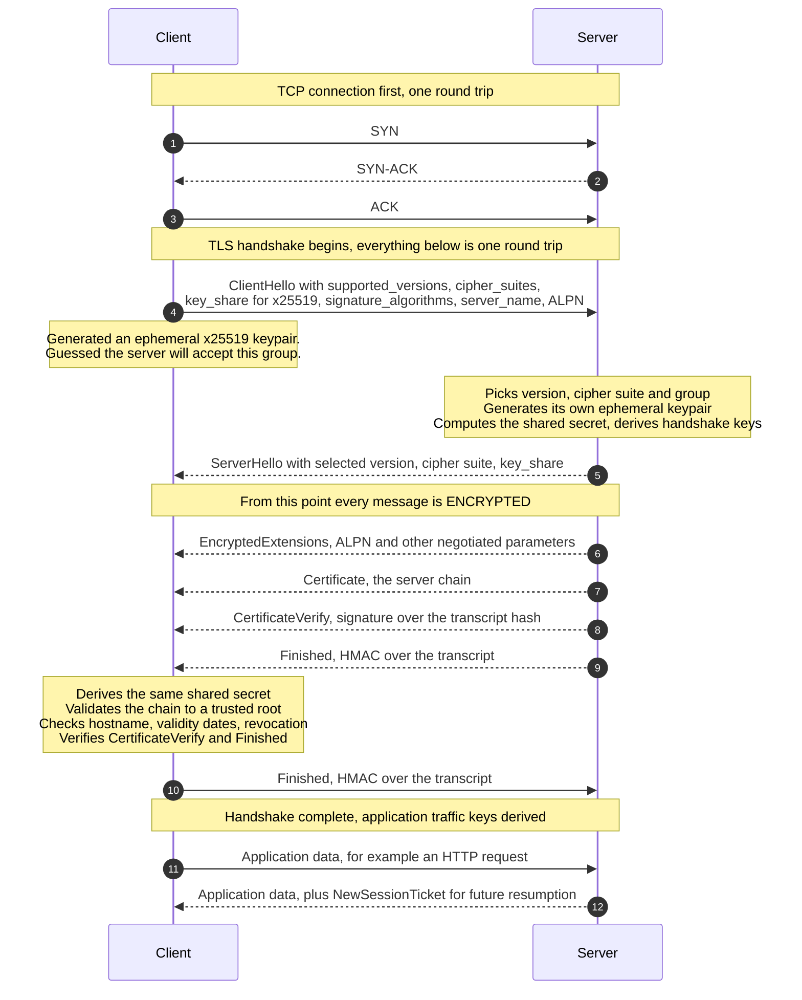
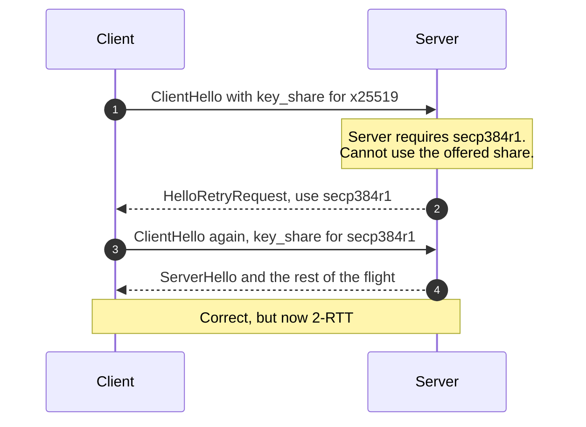
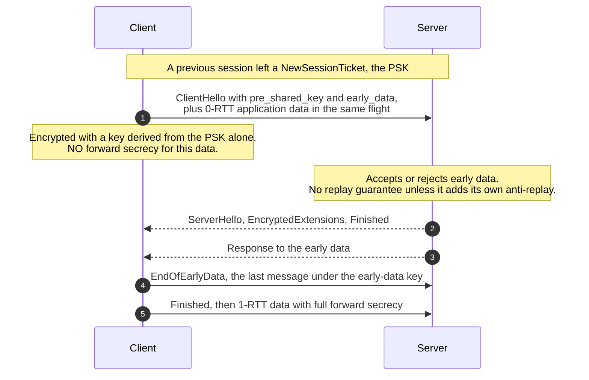

# The TLS 1.3 Handshake

> How two parties who have never met establish an encrypted, authenticated
> channel across a hostile network — in a single round trip, and in a way that
> stays secret even if the server's private key is stolen years later.

---

## TL;DR

- TLS 1.3 completes in **one round trip** (1-RTT). The client guesses which key
  exchange group the server will pick and sends its key share in the very first
  message, so the server can reply with everything needed to finish.
- **Everything after `ServerHello` is encrypted** — including the server's
  certificate. An observer sees far less than under TLS 1.2.
- **Forward secrecy is the default.** Every full handshake, and every
  resumption in `psk_dhe_ke` mode, uses an ephemeral Diffie-Hellman key that is
  discarded afterwards. Recording traffic today and stealing the server key
  tomorrow yields nothing. Static-RSA key transport was removed to guarantee
  this. The exceptions are PSK-only resumption (`psk_ke`) and 0-RTT early data,
  which have no forward secrecy ([RFC 8446 §2.2](https://www.rfc-editor.org/rfc/rfc8446#section-2.2)).
- The cipher suite list is cut to five AEAD suites. Every known-broken primitive
  — RC4, 3DES, CBC mode, MD5, SHA-1, compression, renegotiation — is gone. Most
  TLS 1.2 misconfigurations are simply unrepresentable.
- **0-RTT** sends application data in the first flight for resumed connections,
  at the cost of replay protection. Use it only for genuinely idempotent
  requests.

---

## When to use it

- Everywhere. TLS 1.3 has been standard since 2018 and is supported by every
  current browser, language runtime, and load balancer.
- New services should offer TLS 1.3 **and** 1.2, and nothing older.

## When _not_ to use it

- **Do not disable TLS 1.2 yet** if you have non-browser API clients, older
  embedded devices, or partners on legacy stacks. 1.2 with modern settings
  ([RFC 9325](https://www.rfc-editor.org/rfc/rfc9325)) remains acceptable.
- **Do not enable 0-RTT by default.** It is opt-in per route, for idempotent
  requests only. See the pitfalls.
- TLS 1.0 and 1.1 are formally deprecated by
  [RFC 8996](https://www.rfc-editor.org/rfc/rfc8996) and must be disabled.

---

## Actors and terminology

| Actor         | Spec term                 | What it is                                                                      |
| ------------- | ------------------------- | ------------------------------------------------------------------------------- |
| Browser / app | _Client_                  | Initiates, verifies the server's certificate.                                   |
| Server        | _Server_                  | Proves it holds the private key for the requested name.                         |
| CA            | _Certification Authority_ | Third party the client already trusts, which vouched for the server's identity. |

**Key terms**

- **AEAD** — Authenticated Encryption with Associated Data. Encrypts and
  authenticates in one construction. TLS 1.3 permits nothing else, which
  eliminates the padding-oracle family of attacks outright.
- **(EC)DHE** — Ephemeral Elliptic-Curve Diffie-Hellman. Both sides derive a
  shared secret without transmitting it; the ephemeral keys are thrown away,
  which is what forward secrecy means.
- **`key_share`** — the client's guessed ephemeral public key, sent in
  `ClientHello`. Guessing right is what saves a round trip.
- **HelloRetryRequest (HRR)** — the server's "wrong guess, use this group
  instead". Costs one extra round trip.
- **Transcript hash** — a running hash of every handshake message. Both `Finished`
  messages authenticate it, so any tampering anywhere in the handshake is
  detected.
- **PSK** — Pre-Shared Key. In practice, a resumption ticket from an earlier
  session. Enables 0-RTT.
- **SNI** — Server Name Indication: which hostname the client wants, sent in the
  clear so a server hosting many sites can pick the right certificate — unless
  the client uses **Encrypted Client Hello** (ECH,
  [RFC 9849](https://www.rfc-editor.org/rfc/rfc9849)), which encrypts the
  `ClientHello`, SNI included, under a server public key.

---

## Sequence diagram — full 1-RTT handshake



The client may send application data immediately after its `Finished` — it does
not wait for anything further. That is what "1-RTT" means: one round trip of TLS
on top of the TCP handshake.

## HelloRetryRequest — when the guess is wrong



Clients avoid this by sending shares for the groups servers actually use.
Sending several costs a few hundred bytes; being wrong costs a round trip.

## 0-RTT resumption



Zero round trips before data flows. Two real costs: the early data lacks forward
secrecy, and it is **replayable** by anyone who captured it.

---

## Step-by-step

Numbers match the **full 1-RTT handshake** diagram.

1. **`SYN`.** The client opens a TCP connection. Nothing cryptographic has
   happened yet.

2. **`SYN-ACK`.** The server accepts.

3. **`ACK`.** The TCP connection is established. That is one full round trip
   spent before TLS has sent a byte — which is precisely what QUIC removes, by
   merging the transport and cryptographic handshakes into one
   ([RFC 9001](https://www.rfc-editor.org/rfc/rfc9001)).

4. **`ClientHello`.** The client offers everything at once:

   ```text
   legacy_version:      0x0303          # says "TLS 1.2" for middlebox compatibility
   random:              32 bytes
   cipher_suites:       TLS_AES_128_GCM_SHA256, TLS_AES_256_GCM_SHA384,
                        TLS_CHACHA20_POLY1305_SHA256
   extensions:
     supported_versions: TLS 1.3        # the REAL version negotiation
     key_share:          x25519 public key      <-- the round-trip saver
     signature_algorithms: ecdsa_secp256r1_sha256, rsa_pss_rsae_sha256, …
     server_name:        api.example.com        # SNI, in the clear unless ECH is used
     application_layer_protocol_negotiation: h2, http/1.1
   ```

   Two details worth knowing. `legacy_version` still claims TLS 1.2 because
   middleboxes broke when it changed; real negotiation moved into the
   `supported_versions` extension. And `key_share` is a **guess** — the client
   generates an ephemeral keypair before knowing what the server wants.

   The `x25519` share shown is legal and still common, but current Chrome and
   Firefox lead with the post-quantum hybrid group `X25519MLKEM768`
   ([RFC 10024](https://www.rfc-editor.org/rfc/rfc10024.html)), whose client share
   is 1216 bytes rather than 32. The handshake shape is identical; the
   `ClientHello` is simply larger.

5. **`ServerHello`** carries the chosen version, cipher suite, and the server's
   `key_share`. It is the last plaintext message.

   _No message on the wire:_ the server derived its keys before sending this.
   With the client's `key_share` and its own fresh ephemeral key it can compute
   the shared secret _immediately_, so **everything after this message is
   encrypted** under the handshake traffic keys — the rest of the server's
   flight, and the client's reply.

6. **`EncryptedExtensions`** — negotiated parameters that are not needed to
   establish keys, such as the selected ALPN protocol. Encrypting these is a
   privacy improvement over TLS 1.2.

7. **`Certificate`** — the server's chain. In TLS 1.2 this was plaintext and any
   observer could see exactly which site you were visiting even when SNI was
   absent; in 1.3 it is encrypted.

8. **`CertificateVerify`** — a signature, using the certificate's private key,
   over the transcript hash. **This is the actual proof of identity.** The
   certificate alone proves nothing — anyone can copy one. This signature
   proves the server holds the matching private key _and_ binds that proof to
   this specific handshake, so it cannot be replayed.

9. **`Finished`** — HMAC over the full transcript, keyed by the derived secret.
   Any modification to any earlier handshake message, including the plaintext
   `ClientHello`, makes this fail. It is what protects the downgrade-prone
   parts of the handshake.

   _No message on the wire:_ the client now validates what it has been sent.
   This is the part that carries the security of the web, and the one most
   often botched in non-browser clients:
   - build a chain from the leaf to a locally trusted root
   - check `notBefore`/`notAfter` on every certificate in the chain
   - **check the hostname against the Subject Alternative Name extension**
     ([RFC 9525](https://www.rfc-editor.org/rfc/rfc9525#section-2), which
     obsoleted RFC 6125 in 2023, removed the `CN` fallback that 6125 still
     permitted; browsers and the CA/Browser Forum already ignored `CN`)
   - check key usage and basic constraints — a leaf must not be usable as a CA
   - check revocation — CRLs, browser-pushed sets (CRLSets, CRLite), or OCSP
     stapling where the CA still runs OCSP; increasingly, short-lived
     certificates stand in for revocation altogether
   - verify `CertificateVerify` against the transcript
   - verify the server's `Finished`

10. **Client sends its `Finished`.** The handshake is now complete and both
    sides derive application traffic keys.

11. **Client sends application data.** For HTTPS, the request.

12. **Server responds,** and typically sends one or more `NewSessionTicket`
    messages for future resumption.

---

## Why TLS 1.3 is a round trip faster

|                            | TLS 1.2                                                | TLS 1.3                                     |
| -------------------------- | ------------------------------------------------------ | ------------------------------------------- |
| Handshake round trips      | 2                                                      | **1**                                       |
| Resumption                 | 1-RTT                                                  | **0-RTT** (optional)                        |
| Key exchange               | Negotiated, _then_ keys exchanged                      | Client guesses and sends its share up front |
| Certificate                | Plaintext                                              | **Encrypted**                               |
| Forward secrecy            | Optional (static RSA allowed)                          | **Always**, except `psk_ke` and 0-RTT data  |
| Cipher suites              | Hundreds registered, many broken                       | 5, all AEAD                                 |
| Negotiable weak primitives | RC4, 3DES, CBC, MD5, SHA-1, compression, renegotiation | All removed                                 |

TLS 1.2 needed two round trips because the parties negotiated the key exchange
method first and only then performed it. TLS 1.3 collapses those into one flight
by having the client speculate — and pay a `HelloRetryRequest` on the rare
occasion it speculates wrong.

---

## Failure modes

| Failure                         | What the client sees                          | Cause and handling                                                                                                                                                                        |
| ------------------------------- | --------------------------------------------- | ----------------------------------------------------------------------------------------------------------------------------------------------------------------------------------------- |
| Certificate expired             | `CERT_DATE_INVALID`                           | Automate renewal (ACME). This is the most common TLS outage in existence and it is entirely preventable.                                                                                  |
| Hostname mismatch               | `CERT_COMMON_NAME_INVALID`                    | SAN does not cover the requested name. Check SNI routing on multi-tenant load balancers.                                                                                                  |
| Incomplete chain                | Works in browsers, fails in `curl` and mobile | Server omitted an intermediate. Browsers paper over it via AIA fetching or cached intermediates; other clients do not. **Always serve the full chain.**                                   |
| No shared cipher suite          | `HANDSHAKE_FAILURE`                           | Over-aggressive hardening, or a genuinely ancient client.                                                                                                                                 |
| `HelloRetryRequest`             | Slower connection, no error                   | Client offered an unsupported group. Harmless but measurable.                                                                                                                             |
| Middlebox mangles the handshake | Random failures on one network                | The reason for TLS 1.3's compatibility mode (`legacy_version`, fake `ChangeCipherSpec`). Mostly historical now.                                                                           |
| Clock skew on the client        | Certificate "not yet valid"                   | Common on embedded devices with no RTC. Needs NTP before TLS.                                                                                                                             |
| 0-RTT data replayed             | Duplicate request server-side                 | Restrict early data to idempotent requests, or disable it.                                                                                                                                |
| Revoked certificate accepted    | Silent                                        | Most non-browser clients do not check revocation by default. Prefer short-lived certificates; staple OCSP only where your CA still offers it (Let's Encrypt shut its responders in 2025). |

---

## Common pitfalls

### Disabling certificate verification to "fix" an error

❌ **What people do:** `verify=False`, `rejectUnauthorized: false`,
`InsecureSkipVerify: true` — usually to get past a self-signed certificate in
staging.

✅ **Do instead:** add the internal CA to the client's trust store, or use a real
certificate. Keep verification on everywhere.

_Why it bites you:_ this disables the _entire_ security model — TLS without
verification is encryption to an unknown party, which is exactly what an active
attacker provides. And it never stays in staging. This is the single most common
serious TLS mistake in application code.

### Serving an incomplete certificate chain

❌ **What people do:** configure only the leaf certificate, test in Chrome, ship.

✅ **Do instead:** serve leaf **plus** intermediates (not the root). Verify with
`openssl s_client -connect host:443 -showcerts` or an external checker — not
your browser.

_Why it bites you:_ browsers hide the error by fetching missing intermediates or
using cached ones. Your API clients, mobile apps, and `curl` do not. You get a
bug report that says "works in my browser, fails in CI" and no obvious cause.

### Enabling 0-RTT globally

❌ **What people do:** turn on `early_data` at the load balancer for the latency
win.

✅ **Do instead:** enable it only for safe, idempotent requests. In nginx, gate
on `$ssl_early_data` and reject non-idempotent methods.

_Why it bites you:_ TLS gives 0-RTT data no inherent replay protection
([RFC 8446 §8](https://www.rfc-editor.org/rfc/rfc8446#section-8)). The
mitigations §8 describes — single-use tickets, recording `ClientHello`s,
freshness checks — are yours to deploy, and are hard to make airtight across a
distributed fleet; even then, a client or proxy that retries after a failed
0-RTT attempt can deliver the request twice. An attacker who captures an
early-data `POST /transfer` can resend it. It also has no forward secrecy.

### Pinning certificates without a backup pin

❌ **What people do:** pin the leaf certificate's public key in a mobile app.

✅ **Do instead:** pin an intermediate or a backup key you control, ship at least
two pins, and have a remote kill switch. Or use short-lived certificates and
skip pinning.

_Why it bites you:_ when the certificate is rotated — or has to be revoked in an
emergency — every installed copy of the app stops working, and the fix requires
an app-store release. HTTP Public Key Pinning was removed from browsers for
exactly this reason.

### Assuming TLS 1.3 means you are configured correctly

❌ **What people do:** enable TLS 1.3 and consider the work done.

✅ **Do instead:** also disable TLS 1.0/1.1, restrict 1.2 to AEAD suites with
forward secrecy, set HSTS, and test with
[SSL Labs](https://www.ssllabs.com/ssltest/) or `testssl.sh`.

_Why it bites you:_ nearly every server also offers TLS 1.2, and every client
that cannot speak 1.3 gets exactly your 1.2 configuration. A 1.3-capable client
is protected from being downgraded by the sentinel in `ServerHello.random`
([RFC 8446 §4.1.3](https://www.rfc-editor.org/rfc/rfc8446#section-4.1.3)) —
unless it does an insecure version fallback, retrying with a lower version after
a failed handshake, in which case an attacker who can drop packets drags it down
to the weakest version you accept.

### Terminating TLS at the edge and forgetting the rest

❌ **What people do:** terminate at the load balancer, then speak plaintext HTTP
to backends because "it's the private network".

✅ **Do instead:** re-encrypt internally, or use a service mesh with mTLS.

_Why it bites you:_ the internal network is not a trust boundary. Anything with
a foothold in the VPC reads all your traffic, including the session cookies and
bearer tokens the outer TLS was protecting.

---

## Security considerations

| Threat                                                                       | Mitigation                                                                                                               |
| ---------------------------------------------------------------------------- | ------------------------------------------------------------------------------------------------------------------------ |
| **Passive eavesdropping**                                                    | AEAD encryption of all data, and of most of the handshake                                                                |
| **Retrospective decryption** after a key compromise                          | Ephemeral (EC)DHE in every full handshake and `psk_dhe_ke` resumption — keys are discarded. Not `psk_ke`, not 0-RTT data |
| **Active man-in-the-middle**                                                 | Certificate chain validation + `CertificateVerify` over the transcript                                                   |
| **Downgrade to a weaker version or suite**                                   | Transcript-hash binding in `Finished`; version sentinels in `ServerHello.random`                                         |
| **CBC attacks** — predictable IVs (BEAST), padding oracles (Lucky13, POODLE) | CBC mode removed; AEAD only                                                                                              |
| **Compression oracles** (CRIME)                                              | TLS-level compression removed. BREACH attacks HTTP-level compression and is **not** fixed by TLS 1.3                     |
| **Renegotiation attacks**                                                    | Renegotiation removed entirely                                                                                           |
| **0-RTT replay**                                                             | Restrict early data to idempotent requests; single-use tickets; or disable                                               |
| **Compromised or rogue CA**                                                  | Certificate Transparency as browsers enforce it ([RFC 6962](https://www.rfc-editor.org/rfc/rfc6962)); CAA records        |
| **Hostname confusion**                                                       | Verify against SAN, never `CN`                                                                                           |

---

## Implementation checklist

- [ ] TLS 1.3 and 1.2 enabled; 1.0 and 1.1 disabled ([RFC 8996](https://www.rfc-editor.org/rfc/rfc8996)).
- [ ] TLS 1.2 restricted to AEAD suites with forward secrecy (ECDHE + GCM/ChaCha20).
- [ ] Full certificate chain served — leaf and intermediates, not the root.
- [ ] Certificate renewal automated (ACME) with expiry alerting **well** before the date.
- [ ] Hostname verified against SAN in every client, including internal service-to-service calls.
- [ ] Certificate verification never disabled — grep the codebase for `InsecureSkipVerify`, `verify=False`, `rejectUnauthorized`.
- [ ] Revocation strategy chosen: short-lived certificates where possible; OCSP stapling only if your CA still runs OCSP (Let's Encrypt no longer does).
- [ ] HSTS set with a considered `max-age`; preload only once you are certain.
- [ ] 0-RTT off by default; if on, restricted to idempotent requests.
- [ ] ALPN advertises `h2` so HTTP/2 is negotiated in the handshake rather than upgraded later.
- [ ] Session tickets rotated frequently; ticket keys are not a long-lived shared secret across your fleet.
- [ ] Internal traffic encrypted too — TLS does not stop at the load balancer.
- [ ] CAA DNS records restrict which CAs may issue for your domain.
- [ ] Configuration verified with SSL Labs or `testssl.sh`, and re-verified after infrastructure changes.

---

## Specs and references

**Normative**

- [RFC 8446 — TLS 1.3](https://www.rfc-editor.org/rfc/rfc8446) — the specification. §2 is a compact overview with the handshake diagrams; §4 defines every message; §8 covers 0-RTT replay and is required reading before enabling early data; §E is the security analysis.
- [RFC 9325 — Recommendations for Secure Use of TLS](https://www.rfc-editor.org/rfc/rfc9325) — BCP 195. What to actually configure, for both 1.2 and 1.3.
- [RFC 8996 — Deprecating TLS 1.0 and 1.1](https://www.rfc-editor.org/rfc/rfc8996) — BCP 195 companion.
- [RFC 9525 — Service Identity in TLS](https://www.rfc-editor.org/rfc/rfc9525) — hostname verification rules. Obsoletes RFC 6125 and, in [§2](https://www.rfc-editor.org/rfc/rfc9525#section-2) and Appendix A, removes the `CN` fallback 6125 still allowed.
- [RFC 6962 — Certificate Transparency](https://www.rfc-editor.org/rfc/rfc6962) — the public log that makes CA misissuance detectable, and the version browsers enforce. [RFC 9162](https://www.rfc-editor.org/rfc/rfc9162) (CT 2.0) is Experimental and not what browsers require.
- [RFC 9849 — TLS Encrypted Client Hello](https://www.rfc-editor.org/rfc/rfc9849) — encrypting the `ClientHello`, including SNI.
- [RFC 10024 — PQ/T Hybrid Key Agreement for TLS 1.3](https://www.rfc-editor.org/rfc/rfc10024.html) — defines `X25519MLKEM768`, the hybrid group browsers now offer first.
- [RFC 9001 — Using TLS to Secure QUIC](https://www.rfc-editor.org/rfc/rfc9001) — how the same handshake is carried by QUIC, removing the TCP round trip.

**Further reading**

- [The Illustrated TLS 1.3 Connection](https://tls13.xargs.org/) — a real handshake annotated byte by byte. The single best way to make this concrete.
- [Mozilla SSL Configuration Generator](https://ssl-config.mozilla.org/) — correct, maintained configs for common servers. Use this rather than copying a blog post.
- [SSL Labs Server Test](https://www.ssllabs.com/ssltest/) — external verification of a deployed configuration.
- [Let's Encrypt — Ending OCSP Support in 2025](https://letsencrypt.org/2024/12/05/ending-ocsp/) — OCSP URLs dropped from certificates on 7 May 2025 and responders turned off on 6 August 2025, in favour of CRLs.
- [IANA TLS Cipher Suites registry](https://www.iana.org/assignments/tls-parameters/tls-parameters.xhtml#tls-parameters-4) — the hundreds of suites TLS 1.2 could negotiate, against the five TLS 1.3 defines.

---

## Related flows

- [CORS Preflight](cors-preflight.md) — what the browser does _after_ the secure channel is up, before it will let JavaScript read a cross-origin response.
- [OAuth 2.0 Authorization Code Flow with PKCE](../auth/oauth2-authorization-code-pkce.md) — the back-channel token request depends entirely on the confidentiality established here.
- [WebAuthn / Passkey Registration & Login](../auth/webauthn-passkey-registration-and-login.md) — a second layer of origin binding, above the transport layer.
- [DNS Resolution](dns-resolution.md) — what has to finish before this handshake can start, and why it is often the larger share of connection latency.
- [Server-Sent Events & HTTP Streaming](server-sent-events-and-http-streaming.md) — why a long-lived stream is worth keeping alive: every reconnect pays for this handshake again.
