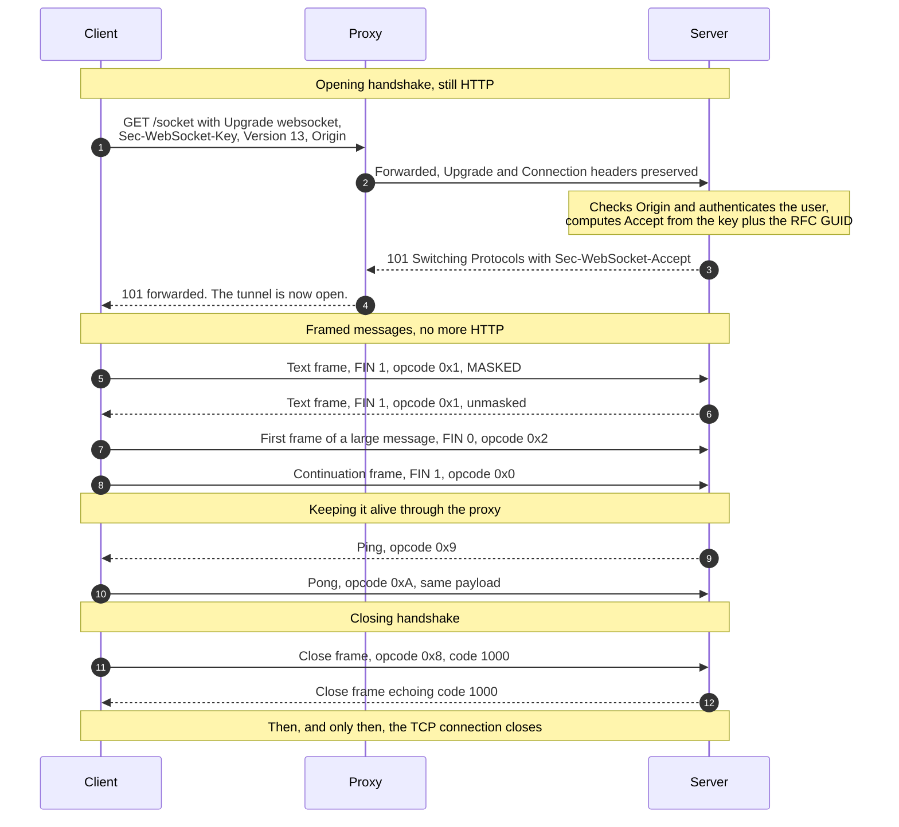
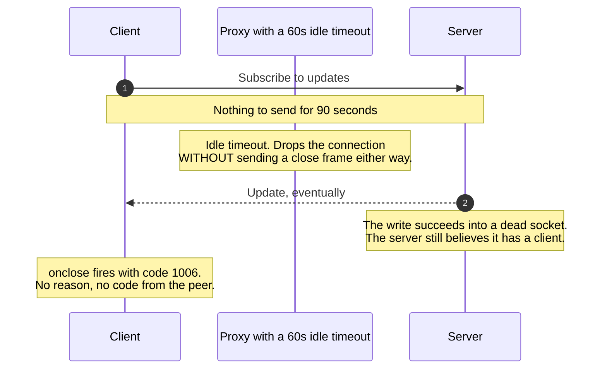

# WebSocket Upgrade & Frames

> How an ordinary HTTP request turns into a two-way, message-oriented connection
> that either side can write to — and what keeps it alive across the
> intermediaries that would rather it did not exist.

_Also known as: the WebSocket handshake, `ws://` and `wss://`, RFC 6455._

---

## TL;DR

- **The handshake is HTTP; nothing after it is.** One `GET` with
  `Upgrade: websocket`, answered with `101 Switching Protocols`, and the
  connection stops speaking HTTP for the rest of its life.
- **`Sec-WebSocket-Accept` is not security.** It is SHA-1 over the client's key
  plus a fixed GUID, and it exists to prove the server understood the upgrade
  rather than that it is trustworthy. Authentication is a separate problem you
  must solve.
- **Client-to-server frames MUST be masked**, and masking is not encryption
  either. It exists to stop a malicious page from making a proxy misread
  attacker-chosen bytes as a second HTTP request.
- **The browser does not enforce the same-origin policy here.** There is no
  CORS preflight for WebSocket, so a page on any origin can open a connection
  to your server with the user's cookies attached. **Check `Origin` yourself.**
- **Without heartbeats the connection dies quietly.** Both sides believe they
  are connected while nothing has flowed for an hour; only a ping reveals it.

---

## When to use it

- Genuine **bidirectional** traffic: collaborative editing, multiplayer state,
  a terminal, an interactive agent session where the client sends as often as it
  receives.
- Low-latency, high-frequency messages where one HTTP request per message would
  dominate the cost.
- Binary payloads, which WebSocket carries natively.

## When _not_ to use it

- **Server-to-client only.** Notifications, progress, log tails, and LLM token
  streams are one-directional;
  [Server-Sent Events](server-sent-events-and-http-streaming.md) gives you
  automatic reconnection, event IDs, and resumption over plain HTTP, and
  survives proxies that mangle upgrades.
- **Request/response semantics.** If every message expects a reply, you are
  reimplementing HTTP — including correlation IDs, timeouts, and retries —
  inside a stream with none of the tooling.
- **Infrequent updates.** A connection held open for one message an hour costs
  a socket, a heartbeat, and a reconnection strategy.
- **Behind infrastructure you do not control.** Some corporate proxies still
  break upgrades. SSE is a normal HTTP response and usually is not touched.

---

## Actors and terminology

| Actor        | Spec term                                                                      | What it is                                                                                                       |
| ------------ | ------------------------------------------------------------------------------ | ---------------------------------------------------------------------------------------------------------------- |
| Client       | _Client_ ([RFC 6455 §4.1](https://www.rfc-editor.org/rfc/rfc6455#section-4.1)) | Browser or library. Must mask everything it sends.                                                               |
| Server       | _Server_ (§4.2)                                                                | Completes the handshake, then speaks frames. Must never mask.                                                    |
| Intermediary | _Proxy_                                                                        | Anything between them: load balancer, reverse proxy, corporate middlebox. The source of most real-world trouble. |

**Key terms**

- **`101 Switching Protocols`** — the only success status for the handshake. The
  TCP connection persists and changes protocol; there is no second connection.
- **`Sec-WebSocket-Key`** — 16 random bytes, base64-encoded, fresh per
  connection (§4.1, requirement 7).
- **`Sec-WebSocket-Accept`** —
  `base64(SHA-1(key + "258EAFA5-E914-47DA-95CA-C5AB0DC85B11"))` (§4.2.2). The
  GUID is a constant published in the RFC.
- **Frame** — the wire unit: FIN bit, opcode, MASK bit, length, optional masking
  key, payload (§5.2).
- **Message** — one or more frames. A large message is a first frame with
  `FIN=0` and opcode `0x1`/`0x2`, then continuation frames (`0x0`), the last
  with `FIN=1`.
- **Opcodes** — `0x0` continuation, `0x1` text (UTF-8), `0x2` binary, `0x8`
  close, `0x9` ping, `0xA` pong.
- **Masking** — client-to-server payloads are XORed with a fresh 32-bit key per
  frame (§5.3).
- **Close code** — a 2-byte code in the close frame: `1000` normal, `1001` going
  away, `1002` protocol error, `1009` message too big, `1011` server error
  (§7.4.1). **`1006` is never sent on the wire** — it is what your library
  reports when the connection died without a close frame.
- **Subprotocol** — an application protocol named in `Sec-WebSocket-Protocol`.
  The server echoes the one it selects, and that is the whole negotiation.

---

## Sequence diagram



## Where it fails — the idle connection



Both endpoints believe the connection is healthy until one of them tries to use
it, and the server may not find out at all until its TCP keepalive expires —
which can be two hours by default. A ping every 30 seconds makes the failure
visible in 30 seconds and keeps the proxy's idle timer from firing at all.

---

## Step-by-step

1. **Client sends the upgrade request.** An ordinary HTTP/1.1 `GET` — which
   means cookies for the target host are attached automatically:

   ```http
   GET /socket HTTP/1.1
   Host: api.example.com
   Upgrade: websocket
   Connection: Upgrade
   Sec-WebSocket-Key: dGhlIHNhbXBsZSBub25jZQ==
   Sec-WebSocket-Version: 13
   Sec-WebSocket-Protocol: chat.v2
   Origin: https://app.example.com
   ```

   The browser API cannot set request headers, which is why authentication here
   is awkward — see the pitfalls.

2. **Proxy forwards it.** The hop-by-hop `Upgrade` and `Connection` headers must
   be passed through explicitly; most reverse proxies need configuration to do
   it. This is the step that fails in production and works on your laptop.

3. **Server accepts and switches protocols.**

   ```http
   HTTP/1.1 101 Switching Protocols
   Upgrade: websocket
   Connection: Upgrade
   Sec-WebSocket-Accept: s3pPLMBiTxaQ9kYGzzhZRbK+xOo=
   Sec-WebSocket-Protocol: chat.v2
   ```

   _Receiver validates:_ before answering, the server checks `Origin` against
   an allow-list, authenticates the user, confirms
   `Sec-WebSocket-Version: 13`, and selects a subprotocol it actually supports.
   **This is the last point at which rejecting is cheap.** Reject with `403`,
   or `426 Upgrade Required` with a `Sec-WebSocket-Version` header if the
   version is wrong. Non-browser clients and your logs see that status; browser
   JavaScript does not — the WebSocket API hides handshake failures, so a `403`
   surfaces only as an `error` event and `onclose` with `1006`. If a browser
   client must tell "not authorised" apart from "network down", accept the
   upgrade and immediately send a close frame with `1008` (policy violation) or
   an application code in the `4000`–`4999` range; that code and reason reach
   JavaScript as `CloseEvent.code` and `CloseEvent.reason`.

   The `Accept` value is computed as:

   ```python
   GUID = b"258EAFA5-E914-47DA-95CA-C5AB0DC85B11"
   accept = base64.b64encode(hashlib.sha1(key.encode() + GUID).digest())
   ```

   SHA-1 is not a security choice here. The value proves only that the
   responder understood the WebSocket handshake rather than being a cache
   replaying a stored `101`.

4. **Proxy relays the `101`.** From this moment the connection carries frames.
   Anything that tries to parse it as HTTP — a WAF, a logging proxy, a response
   buffer — will corrupt it.

5. **Client sends a masked text frame.** `FIN=1`, opcode `0x1`, `MASK=1`, and a
   fresh 32-bit masking key XORed over the payload. Clients **MUST** mask every
   frame, and a server **MUST** close the connection on receiving an unmasked
   one (§5.1; the masking algorithm itself is §5.3).

6. **Server replies unmasked.** Servers **MUST NOT** mask. A masked server
   frame is a protocol error, and the client **MUST** close the connection on
   detecting one, optionally with `1002` (§5.1).

7. **Client starts a fragmented message.** `FIN=0`, opcode `0x2` (binary). The
   sender does not need to know the total length in advance, which is the point
   of fragmentation.

8. **Client finishes it.** `FIN=1`, opcode `0x0` (continuation). **Your
   application sees one message, not two** — but a naive server that treats
   every frame as a message will corrupt every payload larger than its peer's
   fragment size. Control frames (`0x8`–`0xA`) may be interleaved between
   fragments and are never fragmented themselves.

9. **Server sends a ping.** Opcode `0x9`, any payload up to 125 bytes.

10. **Client pongs.** Opcode `0xA`, echoing the ping's payload exactly (§5.5.3).
    Browsers answer automatically — you cannot send a ping from browser
    JavaScript, so the server must be the one driving the heartbeat. If two
    pings go unanswered, treat the connection as dead and tear it down; a
    server that never does this accumulates half-open sockets until it runs out
    of file descriptors.

11. **Client starts the closing handshake.** Opcode `0x8` with code `1000`
    (§7.4.1), optionally with a UTF-8 reason.

12. **Server echoes the close** and stops sending. Only then does either side
    close the TCP connection — closing without the exchange is what produces
    `1006` on the other end, along with no idea of why.

---

## Failure modes

| Failure                                      | What the client sees                                          | Correct handling                                                                                                                                  |
| -------------------------------------------- | ------------------------------------------------------------- | ------------------------------------------------------------------------------------------------------------------------------------------------- |
| Proxy strips `Upgrade`                       | `200` or `400` instead of `101`                               | Configure the proxy explicitly. Detect a non-`101` at connect time and fall back to SSE or polling rather than retrying forever.                  |
| Idle timeout at an intermediary              | `onclose` with `1006`, often at a suspiciously round interval | Application-level ping every 20–30 seconds, from the server. TCP keepalive is too slow and does not reset an L7 idle timer.                       |
| Server restart or deploy                     | Every client disconnects at once                              | Send `1001` before shutting down, and have clients reconnect with exponential back-off **and jitter** — otherwise the fleet returns in one spike. |
| Client loses network                         | Nothing, until a write fails                                  | Server-side ping timeout. Do not rely on the TCP stack noticing.                                                                                  |
| Message larger than the server's frame limit | `1009`, or a silent drop                                      | Set and document a maximum message size, enforce it, and close with `1009` rather than buffering whatever arrives.                                |
| Slow consumer                                | Server memory climbing                                        | Bound the per-connection send buffer and drop the connection when it is exceeded. An unbounded queue turns one slow client into an OOM.           |
| Token expires mid-connection                 | Nothing — the connection was authorised once                  | Re-check authorisation periodically over the connection and close with a policy code when it lapses. The handshake is a moment, not a session.    |
| Load balancer moves the client               | Reconnect lands on a different instance                       | No server affinity. Keep connection state external, or make any instance able to serve any client.                                                |

---

## Common pitfalls

### No heartbeat

❌ **What people do:** open the connection and assume it stays open, since TCP is
reliable.

✅ **Do instead:** server sends a ping every 20–30 seconds, and closes the
connection after two missed pongs. Clients treat any close as a reconnect
trigger, with back-off and jitter.

_Why it bites you:_ every intermediary has an idle timeout — 60 seconds is
common, and it is rarely documented. The connection vanishes with no close
frame, both sides keep their illusions, and the bug reproduces only in
production because your laptop talks to the server directly.

### Skipping the `Origin` check

❌ **What people do:** rely on the same-origin policy, as with `fetch()`.

✅ **Do instead:** validate `Origin` against an exact allow-list during the
handshake and reject with `403`. Do not use `startsWith`.

_Why it bites you:_ **there is no preflight for WebSocket.** Any page on any
origin can open a connection to your server, and the browser will attach your
cookies. This is cross-site WebSocket hijacking, and it is CSRF with a
persistent channel — see
[CORS Preflight](cors-preflight.md) for why the protections you are thinking of
do not apply here.

### Putting the token in the query string

❌ **What people do:** `wss://api.example.com/socket?token=eyJhbGci…`, because
the browser API cannot set an `Authorization` header.

✅ **Do instead:** authenticate the session with a cookie (`Secure`,
`HttpOnly`, `SameSite`), or mint a **single-use, short-lived ticket** over
ordinary HTTPS and pass that in the query string, exchanging it for the
connection's identity during the handshake. The `Sec-WebSocket-Protocol` header
is also occasionally abused for this; a ticket is cleaner.

_Why it bites you:_ URLs are logged everywhere — access logs, proxies, error
trackers, browser history. A long-lived bearer token in a query string is a
credential you have written to a dozen systems in plaintext, and it is the
single most common finding in a WebSocket security review.

### Treating a frame as a message

❌ **What people do:** parse JSON from each frame's payload.

✅ **Do instead:** reassemble fragments until `FIN=1` before handing the payload
to the application, and enforce a maximum total size while doing it. Any real
library does this; hand-rolled servers frequently do not.

_Why it bites you:_ it works until a peer fragments — which depends on their
buffer size, not yours — and then every large message becomes a parse error you
cannot reproduce locally.

### Unbounded buffers

❌ **What people do:** `socket.send()` into a queue with no limit, for every
connected client.

✅ **Do instead:** cap the per-connection outbound buffer and the maximum
message size. When the cap is hit, close with `1009` or drop the client.

_Why it bites you:_ one client on hotel Wi-Fi stops draining its socket, your
queue for it grows to gigabytes, and the process dies taking every other
connection with it. This is back-pressure, and WebSocket gives you no automatic
protection from it.

### Reconnecting without back-off

❌ **What people do:** `onclose` → reconnect immediately, forever.

✅ **Do instead:** exponential back-off with **full jitter**, capped, plus a
distinction between "server said `1001`, come back soon" and "authentication
failed, do not retry".

_Why it bites you:_ a deploy disconnects 50,000 clients simultaneously and they
all reconnect at the same instant, repeatedly. Your restart becomes an outage,
which is the
[thundering herd](../distributed-systems/circuit-breaker-retry-and-backoff.md)
with a longer tail.

---

## Security considerations

| Threat                                                        | Mitigation                                                                                                                                                                                                                     |
| ------------------------------------------------------------- | ------------------------------------------------------------------------------------------------------------------------------------------------------------------------------------------------------------------------------ |
| Cross-site WebSocket hijacking                                | Exact-match `Origin` allow-list at handshake time, plus `SameSite` cookies or a ticket the attacker's page cannot obtain.                                                                                                      |
| Credential leakage through URLs                               | No long-lived tokens in the query string. Single-use tickets, or cookie-based sessions.                                                                                                                                        |
| Accepting a non-WebSocket or replayed response as a handshake | The `Sec-WebSocket-Accept` computation (§4.2.2) — a server that does not speak WebSocket, or a cache replaying a stored `101`, cannot produce the value for this key.                                                          |
| Cache poisoning of intermediaries by attacker-chosen payloads | Client-side masking (§5.3, rationale in §10.3) — an attacker's script cannot choose the bytes on the wire, so it cannot smuggle a fake HTTP request past a proxy that misreads the stream. Mandatory; your library handles it. |
| Stale authorisation on a long connection                      | Re-authorise periodically over the connection; close with a policy code when it lapses.                                                                                                                                        |
| Resource exhaustion                                           | Per-connection buffer and message-size caps, connection limits per user and per IP, and closing unresponsive peers on ping timeout.                                                                                            |
| Plaintext transport                                           | `wss://` only. `ws://` is also far more likely to be mangled by an intermediary.                                                                                                                                               |

---

## Implementation checklist

- [ ] `wss://` everywhere; treat `ws://` as local-development only.
- [ ] Validate `Origin` against an exact allow-list in the handshake.
- [ ] Authenticate during the handshake — cookie or single-use ticket, never a
      long-lived token in the URL.
- [ ] Configure the reverse proxy to pass `Upgrade`/`Connection` through, and
      set its idle timeout above your ping interval.
- [ ] Server-driven ping every 20–30 seconds; close after two missed pongs.
- [ ] Reassemble fragments; enforce a maximum message size and close `1009`.
- [ ] Bound the per-connection send buffer, and decide what to drop when it
      fills.
- [ ] Send `1001` before a planned shutdown so clients know to come back.
- [ ] Client reconnects with exponential back-off and full jitter, and gives up
      on authentication failures. For browser clients, signal those after the
      `101` with a close frame (`1008` or a `4xxx` code) — a handshake `403`
      reaches JavaScript only as `1006`, indistinguishable from a network drop.
- [ ] Negotiate an explicit subprotocol and version it — this is your only
      compatibility mechanism once the tunnel is open.
- [ ] Re-check authorisation periodically on long-lived connections.
- [ ] Decide up front whether you need this at all, or whether
      [SSE](server-sent-events-and-http-streaming.md) does the job.

---

## Specs and references

**Normative**

- [RFC 6455 — The WebSocket Protocol](https://www.rfc-editor.org/rfc/rfc6455) —
  §1.3 the opening handshake and the GUID, §4.1–4.2 client and server handshake
  requirements, §5.1 the masking MUSTs for both sides, §5.2 base framing, §5.3
  client-to-server masking, §5.5 control frames including ping and pong, §7.4.1
  the defined close codes, §7.4.2 the `4000`–`4999` private-use range, §10.2
  origin considerations, §10.3 why masking protects intermediaries.
- [RFC 8441 — Bootstrapping WebSockets with HTTP/2](https://www.rfc-editor.org/rfc/rfc8441) —
  the extended `CONNECT` method with the `:protocol` pseudo-header, which lets a
  WebSocket share an HTTP/2 connection instead of monopolising one. The client
  API does not change.
- [RFC 9220 — Bootstrapping WebSockets with HTTP/3](https://www.rfc-editor.org/rfc/rfc9220) —
  the same mechanism over HTTP/3.
- [WHATWG — The WebSocket API](https://websockets.spec.whatwg.org/) — what the
  browser actually exposes, and the explicit reason `Origin` enforcement is the
  server's job. [§4 Feedback from the protocol](https://websockets.spec.whatwg.org/#feedback-from-the-protocol)
  requires that handshake failures reach script only as close code `1006`.

---

## Related flows

- [Server-Sent Events & HTTP Streaming](server-sent-events-and-http-streaming.md) —
  the one-directional alternative, and the right default for streaming to a
  browser.
- [CORS Preflight](cors-preflight.md) — the protection that does **not** apply
  to WebSocket, and why the `Origin` check has to be yours.
- [The TLS 1.3 Handshake](tls-1-3-handshake.md) — what `wss://` runs on, and
  the round trips the upgrade adds to.
- [Circuit Breaker, Timeout & Retry with Backoff](../distributed-systems/circuit-breaker-retry-and-backoff.md) —
  jittered reconnection, and why a fleet-wide reconnect is a self-inflicted
  outage.
- [Session Cookies & Server-Side Sessions](../auth/session-cookies-and-server-side-sessions.md) —
  the authentication the handshake borrows, including why `SameSite` matters
  here.
