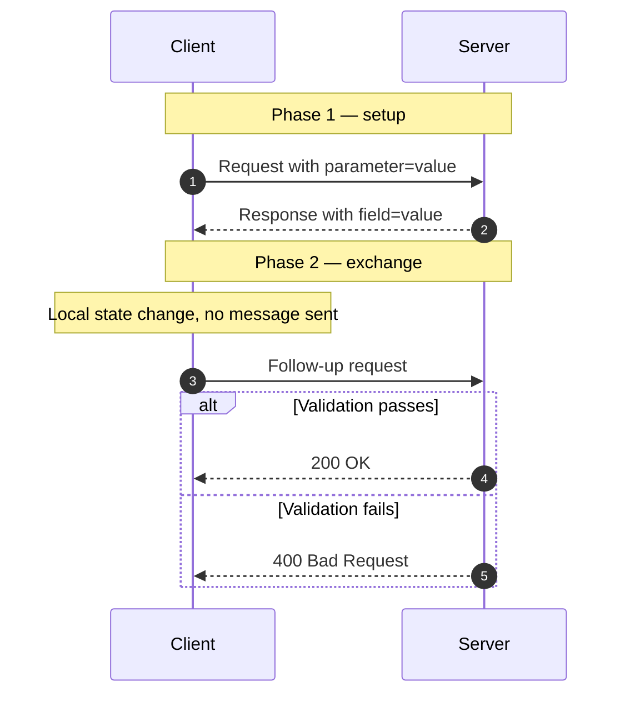
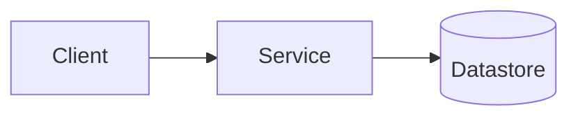

<!--
  COPY THIS FILE to flows/<category>/<kebab-case-name>.md and fill it in.

  The section order below is FIXED. Do not add, remove, or reorder top-level
  sections — the consistency across pages is the whole point of this project.
  If a section genuinely does not apply (e.g. "Security considerations" for a
  pure caching flow), delete it rather than padding it with filler, and say
  why in your pull request.

  Delete every HTML comment in this template before opening your PR.
-->

# Name of the Flow

> One sentence, plain language, no jargon: what this flow accomplishes and for
> whom. A reader who knows nothing about it should finish this line knowing
> whether the page is relevant to them.

<!-- Optional context line, e.g.: -->

_Also known as: alternative name, vendor-specific name._

---

## TL;DR

<!-- 3-5 bullets. A reader in a hurry stops here and still learns something
     true and useful. Lead with the mechanism, not the motivation. -->

- The single most important mechanical fact about the flow.
- The property it guarantees — and the one it does _not_.
- The most common mistake, in one line.
- The one thing that distinguishes it from the obvious alternative.

---

## When to use it

- Concrete situation where this is the right tool.
- Another concrete situation.

## When _not_ to use it

- Situation where a simpler mechanism is sufficient — name the simpler one.
- Situation where this flow's guarantees are misunderstood as stronger than
  they are.

---

## Actors and terminology

<!-- Use the SPEC'S OWN vocabulary in the "Actor" column, so the diagram, the
     walkthrough, and the linked RFC all use the same words. Put the everyday
     name in the description. -->

| Actor  | Spec term              | What it is                           |
| ------ | ---------------------- | ------------------------------------ |
| Client | _Client_ (RFC XXXX §N) | The application initiating the flow. |
| Server | _Server_               | The party that responds.             |

**Key terms**

- **`term_one`** — definition, including where it is generated and how long it lives.
- **`term_two`** — definition, and the common misconception about it.

---

## Sequence diagram

<!-- `autonumber` is REQUIRED. The generated numbers are a contract: step N in
     this diagram is step N in "Step-by-step" below. Keep them in sync.
     This heading must start with "Sequence diagram" — that is what marks the
     diagram as the one CI compares against the walkthrough. -->



<!-- Note: use `Note over` to label phases, NOT `rect rgb(...)`. A hard-coded
     rect fill is unreadable in whichever GitHub theme it was not chosen for.
     Also avoid `<` and `>` inside diagram text — they break rendering. -->

<!-- OPTIONAL. Include only if it shows something the sequence diagram cannot —
     component topology, data ownership, or deployment boundaries. Delete the
     whole section if it would just restate the sequence diagram. -->

## Architecture



---

## Step-by-step

<!-- Numbers MUST match the `autonumber` values in the sequence diagram: one
     item per message, including each branch of an `alt`, and no item for a
     `Note over` — fold those into the message they explain, marked
     "_No message on the wire:_" or "_Receiver validates:_".
     For each step say: what moves, what the receiver validates, and — where it
     clarifies — the concrete wire format. Show real headers and real field
     names, not pseudocode. -->

1. **Short imperative title.** What happens, and why it happens here rather
   than earlier or later.

   ```http
   POST /endpoint HTTP/1.1
   Host: example.com
   Content-Type: application/json

   {"field": "value"}
   ```

   _Receiver validates:_ the specific checks required by the spec, each one
   named.

2. **Short imperative title.** …

---

## Failure modes

<!-- What happens when a step times out, is replayed, arrives out of order, or
     the process crashes between two steps. This is what separates a real
     reference page from a summary. -->

| Failure                 | What the client sees | Correct handling |
| ----------------------- | -------------------- | ---------------- |
| Step N times out        | …                    | …                |
| Step N is replayed      | …                    | …                |
| Crash between N and N+1 | …                    | …                |

<!-- Add a second, smaller Mermaid diagram here only when a failure path is
     hard to describe in prose. -->

---

## Common pitfalls

<!-- The highest-value section on the page. Every entry is a real mistake
     someone has shipped, not a hypothetical. Keep the ❌/✅ pairing. -->

### Short name of the mistake

❌ **What people do:** the incorrect approach, stated concretely.

✅ **Do instead:** the correct approach, stated concretely.

_Why it bites you:_ the specific failure this causes in production — an attack,
a data loss window, an outage under load.

### Short name of the next mistake

❌ **What people do:** …

✅ **Do instead:** …

_Why it bites you:_ …

---

## Security considerations

<!-- Required for auth and networking flows. Delete for flows where it does not
     apply. Pair each threat with its concrete mitigation; do not list threats
     you do not mitigate here. -->

| Threat       | Mitigation                                                |
| ------------ | --------------------------------------------------------- |
| Named attack | The specific parameter, header, or check that defeats it. |

---

## Implementation checklist

<!-- Copy-pasteable. Written for someone building this in the next week. Order
     matters: put the things people forget near the top. -->

- [ ] Concrete, verifiable action.
- [ ] Concrete, verifiable action.
- [ ] Concrete, verifiable action.

---

## Specs and references

**Normative** — link with section anchors where possible.

- [RFC XXXX — Title](https://www.rfc-editor.org/rfc/rfcXXXX) — what this document defines, and which sections matter most for this flow.

**Further reading**

- [Title](https://example.com) — why this source is worth your time.

---

## Related flows

- [Other Flow](../category/other-flow.md) — how it relates to this one.
